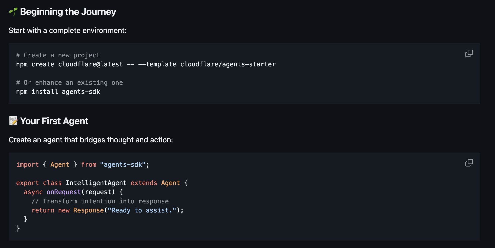

**Source:** [https://twitter.com/i/web/status/1895318291406823540](https://twitter.com/i/web/status/1895318291406823540)
**Original Post Date:** 2025-05-27 21:11:03

# Building Intelligent Agents Using Cloudflare's Agent Framework

## Introduction
Cloudflare's Agent framework represents a powerful approach to bridging thought and action in modern AI applications. This knowledge base item provides an expert-level walkthrough of setting up the development environment and crafting your first intelligent agent using Cloudflare's SDK. We'll explore key concepts, implementation patterns, and best practices that form the foundation for building sophisticated AI-driven systems.

## Setting Up Your Development Environment

Before creating agents, you must establish a proper development environment using Cloudflare's SDK. Two distinct approaches are available depending on your project needs.

_The first command initializes a new project with the latest Cloudflare CLI and agents starter template. The second option adds the SDK to an existing project._

```bash
npm create cloudflare@latest --template cloudflare/agents-starter

# OR

npm install agents-sdk
```

- Ensure Node.js and npm are installed (v16+ recommended)
- Choose appropriate setup method based on your project structure
- Verify successful package installation

> **Note/Tip:** The starter template includes essential configurations for agent development, saving significant setup time.

> **Note/Tip:** Consider version compatibility when installing packages in existing projects.

## Creating Your First Intelligent Agent

Agent implementation follows a specific pattern centered around the base Agent class. This structure ensures consistency and maintainability across different agent types.

_This basic agent demonstrates the essential components: importing the SDK, extending the base Agent class, and implementing the onRequest method._

```javascript
import { Agent } from 'agents-sdk';

export class IntelligentAgent extends Agent {
  async onRequest(request) {
    // Transform intention into response
    return new Response('Ready to assist.');
  }
}
```

1. Import the required Agent class from the SDK
1. Create a custom agent by extending the base Agent class
1. Implement asynchronous request handling with the onRequest method

## Key Takeaways

- Agent development requires proper environment setup using Cloudflare's CLI or direct package installation.
- Custom agents must extend the base Agent class and implement asynchronous request handlers.
- The framework emphasizes transforming intentions into actionable responses through well-structured agent logic.

## Conclusion
Understanding these foundational concepts enables you to build increasingly sophisticated agents. Consider exploring advanced features like error handling, state management, and integration with other Cloudflare services as your next steps in agent development.

## External References

- [Cloudflare Agents SDK Documentation](https://developers.cloudflare.com/agents)
- [Agent Framework Best Practices Guide](https://blog.cloudflare.com/intelligent-agents-best-practices/)


## Media

**Image Description:** The image is a screenshot of a code snippet and accompanying instructions, likely from a tutorial or documentation related to building agents using the Cloudflare Agents SDK. Below is a detailed description:

### **Main Subject**
The main subject of the image is a guide for setting up and creating a basic agent using the Cloudflare Agents SDK. The content is structured into two primary sections: 
1. **Setting up the environment** (using npm commands).
2. **Creating the first agent** (writing the code for an agent class).

### **Technical Details**

#### **1. Setting up the environment**
- **Header**: The section is titled **"Beginning the Journey"**, indicating the start of a tutorial or guide.
- **Instructions**: The text provides two options for setting up the environment:
  - **Option 1**: Creating a new project using a template.
    ```bash
    npm create cloudflare@latest --template cloudflare/agents-starter
    ```
    - This command uses the `npm create` command to initialize a new project with the latest version of the Cloudflare CLI and applies the `agents-starter` template.
  - **Option 2**: Enhancing an existing project.
    ```bash
    npm install agents-sdk
    ```
    - This command installs the `agents-sdk` package into an existing project.

#### **2. Creating the first agent**
- **Header**: The section is titled **"Your First Agent"**, guiding the user to create their first agent.
- **Instructions**: The text explains the goal of creating an agent that bridges thought and action.
- **Code Snippet**:
  ```javascript
  import { Agent } from "agents-sdk";

  export class IntelligentAgent extends Agent {
    async onRequest(request) {
      // Transform intention into response
      return new Response("Ready to assist.");
    }
  }
  ```
  - **Import Statement**:
    ```javascript
    import { Agent } from "agents-sdk";
    ```
    - This line imports the `Agent` class from the `agents-sdk` package, which is the foundation for creating custom agents.
  - **Class Definition**:
    ```javascript
    export class IntelligentAgent extends Agent {
      // Class body
    }
    ```
    - The `IntelligentAgent` class is defined as a subclass of the `Agent` class, indicating that it inherits properties and methods from the base `Agent` class.
  - **Method Definition**:
    ```javascript
    async onRequest(request) {
      // Transform intention into response
      return new Response("Ready to assist.");
    }
    ```
    - The `onRequest` method is an asynchronous method that is triggered when the agent receives a request.
    - Inside the method:
      - A comment (`// Transform intention into response`) suggests that the agent should process the request and generate an appropriate response.
      - The method returns a `Response` object with the string `"Ready to assist."` as the body.

### **Visual Elements**
- **Background**: The background is dark (likely a code editor or terminal theme), with syntax highlighting for the code.
- **Syntax Highlighting**:
  - Keywords like `import`, `class`, `extends`, `async`, and `return` are highlighted in orange.
  - Strings like `"agents-sdk"` and `"Ready to assist."` are highlighted in green.
  - Comments are in gray.
- **Code Blocks**: The code is enclosed in code blocks with a dark background and white text, making it easy to read.
- **Icons**: 
  - A small icon (a green checkmark inside a square) is present at the top left, possibly indicating a section or a completed step.
  - A small icon (a square with a corner pointing outward) is present at the top right of the code blocks, likely for copying the code.

### **Overall Structure**
The image is well-organized, with clear headings and instructions. The code snippet is presented in a readable format with proper syntax highlighting, making it easy for developers to follow along and implement the steps.

### **Purpose**
The image serves as a tutorial or guide for developers who are new to the Cloudflare Agents SDK. It provides step-by-step instructions for setting up the environment and creating a basic agent, emphasizing the use of the `agents-sdk` package and the structure of an agent class. The example provided is minimal but functional, serving as a foundation for more complex agent implementations.
