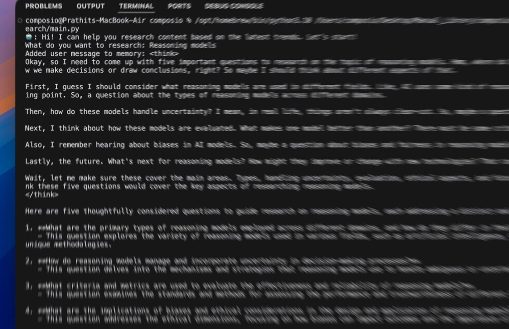

**Source:** [https://twitter.com/i/web/status/1885016511850659903](https://twitter.com/i/web/status/1885016511850659903)
**Original Post Date:** 2025-05-28 00:14:05

# DeepSeek Perplexity Agent: Structured Research Assistant Framework

## Introduction
The DeepSeek Perplexity Agent represents an innovative approach to AI-assisted research, providing a structured framework for exploring complex topics. This technical implementation demonstrates how conversational AI can be integrated into a command-line environment to guide systematic research processes. The agent's architecture combines natural language processing with methodical questioning strategies, offering developers and researchers a powerful tool for exploring reasoning models.

## Environment Setup and Execution

The agent runs in a macOS environment utilizing Python 3.8 installed via Homebrew. The execution command `/opt/homebrew/bin/python3.8 /Users/composio/Projects/research/main.py` ensures precise version control, leveraging the system's package management capabilities.

This setup provides developers with consistent dependencies and cross-platform compatibility while maintaining a robust development environment.

```bash
# Example execution command
/opt/homebrew/bin/python3.8 /Users/composio/Projects/research/main.py
```

## Interaction Architecture

The agent implements a conversational interface with distinct message markers for user (`👤`) and assistant (`🤖`) interactions, facilitating clear communication flow.

The system employs `<think>` tags to capture internal reasoning processes, providing transparency in the decision-making chain.

```text
<think>
- Analysis of user query
- Strategic question formulation
- Structured response generation
</think>
```

## Research Methodology

The agent breaks down complex research topics into five structured questions, covering types of reasoning models, uncertainty handling, evaluation criteria, ethical considerations, and future trends.

This methodology ensures comprehensive coverage while maintaining a logical progression through the subject matter.

1. Types of Reasoning Models in Different Domains
1. Uncertainty Management in Decision-Making
1. Evaluation Metrics and Criteria
1. Ethical Considerations and Bias Implications
1. Future Trends and Technological Integration

## Technical Implementation Notes

> **Note/Tip:** Ensure consistent Python versioning using virtual environments for production deployments.

> **Note/Tip:** Implement robust error handling around AI model interactions to maintain system stability.

> **Note/Tip:** Consider modularizing the conversation handler for easier maintenance and scalability.

## Key Takeaways

- Structured approach to research through methodical question formulation
- Environment setup using Homebrew ensures consistent Python version control
- Transparent reasoning process with explicit thought documentation
- Conversational interface design enhances user interaction clarity

## Conclusion
The DeepSeek Perplexity Agent demonstrates the effective integration of AI-assisted research methodologies into a structured framework. By combining clear communication patterns, systematic question formulation, and transparent reasoning processes, it provides a powerful tool for exploring complex topics in reasoning models and beyond.

## External References

- [Homebrew Documentation](https://docs.brew.sh)
- [Python Packaging Guidelines](https://packaging.python.org/)


## Media

**Image Description:** The image depicts a terminal or command-line interface session, likely from a macOS environment, as indicated by the username and hostname (`composio@Prathits-MacBook-Air`). The session involves a Python script being executed, and the output suggests an interaction with a reasoning or research assistant, possibly an AI or automated system designed to help with research tasks. Below is a detailed breakdown of the image:

### **Main Components:**
1. **Terminal Interface:**
   - The terminal is open, and the command being executed is:
     ```
     /opt/homebrew/bin/python3.8 /Users/composio/Projects/research/main.py
     ```
     - This indicates that the script is being run using Python 3.8, installed via Homebrew (a package manager for macOS).
     - The script is located in the `research/main.py` file within the user's `Projects` directory.

2. **Output of the Script:**
   - The script appears to simulate an interaction with a research assistant. The assistant is designed to help with research content based on reasoning models.
   - The assistant's responses are formatted in a conversational style, with the assistant's messages prefixed by `🤖` (a robot emoji) and the user's messages prefixed by `👤` (a person emoji).

3. **Conversation:**
   - **User Input:**
     - The user initiates the interaction by asking the assistant to research the latest trends in reasoning models.
   - **Assistant's Response:**
     - The assistant acknowledges the request and begins to think about the task.
     - The assistant outlines a structured approach to researching reasoning models, breaking it down into five key questions:
       1. **Types of Reasoning Models:** What are the primary types of reasoning models used across different domains?
       2. **Handling Uncertainty:** How do reasoning models manage and incorporate uncertainty in decision-making processes?
       3. **Evaluation Criteria:** What criteria and metrics are used to evaluate the effectiveness and reliability of reasoning models?
       4. **Bias and Ethical Considerations:** What are the implications of biases and ethical considerations in reasoning models?
       5. **Future Trends:** What is the future of reasoning models? How might they evolve with new technologies?

4. **Thought Process:**
   - The assistant's thought process is explicitly shown in the output, enclosed within `<think>` tags. This indicates a step-by-step reasoning approach, where the assistant considers various aspects of reasoning models before formulating the questions.

5. **Formatted Questions:**
   - The assistant provides five thoughtfully considered questions, each marked with `**` for emphasis. These questions are designed to guide research on reasoning models comprehensively.

### **Technical Details:**
- **Environment:**
  - **Operating System:** macOS (indicated by the hostname and Homebrew usage).
  - **Python Version:** Python 3.8, installed via Homebrew.
  - **Script Location:** The script is located in `/Users/composio/Projects/research/main.py`.
- **Command Execution:**
  - The command uses the full path to the Python interpreter (`/opt/homebrew/bin/python3.8`), ensuring the correct version is used.
- **Output Formatting:**
  - The output is well-structured, with clear demarcations for user input, assistant responses, and thought processes.
  - Use of emojis (`🤖` and `👤`) to differentiate between the assistant and the user.
  - Use of `<think>` tags to encapsulate the assistant's internal reasoning.

### **Key Observations:**
- The script appears to be a research assistant tool, possibly leveraging AI or automated reasoning to guide research on reasoning models.
- The assistant's approach is methodical, breaking down the research task into specific, actionable questions.
- The use of Homebrew suggests a developer-friendly environment, likely used for managing dependencies and tools.

### **Summary:**
The image shows a terminal session where a Python script is executed to interact with a research assistant. The assistant provides a structured approach to researching reasoning models by formulating five key questions. The interaction is well-organized, with clear demarcations for user input, assistant responses, and internal reasoning processes. The technical setup indicates a macOS environment with Python 3.8 managed via Homebrew. This setup suggests a focus on automation, AI, and structured research methodologies.
