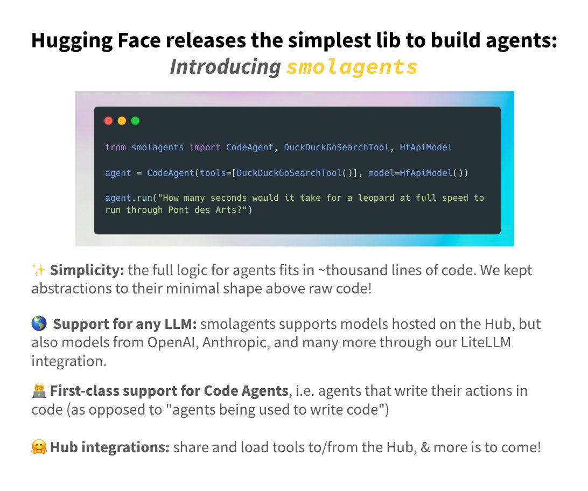

**Source:** [https://twitter.com/i/web/status/1874116324898598934](https://twitter.com/i/web/status/1874116324898598934)
**Original Post Date:** 2025-07-20 09:13:23

# Hugging Face Releases Smolagents: Simplifying AI Agent Development

## Introduction
The smolagents library by Hugging Face is a minimalistic yet powerful tool for building AI agents. It emphasizes simplicity and flexibility, allowing developers to create agents that can interact with models from various providers, including Hugging Face Hub, OpenAI, and Anthropic. This library is particularly noted for its support of Code Agents, which specialize in writing code as their primary action.

## Main Title

The title 'Hugging Face releases the simplest lib to build agents: Introducing smolagents' highlights the library's simplicity and ease of use. The word 'smolagents' is emphasized in orange, drawing attention to the library's name.

## Code Snippet

The central part of the image contains a code snippet demonstrating how to use the smolagents library. The snippet imports necessary components and creates an instance of CodeAgent with a list of tools and a model.

_This code snippet demonstrates how to create and run an agent using the smolagents library. It imports necessary components, initializes a CodeAgent with tools and a model, and runs a query._

```python
from smolagents import import CodeAgent, DuckDuckGoSearchTool, HfApiModel

agent = CodeAgent(tools=[DuckDuckGoSearchTool()], model=HfApiModel())

agent.run("How many seconds would it take for a leopard at full speed to run through Pont des Arts?")
```

## Key Features and Benefits

The text below the code snippet outlines the key features and benefits of smolagents. These include simplicity, support for any LLM, first-class support for Code Agents, and Hub integrations.

- Simplicity: The library is extremely simple, with the full logic for agents fitting into approximately 1,000 lines of code.
- Support for Any LLM: smolagents supports models hosted on Hugging Face Hub and integrates with models from other providers like OpenAI and Anthropic through LiteLLM.
- First-Class Support for Code Agents: The library provides specialized support for Code Agents, which are agents that write code as their primary action.
- Hub Integrations: smolagents facilitates easy sharing and loading of tools and models to/from the Hugging Face Hub.

## Design Elements

The image uses a primarily white background with a gradient effect in the code snippet area. The title and key phrases are highlighted in bold black text, with the library name 'smolagents' in orange.

- Color Scheme: The background is primarily white, with a gradient effect in the code snippet area (purple to blue).
- Icons: A globe icon is used next to the 'Support for any LLM' section. A robot icon is used next to the 'First-class support for Code Agents' section. A smiley face icon is used next to the 'Hub integrations' section.

## Overall Impression

The image effectively communicates the purpose and benefits of smolagents, targeting developers and researchers interested in building AI agents. The use of icons and clear headings makes the key features easy to digest.

## Key Takeaways

- smolagents is designed for simplicity and ease of use.
- The library supports models from various providers, including Hugging Face Hub, OpenAI, and Anthropic.
- smolagents provides specialized support for Code Agents.
- It facilitates easy sharing and loading of tools and models to/from the Hugging Face Hub.

## Conclusion
In conclusion, smolagents by Hugging Face is a powerful yet simple library for building AI agents. Its flexibility in supporting various LLMs and its specialized support for Code Agents make it a valuable tool for developers and researchers.

## External References

- [Hugging Face smolagents documentation](https://huggingface.co/docs/smolagents)


## Media

**Image Description:** The image is a promotional announcement for a new library called **smolagents**, which is designed to simplify the creation and management of AI agents. Below is a detailed breakdown of the image:

### **Main Title**
- The title reads: **"Hugging Face releases the simplest lib to build agents: Introducing smolagents"**
  - The title emphasizes simplicity and is designed to grab attention by highlighting that this library is the simplest way to build agents.
  - The word "smolagents" is highlighted in orange, drawing focus to the library's name.

### **Code Snippet**
- The central part of the image contains a code snippet demonstrating how to use the **smolagents** library.
  - **Code Content**:
    ```python
    from smolagents import import CodeAgent, DuckDuckGoSearchTool, HfApiModel

    agent = CodeAgent(tools=[DuckDuckGoSearchTool()], model=HfApiModel())

    agent.run("How many seconds would it take for a leopard at full speed to run through Pont des Arts?")
    ```
  - **Explanation**:
    - The code imports necessary components from the **smolagents** library:
      - `CodeAgent`: The main class for creating an agent.
      - `DuckDuckGoSearchTool`: A tool for performing web searches using DuckDuckGo.
      - `HfApiModel`: A model interface for interacting with models hosted on the Hugging Face Hub.
    - An instance of `CodeAgent` is created with a list of tools (`[DuckDuckGoSearchTool()]`) and a model (`HfApiModel()`).
    - The `agent.run()` method is called with a query about a leopard running through Pont des Arts. This demonstrates how the agent can process and respond to a natural language query.

### **Key Features and Benefits**
- The text below the code snippet outlines the key features and benefits of **smolagents**:
  1. **Simplicity**:
     - The library is described as extremely simple, with the full logic for agents fitting into approximately 1,000 lines of code.
     - The design emphasizes minimal abstractions, keeping the code as close to raw code as possible.

  2. **Support for Any LLM**:
     - **smolagents** supports models hosted on the Hugging Face Hub.
     - It also integrates with models from other providers like OpenAI, Anthropic, and more through the **LiteLLM** integration.

  3. **First-Class Support for Code Agents**:
     - The library provides specialized support for **Code Agents**, which are agents that write code as their primary action.
     - This differentiates them from general-purpose agents that perform other types of actions.

  4. **Hub Integrations**:
     - The library facilitates easy sharing and loading of tools and models to/from the Hugging Face Hub.
     - The text suggests that more integrations and features are coming in the future.

### **Design Elements**
- **Color Scheme**:
  - The background is primarily white, with a gradient effect in the code snippet area (purple to blue).
  - The title and key phrases are highlighted in bold black text, with the library name "smolagents" in orange.
  - Icons (e.g., a globe, a robot, a smiley face) are used to visually emphasize specific features.

- **Icons**:
  - A globe icon is used next to the "Support for any LLM" section.
  - A robot icon is used next to the "First-class support for Code Agents" section.
  - A smiley face icon is used next to the "Hub integrations" section.

### **Overall Impression**
- The image is designed to be informative and visually appealing, focusing on the simplicity and versatility of the **smolagents** library.
- The use of icons and clear headings makes the key features easy to digest.
- The code snippet provides a practical example, demonstrating the library's ease of use and functionality.

This image effectively communicates the purpose and benefits of **smolagents**, targeting developers and researchers interested in building AI agents.
