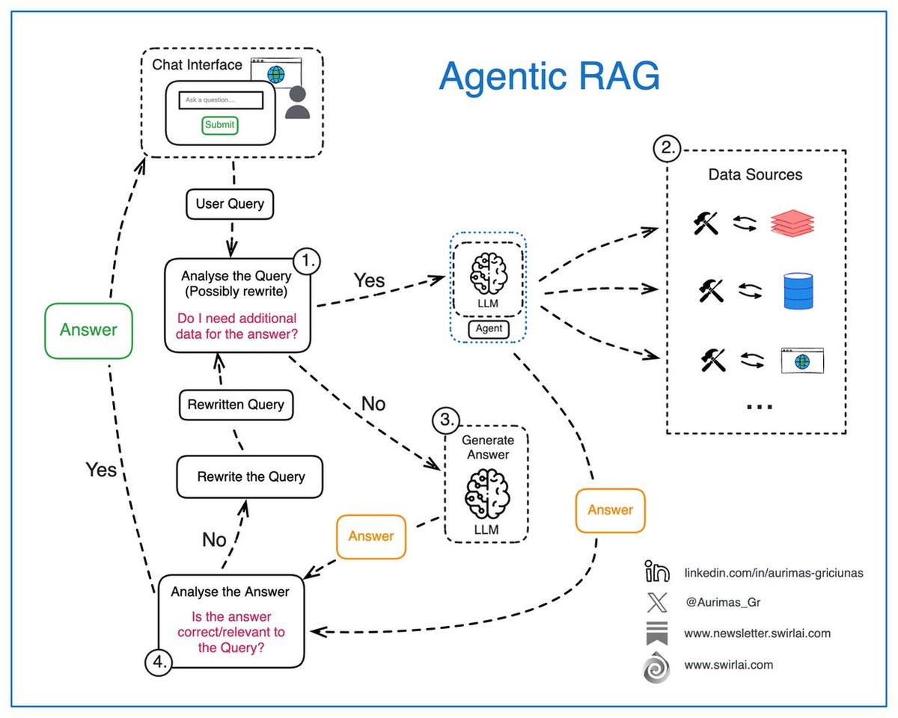

**Source:** [https://twitter.com/i/web/status/1876244332748873979](https://twitter.com/i/web/status/1876244332748873979)
**Original Post Date:** 2025-05-27 20:44:37

# Implementing Agentic RAG Systems: A Systematic Approach to Query Processing

## Introduction
Agentic RAG (Retrieval Augmented Generation) systems represent a sophisticated approach to query answering that combines the strengths of large language models with intelligent agent-driven processes. This system leverages multiple components - including LLMs, purpose-built agents, and diverse data sources - to systematically process user queries through iterative refinement and validation. The architecture presented in this knowledge base item emphasizes the critical decision points and flow required for generating accurate, relevant answers while maintaining high efficiency.

## System Architecture Overview

The agentic RAG system follows a structured workflow beginning with user query submission through an interactive chat interface. This initiates a multi-step process involving query analysis, data retrieval, answer generation, and validation.

A key differentiator is the integration of decision points throughout the pipeline that enable iterative refinement when necessary, ensuring robustness in response quality.

1. User Query Input Phase
1. Query Analysis & Refinement Step
1. Data Retrieval Process
1. Answer Generation via LLM
1. Validation and Iteration Loop

> **Note/Tip:** Implement robust error handling at each decision point to maintain system reliability.

> **Note/Tip:** Design the chat interface with clear feedback mechanisms for user query status.

## Core Components Integration

The system's effectiveness relies on seamless integration between agents, LLMs, and diverse data sources. The agent orchestrates the overall process, managing query refinement and data retrieval while the LLM handles natural language processing.

Data source integration should support multiple formats including documents, databases, and web content to ensure comprehensive information access.

_Core class structure demonstrating component interaction flow_

```python
class AgentRAGSystem:
    def process_query(self, user_input):
        analyzed_query = self.analyze_and_refine(user_input)
        relevant_data = self.retrieve_data(analyzed_query)
        return self.generate_answer(relevant_data)
```

## Iterative Refinement Mechanism

The system's iterative nature is critical for maintaining answer quality. When initial responses are deemed insufficient, the process returns to query refinement and data retrieval stages.

Decision points at each stage ensure intelligent handling of complex queries requiring multiple iterations.

- Query requires rewriting for clarity or relevance
- Additional data sources need integration
- Answer needs validation and refinement

## Key Takeaways

- Implementing agentic RAG systems requires careful orchestration between agents, LLMs, and diverse data sources.
- The iterative refinement process is essential for maintaining answer quality across complex queries.
- Robust decision-making architecture ensures efficient handling of various query types and complexity levels.

## Conclusion
Agentic RAG systems represent a powerful approach to query processing by combining the strengths of modern AI tools with intelligent agent-driven workflows. Through careful implementation of the outlined components and processes, developers can create robust systems capable of delivering accurate, relevant answers while maintaining efficiency.

## External References

- [Retrieval-Augmented Generation: Bridging Retrieval and Generative Models](https://arxiv.org/abs/2005.11401)
- [Large Language Model Agents: A Technical Overview](https://ai.googleblog.com/2023/09/large-language-model-agents.html)


## Media

**Image Description:** The image depicts a flowchart titled **"Agentic RAG"**, which outlines a process for generating answers to user queries using a combination of **Large Language Models (LLMs)**, **agents**, and **data sources**. The diagram is structured to illustrate a step-by-step workflow, emphasizing the iterative nature of query refinement, data retrieval, and answer generation. Below is a detailed breakdown of the image:

---

### **Main Components and Flow**

#### **1. Chat Interface**
- **Location**: Top-left corner.
- **Description**: The process begins with a **Chat Interface**, where a user can input a query. The interface includes a text box labeled "Ask a question..." and a "Submit" button.
- **Purpose**: This is the entry point for user interaction, where the user submits their query for processing.

---

#### **2. User Query**
- **Location**: Below the Chat Interface.
- **Description**: The user's query is received and processed as the **User Query**.
- **Purpose**: This is the initial input that triggers the entire workflow.

---

#### **3. Analyze the Query (Step 1)**
- **Location**: Below the User Query.
- **Description**: The query is analyzed to determine if it needs to be rewritten or if additional data is required to generate an answer.
  - **Rewritten Query**: If the query needs refinement, it is rewritten to improve clarity or relevance.
  - **Additional Data Check**: The system checks if additional data is needed to answer the query.
- **Decision Point**: A decision is made based on whether additional data is required:
  - **Yes**: The process moves to retrieve data from data sources.
  - **No**: The process proceeds to generate an answer.

---

#### **4. Data Sources (Step 2)**
- **Location**: Right side of the diagram.
- **Description**: The system accesses various **Data Sources** to retrieve relevant information. These sources are represented by icons, including:
  - A stack of documents (e.g., PDFs or text files).
  - A database icon.
  - A web icon (e.g., a globe).
- **Purpose**: These data sources provide the necessary information to generate a comprehensive answer.

---

#### **5. Agent and LLM Integration (Step 3)**
- **Location**: Central part of the diagram.
- **Description**: The system uses an **Agent** and an **LLM (Large Language Model)** to process the query and generate an answer.
  - **Agent**: The agent is responsible for orchestrating the process, retrieving data, and ensuring the query is properly understood.
  - **LLM**: The LLM generates the final answer based on the retrieved data and the query.
- **Output**: The LLM generates an **Answer**, which is then evaluated for correctness and relevance.

---

#### **6. Answer Analysis (Step 4)**
- **Location**: Bottom-left part of the diagram.
- **Description**: The generated answer is analyzed to determine if it is correct, relevant, and complete.
  - **Decision Point**: A decision is made based on the analysis:
    - **Yes**: The answer is deemed satisfactory, and it is returned to the user.
    - **No**: The query is rewritten, and the process iterates back to the analysis step.

---

#### **7. Iterative Process**
- **Description**: The diagram emphasizes an iterative process where the query can be rewritten and reanalyzed if the initial answer is not satisfactory. This ensures the system continuously improves the quality of the response.

---

### **Key Technical Details**
1. **Large Language Models (LLMs)**:
   - The LLM is central to generating the final answer. It processes the query and data to produce a coherent response.
   
2. **Agents**:
   - The agent plays a crucial role in orchestrating the process, retrieving data, and ensuring the query is properly understood.

3. **Data Sources**:
   - The system leverages multiple data sources, including documents, databases, and web content, to provide comprehensive answers.

4. **Iterative Query Refinement**:
   - The process includes iterative steps to refine the query and ensure the answer is accurate and relevant.

5. **Decision Points**:
   - The diagram includes decision points (e.g., "Do I need additional data?" and "Is the answer correct/relevant?") to guide the flow of the process.

---

### **Visual Elements**
- **Boxes and Arrows**: The flowchart uses rectangular boxes to represent steps and processes, with arrows indicating the flow of the workflow.
- **Dashed Lines**: Dashed lines are used to indicate optional or iterative paths, such as rewriting the query or reanalyzing the answer.
- **Icons**: Icons are used to represent data sources (e.g., documents, databases, web) and the LLM/Agent components.

---

### **Conclusion**
The diagram illustrates a sophisticated system for answering user queries using a combination of AI-driven components (LLMs and agents) and diverse data sources. The process is iterative, ensuring that the generated answers are accurate, relevant, and of high quality. The flowchart is designed to be clear and logical, making it easy to follow the steps involved in the Agentic RAG workflow.
