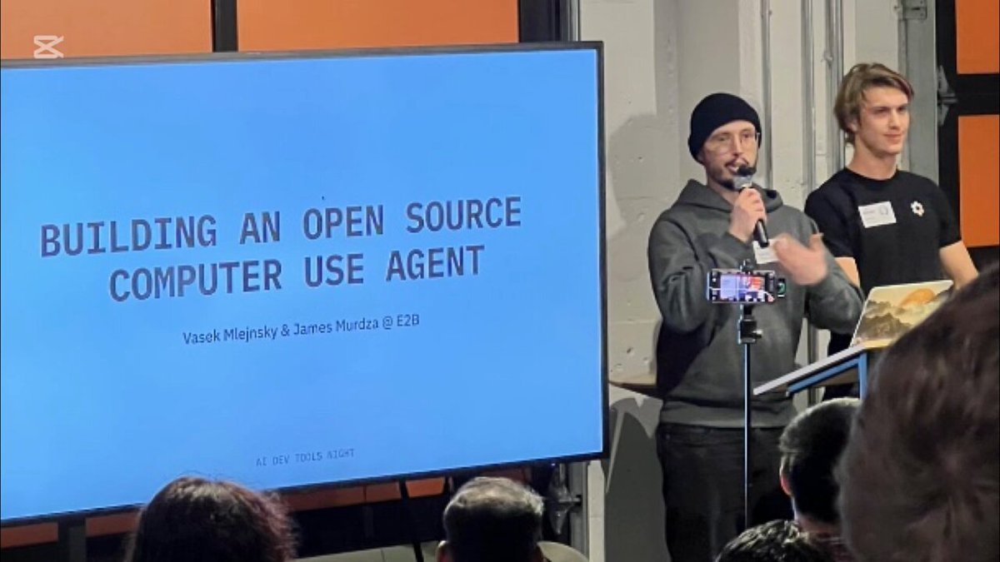

**Source:** [https://twitter.com/i/web/status/1878834392891838556](https://twitter.com/i/web/status/1878834392891838556)
**Original Post Date:** 2025-05-28 09:44:02

# Implementing Open-Source LLM Agent Frameworks: Core Concepts and Tools

## Introduction
LLM agent frameworks enable automated interaction with large language models to perform complex tasks. This article explores the fundamental architecture, design patterns, and best practices for implementing robust agent systems. We'll cover core components like state management, task orchestration, and error handling, while highlighting key open-source tools that simplify the development process.

## Core Concepts of LLM Agent Systems

An LLM agent system consists of multiple interacting components designed to manage complex workflows with large language models. The core architecture includes state management, task decomposition, and interaction protocols.

Agents operate by processing user inputs, breaking down tasks into sub-tasks, and coordinating interactions between different systems and services.

```python
class LLMAgent:
    def __init__(self):
        self.state = {}
        self.llm_client = create_llm_client()

    async def process_request(self, request: str) -> dict:
        """
        Process user requests and coordinate task execution.
        Returns state updates for tracking progress."""
        tasks = decompose_task(request)
        results = await self.execute_tasks(tasks)
        return {'status': 'completed', 'results': results}
```

- State management for tracking task progress
- Task decomposition for complex workflows
- Error handling and retry mechanisms
- Integration with external services

> **Note/Tip:** Implement robust state persistence to handle failures

> **Note/Tip:** Use async operations for efficient resource utilization

## Design Patterns and Architecture

Successful agent frameworks employ specific architectural patterns that ensure scalability, maintainability, and extensibility. Key patterns include modular design, separation of concerns, and event-driven communication.

Implement a clear separation between the core agent logic, task handlers, and external integrations to facilitate testing and updates.

```python
from abc import ABC, abstractmethod

class TaskHandler(ABC):
    @abstractmethod
    async def execute(self, context: dict) -> Any:
        pass
```

## Key Takeaways

- Modular design is crucial for maintaining and extending agent systems
- State management requires careful consideration of persistence and consistency
- Error handling should be comprehensive to ensure reliable operation

## Conclusion
Building an open-source LLM agent framework requires careful attention to architectural patterns, state management, and error handling. By following these principles and utilizing existing tools like LangChain or Rasa, developers can create robust systems capable of automating complex AI workflows.

## External References

- [LangChain Documentation](https://python.langchain.com/docs/)
- [Rasa Framework Guide](https://rasa.com/docs/rasa)


## Media

**Image Description:** ### Description of the Image:

#### **Main Subject:**
The image shows a presentation or talk taking place in a conference or workshop setting. The main subject is a person standing on a stage, holding a microphone and addressing an audience. The individual is wearing a dark gray hoodie and a black beanie. They appear to be actively speaking, as indicated by their hand gestures and the microphone in their hand. 

#### **Background and Setting:**
- **Screen Display:** A large screen is prominently displayed behind the speaker. The screen shows a presentation slide with the following text:
  - **Title:** "BUILDING AN OPEN SOURCE SOURCE"
  - **Subtitle:** "COMPUTER COMPUTER USE USE AGENT AGENT"
  - **Authors/Credits:** "Vasek Mlejnsky & James Murdza @ E2B"
  - **Additional Text:** "AI DEV TOOLS RIGHT" (partially visible at the bottom of the screen).

  The text on the screen appears to have some repetition, which might be intentional for emphasis or could be a typographical error.

- **Stage Setup:** The stage has a simple setup with a microphone stand and a small tripod-mounted device (possibly a camera or a phone) positioned in front of the speaker. The background includes a mix of orange and white panels, giving the setting a modern and casual feel.

- **Audience:** The audience is visible in the foreground, with several heads and shoulders indicating that the event is well-attended. The audience appears to be seated and facing the stage.

#### **Additional Details:**
- **Second Person:** To the right of the main speaker, there is another individual standing on the stage. This person is wearing a black T-shirt and has a name tag or badge on their chest. They are holding a laptop and appear to be assisting or supporting the main speaker.
- **Lighting:** The lighting is bright, focused on the stage, ensuring that the speaker and the screen are clearly visible.
- **Environment:** The overall environment suggests a tech-focused or developer-oriented event, given the content of the presentation slide and the casual attire of the participants.

#### **Technical Details:**
- **Slide Content:** The slide text suggests the topic is related to building an open-source software or tool, possibly an "agent" for AI development tools. The repetition of words like "SOURCE," "COMPUTER," "USE," and "AGENT" might indicate a focus on key concepts or a design choice for emphasis.
- **Presentation Style:** The slide design is minimalistic, with a blue background and white text, which is typical for professional presentations. The repetition of words could be a stylistic choice or an error.
- **Event Context:** The mention of "@E2B" suggests that the event or organization is related to "E2B," which could be an abbreviation for a company, conference, or initiative.

### Summary:
The image depicts a presentation at a tech or developer event, where a speaker is discussing the development of an open-source agent for AI tools. The slide content is somewhat repetitive, possibly for emphasis, and the setting is casual yet professional, with a focus on the audience and the speaker. The presence of a second individual with a laptop suggests a collaborative or supportive role in the presentation. The overall atmosphere is indicative of a modern, tech-oriented conference or workshop.
