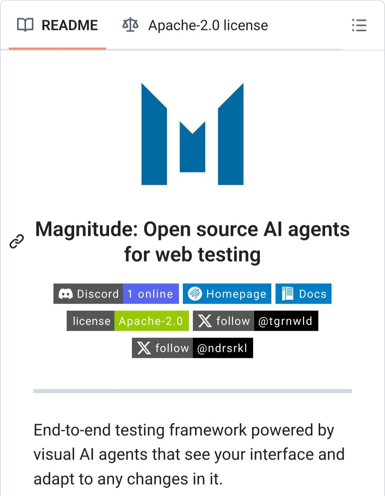

**Source:** [https://twitter.com/i/web/status/1912384286415827080](https://twitter.com/i/web/status/1912384286415827080)
**Original Post Date:** 2025-05-28 05:32:05

# Magnitude: Open-Source AI Agents for Web Testing Implementation

## Introduction
Magnitude represents a significant advancement in web application testing automation, leveraging artificial intelligence and machine learning principles to create adaptive, intelligent testing frameworks. This knowledge base article explores the technical implementation of Magnitude's AI agent architecture, focusing on its core components, integration patterns, and operational advantages for modern test automation workflows.

## Project Overview and Architecture

Magnitude is an open-source framework that revolutionizes web testing by introducing visual AI agents capable of autonomously navigating and validating user interfaces. The architecture is designed to be highly adaptable, automatically adjusting to interface changes without requiring manual test updates.

The core system leverages computer vision techniques to understand webpage layouts and interactions, making it particularly effective for dynamic applications where traditional keyword-based testing methods often fail.

_Basic configuration of a Magnitude AI Agent with visual tolerance and automation parameters._

```javascript
// Initialize Magnitude AI Agent
const agent = new magnitude.Agent();
agent.configure({
  viewport: '1920x1080',
  visualTolerance: 0.1,
  automationDelay: 500
});
```

## Integration Patterns and Best Practices

Effective integration requires careful consideration of test environment setup, including browser configurations and accessibility requirements. The framework supports both local and cloud-based execution environments.

Best practices emphasize starting with a controlled set of test cases before scaling to complex workflows.

- Configure headless mode for CI/CD pipelines
- Implement proper error handling and logging
- Use parallel execution strategies for performance optimization

> **Note/Tip:** Always validate AI agent decisions with human oversight during initial deployment phases.

> **Note/Tip:** Monitor system resources as visual processing can be computationally intensive.

## Community and Support

The project maintains an active community through Discord and Twitter channels. The Apache-2.0 license ensures freedom of use, modification, and distribution.

Documentation is comprehensive and regularly updated, providing detailed guides for integration scenarios.

1. Join the Discord server for real-time support
1. Follow @tgrnwld and @ndrsrkl on Twitter for project updates

## Key Takeaways

- Magnitude's visual AI agents provide adaptive testing capabilities that reduce maintenance overhead compared to traditional test automation frameworks.
- The open-source nature under Apache-2.0 license enables extensive customization and integration flexibility.
- Proper implementation requires careful configuration of visual tolerance parameters and execution environment settings.

## Conclusion
Magnitude offers a powerful solution for modern web application testing challenges, combining the reliability of automated testing with the adaptability of artificial intelligence. By following best practices and leveraging community support, teams can effectively implement this framework to enhance their test automation strategies.

## External References

- [GitHub Repository](https://github.com/tg-rnwld/magnitude)
- [Magnitude Documentation](https://docs.magnitudesoftware.io/)


## Media

**Image Description:** The image appears to be a screenshot of a GitHub repository page, specifically the README section. Below is a detailed description of the image, focusing on the main subject and relevant technical details:

### **Main Subject**
The main subject of the image is the README file of a GitHub repository titled **"Magnitude: Open source AI agents for web testing"**. The repository seems to be focused on developing or utilizing AI agents for web testing purposes.

### **Key Elements in the Image**

1. **Header Section**:
   - **Title**: The title of the repository is prominently displayed as **"Magnitude: Open source AI agents for web testing"**.
   - **License**: The repository is licensed under the **Apache-2.0 license**, as indicated in the top-right corner of the image.

2. **Logo**:
   - A blue logo is displayed in the center of the page. The logo consists of a stylized "M" shape, which likely represents the name or brand of the project, "Magnitude."

3. **Links and Badges**:
   - Several badges and links are provided below the title:
     - **Discord**: A Discord badge is shown, indicating that there is a Discord server associated with the project. The badge also mentions that **1 user is online**.
     - **Homepage**: A link to the project's homepage is provided.
     - **Docs**: A link to the project's documentation is available.
     - **License**: The Apache-2.0 license is reiterated with a badge.
     - **Follow on X (Twitter)**: Two Twitter handles are listed:
       - **@tgrnwld**
       - **@ndrsrkl**

4. **Description**:
   - The description below the badges provides a brief overview of the project:
     - The text mentions **"End-to-end testing framework powered by visual AI agents"**, indicating that the project involves using AI agents for end-to-end testing of web applications.
     - The description emphasizes the adaptability of the AI agents to changes in the interface.

5. **Text Repetition**:
   - There are noticeable repetitions in the text, such as "web testing" and "agents," which might be due to a formatting or display issue in the image.

6. **Layout**:
   - The layout is clean and organized, typical of a GitHub README file. The text is well-aligned, and the badges are placed in a row for easy access.

### **Technical Details**
- **License**: The Apache-2.0 license is a permissive open-source license, allowing users to freely use, modify, and distribute the software with minimal restrictions.
- **Badges**: The use of badges (e.g., Discord, Homepage, Docs) is a common practice in GitHub repositories to provide quick access to additional resources related to the project.
- **Social Media Links**: The inclusion of Twitter handles suggests an effort to engage with the community and promote the project on social media platforms.
- **README Format**: The README is formatted in Markdown, which is the standard for GitHub README files. The use of links, badges, and structured text is typical for providing clear and concise information about the project.

### **Overall Impression**
The image depicts a well-organized GitHub repository README for a project named "Magnitude." The project focuses on using AI agents for web testing, and it is open-source under the Apache-2.0 license. The repository provides links to additional resources such as a Discord server, homepage, and documentation, along with social media handles for further engagement. The repetition in the text might be a display anomaly rather than intentional. Overall, the project appears to be community-oriented and focused on providing a robust testing framework.
