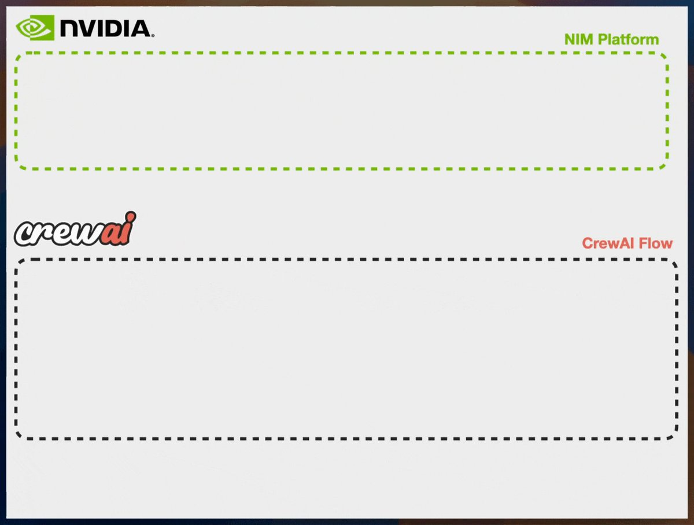

**Source:** [https://twitter.com/i/web/status/1876794656509370842](https://twitter.com/i/web/status/1876794656509370842)
**Original Post Date:** 2025-05-28 04:37:34

# NVIDIA NIM Platform Integration with CrewAI: Architectural Overview

## Introduction
This knowledge base article examines the architectural framework for integrating NVIDIA's NIM (Inference Manager) Platform with CrewAI Flow, a specialized AI workflow system. This integration represents a strategic approach to managing complex AI workflows through modular components and standardized interfaces.

## Conceptual Architecture Overview

The integration is structured around two distinct but interconnected modules: NVIDIA's NIM Platform and CrewAI Flow. The NIM Platform, represented by a green-dashed boundary, serves as the inference management layer, handling AI model deployment, optimization, and resource allocation.

The CrewAI Flow component, enclosed in a red-dashed border, functions as the workflow orchestration engine. This modular design enables seamless communication between NVIDIA's specialized hardware acceleration capabilities and CrewAI's workflow execution logic.

_Sample initialization code demonstrating the creation of an integrated workflow between NIM and CrewAI_

```python
from nvidia_nim import InferenceManager

nim = InferenceManager()
crewai_flow = nim.create_workflow(
    name='crewai_integration',
    target_platform='cuda'
)
```

- Real-time model inference management
- GPU-accelerated workflow execution
- Scalable resource allocation
- Modular component integration

> **Note/Tip:** Ensure proper CUDA version compatibility between NIM and CrewAI components

> **Note/Tip:** Implement robust error handling for cross-platform communications

## Integration Architecture Components

The architecture leverages NVIDIA's hardware acceleration capabilities through the NIM Platform while utilizing CrewAI's workflow management features. This combination enables efficient resource utilization and optimized AI pipeline execution.

Key architectural elements include modular component design, standardized communication protocols, and scalable resource allocation mechanisms.

1. Establish secure communication channels between NIM Platform and CrewAI Flow
1. Implement GPU memory management strategies
1. Configure workflow execution parameters

## Key Takeaways

- NVIDIA's NIM Platform provides robust inference management for AI workflows when integrated with CrewAI Flow.
- The modular architecture enables independent scaling of both components while maintaining seamless integration.
- Cross-platform communication requires careful consideration of resource allocation and error handling.

## Conclusion
This architectural framework demonstrates a powerful approach to managing complex AI workloads through the strategic combination of NVIDIA's hardware acceleration capabilities with CrewAI's workflow management features. The modular design ensures flexibility while maintaining robust performance.

## External References

- [NVIDIA NIM Platform Documentation](https://developer.nvidia.com/nim)
- [CrewAI Technical Specifications](https://www.crewai.com/technical-docs)


## Media

**Image Description:** The image appears to be a conceptual diagram or flowchart that illustrates a technical workflow or integration between two entities: **NVIDIA** and **CrewAI**. Below is a detailed description of the image:

### **Main Components and Layout**
1. **Background and Borders**:
   - The overall background is white.
   - The diagram is enclosed within a dark blue border, giving it a clean and structured appearance.

2. **Sections**:
   - The diagram is divided into two main sections, each represented by a dashed-line box:
     - **Top Section**: Labeled as "NIM Platform" with a green dashed line.
     - **Bottom Section**: Labeled as "CrewAI Flow" with a red dashed line.

### **Top Section: NIM Platform**
- **Label**: "NIM Platform" is written in green text in the top-right corner of this section.
- **Logo**: In the top-left corner of the image, there is the **NVIDIA logo**:
  - The NVIDIA logo consists of a green square with a white eye-like symbol inside it, followed by the word "NVIDIA" in black.
- **Content**: The section is empty, indicating that it is a placeholder for the NIM Platform details or components. The green dashed line emphasizes the boundary of this section.

### **Bottom Section: CrewAI Flow**
- **Label**: "CrewAI Flow" is written in red text in the bottom-right corner of this section.
- **Logo**: In the bottom-left corner, there is the **CrewAI logo**:
  - The logo reads "crewai" in a stylized font. The word "crew" is in black, while "ai" is in red, matching the color of the section's label.
- **Content**: Similar to the top section, this section is also empty, indicating that it is a placeholder for the details or components of the CrewAI Flow.

### **Color Coding and Dashed Lines**
- **Green Dashed Line**: Used to outline the "NIM Platform" section, aligning with the NVIDIA branding.
- **Red Dashed Line**: Used to outline the "CrewAI Flow" section, aligning with the CrewAI branding.
- The use of dashed lines suggests that these sections are modular or separable, possibly indicating a flow or integration process.

### **Overall Structure**
- The diagram is simple and minimalistic, focusing on the conceptual relationship between the two entities (NVIDIA and CrewAI).
- The placement of logos and labels suggests a flow or interaction between the NIM Platform and the CrewAI Flow, although the specific details of the interaction are not provided in the image.

### **Technical Details**
- **NVIDIA NIM Platform**: Likely refers to NVIDIA's NIM (NVIDIA Inference Manager) platform, which is a tool for managing and optimizing AI inference workloads.
- **CrewAI Flow**: Refers to a workflow or process managed by CrewAI, which appears to be an AI-related entity or platform.
- The diagram seems to illustrate a potential integration or workflow where the NIM Platform interacts with or feeds into the CrewAI Flow.

### **Conclusion**
The image is a conceptual representation of a technical workflow or integration process between NVIDIA's NIM Platform and CrewAI's flow. The use of color-coded dashed lines and logos helps differentiate the two sections while maintaining a clean and organized visual structure. The placeholders suggest that this is a high-level diagram, likely intended for further elaboration or detailing.
