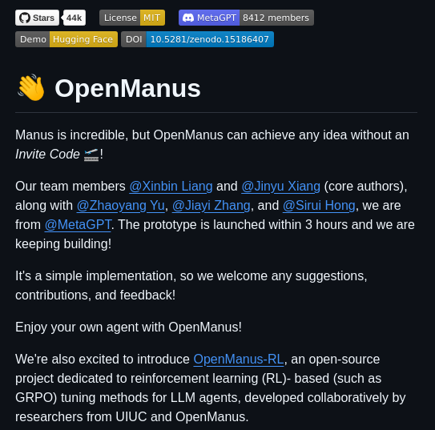

**Source:** [https://twitter.com/i/web/status/1913603056744222882](https://twitter.com/i/web/status/1913603056744222882)
**Original Post Date:** 2025-06-17 09:58:35

# OpenManus: An Open-Source Framework for Agent Development and RL-Based LLM Tuning

## Introduction
OpenManus is a pioneering open-source framework that democratizes AI agent development by eliminating traditional access barriers. Developed collaboratively under the MetaGPT umbrella with UIUC researchers, this framework enables developers to create and customize intelligent agents without invite codes or complex setup requirements. Its integration with reinforcement learning (RL) techniques for Large Language Model (LLM) tuning represents a significant advancement in accessible AI development tools.

## Technical Architecture & Key Components

The framework's architecture is designed to facilitate both agent creation and RL-based LLM optimization. It provides core utilities for agent initialization, state management, and action execution through a streamlined API structure.

Integration with Hugging Face ecosystem enables seamless deployment of trained agents across various environments while maintaining reproducibility through the provided DOI: 10.5281/zenodo.15186407.

_Basic agent initialization using OpenManus's declarative approach to action definition and execution._

```python
from openmanus import AgentBuilder

agent = AgentBuilder(
    model='gpt-3.5',
    actions=['write_code', 'analyze_data'],
    memory_size=1024
).build()

agent.execute('Analyze sentiment in this text: ...')
```

> **Note/Tip:** Always define clear action boundaries for agents to ensure predictable behavior.

> **Note/Tip:** Utilize the memory management features for stateful agent operations across interactions.

## OpenManus-RL Integration

The OpenManus-RL module provides specialized tools for reinforcement learning-based tuning of LLMs. This integration supports fine-tuning methods such as GROPO, optimizing models like GPT through adaptive reward structures.

The framework automatically handles the RL training loop, allowing developers to focus on defining custom reward functions and environment interactions.

```python
# Example reward function

def rl_reward_generator(model_output):
    return sum(
        [calculate_semantic_coherence(output)
         for output in model_output]
    ) * 0.8 + \
           calculate_response_time() * 0.2
```

> **Note/Tip:** Monitor reward function stability to prevent agent behavior degradation.

> **Note/Tip:** Implement validation datasets to evaluate RL optimization effectiveness.

## Community & Collaboration

With 8412 members and over 44k stars on GitHub, OpenManus benefits from a robust community-driven development model. The project's MIT license ensures broad adoption potential while maintaining commercial usability.

Active contribution guidelines encourage code submissions, documentation improvements, and feature requests through the official MetaGPT channel.

## Key Takeaways

- OpenManus provides barrier-free access to AI agent development with no-code requirements or invite restrictions.
- Integration of RL-based LLM tuning capabilities offers advanced customization options for large language models.
- Community-driven development and extensive documentation ensure long-term sustainability and support.

## Conclusion
OpenManus represents a significant advancement in accessible AI development tools, combining ease of use with powerful reinforcement learning capabilities. Its open-source nature and strong community backing make it an invaluable resource for developers looking to create sophisticated AI agents without traditional entry barriers.

## External References

- [Official OpenManus GitHub Repository](https://github.com/metagpt/openmanus)
- [Hugging Face Model Hub Integration](https://huggingface.co/models?filter=openmanus)


## Media

**Image Description:** The image is a screenshot of a GitHub repository page for a project called **OpenManus**. Below is a detailed description of the image, focusing on the main subject and relevant technical details:

### **Header Section**
1. **Repository Name**: 
   - The repository is named **OpenManus**.
   - The name is prominently displayed in large, bold text.
   - A handshake emoji (👋) is placed next to the name, symbolizing collaboration or community involvement.

2. **Stars and Forks**:
   - The repository has **44k stars**, indicating its popularity and engagement.
   - The forks count is not visible in the image.

3. **License**:
   - The repository is licensed under the **MIT License**, as indicated by the "License MIT" badge.

4. **MetaGPT and Members**:
   - The repository is associated with **MetaGPT**, as indicated by the "MetaGPT" badge.
   - It has **8412 members**, suggesting a large community or contributor base.

5. **Demo and Hugging Face**:
   - There is a "Demo" badge, indicating that a demo version of the project is available.
   - The repository is linked to **Hugging Face**, as indicated by the "Hugging Face" badge.

6. **DOI**:
   - The repository has a **DOI (Digital Object Identifier)**: `10.5281/zenodo.15186407`, which provides a persistent identifier for the project.

---

### **Main Content**
1. **Introduction to OpenManus**:
   - The text begins with a statement about **Manus**, describing it as "incredible."
   - **OpenManus** is introduced as a project that can achieve any idea without requiring an invite code, emphasizing its accessibility and openness.

2. **Core Team Members**:
   - The core authors are listed:
     - **@Xinbin Liang**
     - **@Jinyu Xiang**
   - Additional contributors are mentioned:
     - **@Zhaoyang Yu**
     - **@Jiayi Zhang**
     - **@Sirui Hong**
   - The team is noted to be from **MetaGPT**.

3. **Project Launch and Development**:
   - The prototype of the project was launched within **3 hours**.
   - The team is actively working on the project, as indicated by the phrase "we are keeping building!"

4. **Call for Contributions**:
   - The text encourages contributions, feedback, and suggestions, emphasizing the open-source nature of the project.

5. **Agent Implementation**:
   - The project allows users to "Enjoy your own agent with OpenManus," suggesting that it provides tools or frameworks for creating or customizing agents.

---

### **Additional Project Details**
1. **OpenManus-RL**:
   - A related project, **OpenManus-RL**, is mentioned.
   - This is described as an open-source project dedicated to **reinforcement learning (RL)**-based tuning for **Large Language Models (LLMs)**.
   - It focuses on **RL-based tuning methods** for LLMs, such as **GPT** and **GROPO** (a method for optimizing LLMs).
   - The project is developed collaboratively by researchers from **UIUC (University of Illinois at Urbana-Champaign)** and **OpenManus**.

---

### **Design and Layout**
- The background is **dark mode**, with white and light-colored text for readability.
- Badges are used to highlight key features, such as the license, MetaGPT association, and DOI.
- The text is organized into clear sections, with bullet points and emphasis on key phrases.

---

### **Overall Impression**
The repository is focused on an open-source project called **OpenManus**, which aims to provide tools and frameworks for creating and customizing agents, particularly in the context of reinforcement learning and large language models. The project is well-supported by a large community and has a strong technical foundation, as evidenced by its association with MetaGPT and contributions from researchers at UIUC. The emphasis on accessibility (no invite code required) and community involvement (8412 members) highlights its open and collaborative nature.
