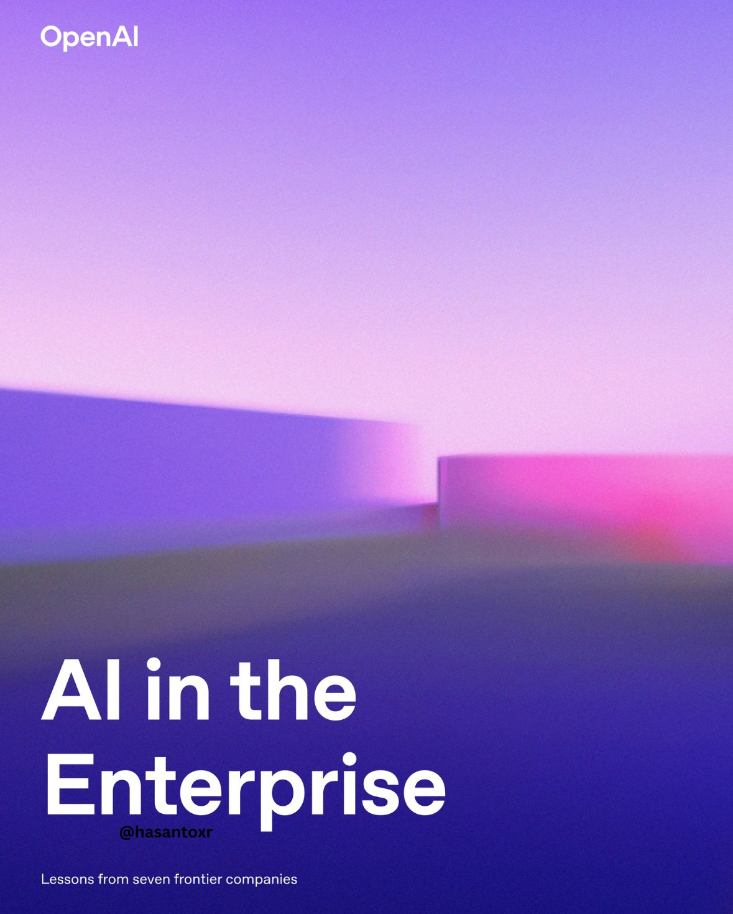
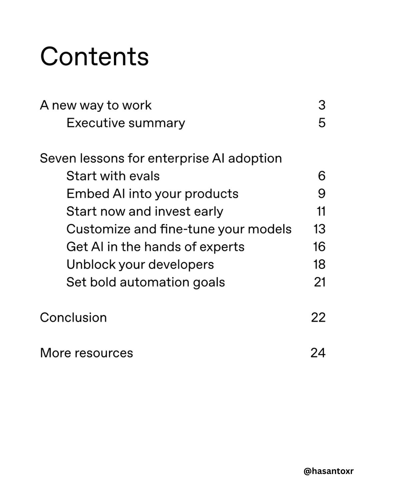

**Source:** [https://twitter.com/i/web/status/1919318992843620593](https://twitter.com/i/web/status/1919318992843620593)
**Original Post Date:** 2025-05-27 20:47:59

# OpenAI Enterprise AI Adoption Guide: Lessons and Implementation Strategies

## Introduction
In today's rapidly evolving technological landscape, enterprises must strategically implement AI to maintain competitive advantage. This guide presents seven foundational lessons derived from real-world implementations at leading organizations using OpenAI's technologies. From evaluation strategies to product integration and developer empowerment, this knowledge base offers actionable insights for successful enterprise-scale AI adoption.

## Evaluating AI Solutions: The Foundation

Successful AI implementation begins with rigorous evaluation of capabilities and limitations. Organizations must establish clear metrics to assess model performance, alignment with business objectives, and potential risks before scaling.

Evaluation frameworks should include quantitative measures (accuracy, latency) and qualitative assessments (bias detection, ethical considerations).

1. Define specific use cases and success criteria
1. Establish baseline performance metrics
1. Implement continuous monitoring systems

> **Note/Tip:** Start with small-scale pilots to validate assumptions before full deployment.

> **Note/Tip:** Document evaluation processes for transparency and accountability.

## Product Integration Strategy

Integrating AI into existing products requires careful consideration of technical architecture, user experience, and operational requirements. Organizations must design scalable solutions that maintain system reliability while delivering enhanced capabilities.

API-based integration offers flexibility and security benefits compared to direct model deployment.

_Example of a secure, API-based integration pattern for OpenAI services_

```python
import openai

def integrate_ai_service(prompt):
    response = openai.ChatCompletion.create(
        model="gpt-3.5-turbo",
        messages=[{"role": "user", "content": prompt}]
    )
    return response.choices[0].message.content
```

## Developer Enablement and Tools

Empowering developers is crucial for rapid AI adoption. Organizations should provide comprehensive tools, documentation, and training to reduce friction in development cycles.

Implement sandbox environments and governance frameworks to balance innovation with security.

- Establish developer portals with API access and examples
- Create standardized workflows for model deployment
- Provide comprehensive documentation and support channels

## Key Takeaways

- Begin AI implementation with thorough evaluation of capabilities and limitations
- Design scalable integration patterns that maintain system reliability
- Empower developers through tools, training, and governance frameworks
- Focus on continuous monitoring and improvement post-deployment

## Conclusion
Successful enterprise AI adoption requires a methodical approach combining technical expertise, strategic planning, and organizational alignment. By following these seven lessons from frontier companies, organizations can accelerate their journey toward effective AI integration while mitigating risks.

## External References

- [OpenAI API Documentation](https://platform.openai.com/docs/introduction)
- [Enterprise AI Adoption Best Practices Guide](https://openai.com/enterprise-adoption-guide)


## Media

**Image Description:** The image is a visually striking and minimalist design with a focus on abstract geometric shapes and a gradient color scheme. Here is a detailed description:

### **Main Subject and Composition**
1. **Geometric Shapes**:
   - The image features two prominent rectangular shapes in the lower portion of the frame.
   - The shapes are simple and abstract, with clean lines and no intricate details.
   - The rectangles are positioned horizontally, with one slightly overlapping the other.
   - The shapes are rendered in a gradient of dark blue to black, creating a sense of depth and shadow.

2. **Lighting and Color Gradient**:
   - The background is a gradient transitioning from a deep purple at the top to a lighter pinkish-purple near the horizon.
   - The gradient creates a soft, ethereal atmosphere, reminiscent of a twilight or dawn sky.
   - The lighting appears to be diffused, with no harsh shadows, contributing to the overall serene and futuristic feel.

3. **Lighting Effects**:
   - A bright, glowing pink light emanates from the right side of the image, behind the rectangular shapes.
   - This light creates a soft, blurred effect, adding a sense of mystery and depth.
   - The glow contrasts sharply with the darker foreground, drawing attention to the interplay between light and shadow.

### **Text Elements**
1. **Top Left Corner**:
   - The text "OpenAI" is displayed in a clean, sans-serif font in white.
   - The font is simple and modern, aligning with the minimalist aesthetic of the image.

2. **Center Bottom**:
   - The phrase "AI in the Enterprise" is prominently displayed in large, bold, white text.
   - The text is repeated multiple times, creating a visual emphasis and reinforcing the theme.
   - The repetition of the text adds a dynamic, almost hypnotic quality to the design.

3. **Bottom Left Corner**:
   - Smaller text reads "@hasantoxr," likely a social media handle or credit for the design.
   - Below this, there is another line of text: "Lessons from seven frontier companies."
   - This text provides context, suggesting that the image is related to a discussion or report about AI implementation in leading enterprises.

### **Technical Details**
1. **Color Palette**:
   - The color scheme is dominated by cool tones, primarily purples, blues, and pinks.
   - The gradient transitions smoothly, creating a harmonious and visually appealing effect.
   - The use of contrasting colors (dark shapes against a lighter background) enhances the depth and focus.

2. **Lighting and Atmosphere**:
   - The lighting is soft and diffused, with a strong emphasis on ambient light.
   - The glow from the pink light source adds a futuristic and almost otherworldly feel.
   - The overall atmosphere is calm and contemplative, with a sense of technological sophistication.

3. **Typography**:
   - The font used for the text is modern and sans-serif, contributing to the clean and futuristic aesthetic.
   - The repetition of the phrase "AI in the Enterprise" creates a visual rhythm and draws the viewer's attention to the central theme.

### **Overall Impression**
The image is a visually striking and modern design that effectively combines abstract geometric shapes, a gradient color scheme, and bold typography. The interplay of light and shadow, along with the repetition of the central text, creates a sense of depth and focus. The overall composition is minimalistic yet impactful, aligning well with the theme of AI and enterprise innovation. The use of cool tones and soft gradients gives the image a futuristic and sophisticated feel, making it suitable for a professional or technological context.


**Image Description:** The image is a screenshot of a table of contents for a document or presentation. The content is organized in a structured format, listing various sections along with their corresponding page numbers. Below is a detailed description:

### **Main Subject:**
The main subject of the image is the **table of contents** for a document or presentation. It outlines the structure of the content, providing a clear overview of the topics covered and their respective page numbers.

### **Content Details:**
1. **Title:**
   - The title at the top of the image is **"Contents"**, written in bold, black text.

2. **Sections and Subsections:**
   - The table of contents lists several sections and subsections, each with a corresponding page number. The text is aligned to the left, and the page numbers are aligned to the right.

3. **List of Sections:**
   - **A new way to work:**
     - **Executive summary summary** (Page 5)
   - **Seven lessons for enterprise AI adoption:**
     - **Start with evals** (Page 6)
     - **Embed AI into your products** (Page 9)
     - **Start now and invest early** (Page 11)
     - **Customize and fine-tune your models** (Page 13)
     - **Get AI in the hands of experts** (Page 16)
     - **Unblock your developers** (Page 18)
     - **Set bold automation goals** (Page 21)
   - **Conclusion** (Page 22)
   - **More resources** (Page 24)

4. **Formatting:**
   - The text is in a simple, clean font, likely a sans-serif typeface.
   - Subsections are indented to indicate their hierarchical relationship to the main sections.
   - Page numbers are aligned to the right, making it easy to locate the corresponding sections.

5. **Repetition and Errors:**
   - There are noticeable repetitions and typographical errors in the text:
     - "Executive summary summary" is repeated unnecessarily.
     - "Seven lessons lessons for enterprise enterprise AI adoption" has repeated words.
     - Some sections have repeated words, such as "your your" and "bold bold."
   - These errors suggest that the document might be a draft or a work in progress.

6. **Footer:**
   - At the bottom right corner, there is a watermark or signature: **"@hasantoxr"**, indicating the creator or contributor of the content.

### **Technical Details:**
- **Layout:**
  - The layout is clean and structured, with clear separation between sections and subsections.
  - The use of indentation for subsections helps in visual organization.
- **Typography:**
  - The font is consistent throughout, with bold text used for the title ("Contents").
  - The text is black on a white background, ensuring high readability.
- **Alignment:**
  - The text is left-aligned, while the page numbers are right-aligned, creating a balanced and organized appearance.

### **Overall Impression:**
The image presents a table of contents for a document focused on **enterprise AI adoption**. Despite the typographical errors and repetitions, the structure is clear, and the content appears to cover essential topics related to AI implementation in enterprises. The inclusion of a creator's watermark suggests ownership or authorship. The overall design is functional and straightforward, aimed at providing a quick reference for navigating the document.
