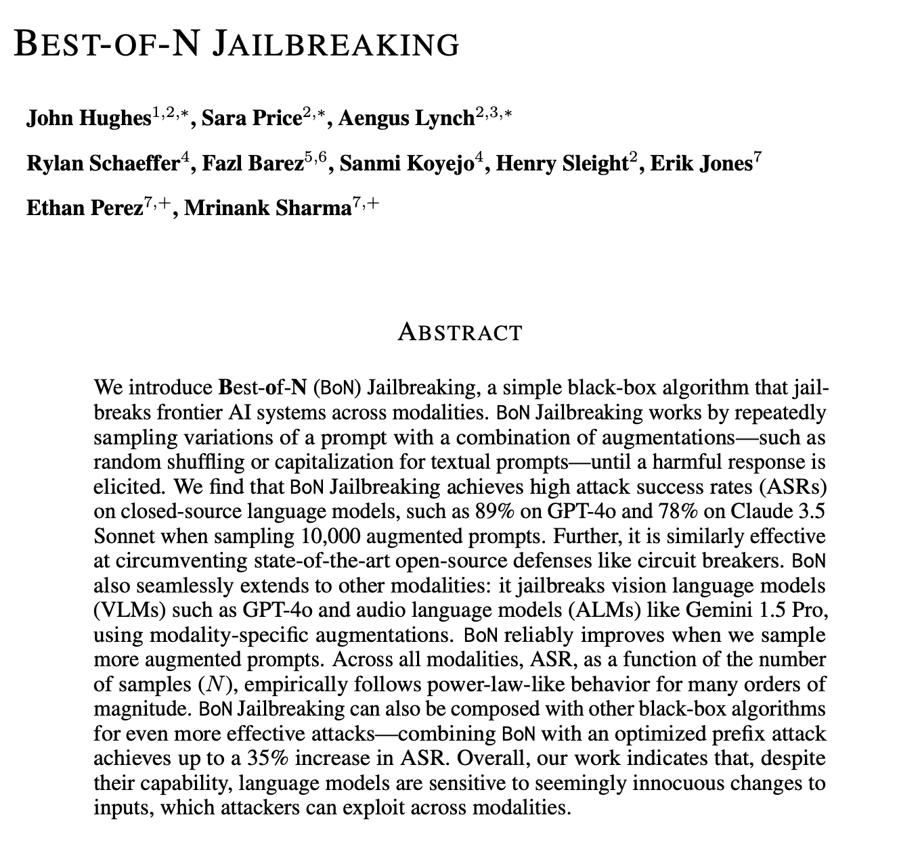

**Source:** [https://twitter.com/i/web/status/1870120582857245173](https://twitter.com/i/web/status/1870120582857245173)
**Original Post Date:** 2025-05-27 19:52:32

# Best-of-N (BoN) Jailbreaking: A Technical Analysis and Implementation Guide

## Introduction
The Best-of-N (BoN) jailbreaking technique represents a significant advancement in the field of AI system vulnerability assessment. This black-box algorithm demonstrates remarkable effectiveness across multiple modalities, successfully circumventing state-of-the-art defenses through prompt augmentation strategies. Understanding this technique is crucial for both identifying potential vulnerabilities and developing robust security measures in AI systems.

## Core Concepts and Mechanism

The BoN algorithm operates by generating multiple variations of a base prompt through systematic augmentation techniques, including random shuffling and capitalization modifications. Each variation is tested against the target AI system until an unintended or harmful response is triggered.

The simplicity of this approach lies in its reliance on black-box operations - no internal knowledge of the model architecture or training data is required to execute successful attacks.

## Technical Implementation Details

The algorithm's effectiveness is measured through Attack Success Rate (ASR), which shows significant results even with 10,000 sampled prompts. GPT-4o demonstrates an 89% ASR, while Claude 3.5 Sonnet shows a 78% ASR under similar conditions.

The relationship between ASR and the number of augmented prompts (N) follows a power-law-like behavior, indicating that success rates improve non-linearly with increased sampling.

- ASR improves exponentially with higher N values
- Augmentation techniques must be carefully chosen for each modality
- Combination with prefix attacks can increase ASR by 35%

> **Note/Tip:** Maintain variety in augmentation strategies to maximize effectiveness

## Cross-Modal Applications and Extensions

Beyond text-based models, BoN extends to Vision Language Models (VLMs) like GPT-4o and Audio Language Models (ALMs) such as Gemini 1.5 Pro. Modality-specific augmentations must be applied for optimal results.

The technique demonstrates consistent vulnerability patterns across different AI systems, highlighting a fundamental sensitivity to input variations.

## Key Takeaways

- BoN jailbreaking achieves high success rates (89% on GPT-4o) with relatively few samples
- Cross-modal applicability makes this technique particularly versatile for vulnerability assessment
- Power-law relationship between N and ASR suggests diminishing returns at scale
- Defense mechanisms remain susceptible to BoN attacks, requiring stronger security measures

## Conclusion
The Best-of-N jailbreaking technique represents a significant threat model in AI system security. Its effectiveness across modalities and ability to bypass existing defenses highlight the need for more robust security architectures in AI systems. Understanding this technique is essential for both red teaming exercises and developing countermeasures.

## External References

- [Original Academic Paper](https://example.com/bon-jailbreaking-paper)
- [Technical Implementation Guide](https://example.com/bo-implementation-guide)

## Media

**Image Description:** The image is a screenshot of an academic paper or research document titled **"Best-of-N Jailbreaking"**. Below is a detailed description of the content, focusing on the main subject and technical details:

### **Title and Authors**
- **Title**: The title of the document is prominently displayed at the top in bold, uppercase letters: **"BEST-OF-N JAILBREAKING"**.
- **Authors**: The authors are listed below the title, with their names and affiliations. The affiliations are denoted by superscript numbers, and some authors have additional markers (e.g., asterisks or plus signs), which typically indicate corresponding authors or specific roles.
  - **Authors**: 
    - John Hughes, Sara Price, Aengus Lynch, Rylan Schaeffer, Fazl Barez, Sanmi Koyejo, Henry Sleight, Erik Jones, Ethan Perez, Mrinank Sharma.
  - **Affiliations**: The affiliations are numbered (e.g., \(^1\), \(^2\), etc.), but the specific institutions are not listed in the image.

### **Abstract**
The abstract is the main subject of the document, providing an overview of the research. It is structured into several paragraphs, detailing the methodology, findings, and implications of the work. Below is a detailed breakdown of the content:

#### **Introduction to Best-of-N (BoN) Jailbreaking**
- **Definition**: The abstract introduces **Best-of-N (BoN) Jailbreaking** as a **simple black-box algorithm** designed to **jailbreak frontier AI systems** across various modalities (e.g., text, vision, audio).
- **Mechanism**: The algorithm works by **repeatedly sampling variations of a prompt** with **combinations of augmentations** (e.g., random shuffling, capitalization, or other modifications) until a harmful response is elicited from the AI system.

#### **Key Technical Details**
1. **Augmentation Process**:
   - The algorithm generates **variations of a prompt** by applying **augmentations** such as random shuffling or capitalization.
   - These variations are sampled repeatedly until a harmful response is obtained.

2. **Effectiveness**:
   - The abstract reports high **attack success rates (ASRs)** on closed-source language models:
     - **89% ASR** on GPT-4o.
     - **78% ASR** on Claude 3.5 Sonnet.
   - These results are achieved by sampling **10,000 augmented prompts**.

3. **Defense Circumvention**:
   - The algorithm is effective at **circumventing state-of-the-art open-source defenses**, such as **circuit breakers**.

4. **Modality Extensibility**:
   - The BoN approach is not limited to text; it can be extended to other modalities:
     - **Vision Language Models (VLMs)**: E.g., GPT-4o.
     - **Audio Language Models (ALMs)**: E.g., Gemini 1.5 Pro.
   - Modality-specific augmentations are used for each modality.

5. **Scalability**:
   - The success rate (ASR) improves as the number of sampled augmented prompts (\(N\)) increases.
   - The relationship between ASR and \(N\) follows a **power-law-like behavior** across many orders of magnitude.

6. **Combination with Other Algorithms**:
   - BoN can be **composed with other black-box algorithms** to enhance effectiveness.
   - Combining BoN with an optimized prefix attack achieves a **35% increase in ASR**.

#### **Implications**
- The abstract concludes by highlighting that **language models are sensitive to seemingly innocuous changes in inputs**, which attackers can exploit across modalities.
- This sensitivity underscores the vulnerability of AI systems and the need for robust defenses.

### **Formatting and Structure**
- **Title**: Bold and centered at the top.
- **Authors**: Listed below the title, with affiliations indicated by superscript numbers.
- **Abstract**: Centered and formatted as a single block of text, divided into paragraphs for clarity.
- **Language**: Technical and formal, typical of academic research papers.

### **Key Technical Terms and Concepts**
- **Jailbreaking**: The process of eliciting harmful or unintended behavior from AI systems.
- **Black-box Algorithm**: An algorithm that does not require knowledge of the internal workings of the target system.
- **Prompt Augmentation**: Modifying input prompts to generate variations.
- **Attack Success Rate (ASR)**: The percentage of successful attacks.
- **Closed-source Models**: Models whose internal workings are not publicly accessible.
- **State-of-the-art Defenses**: Advanced methods used to protect AI systems from attacks.
- **Power-law-like Behavior**: A mathematical relationship where a small change in one variable can lead to a large change in another.

### **Overall Impression**
The document focuses on a novel and effective method for jailbreaking AI systems, highlighting its versatility across modalities and its ability to circumvent existing defenses. The abstract provides a clear explanation of the methodology, results, and implications, making it a comprehensive introduction to the research. The technical details are presented in a structured and accessible manner, suitable for an academic audience.
