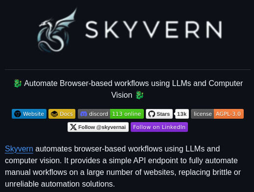

**Source:** [https://twitter.com/i/web/status/1915348019031032131](https://twitter.com/i/web/status/1915348019031032131)
**Original Post Date:** 2025-05-28 01:52:13

# Automating Browser Workflows Using Skyvern: LLMs and Computer Vision Integration

## Introduction
Browser-based automation traditionally relies on brittle solutions like Selenium or manual scripting. Skyvern revolutionizes this approach by combining Large Language Models (LLMs) with Computer Vision, offering a robust API-driven solution for automating complex web interactions. This integration addresses common challenges in web automation while maintaining reliability across diverse websites.

## Architecture & Core Technologies

Skyvern's architecture centers around two core technologies: LLMs and Computer Vision. The system processes user requests through an LLM to understand intent, then leverages computer vision for precise element detection and interaction within browser contexts.

The modular design allows seamless integration with existing workflows while maintaining robustness against website changes.

- LLM-driven request interpretation
- Real-time visual element detection
- API-first architecture

## Technical Implementation

Integration with Skyvern begins by establishing an API endpoint connection. The system processes commands through a structured format, enabling precise automation of complex workflows across multiple websites.

The combination of LLM and CV capabilities allows for contextual understanding of web elements, making it adaptable to various website structures.

_Example of basic API integration showing how natural language commands are processed._

```python
import skyvern

c = skyvern.Client('your_api_key')
result = c.execute(
    'Login to GitHub and create a new repository'
)
```

## Community & Ecosystem

With 13k stars on GitHub and an active Discord community (113 users online), Skyvern offers robust support for implementation challenges.

Documentation and community resources provide comprehensive guidance for various use cases.

1. Access detailed API documentation at docs.skyverni.com
1. Join the Discord community for real-time support
1. Explore GitHub repository for examples

> **Note/Tip:** Ensure network reliability when deploying automation scripts.

> **Note/Tip:** Test visual recognition components thoroughly across target websites.

## Key Takeaways

- Skyvern simplifies complex browser automation through AI-driven approaches
- LLM and computer vision integration ensures robustness against website changes
- API-first design enables seamless integration with existing systems

## Conclusion
Skyvern represents a significant advancement in web automation, combining cutting-edge AI technologies to create reliable, scalable solutions. Its active community support and comprehensive documentation make it an ideal choice for teams looking to modernize their browser-based workflows.

## External References

- [GitHub Repository](https://github.com/skyverni)
- [Project Documentation](https://docs.skyverni.com)


## Media

**Image Description:** The image is a screenshot of a GitHub repository page for a project called **Skyvern**. Below is a detailed description of the image, focusing on the main subject and relevant technical details:

### **Main Subject: Skyvern**
- **Project Name**: The project is named **Skyvern**, as prominently displayed at the top of the image.
- **Logo**: The logo on the left side of the page features a stylized, abstract design resembling a bird or a dragon in a light blue color, which contrasts with the dark background.
- **Tagline**: The tagline reads:
  > "Automate Browser-based workflows using LLMs and Computer Vision 🦜"

### **Technical Details and Features**
1. **Description**:
   - The project aims to automate browser-based workflows using **Large Language Models (LLMs)** and **Computer Vision**.
   - It provides a simple API endpoint to fully automate manual workflows on a large number of websites.
   - The goal is to replace brittle or unreliable automation solutions.

2. **Key Features**:
   - **LLMs and Computer Vision**: The project leverages advanced technologies like LLMs and computer vision to automate tasks.
   - **API Endpoint**: It offers a simple API endpoint for integration.
   - **Website Automation**: It is designed to automate workflows on a large number of websites.

3. **Repository Information**:
   - **Website**: A link to the project's website is provided.
   - **Documentation (Docs)**: A link to the project's documentation is available.
   - **Discord Server**: The project has an active Discord server with **113 users online** at the time of the screenshot.
   - **Stars**: The repository has **13k stars**, indicating its popularity and engagement.
   - **License**: The project is licensed under the **AGPL-3.0** license, which is an open-source license.

4. **Social Media and Community Links**:
   - **GitHub Profile**: A link to follow the project's GitHub profile (`@skyverni`).
   - **LinkedIn**: A link to follow the project on LinkedIn.

### **Design and Layout**
- **Background**: The background is dark, likely black or a very dark gray, which makes the text and elements stand out.
- **Text Color**: The text is primarily in white, with some elements (e.g., links, buttons) highlighted in blue or other colors for emphasis.
- **Icons**: Various icons are used to represent links (e.g., a globe for the website, a book for documentation, a Discord logo, etc.).
- **Color Scheme**: The color scheme is minimalistic, with a focus on dark and light contrasts, along with some accent colors like blue and green.

### **Additional Notes**
- The project appears to be well-maintained and actively used, as indicated by the high number of stars and active Discord server.
- The use of LLMs and computer vision suggests that the project is leveraging cutting-edge technologies to solve complex automation problems.

Overall, the image effectively communicates the purpose, features, and community engagement of the **Skyvern** project.
