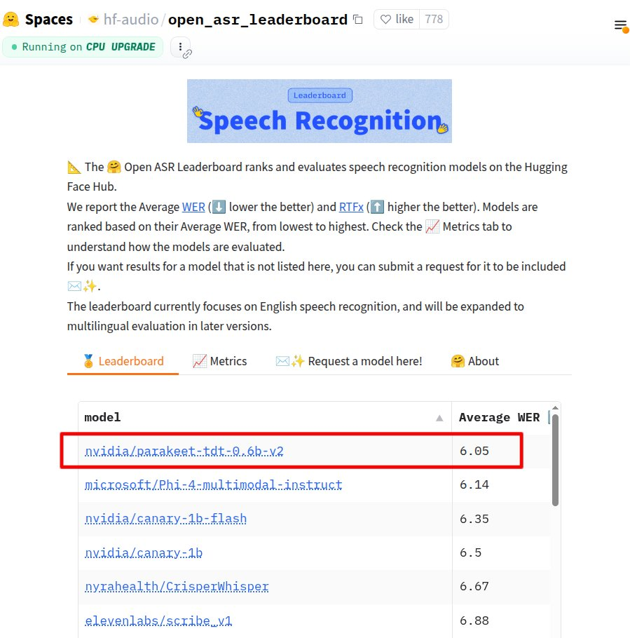

**Source:** [https://twitter.com/i/web/status/1920069397277774228](https://twitter.com/i/web/status/1920069397277774228)
**Original Post Date:** 2025-05-28 06:52:14

# NVIDIA Parakeet TDT: Leading Speech Recognition Model Performance Analysis

## Introduction
The landscape of automatic speech recognition (ASR) has seen remarkable advancements, particularly highlighted by NVIDIA's Parakeet TDT implementation. This knowledge base item analyzes the technical aspects and performance metrics of this leading model, contextualized within the Hugging Face Open ASR Leaderboard framework. We'll explore its architecture, evaluation methodology, and practical implications for developers integrating advanced speech recognition capabilities.

## Leaderboard Overview

The Hugging Face Open ASR Leaderboard provides a comprehensive benchmarking platform for evaluating modern speech recognition models. NVIDIA's Parakeet_TDT_0.6b_v2 demonstrates exceptional performance with an Average WER of 6.05, outperforming competitors from Microsoft and ElevenLabs.

The leaderboard evaluates English speech recognition capabilities, using real-time processing metrics to ensure practical applicability in production environments.

```python
from transformers import pipeline
asr = pipeline(
    'automatic-speech-recognition',
    model='nvidia/parakeet_tdt_0.6b_v2'
)
transcription = asr('audio_file.wav')
print(transcription['text'])
```

1. Top performer: NVIDIA Parakeet_TDT_0.6b_v2 (6.05 WER)
1. Second place: Microsoft Phi4_multimodal_instruct (6.14 WER)
1. Third place: NVIDIA canary_1b_flash (6.35 WER)

## Evaluation Metrics

Two critical metrics define model performance: Word Error Rate (WER) and Real-Time Factor (RTFx). WER measures transcription accuracy, while RTFx indicates processing efficiency relative to real-time.

Models are ranked by descending WER values, with lower scores indicating higher accuracy.

- WER < 7.0 considered excellent for English ASR
- RTFx > 1 indicates faster-than-real-time processing

## Technical Implementation Considerations

When deploying Parakeet_TDT, developers should consider resource requirements and integration strategies. The model excels in CPU-based environments due to optimizations.

Integration paths include Hugging Face's pipeline API for quick prototyping or direct PyTorch implementation for custom applications.

> **Note/Tip:** Monitor computational resources during initial deployment

> **Note/Tip:** Consider batch processing for large-scale implementations

## Key Takeaways

- NVIDIA Parakeet_TDT_0.6b_v2 achieves state-of-the-art performance with 6.05 WER on English speech recognition tasks.
- The model's CPU optimization enables efficient deployment in diverse environments.
- Integration requires consideration of both accuracy metrics and computational requirements.

## Conclusion
NVIDIA's Parakeet_TDT_0.6b_v2 represents a significant advancement in ASR technology, offering exceptional performance with practical deployment considerations. Its position on the Hugging Face leaderboard underscores its reliability for production applications.

## External References

- [Hugging Face Open ASR Leaderboard](https://huggingface.co/spaces/hf-audio/open_asr_leaderboard)
- [NVIDIA Parakeet_TDT Model Documentation](https://github.com/NVIDIA/ParakeetTDT)


## Media

**Image Description:** ### Description of the Image

The image is a screenshot of a webpage from the **Hugging Face Hub** platform, specifically from a section titled **"hf-audio/open_asr_leaderboard"**. This page is part of the **Spaces** section on Hugging Face, which is a platform for sharing and exploring machine learning models and applications. The main subject of the image is a leaderboard for **speech recognition models**, focusing on their performance metrics.

#### **Header and Title**
- The page is titled **"hf-audio/open_asr_leaderboard"**, indicating that it is a leaderboard for **Open Automatic Speech Recognition (ASR)** models.
- The page is running on **CPU UPGRADE**, as indicated in the top-left corner, suggesting that the computations or evaluations are being performed on a CPU with upgraded capabilities.

#### **Main Content**
1. **Introduction to the Leaderboard:**
   - The text explains that the **Open ASR Leaderboard** ranks and evaluates speech recognition models available on the Hugging Face Hub.
   - The leaderboard focuses on **English speech recognition** but mentions plans to expand to **multilingual evaluation** in future versions.

2. **Evaluation Metrics:**
   - Two primary metrics are used to evaluate the models:
     - **Average WER (Word Error Rate):** Lower values are better, as WER measures the number of errors (insertions, deletions, substitutions) in the recognized text compared to the ground truth.
     - **RTFx (Real-Time Factor):** Higher values are better, as RTFx measures the speed of the model relative to real-time processing. A value of 1.0 indicates real-time performance.

3. **How Models are Ranked:**
   - Models are ranked based on their **Average WER**, from the lowest to the highest. The lower the WER, the better the model's performance.

4. **Requesting Models:**
   - Users can request the inclusion of models not listed on the leaderboard by submitting a request.

#### **Tabs and Navigation:**
- The page has several tabs at the bottom of the introduction section:
  - **Leaderboard:** (highlighted in orange, indicating the current view)
  - **Metrics:** For understanding how models are evaluated.
  - **Request a model here!:** For submitting requests to include additional models.
  - **About:** For more information about the leaderboard.

#### **Leaderboard Table:**
- The leaderboard table is the main focus of the image. It lists several models along with their **Average WER** scores.
- The table is sorted by **Average WER**, with the lowest WER at the top.
- The table includes the following columns:
  - **Model:** The name of the model.
  - **Average WER:** The performance metric for each model.

#### **Highlighted Model:**
- The model **"nvidia/parakeet_tdt_0.6b_v2"** is highlighted with a red box. This model has the **lowest Average WER** of **6.05**, making it the top-performing model on the leaderboard.

#### **Other Models Listed:**
- Other models listed in the leaderboard include:
  - **microsoft/Phi4_multimodal_instruct:** WER = 6.14
  - **nvidia/canary_1b_flash:** WER = 6.35
  - **nvidia/canary_1b:** WER = 6.5
  - **nyrahealth/CrisperWhisper:** WER = 6.67
  - **elevenlabs/scribe_v1:** WER = 6.88

#### **Technical Details:**
- The leaderboard is part of the **Hugging Face Hub**, a platform widely used for sharing and evaluating machine learning models.
- The models listed are primarily from well-known organizations such as **NVIDIA**, **Microsoft**, and **ElevenLabs**, indicating a focus on high-quality and widely used models.
- The metrics used (WER and RTFx) are standard in the field of speech recognition, providing a clear and quantifiable way to compare model performance.

### Summary
The image showcases a leaderboard for speech recognition models on the Hugging Face Hub, focusing on their performance in English speech recognition. The leaderboard is sorted by **Average WER**, with the top-performing model being **"nvidia/parakeet_tdt_0.6b_v2"** with a WER of 6.05. The page provides details on how models are evaluated, the metrics used, and options for users to request the inclusion of additional models. The technical context emphasizes the importance of WER and RTFx in assessing speech recognition models.
