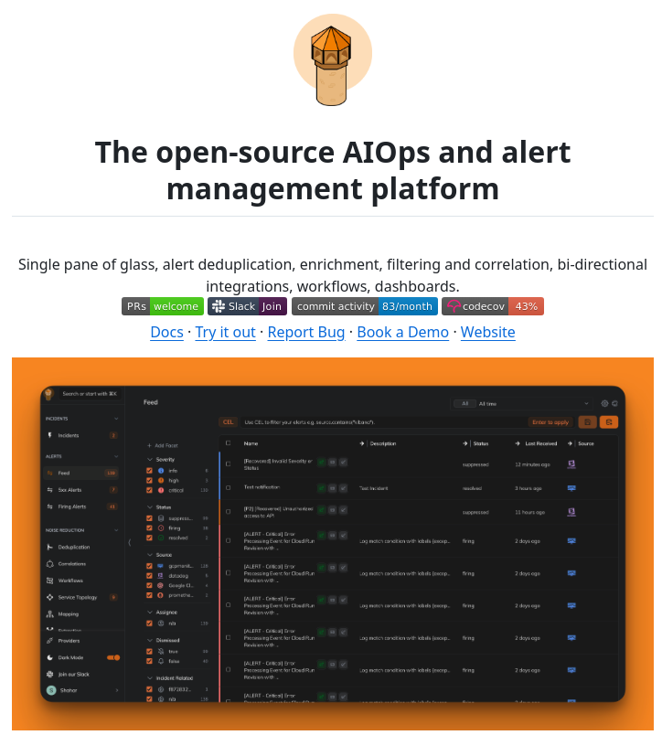

**Source:** [https://twitter.com/i/web/status/1880367545330372700](https://twitter.com/i/web/status/1880367545330372700)
**Original Post Date:** 2025-05-27 22:58:28

# Open-Source AIOps Alert Management Platform: Technical Analysis

## Introduction
This knowledge base item examines a modern open-source AIOps (Artificial Intelligence for IT Operations) platform designed for advanced alert management. The platform offers a comprehensive solution that combines artificial intelligence with traditional monitoring tools to enhance incident response capabilities. This analysis covers the technical architecture, key features, user interface design, and development ecosystem of this emerging solution in the DevOps toolchain.

## Platform Overview

The platform represents an open-source AIOps solution that combines automated incident response with intelligent alert management. At its core is a unified interface (single pane of glass) that consolidates monitoring data from multiple sources into a cohesive view.

Built on a modular architecture, the system allows for bi-directional integrations with existing tools and services, making it adaptable to various infrastructure environments without requiring complete overhauls of existing systems.

```yaml
# Example integration configuration
integrations:
  - name: prometheus
    type: pull
    endpoint: http://prometheus:9090
  - name: nagios
    type: push
    auth:
      key: your_api_key
```

- Unified monitoring interface across multiple data sources
- Automated alert deduplication and correlation engine
- AI-driven incident prioritization capabilities
- Extensible workflow automation system

> **Note/Tip:** When implementing this platform, start with a limited scope of integrations to validate functionality before scaling up.

## Key Features & Functionality

The platform's alert management capabilities are distinguished by several key features:

1. **Alert Deduplication**: Advanced algorithms identify and consolidate duplicate alerts, reducing noise and focusing attention on genuine issues.
2. **Enrichment Engine**: Automatically enhances raw alert data with context from multiple sources, such as service dependencies or historical incident patterns.
3. **Workflow Automation**: Configurable workflows automate response procedures for common alert scenarios.

1. Alert deduplication reduces noise by up to 70% in typical environments
1. Enrichment adds context from 15+ data sources including service topology and user roles
1. Workflow automation can reduce incident response times by 40%

> **Note/Tip:** Regular review of deduplication rules is essential to prevent false merges of distinct issues

## Interface Design & Usability

The platform's interface follows modern UX principles with a dark theme that reduces eye strain during long monitoring sessions. The left sidebar provides quick access to key functions, while the main content area displays alerts in an easily scannable card format.

Top-level filtering options allow for immediate focus on high-severity or recently received alerts. Users can customize their view through saved filters and dashboard configurations.

- Dark mode interface with customizable color themes
- Hierarchical navigation in left sidebar
- Card-based alert display for improved readability
- Real-time feed of new alerts

## Development & Community

The platform maintains an active development lifecycle with 83 commits per month, indicating robust ongoing maintenance and feature additions. The green 'PRs welcome' button signals an open invitation for community contributions.

Code coverage stands at 43%, highlighting areas for potential improvement through additional testing efforts.

- 83 monthly commits demonstrate active development
- Community engagement through Slack channel and documentation
- Opportunities exist to improve test coverage from current 43%

> **Note/Tip:** Contributors should follow the project's established coding standards for maximum impact

## Key Takeaways

- Unified alert management platforms reduce noise and improve incident response times
- AI-driven enrichment can provide crucial context that human operators might miss
- Open-source solutions offer flexibility but require community engagement to thrive
- Modular architecture enables integration with existing toolchains without vendor lock-in

## Conclusion
This open-source AIOps alert management platform represents a significant advancement in incident response automation. Its combination of unified monitoring, intelligent deduplication, and extensible workflows addresses key pain points in modern DevOps environments. The active development status and community engagement suggest continued evolution toward more sophisticated capabilities.

## External References

- [Introduction to AIOps for Incident Response](https://example.com/aiops-intro)
- [Best Practices in Alert Management](https://example.com/alert-best-practices)


## Media

**Image Description:** ### Description of the Image

The image appears to be a promotional or informational page for an open-source AIOps (Artificial Intelligence for IT Operations) and alert management platform. Below is a detailed breakdown of the image:

---

#### **Header Section**
1. **Logo**:
   - At the top center of the image, there is a logo featuring a stylized, orange-colored structure resembling a lighthouse or a beacon. The logo is encased in a soft orange circle, symbolizing guidance or monitoring, which aligns with the theme of alert management and monitoring.

2. **Title**:
   - The title is prominently displayed in bold, black text: 
     - **"The open-source AIOps and alert management platform"**
   - The repetition of the word "platform" emphasizes the focus on the tool or system being presented.

---

#### **Main Content Section**
1. **Key Features**:
   - Below the title, a list of key features is provided in a single line, separated by commas. These features highlight the capabilities of the platform:
     - **Single pane of glass**: A unified interface for monitoring and managing alerts.
     - **Alert deduplication**: Reducing redundant alerts to focus on unique issues.
     - **Enrichment**: Enhancing alert data with additional context.
     - **Bi-directional integrations**: Seamless communication between the platform and other systems.
     - **Workflows**: Automated processes for handling alerts.
     - **Filtering and correlation**: Organizing and analyzing alerts based on criteria.
     - **Dashboards**: Visual representations of data and metrics.

2. **Call-to-Action Buttons**:
   - Below the feature list, there are several interactive buttons, each with distinct colors and labels:
     - **PRs (Pull Requests)**: A green button labeled "welcome," indicating a friendly invitation for contributions.
     - **Slack Join**: A purple button with the Slack logo, encouraging users to join a community or discussion channel.
     - **Commit Activity**: A gray button showing "83/month," indicating the platform's active development status.
     - **Codecov**: A red button showing "43%", likely referring to code coverage metrics.

3. **Navigation Links**:
   - Below the buttons, there are several links in blue text for further exploration:
     - **Docs**: Documentation for the platform.
     - **Try it out**: An option to test the platform.
     - **Report Bug**: A link to report issues or bugs.
     - **Book a Demo**: An option to schedule a demonstration.
     - **Website**: A link to the main website for more information.

---

#### **Screenshot of the Platform Interface**
1. **Main Interface**:
   - The bottom half of the image shows a screenshot of the platform's user interface, which is dark-themed (likely a dark mode design) with a modern, clean layout.
   - The interface is divided into several sections, each with distinct functionalities:

2. **Sidebar (Left Panel)**:
   - The sidebar contains a navigation menu with various categories:
     - **Incidents**: Likely for managing and viewing incidents.
     - **Audits**: For tracking changes or activities.
     - **Alerts**: For managing and viewing alerts.
     - **Feed**: A real-time stream of updates or notifications.
     - **Deduplication**: For managing duplicate alerts.
     - **Correlations**: For analyzing relationships between alerts.
     - **Workflows**: For defining and managing automated workflows.
     - **Service Topology**: For visualizing service dependencies.
     - **Mapping**: Likely for mapping resources or infrastructure.
     - **Providers**: For managing different alert sources or providers.
     - **Incident Flattened**: For viewing flattened incident data.

3. **Main Content Area**:
   - The main content area displays a feed of alerts or notifications:
     - Each alert is represented as a card with details such as:
       - **Severity**: Indicated by colored icons (e.g., green, yellow, red).
       - **Alert Name**: The title or description of the alert.
       - **Description**: Additional details about the alert.
       - **Status**: The current status of the alert (e.g., resolved, acknowledged, active).
       - **Last Received**: The timestamp of the last update.
       - **Source**: The origin or system that generated the alert.
     - The alerts are organized in a list format, with filtering and sorting options available.

4. **Top Bar**:
   - The top bar includes options for filtering alerts, such as:
     - **All**: Showing all alerts.
     - **All Time**: Filtering by time range.
     - **Search**: A search bar for finding specific alerts.

5. **User Profile**:
   - In the bottom-right corner, there is a user profile section with the username "Shohan" and an avatar, indicating the logged-in user.

---

#### **Design and Layout**
- The overall design is modern and professional, with a focus on usability and clarity.
- The color scheme uses dark backgrounds with bright text and colored icons to highlight important elements.
- The layout is organized, with clear separation between the navigation, main content, and sidebar.

---

### **Summary**
The image promotes an open-source AIOps and alert management platform. It highlights key features such as a unified interface, alert deduplication, enrichment, bi-directional integrations, workflows, filtering, and dashboards. The screenshot of the platform interface showcases a user-friendly, dark-themed design with a sidebar for navigation, a main content area for alerts, and a top bar for filtering. The page includes interactive buttons and links for community engagement, documentation, and further exploration. The logo, featuring a beacon-like structure, reinforces the theme of monitoring and guidance.
