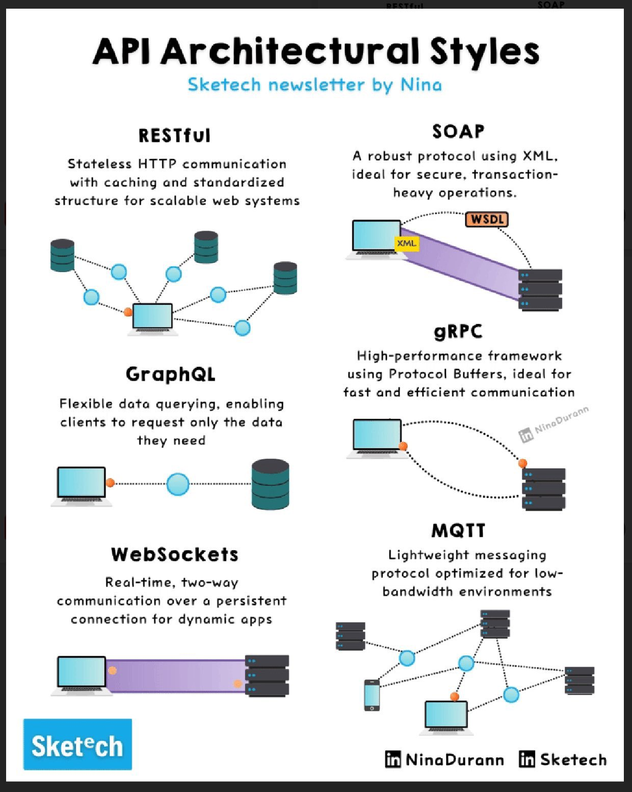

**Source:** [https://twitter.com/i/web/status/1869293800348377317](https://twitter.com/i/web/status/1869293800348377317)
**Original Post Date:** 2025-06-17 14:57:36

# Comparative Analysis of Modern API Architectural Styles

## Introduction
API architectural styles determine how client-server communication is structured, affecting performance, scalability, security, and development complexity. This analysis compares five dominant approaches: RESTful, SOAP, gRPC, GraphQL, and WebSockets. Each style addresses specific needs in the modern API landscape, from simple web services to real-time applications and high-performance microservices.

## RESTful Architecture

REST (Representational State Transfer) is a client-server architectural style that uses stateless HTTP communications. Its simplicity and scalability make it the most widely adopted API style for web services.

Key characteristics include: standardized methods (GET, POST, PUT, DELETE), uniform interface through resources and representations, layered system architecture, and cacheable responses.

> **Note/Tip:** REST is ideal when you need standardization and scalability across multiple clients and platforms

> **Note/Tip:** Avoid complex nested relationships in REST APIs as they can lead to over-fetching or under-fetching issues

## SOAP Architecture

SOAP (Simple Object Access Protocol) is a protocol for exchanging structured information between web services using XML. It provides strong security, reliability, and transaction support through its standardized message format.

The WSDL specification defines the service interface, enabling automatic client generation and robust contract-first development.

> **Note/Tip:** SOAP is best suited for enterprise systems requiring strict contracts and high security

> **Note/Tip:** Consider the overhead of XML processing when implementing SOAP in performance-critical scenarios

## gRPC Architecture

gRPC is a modern RPC (Remote Procedure Call) framework that uses Protocol Buffers for efficient binary serialization. It offers high-performance communication through HTTP/2 and supports features like bidirectional streaming.

Its strongly-typed interfaces and code generation capabilities make it particularly suitable for microservices architectures requiring low latency.

> **Note/Tip:** gRPC provides better performance than REST or SOAP for services with frequent, small payloads

> **Note/Tip:** The service contract is defined in .proto files which enables strong typing across languages

## GraphQL Architecture

GraphQL is a query language that allows clients to request exactly the data they need. It replaces multiple REST endpoints with a single endpoint and reduces over-fetching or under-fetching issues.

The schema defines available queries, mutations, and subscriptions, providing strong typing and validation at runtime.

> **Note/Tip:** GraphQL is excellent for complex client requirements where data needs vary significantly

> **Note/Tip:** Implement pagination carefully to avoid performance bottlenecks with large datasets

## WebSockets Architecture

WebSockets provide full-duplex communication channels over a single TCP connection. They maintain persistent connections between client and server, enabling real-time bidirectional data transfer.

This makes WebSockets ideal for applications requiring low-latency updates or live interactions like chat systems, gaming, and IoT devices.

> **Note/Tip:** WebSockets are essential for applications needing immediate feedback or push notifications

> **Note/Tip:** Consider the impact of persistent connections on server resource utilization

## Key Takeaways

- REST is the most versatile choice when standardization and broad platform support are priorities
- SOAP should be considered for enterprise systems requiring strict contracts and strong security guarantees
- gRPC offers superior performance for microservices architectures with low-latency requirements
- GraphQL provides flexibility in data fetching but requires careful schema design to maintain simplicity
- WebSockets are indispensable for real-time applications but come with trade-offs in connection management

## Conclusion
Choosing the right API architectural style depends on your specific use case, performance requirements, and ecosystem constraints. REST offers universal compatibility, SOAP provides enterprise-grade reliability, gRPC delivers high performance, GraphQL enables flexible data access, and WebSockets enable real-time communication. Understanding these trade-offs is crucial for making informed decisions in modern API design.

## Media

**Image Description:** The image is an infographic titled **"API Architectural Styles"** by Nina, as indicated in the text and logo at the bottom. It provides a comparative overview of five popular API architectural styles: **RESTful**, **SOAP**, **gRPC**, **GraphQL**, and **WebSockets**. Each style is described with its key characteristics, use cases, and visual representations. Below is a detailed breakdown:

---

### **1. RESTful**
- **Description**: 
  - Stateless HTTP communication.
  - Caching and standardized structure for scalable web systems.
  - Focus on simplicity, scalability, and statelessness.
- **Visual Representation**:
  - A network diagram showing multiple clients (represented by blue circles) interacting with a central server (represented by a laptop or server icon).
  - The diagram emphasizes the stateless nature of RESTful APIs, where each request is independent of previous requests.

---

### **2. SOAP**
- **Description**:
  - A robust protocol using XML.
  - Ideal for secure, transaction-heavy operations.
  - Emphasizes reliability and security.
- **Visual Representation**:
  - A diagram showing a client (laptop) sending a request to a server.
  - Key components like **WSDL (Web Services Description Language)** and **XML** are highlighted.
  - The diagram illustrates the structured and verbose nature of SOAP, with XML being the primary data format.

---

### **3. gRPC**
- **Description**:
  - High-performance framework using Protocol Buffers.
  - Ideal for fast and efficient communication.
- **Visual Representation**:
  - A diagram showing a client (laptop) communicating with a server.
  - Protocol Buffers are highlighted as the data format.
  - The diagram emphasizes the binary format and efficiency of gRPC, contrasting it with the verbosity of SOAP.

---

### **4. GraphQL**
- **Description**:
  - Flexible data querying.
  - Enables clients to request only the data they need.
  - Focus on flexibility and efficiency.
- **Visual Representation**:
  - A diagram showing a client (laptop) querying a server.
  - The diagram highlights the flexibility of GraphQL, where clients can specify exactly what data they need, reducing unnecessary data transfer.

---

### **5. WebSockets**
- **Description**:
  - Real-time, two-way communication.
  - Persistent connection for dynamic apps.
  - Ideal for low-bandwidth environments.
- **Visual Representation**:
  - A diagram showing multiple devices (laptop, smartphone, etc.) connected to a server via a persistent connection.
  - The diagram emphasizes the real-time, bidirectional communication nature of WebSockets, making it suitable for applications like chat apps, live updates, and IoT devices.

---

### **General Layout and Design**
- **Title**: The title "API Architectural Styles" is prominently displayed at the top in bold black text.
- **Subheading**: "Sketech newsletter by Nina" is written in blue text below the title.
- **Sections**: Each API style is presented in a separate section with:
  - A heading in bold black text.
  - A brief description in smaller black text.
  - A visual diagram illustrating the key concepts.
- **Color Scheme**: 
  - Blue and purple are used for highlighting key components (e.g., XML, WSDL, Protocol Buffers).
  - Black text is used for descriptions and headings.
  - Diagrams use a mix of blue, orange, and gray to represent clients, servers, and data flows.
- **Logos and Branding**: 
  - The "Sketech" logo is present at the bottom left.
  - The author's name, "Nina," and her LinkedIn profile are mentioned at the bottom right.

---

### **Key Technical Details**
1. **RESTful**:
   - Stateless: Each request is independent.
   - Uses HTTP methods (GET, POST, PUT, DELETE).
   - Focuses on scalability and simplicity.

2. **SOAP**:
   - Uses XML for data exchange.
   - WSDL defines the service interface.
   - Robust for secure and transactional operations.

3. **gRPC**:
   - Uses Protocol Buffers for efficient binary data serialization.
   - High performance and efficiency.
   - Suitable for microservices and distributed systems.

4. **GraphQL**:
   - Allows clients to specify exactly what data they need.
   - Reduces over-fetching and under-fetching issues.
   - Flexible and efficient for complex data queries.

5. **WebSockets**:
   - Maintains a persistent connection between client and server.
   - Real-time, two-way communication.
   - Ideal for applications requiring live updates or low-latency interactions.

---

### **Overall Impression**
The infographic is well-organized, visually appealing, and informative. It effectively compares the five API architectural styles by highlighting their strengths, use cases, and technical details. The diagrams complement the text descriptions, making the concepts easy to understand for both technical and non-technical audiences. The branding and authorship are clearly indicated, adding a professional touch.
