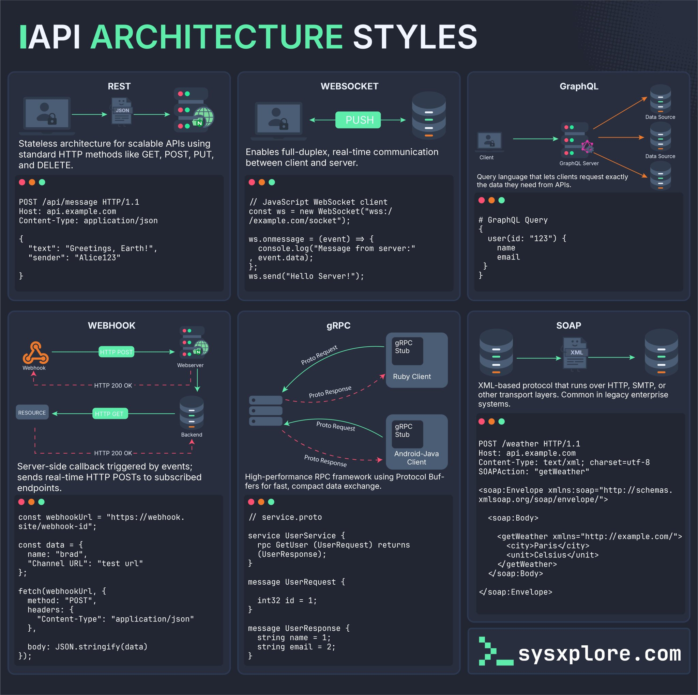

**Source:** [https://twitter.com/i/web/status/1914918661086761391](https://twitter.com/i/web/status/1914918661086761391)
**Original Post Date:** 2025-05-28 01:09:23

# API Architecture Styles: A Technical Deep Dive into REST, WebSocket, GraphQL, Webhook, gRPC & SOAP

## Introduction
API architecture selection fundamentally impacts application scalability, performance, and maintainability. This comprehensive guide explores six major architectural styles: REST for stateless communication, WebSocket for real-time bidirectional channels, GraphQL for flexible data querying, Webhook for event-driven integration, gRPC for high-performance RPCs, and SOAP for enterprise-grade protocols.

## REST (Representational State Transfer)

REST is a stateless architectural style using HTTP methods to manage resource states. Each request contains complete context without server-side session storage.

Key characteristics include standardized HTTP operations, JSON data format, and uniform interface through URIs.

_Demonstrates REST POST request with JSON payload_

```http
POST /api/message HTTP/1.1
Host: api.example.com
Content-Type: application/json

{
  "text": "Greetings, Earth!",
  "sender": "Alice123"
}
```

- Stateless communication pattern
- JSON-based data exchange
- Scalable and cache-friendly design

## WebSocket for Real-Time Communication

WebSocket enables persistent, bidirectional connections between client and server. Ideal for applications requiring real-time updates.

Maintains open connection with full-duplex communication capabilities.

```javascript
const ws = new WebSocket("wss://example.com/socket");
ws.onmessage = (event) => {
  console.log("Message from server: ", event.data);
};
ws.send("Hello Server!");
```

## GraphQL Query Language

GraphQL allows clients to specify exact data requirements through query language, eliminating over-fetching/under-fetching.

Centralized endpoint supports complex queries and mutations across multiple resources.

```graphql
query {
  user(id: "123") {
    name
    email
  }
}
```

## Webhook Event-Driven Integration

Webhooks enable server-to-server communication via HTTP callbacks triggered by specific events.

Ideal for real-time system integration without polling.

```javascript
fetch(webhookUrl, {
  method: "POST",
  headers: {"Content-Type": "application/json"},
  body: JSON.stringify(data)
});
```

## gRPC Remote Procedure Calls

gRPC provides high-performance RPC framework using Protocol Buffers for efficient data serialization.

Supports bi-directional streaming and unary RPCs with strong typing.

```protobuf
service UserService {
  rpc GetUser(UserRequest) returns (UserResponse);
}

message UserRequest {
  int32 id = 1;
}
```

## SOAP XML-Based Protocol

SOAP uses XML for structured data exchange, supporting multiple transport protocols.

Common in enterprise systems requiring strict standards and security.

```xml
<soap:Envelope xmlns:soap="http://schemas.xmlsoap.org/soap/envelope/"><soap:Body><getWeather xmlns="http://example.com/"><city>Paris</city></getWeather></soap:Body></soap:Envelope>
```

## Key Takeaways

- REST is optimal for stateless, resource-oriented APIs with standard HTTP methods
- WebSocket provides real-time communication through persistent connections
- GraphQL enables efficient data fetching by specifying exact requirements
- Webhooks facilitate event-driven integration without polling overhead
- gRPC delivers high-performance RPCs using Protocol Buffers
- SOAP remains relevant for enterprise systems requiring XML standards

## Conclusion
Selecting the appropriate API architecture style depends on specific use cases and requirements. REST provides broad compatibility, WebSocket enables real-time updates, GraphQL optimizes data fetching, Webhooks support event-driven integration, gRPC offers high performance, and SOAP ensures enterprise-grade protocol compliance.

## External References

- [sysxxplore.com API Architecture Infographic](https://www.sysxxplore.com/api-architecture)


## Media

**Image Description:** The image is a comprehensive infographic titled **"API Architecture Styles"**, which provides an overview of different architectural styles used in API development. The infographic is divided into six sections, each detailing a specific API architecture style: **REST**, **Websocket**, **GraphQL**, **Webhook**, **gRPC**, and **SOAP**. Below is a detailed breakdown of each section:

---

### **1. REST (Representational State Transfer)**
- **Description**: Stateless architecture for scalable APIs using standard HTTP methods (GET, POST, PUT, DELETE, etc.).
- **Key Features**:
  - Uses JSON as the primary data format.
  - Stateless: Each request from the client to the server contains all the necessary information; the server does not maintain session state.
  - Scalable and widely adopted for building web services.
- **Example Code**:
  - A `POST` request to `/api/message` is shown, demonstrating how data is sent in JSON format.
  - Example:
    ```http
    POST /api/message HTTP/1.1
    Host: api.example.com
    Content-Type: application/json

    {
      "text": "Greetings, Earth!",
      "sender": "Alice123"
    }
    ```
- **Diagram**: Illustrates the flow of data between the client and server using HTTP methods and JSON.

---

### **2. Websocket**
- **Description**: Enables full-duplex, real-time communication between the client and server.
- **Key Features**:
  - Bi-directional communication: Both the client and server can send and receive data in real-time.
  - Ideal for applications requiring real-time updates (e.g., chat applications, live dashboards).
- **Example Code**:
  - A JavaScript WebSocket client is shown connecting to a server and sending/receiving messages.
  - Example:
    ```javascript
    const ws = new WebSocket("wss://example.com/socket");
    ws.onmessage = (event) => {
      console.log("Message from server:", event.data);
    };
    ws.send("Hello Server!");
    ```
- **Diagram**: Illustrates the WebSocket connection and data flow between the client and server.

---

### **3. GraphQL**
- **Description**: Query language that allows clients to request exactly the data they need from APIs.
- **Key Features**:
  - Flexible and efficient: Clients specify the exact data they need, reducing over-fetching or under-fetching.
  - Centralized endpoint: All queries are sent to a single endpoint.
- **Example Code**:
  - A GraphQL query is shown to fetch user data.
  - Example:
    ```graphql
    query {
      user(id: "123") {
        name
        email
      }
    }
    ```
- **Diagram**: Illustrates the GraphQL server handling queries from multiple clients and fetching data from various data sources.

---

### **4. Webhook**
- **Description**: Server-side callback triggered by events; sends real-time HTTP POST requests to subscribed endpoints.
- **Key Features**:
  - Event-driven architecture: Triggers actions based on specific events.
  - Useful for integrating systems where one system needs to notify another about changes.
- **Example Code**:
  - A JavaScript example of triggering a webhook using `fetch`.
  - Example:
    ```javascript
    const webhookUrl = "[https://webhook.site/webhook-id-id";](https://webhook.site/webhook-id-id";)
    const data = {
      name: "brad",
      "Channel URL": "test url"
    };
    fetch(webhookUrl, {
      method: "POST",
      headers: {
        "Content-Type": "application/json"
      },
      body: JSON.stringify(data)
    });
    ```
- **Diagram**: Illustrates the flow of a webhook from the server to the client, showing HTTP POST requests.

---

### **5. gRPC (gRPC Remote Procedure Call)**
- **Description**: High-performance RPC framework using Protocol Buffers for fast, compact data exchange.
- **Key Features**:
  - Protocol Buffers (protobuf) for efficient serialization and deserialization of data.
  - Bi-directional streaming and unary RPCs.
  - Suitable for high-performance, low-latency applications.
- **Example Code**:
  - A gRPC service definition in `.proto` format and client-side implementation in Ruby and Android/Java.
  - Example:
    ```proto
    service UserService {
      rpc GetUser(UserRequest) returns (UserResponse);
    }

    message UserRequest {
      int32 id = 1;
    }

    message UserResponse {
      string name = 1;
      string email = 2;
    }
    ```
- **Diagram**: Illustrates the gRPC client-server interaction using Protocol Buffers.

---

### **6. SOAP (Simple Object Access Protocol)**
- **Description**: XML-based protocol that runs over HTTP, SMTP, or other transport protocols; common in legacy enterprise systems.
- **Key Features**:
  - Uses XML for data exchange.
  - Well-defined standards for security, reliability, and extensibility.
  - Often used in enterprise-level systems for its robustness.
- **Example Code**:
  - A SOAP request and response in XML format.
  - Example:
    ```xml
    <soap:Envelope xmlns:soap="[http://schemas.xmlsoap.org/soap/envelope/">](http://schemas.xmlsoap.org/soap/envelope/">)
      <soap:Body>
        <getWeather xmlns="[http://example.com/">](http://example.com/">)
          <city>Paris</city>
        </getWeather>
      </soap:Body>
    </soap:Envelope>
    ```
- **Diagram**: Illustrates the SOAP request-response cycle over HTTP.

---

### **Overall Layout and Design**
- The infographic uses a dark theme with green highlights for code snippets and diagrams.
- Each section is clearly separated and includes:
  - A title and brief description.
  - Code examples in relevant languages (e.g., JavaScript, GraphQL, Protocol Buffers, XML).
  - Diagrams illustrating the flow of data and interactions between clients and servers.
- The bottom right corner includes a watermark: **sysxxplore.com**, indicating the source of the infographic.

---

### **Key Takeaways**
This infographic serves as an educational resource for developers and architects, providing a concise comparison of different API architectural styles. Each style is tailored to specific use cases, from real-time communication (Websocket) to efficient data querying (GraphQL) and legacy enterprise systems (SOAP). The inclusion of code snippets and diagrams enhances understanding by providing practical examples.
