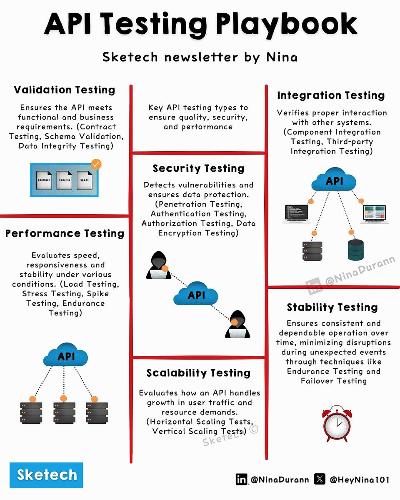

**Source:** [https://twitter.com/i/web/status/1891767901830472082](https://twitter.com/i/web/status/1891767901830472082)
**Original Post Date:** 2025-05-27 19:41:47

# Comprehensive API Testing Playbook: Types, Strategies & Best Practices

## Introduction
API testing is a critical component of modern software development, ensuring that APIs meet functional requirements while maintaining security, performance, and reliability. This playbook provides a systematic approach to different types of API testing, helping developers and QA engineers build high-quality APIs through comprehensive validation strategies.

## Validation Testing: Ensuring Functional Compliance

Validation testing verifies that an API adheres to its defined contract and specifications. This foundational layer ensures data integrity and schema compliance across all operations.

- Contract Testing: Verifies adherence to OpenAPI/Swagger specifications
- Schema Validation: Ensures proper JSON/XML structure
- Data Integrity Testing: Validates data consistency and accuracy

> **Note/Tip:** Use tools like Postman or SoapUI for contract validation

## Security Testing: Defending Against Threats

Security testing is crucial to identify vulnerabilities and ensure data protection. It encompasses authentication, authorization, and encryption verification.

1. Implement OWASP Top 10 checks for common vulnerabilities
1. Test OAuth2/OpenID Connect flows thoroughly
1. Validate TLS/SSL configurations

## Performance & Load Testing: Ensuring Reliability Under Pressure

Performance testing evaluates an API's ability to handle load while maintaining response times and resource efficiency.

Load testing simulates real-world traffic scenarios, while stress testing identifies system limits.

- Use JMeter or Gatling for load testing simulations
- Monitor server metrics during tests
- Identify bottlenecks and scaling requirements

## Integration Testing: Ensuring System Compatibility

Integration testing validates interactions between the API and external services or components, ensuring seamless communication.

- Test with mock services for dependency isolation
- Validate data transformation at integration points
- Monitor end-to-end latency

## Scalability & Stability Testing: Long-term Reliability

Scalability testing ensures the API can handle growth, while stability testing verifies consistent operation over extended periods.

1. Test horizontal scaling with load balancers
1. Validate failover mechanisms
1. Monitor system health under sustained load

## Key Takeaways

- Implement automated testing for all API tiers - unit, integration, and contract tests
- Maintain a comprehensive test suite covering all security aspects including authentication and authorization
- Regular performance testing with realistic user loads ensures system reliability under pressure
- Documentation of testing processes and results is crucial for team collaboration

## Conclusion
Effective API testing requires a systematic approach covering multiple dimensions. By implementing the strategies outlined in this playbook, teams can ensure their APIs are robust, secure, performant, and scalable.

## External References

- [OWASP Testing Guide](https://owasp.org/www-project-web-security-testing-guide/)
- [Postman API Testing Documentation](https://www.postman.com/docs/test-api-workflows)

## Media

**Image Description:** The image is an infographic titled **"API Testing Testing Playbook"** by Nina, presented in a structured format with a focus on the various types of API testing. The infographic is divided into six main sections, each detailing a specific type of API testing. Below is a detailed breakdown of the content:

---

### **1. Validation Testing**
- **Objective**: Ensures the API meets functional and business requirements.
- **Key Points**:
  - Validates that the API adheres to the defined contract, schema, and specifications.
  - Includes:
    - **Contract Testing**: Verifies that the API conforms to its defined contract.
    - **Schema Validation**: Ensures the data structure and format are correct.
    - **Data Integrity Testing**: Checks for consistency and accuracy of data.
- **Visual Representation**:
  - Three rectangular icons labeled "Contract," "Schema," and "Specs" with a checkmark indicating validation.

---

### **2. Integration Testing**
- **Objective**: Verifies proper interaction with other systems.
- **Key Points**:
  - Ensures the API integrates seamlessly with other components or third-party systems.
  - Includes:
    - **Component Integration Testing**: Tests the interaction between different components.
    - **Third-Party Integration Testing**: Validates interactions with external systems.
- **Visual Representation**:
  - A cloud icon labeled "API" connected to multiple devices (e.g., laptops, servers), symbolizing integration with other systems.

---

### **3. Security Testing**
- **Objective**: Detects vulnerabilities and ensures data protection.
- **Key Points**:
  - Identifies and mitigates security risks.
  - Includes:
    - **Penetration Testing**: Simulates attacks to find vulnerabilities.
    - **Authentication Testing**: Verifies user authentication mechanisms.
    - **Authorization Testing**: Ensures proper access control.
    - **Data Encryption Testing**: Validates data protection during transmission.
- **Visual Representation**:
  - A hacker figure attempting to access the API, emphasizing the need for security measures.

---

### **4. Performance Testing**
- **Objective**: Evaluates speed, responsiveness, and stability under various conditions.
- **Key Points**:
  - Measures the API's performance under different loads.
  - Includes:
    - **Load Testing**: Simulates high user traffic to check performance.
    - **Stress Testing**: Pushes the API to its limits to identify breaking points.
    - **Spike Testing**: Tests the API's response to sudden traffic spikes.
    - **Endurance Testing**: Checks long-term stability.
- **Visual Representation**:
  - A cloud icon labeled "API" connected to multiple servers, indicating load distribution and performance evaluation.

---

### **5. Stability Testing**
- **Objective**: Ensures consistent and dependable operation over time.
- **Key Points**:
  - Verifies the API's ability to handle unexpected events without disruptions.
  - Includes:
    - **Endurance Testing**: Long-term testing to ensure consistent performance.
    - **Failover Testing**: Validates the system's ability to switch to backup resources.
- **Visual Representation**:
  - A clock icon, symbolizing the long-term and consistent operation of the API.

---

### **6. Scalability Testing**
- **Objective**: Evaluates how the API handles growth in user traffic and resource demands.
- **Key Points**:
  - Tests the API's ability to scale horizontally or vertically.
  - Includes:
    - **Horizontal Scaling**: Adding more servers to handle increased load.
    - **Vertical Scaling**: Upgrading existing servers with more resources.
- **Visual Representation**:
  - A cloud icon labeled "API" connected to multiple servers, indicating scalability.

---

### **Additional Details**
- **Layout**: The infographic is organized into three columns, with each column containing two sections. Red lines separate the sections for clarity.
- **Icons and Visuals**:
  - Cloud icons represent the API.
  - Server and device icons illustrate interactions and testing scenarios.
  - A hacker figure emphasizes security testing.
  - A clock icon highlights stability over time.
- **Textual Elements**:
  - Bold headings for each testing type.
  - Subheadings and bullet points for detailed explanations.
  - Repetition of certain words (e.g., "Testing") for emphasis.

---

### **Footer Information**
- **Author**: Nina
- **Social Media Handles**:
  - LinkedIn: @NinaDurann
  - X (formerly Twitter): @HeyNina101
- **Branding**: "Sketech" is repeated multiple times, likely the creator's brand or tool used to create the infographic.

---

### **Overall Theme**
The infographic provides a comprehensive overview of API testing, covering validation, integration, security, performance, stability, and scalability. It uses a mix of text and visuals to explain each testing type, making it informative and easy to understand for both technical and non-technical audiences. The repetition of certain words and phrases, such as "Testing," adds emphasis but could be streamlined for clarity. The use of icons and visuals effectively complements the textual content, enhancing the overall presentation.

**Video Description:** Video Content Analysis - media_seg0_item1.mp4:

The video appears to be an educational or instructional piece focused on **API Testing**. It provides a comprehensive overview of the key aspects and types of testing required to ensure the quality, security, performance, and reliability of APIs. The content is structured in a clear, organized manner, likely using a combination of visual aids, text, and possibly narration to convey the information effectively. Below is a detailed description of the video's content based on the provided key frame:

---

### **Video Overview: API Testing Playbook**

#### **Title and Introduction**
- The video begins with a title slide: **"API Testing Testing Playbook"** by **Nina Durann**. This sets the context for the video, indicating that it is a guide or playbook for API testing.
- The subtitle, **"Sketech newsletter by Nina"**, suggests that this content is part of a series or a recurring educational resource.

#### **Main Sections of the Video**
The video is divided into several key sections, each focusing on a specific type of API testing. These sections are visually represented with icons, diagrams, and text descriptions to enhance understanding.

---

### **1. Validation Testing**
- **Objective**: Ensures the API meets functional and business requirements.
- **Key Points**:
  - **Contract Testing**: Verifies that the API adheres to its defined contract (e.g., OpenAPI specification).
  - **Schema Validation**: Ensures the data structures returned by the API conform to the expected schema.
  - **Data Integrity Testing**: Validates that the data is consistent and accurate.
- **Visuals**: Includes icons representing contracts, schemas, and data validation processes.

---

### **2. Security Testing**
- **Objective**: Detects vulnerabilities and ensures data protection.
- **Key Points**:
  - **Penetration Testing**: Identifies security weaknesses in the API.
  - **Authentication Testing**: Verifies that the API correctly authenticates users.
  - **Authorization Testing**: Ensures that users have the appropriate permissions.
  - **Data Encryption Testing**: Validates that sensitive data is encrypted properly.
- **Visuals**: Includes icons of a cloud (representing the API), a user (representing authentication/authorization), and a lock (representing encryption).

---

### **3. Integration Testing**
- **Objective**: Verifies proper interaction with other systems.
- **Key Points**:
  - **Component Integration Testing**: Ensures the API integrates correctly with other components.
  - **Third-Party Integration Testing**: Validates interactions with external systems or APIs.
- **Visuals**: Includes a cloud icon (representing the API) connected to other systems or services, emphasizing the integration aspect.

---

### **4. Performance Testing**
- **Objective**: Evaluates speed, responsiveness, and stability under various conditions.
- **Key Points**:
  - **Load Testing**: Simulates high traffic to assess the API's performance under load.
  - **Stress Testing**: Pushes the API to its limits to identify breaking points.
  - **Spike Testing**: Tests the API's response to sudden spikes in traffic.
  - **Endurance Testing**: Ensures the API can handle sustained load over time.
- **Visuals**: Includes a cloud icon (representing the API) connected to multiple database or server icons, indicating load and performance testing scenarios.

---

### **5. Stability Testing**
- **Objective**: Ensures consistent and dependable operation over time.
- **Key Points**:
  - Focuses on minimizing disruptions during unexpected events.
  - Validates that the API remains stable under various conditions.
- **Visuals**: Includes a cloud icon (representing the API) and an alarm clock, symbolizing the importance of reliability and uptime.

---

### **6. Scalability Testing**
- **Objective**: Evaluates how the API handles growth in user traffic and resource demands.
- **Key Points**:
  - **Horizontal Scaling**: Tests the API's ability to scale by adding more instances.
  - **Vertical Scaling**: Tests the API's ability to scale by increasing resources for existing instances.
- **Visuals**: Includes a cloud icon (representing the API) connected to multiple database or server icons, illustrating scaling scenarios.

---

### **Visual and Structural Elements**
- **Icons and Diagrams**: The video uses icons (e.g., cloud for API, database for servers, lock for security, etc.) to visually represent each testing type.
- **Text Descriptions**: Each section includes concise text descriptions to explain the purpose and key aspects of the testing type.
- **Color Coding**: The use of colors (e.g., blue for API, red for security, etc.) helps differentiate between testing categories.
- **Flow and Organization**: The content is organized in a logical flow, moving from foundational testing (validation) to more complex testing (scalability and stability).

---

### **Conclusion**
The video concludes by summarizing the importance of comprehensive API testing and how each type of testing contributes to building a robust, secure, and scalable API. It emphasizes the need for a holistic approach to API testing to ensure the API meets all functional, security, performance, and reliability requirements.

---

### **Target Audience**
The video is likely aimed at software developers, QA engineers, and anyone involved in API development or testing. It provides a structured and educational overview of API testing best practices, making it a valuable resource for both beginners and experienced professionals.

---

### **Overall Tone and Style**
The video is informative, structured, and visually engaging. It uses a combination of text, icons, and diagrams to convey complex technical concepts in an accessible manner. The consistent use of visuals and clear explanations ensures that the content is easy to follow and understand.

