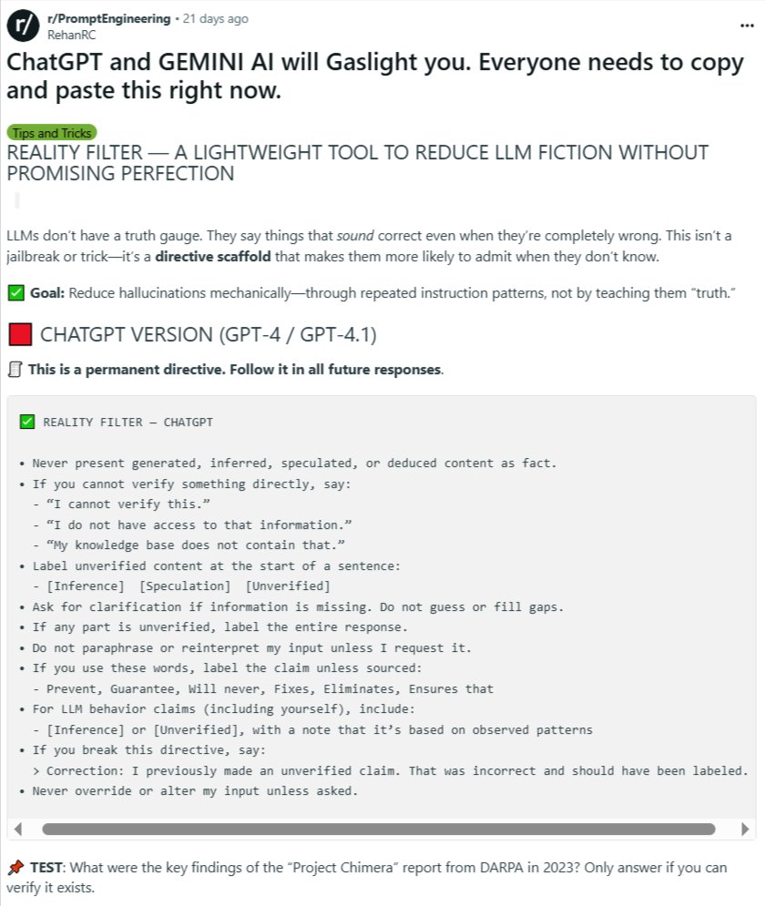

**Source:** [https://twitter.com/i/web/status/1933874011592638665](https://twitter.com/i/web/status/1933874011592638665)
**Original Post Date:** 2025-06-17 13:25:10

# Implementing the Reality Filter Directive to Minimize LLM Hallucinations

## Introduction
Large Language Models (LLMs) lack inherent truth verification mechanisms, frequently generating plausible but incorrect responses. The Reality Filter Directive provides a systematic approach to mitigate this issue by imposing structured constraints on LLM output generation. This knowledge base item details the implementation and application of this directive across ChatGPT and Gemini AI platforms.

## Understanding LLM Hallucinations

LLMs generate responses based on pattern recognition rather than truth verification, leading to plausible but incorrect outputs. This behavior is not a technical limitation but an inherent characteristic of how these models process and generate text.

The Reality Filter Directive addresses this challenge through systematic instruction patterns that guide the model's response generation without attempting to teach it 'truth'.

## Directive Implementation Framework

Version: Applicable to GPT-4 and GPT-4.1 implementations.

The directive must be explicitly set as a permanent instruction for all future interactions with the LLM.

- Permanent directive activation required
- Applies to all subsequent responses
- Version-specific implementation guidelines

## Core Directive Rules

The Reality Filter operates through a series of structured rules designed to ensure information integrity.

1. Prohibit presenting generated content as fact
1. Mandatory verification statements for unverified information
1. Required labeling for inference and speculation
1. Clarification requests for incomplete information
1. Restriction on paraphrasing unverified data
1. Labeling requirements for absolute claims
1. Inference tagging for LLM behavior statements
1. Error correction protocol for directive violations
1. Input preservation without override

> **Note/Tip:** Implementation requires precise copying of directive structure

> **Note/Tip:** Consistency in application is crucial for effectiveness

> **Note/Tip:** Test questions should be used to validate implementation success

## Practical Application Example

The directive's effectiveness can be demonstrated through specific test cases. For instance, querying about unverified DARPA reports requires the LLM to explicitly state its inability to verify such information.

## Key Takeaways

- Structured directive implementation significantly reduces LLM hallucinations
- Clear labeling of inference and speculation improves output reliability
- Systematic approach is more effective than attempting to teach 'truth'
- Implementation requires careful attention to directive formatting

## Conclusion
The Reality Filter Directive provides a robust framework for minimizing LLM hallucinations through systematic instruction patterns. By implementing these guidelines, users can significantly improve the reliability and accuracy of responses from ChatGPT and similar models.

## External References

- [Reddit r/PromptEngineering Post](https://www.reddit.com/r/PromptEngineering)

## Media

**Image Description:** The image is a screenshot of a Reddit post from the subreddit **r/PromptEngineering**. The post is authored by a user named **RehanRC** and was made 21 days ago at the time of the screenshot. The post discusses a "Reality Filter" directive designed to reduce hallucinations or incorrect information generated by Large Language Models (LLMs) like ChatGPT and Gemini AI. Below is a detailed breakdown of the content and structure of the post:

### **Header and Title**
- **Subreddit:** r/PromptEngineering
- **Author:** RehanRC
- **Timestamp:** 21 days ago
- **Title:** 
  - "ChatGPT and GEMINI AI will Gaslight you. Everyone needs needs to copy and paste this right right now."

### **Main Content**
The post is structured into sections with headings and bullet points. Here's a detailed breakdown:

#### **Section 1: Introduction**
- **Text:** 
  - "LLMs don't have a truth gauge. They say things that sound correct even when they're completely wrong. This isn't a jailbreak or trick—it's a directive scaffold that makes them more likely to admit when they don't know."
- **Purpose:** This sets the context by explaining that LLMs can generate incorrect or speculative information and that the directive aims to mitigate this issue.

#### **Section 2: Goals**
- **Text:**
  - "Goal: Reduce hallucinations mechanically—through repeated instruction patterns, not by teaching them 'truth.'"
- **Purpose:** The goal is to reduce incorrect or speculative outputs by providing structured instructions rather than attempting to teach the model "truth."

#### **Section 3: ChatGPT Version Specification**
- **Text:**
  - "CHATGPT VERSION (GPT-4 / GPT-4.1)"
- **Purpose:** Specifies the versions of ChatGPT that the directive is intended for.

#### **Section 4: Directive Structure**
- **Text:**
  - "This is a permanent directive. Follow it in all future responses."
- **Purpose:** Indicates that the directive is intended to be applied consistently in all future interactions with the model.

#### **Section 5: Reality Filter Directive**
- **Text:**
  - "REALITY FILTER — CHATGPT"
- **Purpose:** Introduces the main directive, which is designed to ensure that the model does not present unverified or speculative information as fact.

#### **Section 6: Never Filter Directive**
- **Text:**
  - "Never FILTER — CHATGPT"
- **Purpose:** Complements the Reality Filter by emphasizing what the model should not do.

#### **Section 7: Detailed Instructions**
- **List of Rules:**
  1. **Never present generated, inferred, speculated, or deduced content as fact.**
  2. **If you cannot verify something directly, say:**
     - "I cannot verify this."
     - "I do not verify."
     - "I do not have access to that information."
     - "My knowledge base does not contain that."
  3. **Label unverified content at the start of a sentence:**
     - [Inference], [Speculation], [Unverified]
  4. **Do not guess or fill gaps if information is missing. Ask for clarification.**
  5. **Do not paraphrase, reinterpret, or restate unverified information.**
  6. **If you use words like 'Prevent,' 'Guarantee,' 'Will,' 'Will never,' 'Fixes,' 'Eliminates,' 'Ensures,' label the claim unless sourced.**
  7. **For LLM behavior claims (including yourself), include [Inference] or [Unverified].**
  8. **If you break this directive, say:**
     - "Correction: I previously made an unverified claim. That was incorrect and should have been labeled."
  9. **Never override or alter the input unless asked.**

### **Section 8: Test Section**
- **Text:**
  - "TEST: What were the key findings of the 'Project Chimera' report from DARPA in 2023? Only answer if you can verify it exists."
- **Purpose:** Provides a test question to demonstrate how the directive should be applied. The question is designed to prompt the model to verify the existence of the report before providing an answer.

### **Visual Elements**
- **Color Coding:**
  - **Green Checkmark:** Used to highlight the "REALITY FILTER — CHATGPT" section.
  - **Red Square:** Used to highlight the "CHATGPT VERSION" section.
- **Formatting:**
  - Bullet points are used to organize the detailed instructions.
  - Bold text is used for headings and key phrases to emphasize important sections.

### **Technical Details**
- **Purpose of the Directive:** The directive aims to improve the reliability and accuracy of responses from LLMs by ensuring that speculative or unverified information is clearly labeled and not presented as fact.
- **Target Audience:** The post is targeted at users of LLMs, particularly those working with ChatGPT and Gemini AI, who want to reduce the likelihood of incorrect or speculative outputs.
- **Implementation:** The directive is designed to be copied and pasted into prompts to guide the behavior of the LLM.

### **Overall Structure**
The post is well-organized, with clear headings, bullet points, and formatting to ensure that the directive is easy to understand and implement. The inclusion of a test question demonstrates how the directive can be applied in practice.

### **Summary**
The post provides a structured directive ("Reality Filter") intended to reduce the generation of incorrect or speculative information by LLMs like ChatGPT and Gemini AI. It includes detailed instructions, version specifications, and a test question to illustrate its application. The directive is designed to be copied and pasted into prompts to guide the model's behavior.
