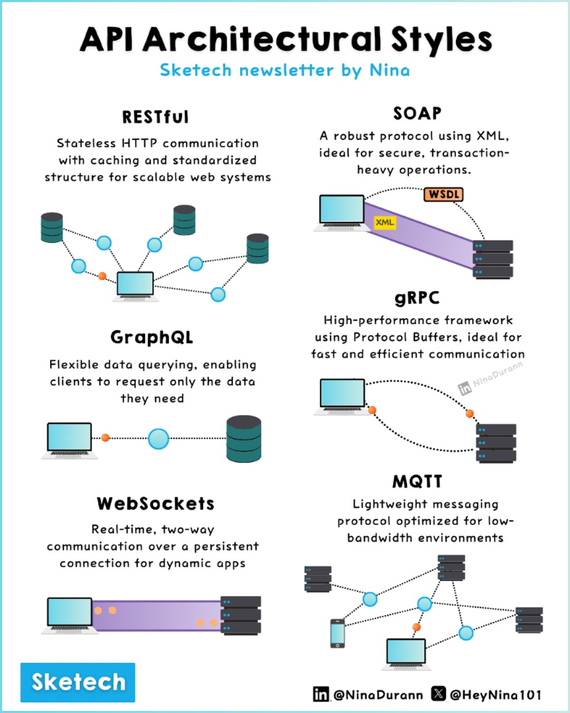

**Source:** [https://twitter.com/i/web/status/1871306487374417991](https://twitter.com/i/web/status/1871306487374417991)
**Original Post Date:** 2025-05-28 04:30:36

# Understanding API Architectural Styles: RESTful, SOAP, gRPC, GraphQL, WebSockets, and MQTT

## Introduction
API architectural styles are fundamental to designing robust system interfaces. This article explores six prominent approaches—RESTful, SOAP, gRPC, GraphQL, WebSockets, and MQTT—each serving distinct purposes in distributed systems. We'll examine their technical characteristics, best use cases, and implementation considerations, providing a comprehensive guide for choosing the right architectural style.

## 1. RESTful Architecture

RESTful architecture leverages HTTP protocol for stateless communication, making it ideal for scalable web systems. It employs standardized methods (GET, POST, PUT, DELETE) for CRUD operations and supports caching mechanisms.

Key benefits include loose coupling between clients and servers, enabling independent evolution of both components.

- Stateless communication ensures scalability
- Standardized HTTP methods simplify integration
- Caching improves performance

## 2. SOAP Architecture

SOAP provides a robust XML-based protocol for secure, transaction-heavy operations. It uses WSDL (Web Services Description Language) to define services and enforce strict contracts.

This makes it particularly suitable for enterprise systems requiring high security and reliability.

- XML-based messaging ensures platform independence
- WSDL enables service description and discovery
- Supports complex transactions with ACID properties

## 3. gRPC Architecture

gRPC utilizes Protocol Buffers for high-performance, efficient communication in microservices architectures. Its binary format reduces network overhead compared to text-based alternatives.

It supports asynchronous operations and streaming, making it ideal for distributed systems.

- Protocol Buffers enable compact message serialization
- Supports bidirectional streaming
- High performance through binary format

## 4. GraphQL Architecture

GraphQL introduces a flexible query language allowing clients to specify exactly what data they need, reducing over-fetching and under-fetching issues.

This makes it particularly effective for mobile applications or systems with complex data requirements.

- Client-driven data fetching
- Strongly typed schema enforcement
- Efficient network usage

## 5. WebSocket Architecture

WebSocket enables real-time, persistent bidirectional communication between clients and servers.

This makes it essential for applications requiring live updates such as chat systems or collaborative tools.

- Persistent connection reduces latency
- Supports full-duplex communication
- Ideal for real-time applications

## 6. MQTT Architecture

MQTT is a lightweight publish/subscribe messaging protocol optimized for low-bandwidth environments.

It's particularly well-suited for IoT devices and scenarios where network resources are constrained.

- Minimal overhead for constrained networks
- Efficient publish/subscribe messaging
- Ideal for IoT device communication

## Key Takeaways

- Choose RESTful when building scalable, stateless web services with caching requirements
- Select SOAP for enterprise-grade security and complex transactional systems
- Implement gRPC in microservices architectures requiring high performance and efficient binary communication
- Use GraphQL when client-side control over data fetching is crucial
- Deploy WebSocket for real-time bidirectional communication needs
- Consider MQTT for IoT scenarios with bandwidth constraints

## Conclusion
Selecting the appropriate API architectural style depends on specific system requirements, infrastructure capabilities, and performance needs. Understanding these six styles enables architects to make informed decisions that balance scalability, security, performance, and development complexity.

## External References

- [REST Architectural Styles](https://restfulapi.net/)
- [SOAP Protocol Documentation](https://www.w3.org/TR/soap12-part0/)

## Media

**Image Description:** This image is an infographic titled **"API Architectural Styles"** by Nina, as part of the "Sketech newsletter." It provides a comparative overview of five popular API architectural styles: **RESTful**, **SOAP**, **gRPC**, **GraphQL**, and **WebSockets**, along with **MQTT**. Each style is described with its key characteristics, use cases, and visual representations. Below is a detailed breakdown:

---

### **1. RESTful**
- **Description**: 
  - Stateless HTTP communication.
  - Caching and standardized structure for scalable web systems.
  - Uses HTTP methods (GET, POST, PUT, DELETE) for CRUD operations.
- **Visual Representation**:
  - A network diagram showing multiple clients interacting with a server via HTTP requests.
  - Dots and lines represent the stateless nature of communication, where each request is independent.
  - Multiple databases are shown, indicating scalability.

---

### **2. SOAP**
- **Description**:
  - A robust protocol using XML for secure, transaction-heavy operations.
  - Uses WSDL (Web Services Description Language) for defining services.
- **Visual Representation**:
  - A client-server interaction diagram where XML is the primary data format.
  - WSDL is shown as a separate component, emphasizing its role in defining the service.
  - Multiple servers are depicted, indicating its use in complex, transactional systems.

---

### **3. gRPC**
- **Description**:
  - High-performance framework using Protocol Buffers for fast and efficient communication.
  - Ideal for microservices and distributed systems.
- **Visual Representation**:
  - A client-server interaction diagram with Protocol Buffers as the data format.
  - Dots and lines indicate efficient, binary-based communication.
  - Multiple servers are shown, highlighting its scalability and performance.

---

### **4. GraphQL**
- **Description**:
  - Flexible data querying, allowing clients to request only the data they need.
  - Reduces over-fetching and under-fetching issues.
- **Visual Representation**:
  - A client-server interaction diagram where the client specifies the exact data it needs.
  - A single database is shown, emphasizing the focused nature of data retrieval.
  - The interaction is depicted as a direct, efficient query.

---

### **5. WebSockets**
- **Description**:
  - Real-time, two-way communication over a persistent connection.
  - Ideal for dynamic applications requiring live updates.
- **Visual Representation**:
  - A client-server interaction diagram with a persistent connection indicated by a continuous line.
  - Multiple servers are shown, highlighting its use in real-time applications like chat or live updates.

---

### **6. MQTT**
- **Description**:
  - Lightweight messaging protocol optimized for low-bandwidth environments.
  - Ideal for IoT (Internet of Things) and real-time data streaming.
- **Visual Representation**:
  - A network diagram showing multiple devices (clients) and brokers.
  - Dots and lines indicate the lightweight, efficient communication between devices.
  - The diagram emphasizes its use in distributed, low-bandwidth scenarios.

---

### **General Layout and Design**
- **Title**: "API Architectural Styles" is prominently displayed at the top.
- **Sections**: Each architectural style is presented in a separate section with a title, description, and visual representation.
- **Visual Elements**:
  - **Icons**: Computers, databases, and network connections are used to illustrate interactions.
  - **Colors**: Blue, orange, and gray are used consistently to differentiate elements like clients, servers, and data formats.
  - **Annotations**: Key technical terms (e.g., XML, WSDL, Protocol Buffers) are highlighted in boxes or labels.
- **Footer**: Includes the author's name ("Nina"), social media handles (`@NinaDurann` and `@HeyNina101`), and the logo "Sketech."

---

### **Key Technical Details**
1. **RESTful**:
   - Stateless: Each request is independent.
   - Uses HTTP methods (GET, POST, PUT, DELETE).
   - Focuses on scalability and caching.

2. **SOAP**:
   - XML-based: Uses XML for data exchange.
   - WSDL: Defines the service interface.
   - Robust for secure, transactional operations.

3. **gRPC**:
   - Protocol Buffers: Efficient, binary-based data format.
   - High performance: Ideal for microservices and distributed systems.

4. **GraphQL**:
   - Flexible querying: Clients specify exactly what data they need.
   - Reduces over-fetching and under-fetching.

5. **WebSockets**:
   - Persistent connection: Real-time, two-way communication.
   - Ideal for dynamic applications like chat or live updates.

6. **MQTT**:
   - Lightweight: Optimized for low-bandwidth environments.
   - Publish/subscribe model: Ideal for IoT and real-time data streaming.

---

### **Conclusion**
The infographic effectively compares the five API architectural styles by highlighting their key features, use cases, and technical details. The visual elements and annotations make it easy to understand the strengths and applications of each style, making it a valuable resource for developers and architects.
