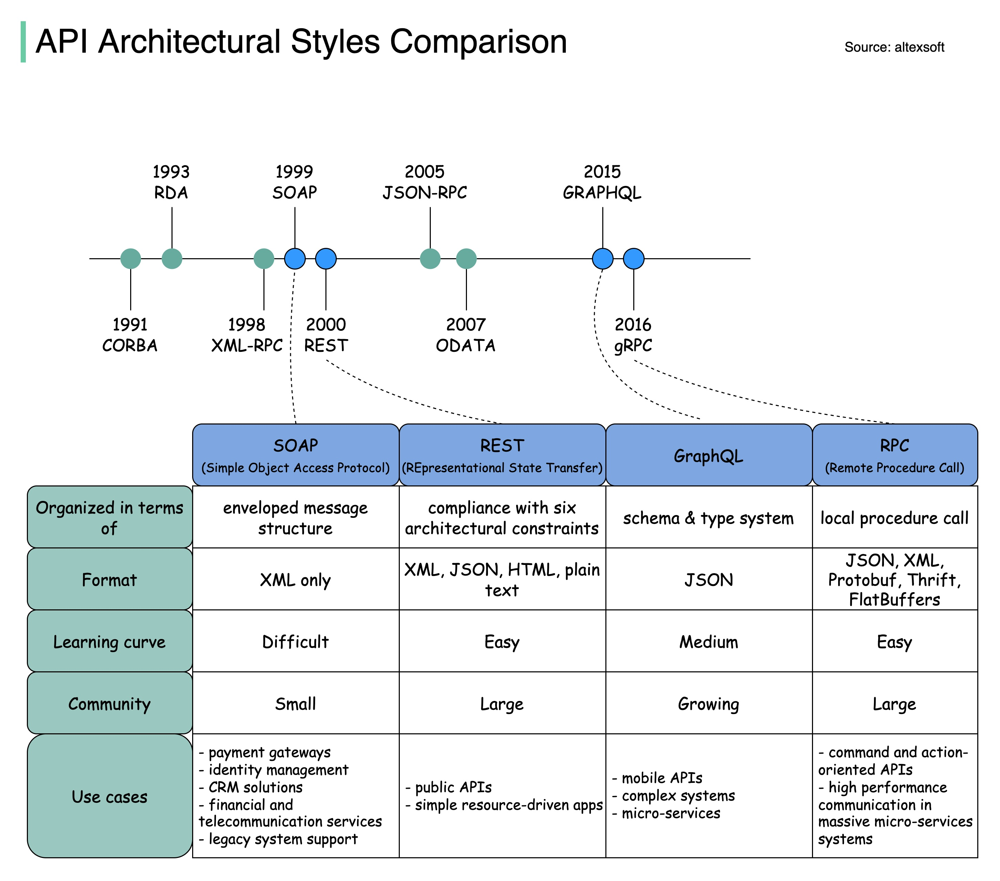

**Source:** [https://twitter.com/i/web/status/1914167970395549852](https://twitter.com/i/web/status/1914167970395549852)
**Original Post Date:** 2025-07-20 09:30:41

# Comparative Analysis of API Architectural Styles: SOAP vs REST vs GraphQL vs RPC

## Introduction
API architectural styles have evolved significantly over the years, each addressing specific needs in terms of complexity, performance, and community support. This analysis delves into four prominent styles: SOAP, REST, GraphQL, and RPC. We will explore their historical development, key attributes, and practical applications to help you choose the most suitable style for your projects.

## Historical Evolution of API Architectural Styles

The timeline illustrates the chronological development of API architectural styles from 1991 to 2016. Each style is marked with a blue or green dot, and some are connected with dashed lines to indicate their relationships or influences.

Starting from early protocols like CORBA (1991) and RDA (1993), the evolution continues through XML-RPC (1998), SOAP (1999), REST (2000), JSON-RPC (2005), OData (2007), GraphQL (2015), and gRPC (2016). This progression highlights the continuous innovation in API design to meet evolving technological demands.

- CORBA (1991)
- RDA (1993)
- XML-RPC (1998)
- SOAP (1999)
- REST (2000)
- JSON-RPC (2005)
- OData (2007)
- GraphQL (2015)
- gRPC (2016)

## Comparison of Key Attributes

The comparison table provides a detailed breakdown of specific attributes for each architectural style, including their organization, format, learning curve, community support, and use cases.

SOAP is organized around an enveloped message structure and uses XML exclusively. It has a difficult learning curve but finds applications in payment gateways, identity management, CRM solutions, financial services, telecommunication services, and legacy system support.

- SOAP: Enveloped message structure, XML only, difficult learning curve, small community.
- REST: Compliance with six architectural constraints, supports XML, JSON, HTML, plain text, easy learning curve, large community.
- GraphQL: Schema and type system, JSON format, medium learning curve, growing community.
- RPC: Local procedure call, supports JSON, XML, Protobuf, Thrift, FlatBuffers, easy learning curve, large community.

> **Note/Tip:** SOAP's complexity and limited format make it less popular for new projects but essential in legacy systems.

> **Note/Tip:** REST's simplicity and broad support make it a preferred choice for public APIs and simple resource-driven applications.

> **Note/Tip:** GraphQL offers flexibility with its schema-based approach, making it ideal for complex systems and mobile APIs.

> **Note/Tip:** RPC is suitable for command and action-oriented APIs, high-performance communication systems, and massive communication systems.

## Use Cases and Practical Applications

Each architectural style caters to specific use cases, reflecting their strengths in different scenarios.

SOAP is widely used in payment gateways, identity management, CRM solutions, financial services, telecommunication services, and legacy system support due to its robust security features and standardized protocols.

- REST: Public APIs, simple resource-driven apps, microservices.
- GraphQL: Mobile APIs, complex systems, microservices.
- RPC: Command and action-oriented APIs, high-performance communication systems, massive communication systems.

> **Note/Tip:** Choose REST for its simplicity and broad applicability in public APIs and resource-driven applications.

> **Note/Tip:** Consider GraphQL for projects requiring flexibility and complex data fetching capabilities.

> **Note/Tip:** Opt for RPC when you need high-performance communication and command-oriented operations.

## Visual Design and Key Observations

The visual design of the comparison chart uses blue for architectural styles and green for supporting elements, with dashed lines connecting related styles.

Key observations include the clear progression from early protocols to modern approaches, REST's popularity due to its ease of use and large community support, SOAP's complexity and limited format, and GraphQL's flexibility with schema-based JSON.

- The timeline shows a clear progression from early protocols like CORBA and RDA to modern styles like GraphQL and gRPC.
- REST is highlighted as having a large community and being easy to learn, making it widely adopted.
- SOAP is noted for its difficult learning curve and limited XML format.
- GraphQL offers flexibility with its schema-based approach and JSON support.

## Key Takeaways

- Understand the historical evolution of API architectural styles to appreciate their context and development.
- Recognize the key attributes of SOAP, REST, GraphQL, and RPC to make informed decisions based on project requirements.
- Evaluate the learning curve and community support for each style to ensure alignment with team capabilities and project goals.
- Identify specific use cases where each architectural style excels to optimize performance and functionality.

## Conclusion
In conclusion, this analysis provides a comprehensive comparison of SOAP, REST, GraphQL, and RPC. Each style has its strengths and weaknesses, making them suitable for different scenarios. By understanding their historical context, key attributes, and practical applications, you can make informed decisions to enhance your API design and development processes.

## External References

- [AltexSoft - API Architectural Styles Comparison](https://www.altexsoft.com/blog/technology/api-architectural-styles-comparison/)

## Media

**Image Description:** ### Image Description: API Architectural Styles Comparison

The image is a detailed comparison chart of various API architectural styles, highlighting their evolution over time, key characteristics, and use cases. The chart is organized into several sections, including a timeline, a comparison table, and a breakdown of technical details for each architectural style. Below is a detailed breakdown:

---

#### **1. Title and Source**
- **Title**: "API Architectural Styles Comparison"
- **Source**: altexsoft (as noted in the top-right corner)

---

#### **2. Timeline**
The timeline at the top of the image illustrates the chronological development of API architectural styles, starting from 1991 to 2016. Each architectural style is marked with a blue or green dot, and some are connected with dashed lines to indicate their relationships or influences.

- **1991**: CORBA (Common Object Request Broker Architecture)
- **1993**: RDA (Remote Data Access)
- **1998**: XML-RPC (XML Remote Procedure Call)
- **1999**: SOAP (Simple Object Access Protocol)
- **2000**: REST (Representational State Transfer)
- **2005**: JSON-RPC (JSON Remote Procedure Call)
- **2007**: OData (Open Data Protocol)
- **2015**: GraphQL (Graph Query Language)
- **2016**: gRPC (gRPC Remote Procedure Call)

---

#### **3. Comparison Table**
The comparison table is divided into columns for each architectural style, with rows detailing specific attributes. The architectural styles compared are:

- **SOAP**
- **REST**
- **GraphQL**
- **RPC (Remote Procedure Call)**

Each row in the table provides information about the following attributes:

---

##### **a. Organized in Terms Of**
- **SOAP**: Enveloped message structure
- **REST**: Compliance with six architectural constraints
- **GraphQL**: Schema and type system
- **RPC**: Local procedure call

---

##### **b. Format**
- **SOAP**: XML only
- **REST**: XML, JSON, HTML, plain text
- **GraphQL**: JSON
- **RPC**: JSON, XML, Protobuf, Thrift, FlatBuffers

---

##### **c. Learning Curve**
- **SOAP**: Difficult
- **REST**: Easy
- **GraphQL**: Medium
- **RPC**: Easy

---

##### **d. Community**
- **SOAP**: Small
- **REST**: Large
- **GraphQL**: Growing
- **RPC**: Large

---

##### **e. Use Cases**
- **SOAP**:
  - Payment gateways
  - Identity management
  - CRM solutions
  - Financial and telecommunication services
  - Legacy system support
- **REST**:
  - Public APIs
  - Simple resource-driven apps
  - Microservices
- **GraphQL**:
  - Mobile APIs
  - Complex systems
  - Microservices
- **RPC**:
  - Command and action-oriented APIs
  - High-performance communication systems
  - Massive communication systems

---

#### **4. Visual Design**
- **Colors**:
  - **Blue**: Used for the architectural styles (SOAP, REST, GraphQL, RPC).
  - **Green**: Used for the timeline and other supporting elements.
- **Dashed Lines**: Connect related architectural styles, such as SOAP and XML-RPC, or REST and JSON-RPC.
- **Icons and Labels**: Each architectural style is labeled with its name and a brief description in parentheses.

---

#### **5. Key Observations**
- **Evolution**: The timeline shows a clear progression from early protocols like CORBA and RDA to modern styles like GraphQL and gRPC.
- **Popularity**: REST is highlighted as having a large community and being easy to learn, making it widely adopted.
- **Complexity**: SOAP is noted as having a difficult learning curve and being limited to XML, while GraphQL offers a schema-based approach with JSON.
- **Use Cases**: Each architectural style is tailored to specific use cases, reflecting their strengths in different scenarios.

---

### Summary
The image provides a comprehensive comparison of API architectural styles, emphasizing their historical development, technical characteristics, and practical applications. It highlights the evolution from early protocols like CORBA and SOAP to modern approaches like REST, GraphQL, and gRPC, each catering to different needs in terms of complexity, community support, and use cases. The visual design effectively organizes the information, making it easy to compare and understand the strengths and weaknesses of each style.
