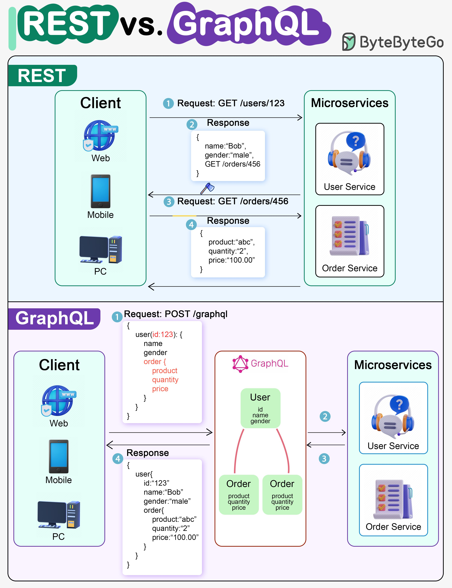

**Source:** [https://twitter.com/i/web/status/1867435631171055638](https://twitter.com/i/web/status/1867435631171055638)
**Original Post Date:** 2025-06-17 15:28:29

# REST vs GraphQL: A Comprehensive Comparison for API Design

## Introduction
In modern API design, choosing between REST and GraphQL significantly impacts system performance and maintainability. This article explores their fundamental differences through a practical lens, comparing how each handles client-server communication in microservices environments. Understanding these trade-offs is crucial for architectural decision-making when building scalable systems.

## Understanding REST Architecture

REST represents the traditional approach to API design, built on HTTP methods and resource-based endpoints.

In microservices environments, each service exposes its own endpoint set, leading to a direct client-to-service communication pattern.

_Demonstrates REST's endpoint-specific requests and separate responses for user and order data_

```HTTP
GET /users/123

{
  name: "Bob",
  gender: "male"
}

GET /orders/456

{
  product: "abc",
  quantity: "2",
  price: "100.00"
}
```

- Requires multiple HTTP requests for related data
- Each request incurs network overhead
- Returns complete resources regardless of client needs

> **Note/Tip:** REST's simplicity makes it easier to implement and debug initially.

> **Note/Tip:** Resource-based endpoints align well with CRUD operations.

## Exploring GraphQL Architecture

GraphQL introduces a query language that allows clients to request precisely what they need in a single operation.

A central GraphQL server orchestrates requests across microservices, providing unified access points.

_Single query retrieving both user and related order data_

```GraphQL
{
  user(id: 123) {
    name
    gender
    order {
      product
      quantity
      price
    }
  }
}
```

- Unified interface for all data requirements
- Precise control over returned fields
- Reduced network overhead through single request

> **Note/Tip:** GraphQL requires more initial setup and understanding of its query language.

> **Note/Tip:** Schema design becomes crucial for maintaining flexibility.

## Comparative Analysis

The fundamental difference lies in their approach to data fetching: REST uses multiple endpoints while GraphQL offers a single unified interface.

This distinction impacts system performance, client development complexity, and backend architecture considerations.

1. REST excels in simple CRUD operations with known data requirements.
1. GraphQL shines in complex applications requiring flexible data aggregation.
1. Consider team expertise when choosing between the two approaches.

> **Note/Tip:** Hybrid approaches are possible for systems transitioning from REST to GraphQL.

> **Note/Tip:** Performance monitoring is crucial regardless of chosen architecture.

## Key Takeaways

- REST's multiple requests can lead to 'N+1' problems in complex microservices architectures
- GraphQL offers more efficient data fetching but requires a robust schema design
- Choose REST for simple CRUD operations and GraphQL for flexible, interconnected data requirements

## Conclusion
The choice between REST and GraphQL depends on specific use cases. REST provides simplicity and broad support while GraphQL delivers efficiency and flexibility in complex scenarios. Consider factors such as system complexity, team expertise, and performance requirements when making this architectural decision.

## External References

- [MDN Web Docs: REST](https://developer.mozilla.org/en-US/docs/Web/HTTP/REST)
- [GraphQL Official Documentation](https://graphql.org/)


## Media

**Image Description:** This image is a comparative diagram illustrating the differences between **REST (Representational State Transfer)** and **GraphQL** in the context of API design and microservices architecture. The diagram is divided into two main sections, each representing one of the technologies. Below is a detailed breakdown:

---

### **1. REST Section**
#### **Overview**
- The REST section demonstrates how a client interacts with microservices using RESTful APIs. It shows a sequence of requests and responses between the client and the server-side microservices.

#### **Key Components**
1. **Client**:
   - The client is represented as a generic device (Web, Mobile, PC).
   - It sends HTTP requests to the server.

2. **Microservices**:
   - The server-side is divided into two microservices:
     - **User Service**: Handles user-related data.
     - **Order Service**: Handles order-related data.

3. **Request and Response Flow**:
   - **Step 1**: The client sends a `GET /users/123` request to fetch user data.
     - **Request**: `GET /users/123`
     - **Response**: 
       ```json
       {
         name: "Bob",
         gender: "male"
       }
       ```
   - **Step 2**: The client sends a second `GET /orders/456` request to fetch order data.
     - **Request**: `GET /orders/456`
     - **Response**: 
       ```json
       {
         product: "abc",
         quantity: "2",
         price: "100.00"
       }
       ```

#### **Key Observations**
- **Multiple Requests**: The client needs to make separate requests to different endpoints to fetch user and order data.
- **Overhead**: Each request incurs network latency and overhead.
- **Data Granularity**: The client receives all data from each endpoint, even if only a subset is needed.

---

### **2. GraphQL Section**
#### **Overview**
- The GraphQL section demonstrates how a client interacts with a GraphQL API, which allows for more flexible and efficient data fetching compared to REST.

#### **Key Components**
1. **Client**:
   - Similar to the REST section, the client is represented as a generic device (Web, Mobile, PC).
   - It sends a single GraphQL query to fetch the required data.

2. **GraphQL Server**:
   - Acts as a unified interface that resolves queries by interacting with the underlying microservices.
   - The GraphQL server is represented as a central component that orchestrates communication with the microservices.

3. **Microservices**:
   - Similar to the REST section, the server-side is divided into two microservices:
     - **User Service**: Handles user-related data.
     - **Order Service**: Handles order-related data.

4. **Request and Response Flow**:
   - **Step 1**: The client sends a single `POST /graphql` request with a GraphQL query.
     - **Request**:
       ```graphql
       {
         user(id: 123) {
           name
           gender
           order {
             product
             quantity
             price
           }
         }
       }
       ```
   - **Step 2**: The GraphQL server resolves the query by interacting with the microservices:
     - It queries the **User Service** for user data.
     - It queries the **Order Service** for order data.
   - **Step 3**: The GraphQL server combines the resolved data into a single response.
   - **Step 4**: The client receives a single response containing all the requested data.
     - **Response**:
       ```json
       {
         user: {
           id: "123",
           name: "Bob",
           gender: "male",
           order: {
             product: "abc",
             quantity: "2",
             price: "100.00"
           }
         }
       }
       ```

#### **Key Observations**
- **Single Request**: The client sends a single query to fetch all required data, reducing network overhead.
- **Data Granularity**: The client specifies exactly what data it needs, avoiding over-fetching.
- **Centralized Interface**: The GraphQL server acts as a single point of contact, abstracting the underlying microservices.

---

### **Comparison**
- **REST**:
  - **Advantages**: Simple and widely understood, uses standard HTTP methods.
  - **Disadvantages**: Requires multiple requests for related data, leading to "N+1" problems and over-fetching.
  
- **GraphQL**:
  - **Advantages**: Single request for all data, flexible data fetching, reduces over-fetching, and simplifies client-server communication.
  - **Disadvantages**: More complex to implement and requires a centralized GraphQL server.

---

### **Visual Design**
- **Color Coding**:
  - **REST**: Green and light blue tones.
  - **GraphQL**: Purple and light purple tones.
- **Icons**:
  - Client devices (Web, Mobile, PC) are represented with icons.
  - Microservices are represented with icons (e.g., a headset for User Service, a database for Order Service).
- **Flow Arrows**: Clear arrows indicate the direction of requests and responses.

---

### **Conclusion**
The image effectively contrasts REST and GraphQL by illustrating their request-response patterns and data-fetching mechanisms. REST requires multiple requests for related data, while GraphQL allows clients to fetch all required data in a single request, making it more efficient and flexible for complex data retrieval scenarios. The diagram is visually organized and uses icons and colors to differentiate between the two technologies.
