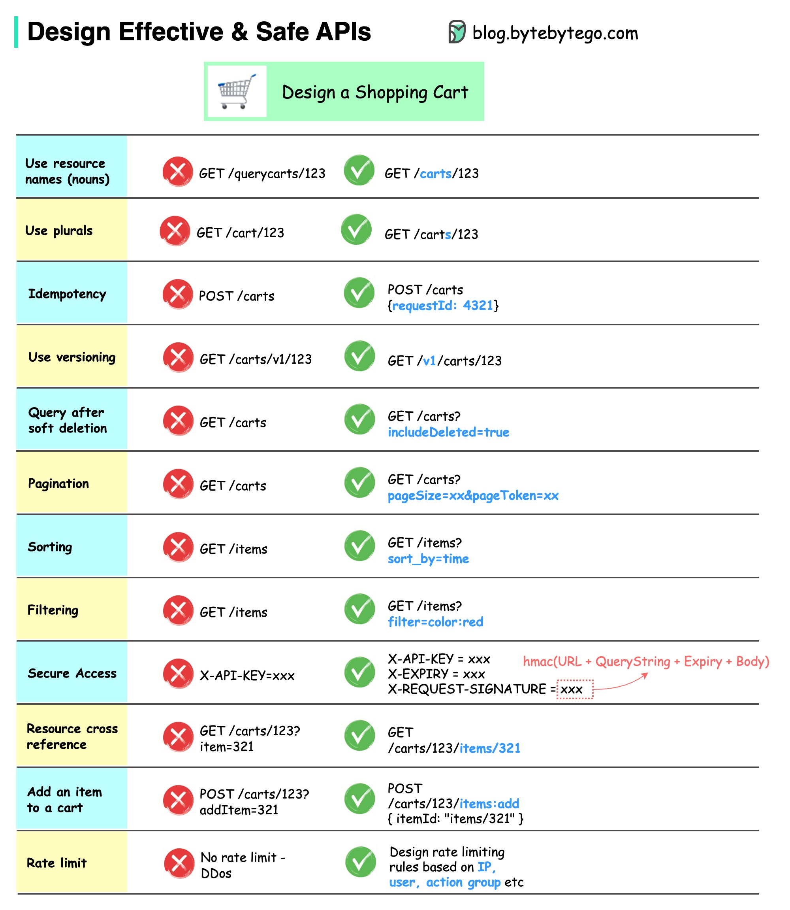

**Source:** [https://twitter.com/i/web/status/1870700361583034768](https://twitter.com/i/web/status/1870700361583034768)
**Original Post Date:** 2025-05-28 08:13:28

# RESTful Shopping Cart API Design Patterns and Best Practices

## Introduction
Designing a robust shopping cart system requires careful consideration of API patterns that ensure scalability, security, and maintainability. This guide explores essential RESTful principles through practical examples, addressing common pitfalls and their solutions. From proper resource naming conventions to advanced security implementations, we'll cover the critical aspects needed for building production-ready e-commerce APIs.

## Resource Naming Conventions

Resource names should follow RESTful principles using nouns in plural form.

Incorrect approach uses verbs like 'query' or singular nouns, leading to inconsistent API design.

_Correct use of plural nouns and nested resources_

```http
GET /carts/123
POST /cart/items
```

## Idempotency Handling

Operations should be idempotent to handle retries safely.

Include unique request IDs in POST requests to ensure safe operation repetition.

_Example of idempotent request payload_

```json
{
  "requestId": "4321",
  "items": []
}
```

## Security Implementation

Authentication requires multiple security layers for robust protection.

Implement HMAC signatures to ensure request integrity and prevent tampering.

```http
X-API-KEY: xxx
X-EXPIRY: xxx
X-REQUEST-SIGNATURE: hmac_hash
```

## Pagination and Filtering

Large datasets require efficient pagination mechanisms.

Filtering capabilities should be parameterized for flexibility.

- Use pageSize and pageToken for pagination
- Include sort_by parameter for custom sorting
- Implement filter parameters with proper syntax

## Rate Limiting Strategy

Protect APIs from abuse using multi-layered rate limiting.

Apply limits based on IP address, user identity, and action groups.

> **Note/Tip:** Monitor usage patterns to adjust rate limits dynamically

## Key Takeaways

- Use plural nouns for resource endpoints (e.g., /carts instead of /cart)
- Implement idempotency keys in request bodies for safe retry mechanisms
- Layer security with API keys, expiration times, and HMAC signatures
- Structure pagination and filtering parameters consistently across endpoints
- Apply rate limiting at multiple levels to protect against abuse

## Conclusion
A well-designed shopping cart API requires careful attention to RESTful principles, security measures, and scalability considerations. By following these patterns and best practices, developers can create robust e-commerce systems that handle high traffic while maintaining data integrity and user trust.

## External References

- [Bytebytego Blog: Design Effective & Safe APIs](blog.bytebytego.com)


## Media

**Image Description:** The image is a detailed guide on designing effective, safe, and secure APIs, specifically focusing on the design of a shopping cart system. The content is presented in a tabular format with clear comparisons between "incorrect" and "correct" approaches for various API design principles. Below is a detailed breakdown of the image:

### **Header**
- **Title**: "Design Effective & Safe APIs"
- **Subtitle**: "Design a Shopping Cart"
- **Icon**: A shopping cart icon is displayed next to the subtitle.
- **Website**: The image references a blog at `blog.bytebytego.com`.

### **Main Content**
The table is divided into several sections, each addressing a specific API design principle. Each section includes:
1. **Incorrect Approach** (marked with a red "X").
2. **Correct Approach** (marked with a green "✓").
3. **Explanation of the principle**.

#### **1. Use resource names (nouns)**
- **Incorrect**: `GET /querycarts/123`
  - Uses a verb (`query`) in the resource name, which is not RESTful.
- **Correct**: `GET /carts/123`
  - Uses a noun (`carts`) to represent the resource, adhering to RESTful principles.

#### **2. Use plurals**
- **Incorrect**: `GET /cart/123`
  - Uses a singular noun (`cart`), which is inconsistent with plural resource naming conventions.
- **Correct**: `GET /carts/123`
  - Uses a plural noun (`carts`) for consistency and clarity.

#### **3. Idempotency**
- **Incorrect**: `POST /carts`
  - Uses `POST` for an operation that should be idempotent (e.g., creating a cart).
- **Correct**: 
  - `POST /carts` with a request body that includes a unique identifier (`{requestId: 4321}`).
  - Ensures idempotency by including a unique request ID in the payload.

#### **4. Use versioning**
- **Incorrect**: `GET /carts/v1/123`
  - Embeds the version (`v1`) in the resource path, which is not recommended.
- **Correct**: `GET /v1/carts/123`
  - Places the version (`v1`) at the beginning of the path, making it easier to manage API versions.

#### **5. Query after soft deletion**
- **Incorrect**: `GET /carts`
  - Does not account for soft-deleted items.
- **Correct**: `GET /carts?includeDeleted=true`
  - Includes a query parameter to specify whether soft-deleted items should be included in the response.

#### **6. Pagination**
- **Incorrect**: `GET /carts`
  - Does not include pagination parameters.
- **Correct**: `GET /carts?pageSize=xx&pageToken=xx`
  - Includes query parameters for `pageSize` and `pageToken` to enable pagination.

#### **7. Sorting**
- **Incorrect**: `GET /items`
  - Does not specify sorting criteria.
- **Correct**: `GET /items?sort_by=time`
  - Includes a query parameter (`sort_by=time`) to specify sorting criteria.

#### **8. Filtering**
- **Incorrect**: `GET /items`
  - Does not include filtering parameters.
- **Correct**: `GET /items?filter=color:red`
  - Includes a query parameter (`filter=color:red`) to filter results based on specific criteria.

#### **9. Secure Access**
- **Incorrect**: `X-API-KEY=xxx`
  - Uses only an API key for authentication, which is insecure.
- **Correct**: 
  - Includes additional security measures:
    - `X-API-KEY=xxx`
    - `X-EXPIRY=xxx`
    - `X-REQUEST-SIGNATURE=xxx`
  - The signature is calculated using an HMAC hash of the URL, query string, expiry, and body, ensuring integrity and authenticity.

#### **10. Resource cross-reference**
- **Incorrect**: `GET /carts/123?item=321`
  - Embeds a related resource (`item`) as a query parameter, which is not RESTful.
- **Correct**: `GET /carts/123/items/321`
  - Uses a nested resource structure to represent the relationship between a cart and its items.

#### **11. Add an item to a cart**
- **Incorrect**: `POST /carts/123?addItem=321`
  - Embeds the action (`addItem`) as a query parameter, which is not RESTful.
- **Correct**: 
  - `POST /carts/123/items:add`
  - Uses a dedicated endpoint for adding items to a cart, with a request body specifying the item details:
    ```json
    { "itemId": "items/321" }
    ```

#### **12. Rate Limiting**
- **Incorrect**: No rate limiting is implemented, leaving the API vulnerable to DDoS attacks.
- **Correct**: 
  - Implements rate limiting based on:
    - IP address
    - User
    - Action group
  - Ensures the API is protected against abuse and DDoS attacks.

### **Visual Elements**
- **Icons**: 
  - Red "X" for incorrect approaches.
  - Green "✓" for correct approaches.
- **Annotations**: 
  - Additional notes and explanations are provided for complex concepts, such as HMAC calculations for secure access.
- **Color Coding**: 
  - Alternating background colors (light blue and light yellow) for readability.

### **Overall Structure**
The image is highly structured and educational, providing clear examples of both incorrect and correct API design patterns. It emphasizes RESTful principles, security, scalability, and best practices for designing robust and maintainable APIs. The use of contrasting icons and color coding makes it easy to distinguish between recommended and discouraged practices. 

This guide is particularly useful for developers working on API design, especially for systems like shopping carts that require careful handling of resources, security, and scalability.
