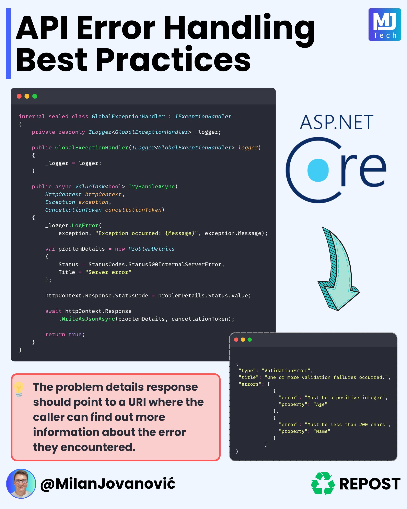

**Source:** [https://twitter.com/i/web/status/1869284101280182609](https://twitter.com/i/web/status/1869284101280182609)
**Original Post Date:** 2025-06-17 13:10:42

# Problem Details for Robust API Error Handling in ASP.NET Core

## Introduction
API error handling requires precise control over response structure and content. This guide demonstrates how to implement the IETF RFC7807-compliant Problem Details format using ASP.NET Core's built-in features. We'll explore creating a global exception handler that standardizes error responses while maintaining detailed, actionable information for clients.

## Global Exception Handler Implementation

The GlobalExceptionExceptionHandler class serves as the central point for all unhandled exceptions in your ASP.NET Core application. By implementing IExceptionHandler, we ensure consistent error handling across all endpoints.

_This implementation logs exceptions, creates a ProblemDetails object with status code and title, then writes it as JSON to the response._

```csharp
internal sealed class GlobalExceptionExceptionHandler : IExceptionHandler
{
    private readonly ILogger _logger;

    public GlobalExceptionExceptionHandler(ILogger<GlobalExceptionExceptionHandler> logger)
    {
        _logger = logger;
    }

    public async Task<bool> TryHandleAsync(HttpContext httpContext, Exception exception, CancellationToken cancellationToken)
    {
        _logger.LogError(exception.Message);

        var problemDetails = new ProblemDetails
        {
            Status = 500,
            Title = "Server error",
            Type = "https://example.com/problem-details#server-error"
        };

        httpContext.Response.StatusCode = 500;
        await httpContext.Response.WriteAsJsonAsync(problemDetails);

        return true;
    }
}
```

> **Note/Tip:** Always use sealed classes for exception handlers to prevent inheritance misuse

> **Note/Tip:** Inject logging services via constructor for proper dependency management

## Problem Details Response Structure

The ProblemDetails object provides a standardized way to communicate error information. It should include essential metadata while maintaining extensibility for application-specific needs.

_This represents a validation error response with detailed field-level information._

```json
{
    "type": "ValidationError",
    "title": "One or more validation failures occurred",
    "errors": [
        {
            "error": "Must be a positive integer",
            "property": "Age"
        },
        {
            "error": "Must be less than 200 chars",
            "property": "Name"
        }
    ]
}
```

- Include meaningful status codes (400, 422 for client errors; 500 for server errors)
- Provide human-readable titles and type URIs
- Structure validation errors in a consistent format

## Best Practices and Recommendations

Proper error handling requires balancing detail with security. The Problem Details pattern helps achieve this by standardizing responses while maintaining flexibility for specific use cases.

> **Note/Tip:** Always include a Type URI pointing to detailed documentation about the error

> **Note/Tip:** Avoid exposing sensitive information in problem details messages

> **Note/Tip:** Use consistent status codes across your API

## Key Takeaways

- Implement global exception handling using ProblemDetails pattern for standardized errors
- Structure validation errors with field-level detail using custom extensions to ProblemDetails
- Always provide documentation URIs in Type fields for client troubleshooting
- Maintain consistency in status code usage across your API

## Conclusion
Structured error responses are crucial for robust API design. By implementing the Problem Details pattern and following these best practices, you ensure that clients receive consistent, actionable information while maintaining security boundaries.

## External References

- [IETF RFC7807 - Problem Details for HTTP APIs](https://tools.ietf.org/html/rfc7807)
- [ASP.NET Core Error Handling Documentation](https://docs.microsoft.com/aspnet/core/fundamentals/error-handling)


## Media

**Image Description:** ### Image Description

The image is a detailed infographic titled **"API Error Handling Best Practices"**, focusing on error handling in ASP.NET Core applications. It provides code snippets, explanations, and best practices for handling errors effectively. Below is a detailed breakdown:

---

#### **Header**
- **Title**: "API Error Handling Best Practices"
- **Logo**: The top-right corner features the **ASP.NET Core** logo, indicating the framework being discussed.
- **Repost Logo**: The bottom-right corner includes a "Repost" logo with a recycling symbol, suggesting this content may be shared or repurposed.

---

#### **Main Content**
The infographic is divided into several sections, each highlighting different aspects of error handling in ASP.NET Core.

##### **1. Code Snippet: Global Exception Handler**
- **Class Definition**:
  - The code defines an **internal sealed class** named `GlobalExceptionExceptionHandler` that implements the `IExceptionHandler` interface.
  - The class is responsible for handling exceptions globally in an ASP.NET Core application.

- **Logger Dependency**:
  - The class uses an `ILogger` dependency for logging exceptions.
  - The logger is injected via the constructor and is marked as `private readonly`.

- **TryHandleAsync Method**:
  - The method `TryHandleAsync` is an asynchronous method that takes the following parameters:
    - `HttpContext`: The HTTP context of the request.
    - `Exception`: The exception that occurred.
    - `CancellationToken`: A cancellation token for asynchronous operations.
  - **Key Steps in the Method**:
    1. **Logging the Error**:
       - The `_logger.LogError` method is used to log the exception with a detailed message.
       - The message includes the exception's `Message` property.
    2. **Creating Problem Details**:
       - A `ProblemDetails` object is created to encapsulate the error details.
       - The `Status` is set to `500` (Internal Server Error).
       - The `Title` is set to "Server error".
    3. **Setting HTTP Status Code**:
       - The `HttpContext.Response.StatusCode` is set to `500`.
    4. **Returning JSON Response**:
       - The `ProblemDetails` object is serialized to JSON and written to the response using `WriteAsJsonAsync`.
       - The method returns `true` to indicate that the exception was handled.

---

##### **2. Problem Details JSON Example**
- **JSON Structure**:
  - The infographic includes a JSON example of the `ProblemDetails` object that is returned in the response.
  - **Key Fields**:
    - **Type**: `"ValidationError"`, indicating the type of error.
    - **Title**: A descriptive title for the error, e.g., "One or more validation failures occurred."
    - **Errors**: An array of error objects, each containing:
      - **Error Message**: Describes the validation issue.
      - **Property**: The name of the property that caused the error.
  - **Example Errors**:
    - `"error": "Must be a positive integer", "property": "Age"`
    - `"error": "Must be less than 200 chars", "property": "Name"`

---

##### **3. Best Practice Highlight**
- **Boxed Text**:
  - A red-highlighted box emphasizes a best practice:
    - **Message**: "The problem details response should point to a URI where the caller can find more information about the error."
    - This suggests that the `ProblemDetails` object should include a `Type` field that links to a documentation URI for more details about the error.

---

#### **Visual Elements**
- **Code Background**: The code snippets are displayed on a dark background with syntax highlighting for better readability.
- **Icons**:
  - A lightbulb icon is used next to the best practice text to draw attention to the key recommendation.
- **Arrows**:
  - A teal arrow points from the `ProblemDetails` JSON example to the best practice text, visually connecting the two concepts.

---

#### **Footer**
- **Author Information**:
  - The bottom-left corner includes a circular profile picture of a person and their Twitter handle: `@MilanJovanovic`.
- **Repost Logo**: The recycling symbol and "Repost" text are repeated in the bottom-right corner.

---

### Summary
The image provides a comprehensive guide on implementing a global exception handler in ASP.NET Core applications. It includes:
1. A code snippet for a `GlobalExceptionExceptionHandler` class.
2. An example of a `ProblemDetails` JSON response structure.
3. A best practice recommendation for linking error types to documentation URIs.

The visual design uses syntax highlighting, icons, and arrows to emphasize key points and make the content easy to follow. The focus is on structured, robust error handling in API development.
