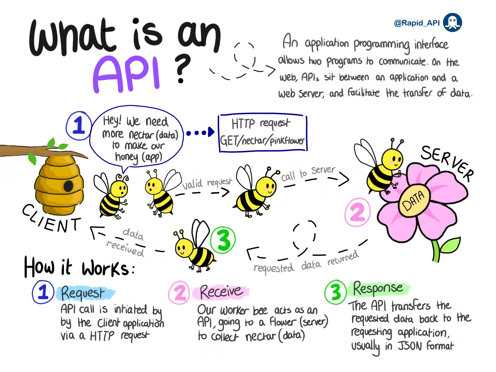

**Source:** [https://twitter.com/i/web/status/1878324550418714836](https://twitter.com/i/web/status/1878324550418714836)
**Original Post Date:** 2025-05-29 12:01:47

# API Fundamentals: Understanding Communication Through the Bee Metaphor

## Introduction
Understanding Application Programming Interfaces (APIs) is crucial for modern software development. This guide uses an engaging metaphor of bees interacting with flowers to explain how APIs facilitate communication between different software components.

By breaking down complex concepts into simple, visual elements, this explanation covers key aspects including HTTP requests, data transfer formats, and the role of servers and clients in API interactions.

## The Bee Metaphor: Breaking Down API Components

In this metaphorical representation, each element serves a specific purpose:

- Bees represent client applications making requests

- The beehive represents the server hosting data

- Flowers symbolize endpoints where data resides

- Nectar represents the actual data being transferred

- Each bee action corresponds to an API call
- The journey of a bee mirrors the HTTP request lifecycle
- Nectar collection parallels data retrieval from servers

## API Communication Process: Step-by-Step Analysis

The three-step process illustrates how APIs function:

First, a client application (beehive) initiates communication by sending a request to retrieve data from the server (flower).

```HTTP
GET /nectar/pinkFlower HTTP/1.1
Host: api.example.com
```

## Technical Implementation Details

The metaphor extends to technical aspects, including:

Data transfer using standardized formats like JSON

HTTP request methods (GET, POST, etc.) for different operations

Error handling through HTTP status codes

1. Client sends request with specific endpoint and parameters
1. Server processes request and returns data in JSON format
1. Client receives and processes the response data

## Real-World Applications of This Model

This metaphorical approach helps understand:

- RESTful API design principles

- Client-server architecture fundamentals

- Data transfer protocols and formats

> **Note/Tip:** Remember that real APIs may involve more complex error handling and security measures

> **Note/Tip:** The metaphor simplifies the actual implementation details for educational purposes

## Key Takeaways

- APIs enable communication between different software components through standardized protocols
- Understanding the client-server relationship is fundamental to API design
- Data transfer formats like JSON ensure compatibility across different systems
- The bee metaphor provides a visual framework for understanding complex technical concepts

## Conclusion
By using this bee-based analogy, we've demystified the core principles of API communication. This understanding serves as a foundation for designing and implementing robust APIs in real-world applications.

## External References

- [HTTP Specification](https://tools.ietf.org/html/rfc7231)
- [JSON Standard](https://www.json.org/)


## Media

**Image Description:** This image is a creative and visually engaging illustration that explains the concept of an **API (Application Programming Interface)** using a metaphor involving bees, a beehive, and flowers. The image is divided into sections that describe what an API is and how it works, using a step-by-step process. Below is a detailed breakdown:

---

### **Main Subject: API Explanation**
The main subject of the image is the explanation of how an **API** functions, using a metaphor of bees interacting with a beehive and flowers. The bees represent the **client application**, the beehive represents the **server**, and the flowers represent the **data** being requested and transferred.

---

### **Key Sections of the Image**

#### **1. Title and Introduction**
- The title at the top reads: **"What is an API?"**
- A brief description explains that an API is an **application programming interface** that allows two programs to communicate. On the web, APIs sit between an application and a server, facilitating the transfer of data.

#### **2. Metaphor Setup**
- **Client (Beehive):** The beehive is labeled as the **client**, representing an application that needs data.
- **Server (Flower):** The flower is labeled as the **server**, representing the source of data.
- **Data (Nectar):** The nectar in the flower is labeled as **data**, which the client (beehive) needs to collect.

#### **3. Process Steps**
The image illustrates the API process in three steps, each represented by a numbered circle and corresponding bees:

##### **Step 1: Request**
- **Description:** The beehive (client) sends a request to the flower (server) for nectar (data).
- **Visual:** A bee labeled **"1"** flies from the beehive to the flower.
- **Text:** The bee says, **"Hey! We need more nectar (data) to make our honey (app)."**
- **Technical Detail:** The request is made via an **HTTP request**, specifically a **GET request**. The request is shown as: **`GET /nectar/pinkFlower`**.

##### **Step 2: Receive**
- **Description:** The flower (server) processes the request and sends the nectar (data) back to the bee.
- **Visual:** A bee labeled **"2"** flies from the flower back to the beehive, carrying a drop of nectar labeled **"DATA."**
- **Text:** The bee represents the **API** transferring the requested data back to the client.
- **Technical Detail:** The server processes the request and sends the data back to the client.

##### **Step 3: Response**
- **Description:** The beehive (client) receives the nectar (data) and uses it.
- **Visual:** A bee labeled **"3"** returns to the beehive with the nectar.
- **Text:** The beehive (client application) now has the data it needed to function.
- **Technical Detail:** The data is typically transferred in a standardized format, such as **JSON (JavaScript Object Notation)**.

---

### **Visual Elements**
- **Bees:** Represent the API calls and data transfer. Each bee corresponds to a step in the process.
- **Beehive:** Represents the **client application** that initiates the request.
- **Flower:** Represents the **server** that holds the data.
- **Nectar:** Represents the **data** being requested and transferred.
- **Arrows and Text:** Show the flow of communication and data transfer between the client and server.

---

### **Technical Details**
- **HTTP Request:** The image explicitly mentions an **HTTP GET request** as the method used to request data.
- **Data Format:** The data is described as being transferred in **JSON format**, which is a common format for API responses.
- **API Role:** The API is depicted as the intermediary that facilitates the communication between the client and server.

---

### **Overall Message**
The image effectively uses a simple and relatable metaphor to explain the complex concept of an API. It breaks down the process into three clear steps: **Request**, **Receive**, and **Response**, making it easy for beginners to understand how APIs work in a web environment.

---

### **Conclusion**
This image is a creative and educational tool that simplifies the concept of APIs by using a bee metaphor. It highlights the key technical aspects, such as HTTP requests and JSON data transfer, while maintaining a visually engaging and easy-to-follow format.
