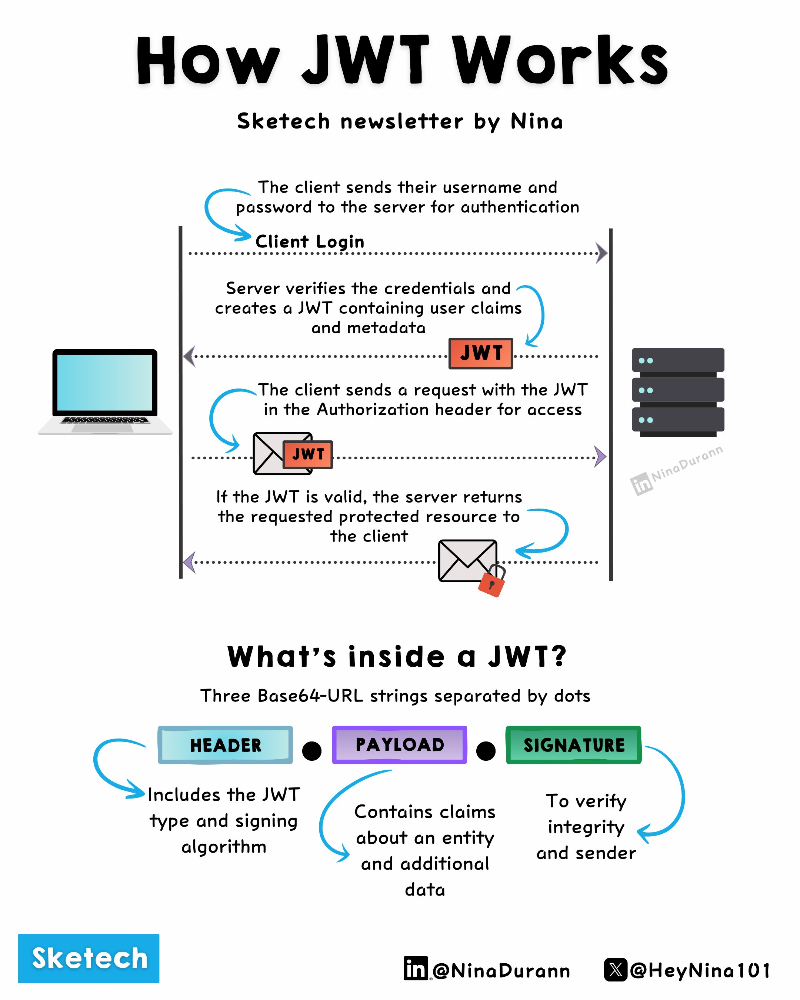

**Source:** [https://twitter.com/i/web/status/1930945182536462555](https://twitter.com/i/web/status/1930945182536462555)
**Original Post Date:** 2025-06-17 12:32:05

# JSON Web Tokens (JWT) Explained in 10 Seconds

## Introduction
JSON Web Tokens (JWT) are a fundamental component of modern authentication systems. This guide breaks down the JWT lifecycle and internal structure, providing engineers with clear understanding of how these tokens enable secure client-server interactions without repeated authentications.

## Understanding JWT Workflow

The JWT lifecycle begins with user authentication and continues through protected resource access. Each step ensures security while maintaining seamless communication between client and server.

When a client initiates login, the server validates credentials and issues a JWT containing authenticated user data.

1. Client sends username/password for authentication
1. Server verifies credentials and generates JWT
1. JWT contains user claims and metadata
1. Client uses JWT in Authorization header
1. Server validates token authenticity
1. Protected resources are returned to client

> **Note/Tip:** Always include expiration time (exp) claim in JWT payload

> **Note/Tip:** Use HTTPS for all JWT transmissions

## JWT Internal Structure

A JWT is composed of three Base64-URL encoded parts: header, payload, and signature. Each section serves a distinct purpose in ensuring secure token operation.

The header specifies the token type and signing algorithm, while the payload carries claims about the user or entity. The signature ensures authenticity by hashing header and payload with a secret key.

_JWT structure components and common security configuration_

```plaintext
Header.Payload.Signature
HS256 encoded secret
Signed with HMAC-SHA-256 algorithm
```

- Header: Contains JWT metadata (algorithm, token type)
- Payload: Carries user claims and registered claims (exp, sub, etc.)
- Signature: Ensures integrity by hashing header + payload with secret key

## Key Takeaways

- JWT provides stateless authentication, eliminating need for session storage
- Always validate JWT on every request to protected resources
- Choose appropriate algorithms (HS256 for symmetric, RS256/ES256 for asymmetric encryption)
- Implement proper token revocation mechanisms when needed

## Conclusion
JWT serves as a crucial tool in secure API design, offering stateless authentication and authorization. Understanding its workflow and structure enables engineers to implement robust security measures while maintaining efficient client-server communication.

## External References

- [JWT Specification](https://tools.ietf.org/html/rfc7519)
- [Nina's Sketch Newsletter](https://sketchnewsletter.com/)


## Media

**Image Description:** ### Description of the Image

The image is an infographic titled **"How JWT Works"** by Nina, as part of the "Sketech newsletter" by Nina. It provides a detailed explanation of how JSON Web Tokens (JWTs) function in a client-server interaction, along with an overview of the structure of a JWT. The infographic is visually organized into two main sections: the **JWT workflow** and the **JWT structure**.

---

### **1. JWT Workflow**

#### **Client Login**
- **Step 1: Authentication Request**
  - The client (represented by a laptop icon) sends their **username and password** to the server for authentication.
  - This is the initial step where the client attempts to log in.

#### **Step 2: Server Verification**
  - The server verifies the credentials (username and password) provided by the client.
  - If the credentials are valid, the server generates a **JWT (JSON Web Token)**.

#### **Step 3: JWT Generation**
  - The server creates a JWT containing:
    - **User claims**: Information about the authenticated user.
    - **Metadata**: Additional data related to the token, such as expiration time, issuer, etc.
  - The JWT is returned to the client.

#### **Step 4: Client Request with JWT**
  - The client includes the JWT in the **Authorization header** of subsequent requests to the server.
  - This allows the client to access protected resources without needing to re-authenticate.

#### **Step 5: Server Validation**
  - The server validates the JWT to ensure it is valid and has not expired.
  - If the JWT is valid, the server grants access to the requested protected resource.

#### **Step 6: Resource Access**
  - The server returns the requested resource to the client.

---

### **2. JWT Structure**

The infographic explains the internal structure of a JWT, which is composed of three parts, each encoded in **Base64-URL strings** and separated by dots (`.`):

#### **Header**
- **Purpose**: Contains metadata about the JWT.
- **Content**:
  - The type of token (e.g., `JWT`).
  - The signing algorithm used (e.g., `HS256` for HMAC SHA-256).

#### **Payload**
- **Purpose**: Contains claims about the user or entity.
- **Content**:
  - **Registered claims**: Standard claims like `exp` (expiration time), `sub` (subject), etc.
  - **Custom claims**: Additional data specific to the application.

#### **Signature**
- **Purpose**: Ensures the integrity and authenticity of the JWT.
- **Content**:
  - Generated by hashing the header and payload using a secret key or public/private key pair.
  - Used to verify that the token has not been tampered with.

---

### **Visual Elements**
- **Icons**:
  - A laptop icon represents the client.
  - A server icon represents the server.
  - An envelope icon represents the JWT being sent or returned.
- **Arrows**:
  - Blue arrows indicate the flow of data between the client and server.
- **Text Boxes**:
  - Descriptive text boxes explain each step of the process.
- **JWT Representation**:
  - The JWT is visually represented as a box labeled "JWT" with a lock icon, emphasizing its role in securing communication.

---

### **Additional Details**
- The infographic is visually clean and uses a consistent color scheme:
  - **Blue** for the header.
  - **Purple** for the payload.
  - **Green** for the signature.
- The title is bold and prominent, making it easy to identify the main topic.
- Social media handles are included at the bottom: `@NinaDurann` (Instagram) and `@HeyNina101` (X/Twitter).

---

### **Summary**
The infographic effectively breaks down the JWT workflow and structure, making it easy to understand how JWTs are used for secure client-server communication. It combines visual elements with clear text to explain the technical details in an accessible manner.
