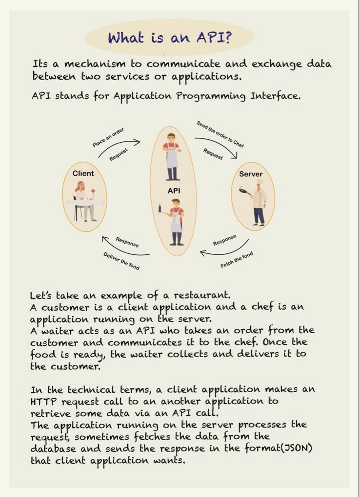

**Source:** [https://twitter.com/i/web/status/1888049786525302925](https://twitter.com/i/web/status/1888049786525302925)
**Original Post Date:** 2025-05-28 00:17:25

# Understanding Application Programming Interfaces (APIs) Through the Restaurant Analogy

## Introduction
Application Programming Interfaces (APIs) are fundamental building blocks of modern software architecture. While often abstracted behind code, understanding their core functionality is essential for developers. This guide uses an intuitive restaurant analogy to break down complex concepts into digestible parts.

## The API as Restaurant Waiter

Just as a waiter facilitates communication between customers and chefs, APIs act as intermediaries between clients (customers) and servers (chefs). The waiter receives orders, processes them according to restaurant protocols, and ensures food is delivered correctly.

In technical terms, the API validates requests, handles authentication, applies business logic transformations, and formats responses - all critical operations for secure and efficient data exchange.

- API acts as a gatekeeper between services
- Implements security checks and validations
- Manages communication protocols and standards

## The HTTP Protocol in Action

HTTP requests correspond to customer orders, while responses represent the delivered meal. The waiter (API) ensures proper formatting of both requests and responses, maintaining consistency across interactions.

```http
POST /orders
{
  "dish": "burger",
  "quantity": 1
}

Response:
{
  "status": "accepted",
  "order_id": "123"
}
```

## Data Format and Structure

Just as recipes have standardized formats, APIs use structured data formats like JSON to ensure clear communication between systems.

```json
{
  "customer_id": "user123",
  "order_items": [
    {
      "item": "burger",
      "price": 9.99
    }
  ],
  "timestamp": "2024-01-20T15:30Z"
}
```

## Real-world Applications

This analogy extends to real-world scenarios where APIs power everything from social media integrations to payment processing systems.

1. Social media authentication via OAuth APIs
1. Payment gateway integrations
1. Third-party service aggregators

## Key Takeaways

- APIs serve as standardized communication layers between different software systems
- Understanding the restaurant analogy provides a framework for visualizing API interactions
- HTTP protocols and data formats ensure consistent, secure communication
- Real-world applications demonstrate APIs' crucial role in modern software architecture

## Conclusion
This guide has demystified APIs through the familiar lens of restaurant service. As you progress in your development journey, remember that APIs are not just tools but essential architectural components that enable seamless integration between diverse systems.

## External References

- [MDN Web Docs - HTTP](https://developer.mozilla.org/en-US/docs/Web/HTTP)
- [REST API Tutorial](https://restfulapi.net/)


## Media

**Image Description:** ### Description of the Image

The image is an informational graphic explaining the concept of an **API (Application Programming Interface)** using a restaurant analogy. The main subject of the image is the API, and it is illustrated through a flowchart and accompanying text. Below is a detailed breakdown:

---

#### **Header**
- The title at the top reads: **"What is an API?"**
- This sets the context for the image, which aims to explain the concept of an API in a simple and relatable manner.

---

#### **Main Text Explanation**
- The text defines an API as:
  - **A mechanism to communicate and exchange data between two services or applications.**
  - It explains that API stands for **Application Programming Interface**.
- The explanation is further clarified using a restaurant analogy, which is visually represented in the flowchart.

---

#### **Flowchart Illustration**
The flowchart is the central visual element of the image. It uses a restaurant scenario to illustrate how an API works. The flowchart is divided into three main roles:
1. **Client**
2. **API**
3. **Server**

Each role is represented by a character in the flowchart, and the interactions between them are depicted with arrows and labels.

##### **1. Client**
- Represented by a customer sitting at a table.
- The customer places an order (a request) to the waiter (API).

##### **2. API (Waiter)**
- Represented by a waiter standing in the middle.
- The waiter acts as the intermediary between the customer (Client) and the chef (Server).
- The waiter receives the order from the customer, processes it, and sends it to the chef.
- Once the food is ready, the waiter fetches it from the chef and delivers it to the customer.

##### **3. Server**
- Represented by a chef in the kitchen.
- The chef prepares the food based on the order received from the waiter.
- Once the food is ready, the chef communicates back to the waiter, who then delivers the food to the customer.

---

#### **Flow of Actions in the Flowchart**
1. **Client → API (Waiter):**
   - The customer places an order (a request).
   - The waiter receives the order.

2. **API (Waiter) → Server (Chef):**
   - The waiter sends the order to the chef.
   - The chef prepares the food.

3. **Server (Chef) → API (Waiter):**
   - Once the food is ready, the chef communicates back to the waiter.
   - The waiter fetches the food.

4. **API (Waiter) → Client:**
   - The waiter delivers the food to the customer (response).

---

#### **Technical Explanation**
- The text at the bottom provides a technical explanation of how APIs work in a real-world context:
  - **Client:** An application or user making a request.
  - **API:** The interface that processes the request and communicates with the server.
  - **Server:** The application or service that processes the request and sends a response.
  - **HTTP Request/Response:** The communication between the client and server typically occurs via HTTP (HyperText Transfer Protocol).
  - **Data Format:** The data exchanged is often in a standardized format, such as **JSON (JavaScript Object Notation)**.

---

#### **Visual Elements**
- **Characters:**
  - **Client:** A customer sitting at a table with a menu.
  - **API (Waiter):** A waiter standing in the middle, holding a bottle of wine.
  - **Server (Chef):** A chef in the kitchen, holding a spatula.
- **Arrows and Labels:**
  - Arrows indicate the flow of communication and actions.
  - Labels such as "Place an order," "Send the order to Chef," "Fetch the food," and "Deliver the food" describe the steps in the process.
- **Color Scheme:**
  - The background is a light beige color.
  - Characters and text are in a clean, readable font with orange and black colors for emphasis.

---

#### **Summary**
The image effectively uses a restaurant analogy to explain the concept of an API. The flowchart visually represents the interaction between a client, an API, and a server, while the accompanying text provides both a simple explanation and a technical overview. The use of relatable characters (customer, waiter, chef) makes the concept accessible to a broad audience, while the technical details at the bottom cater to those seeking a deeper understanding. 

---

**Final Answer:**
The image is a detailed and visually engaging explanation of an API, using a restaurant analogy to illustrate the interaction between a client, an API, and a server. The flowchart and accompanying text provide both a conceptual and technical understanding of how APIs facilitate communication and data exchange between applications.
