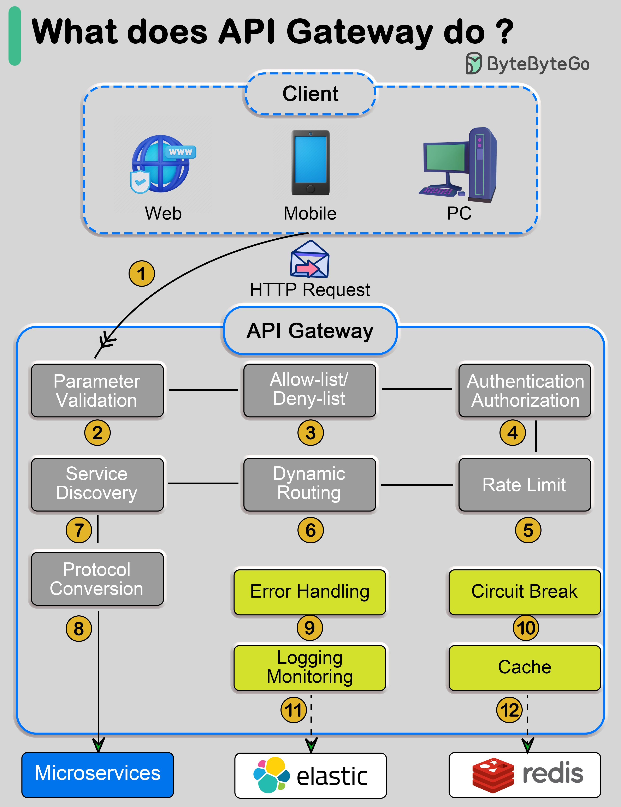

**Source:** [https://twitter.com/i/web/status/1873768521823601153](https://twitter.com/i/web/status/1873768521823601153)
**Original Post Date:** 2025-05-27 17:00:44

# API Gateway Fundamentals: Orchestrating Microservice Requests

## Introduction
An API Gateway serves as the central control point for managing client interactions with microservices architectures. This knowledge base explores its critical role in orchestrating requests through essential functions like authentication, service discovery, and rate limiting, while ensuring system resilience and performance optimization.

Understanding an API Gateway is crucial for building scalable, secure distributed systems that can effectively manage complex request flows across multiple services.

## Core Request Flow Architecture

The gateway serves as the primary entry point for clients (Web, Mobile, PC), receiving HTTP requests and initiating a series of validation and processing steps before routing to microservices.

Each request undergoes systematic inspection through parameter validation, authentication, authorization, and service discovery phases.

## API Gateway Core Functions

The gateway performs multiple critical tasks in sequence: validating parameters, discovering appropriate services, applying security filters, handling routing decisions, and managing protocol conversions.

Advanced features like rate limiting, circuit breakers, and caching optimize performance while maintaining system health.

1. Parameter Validation: Ensures correct request format
1. Service Discovery: Locates appropriate microservice
1. Security Checks: Authentication and authorization
1. Dynamic Routing: Directs to target service
1. Protocol Conversion: Adapts request formats

## System Integration & Monitoring

The gateway integrates with tools like Elasticsearch for logging/monitoring and Redis for caching, enhancing observability and performance.

Error handling, circuit breaking, and logging ensure robustness against failures while maintaining system health.

## Key Takeaways

- An API Gateway centralizes request management across a microservices architecture
- Implementing security layers (authentication/authorization) at the gateway reduces individual service complexity
- Caching and rate limiting optimize performance while protecting against overload
- Integration with monitoring tools provides crucial insights for system health and troubleshooting

## Conclusion
An API Gateway is essential for modern microservices architectures, providing centralized control over request flow management. By handling security, routing, caching, and monitoring at a single point, it simplifies complex distributed systems while ensuring reliability and performance.

## External References

- [Kubernetes Service Mesh Documentation](https://kubernetes.io/docs/concepts/services-networking/service-mesh/)
- [AWS API Gateway Best Practices](https://docs.aws.amazon.com/apigateway/latest/developerguide/best-practices.html)

## Media

**Image Description:** The image is a detailed flowchart that explains the role and functionalities of an **API Gateway** in a microservices architecture. The diagram is structured to illustrate how an API Gateway processes incoming HTTP requests from clients and manages various tasks before routing the request to the appropriate microservices. Below is a detailed breakdown of the image:

### **Main Subject: API Gateway**
The central focus of the image is the **API Gateway**, which acts as an intermediary between clients (Web, Mobile, PC) and the backend microservices. Its primary function is to manage and orchestrate the flow of requests, ensuring security, performance, and reliability.

### **Key Components and Flow**
The flowchart is divided into several sections, each highlighting a specific function performed by the API Gateway. Here’s a step-by-step breakdown:

#### **1. Client Requests**
- **Clients**: The diagram shows three types of clients: **Web**, **Mobile**, and **PC**. These clients send HTTP requests to the API Gateway.
- **HTTP Request**: The request is represented as an arrow pointing towards the API Gateway.

#### **2. API Gateway**
The API Gateway is the central component that processes the incoming request. It performs multiple tasks, as detailed below:

##### **(1) Parameter Validation**
- **Purpose**: Validates the parameters in the incoming request to ensure they are correct and meet the required format.
- **Outcome**: If the parameters are invalid, the request may be rejected or an error response is returned.

##### **(2) Service Discovery**
- **Purpose**: Identifies and locates the appropriate microservice to handle the request.
- **Outcome**: The API Gateway uses service discovery mechanisms to determine which microservice should process the request.

##### **(3) Allow-list/Deny-list**
- **Purpose**: Filters requests based on predefined allow-lists or deny-lists.
- **Outcome**: Requests from allowed sources or with allowed parameters are permitted, while those from denied sources or with invalid parameters are blocked.

##### **(4) Authentication**
- **Purpose**: Verifies the identity of the client making the request.
- **Outcome**: Ensures that only authenticated users or applications can access the services.

##### **(5) Authorization**
- **Purpose**: Checks whether the authenticated client has the necessary permissions to access the requested resource.
- **Outcome**: Only authorized clients are allowed to proceed; unauthorized requests are rejected.

##### **(6) Dynamic Routing**
- **Purpose**: Routes the request to the appropriate microservice based on the request parameters, service location, or other dynamic factors.
- **Outcome**: The request is directed to the correct microservice for processing.

##### **(7) Protocol Conversion**
- **Purpose**: Converts the request format or protocol if necessary to ensure compatibility with the target microservice.
- **Outcome**: Ensures that the request is in a format that the microservice can understand.

##### **(8) Rate Limiting**
- **Purpose**: Controls the number of requests a client can make within a specified time frame.
- **Outcome**: Prevents abuse or overload of the system by limiting the request rate.

##### **(9) Circuit Breaker**
- **Purpose**: Monitors the health of downstream services and prevents requests from being sent to unhealthy or overloaded services.
- **Outcome**: Helps in managing failures gracefully and avoiding cascading failures.

##### **(10) Error Handling**
- **Purpose**: Handles errors that occur during the request processing.
- **Outcome**: Provides meaningful error responses to the client and logs errors for debugging.

##### **(11) Logging and Monitoring**
- **Purpose**: Logs request details and monitors the performance and health of the system.
- **Outcome**: Provides insights into system behavior and helps in troubleshooting and optimization.

##### **(12) Cache**
- **Purpose**: Caches responses to frequently accessed requests.
- **Outcome**: Reduces latency and improves performance by serving cached responses instead of processing the request again.

### **Integration with Microservices and Tools**
- **Microservices**: The API Gateway routes requests to the appropriate microservices, which are depicted at the bottom of the diagram.
- **Elasticsearch**: Used for logging and monitoring purposes, as indicated by the Elasticsearch logo.
- **Redis**: Used for caching, as indicated by the Redis logo.

### **Visual Elements**
- **Boxes and Arrows**: The flowchart uses boxes to represent different functionalities and arrows to show the flow of the request.
- **Color Coding**:
  - **Gray Boxes**: Represent core functionalities like validation, discovery, routing, etc.
  - **Yellow Boxes**: Represent additional functionalities like error handling, circuit breaker, logging, and caching.
  - **Blue Boxes**: Represent the API Gateway and client types.
- **Icons**: Icons are used to represent clients (Web, Mobile, PC) and tools (Elasticsearch, Redis).

### **Summary**
The image effectively illustrates the role of an API Gateway in managing and orchestrating requests in a microservices architecture. It highlights the various functions performed by the API Gateway, such as validation, routing, security, performance optimization, and monitoring. The integration with tools like Elasticsearch and Redis further emphasizes the API Gateway's role in building a robust and scalable system.
