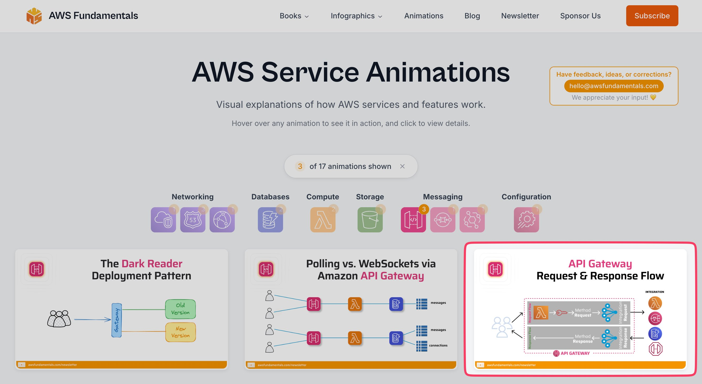

**Source:** [https://twitter.com/i/web/status/1934129755475067354](https://twitter.com/i/web/status/1934129755475067354)
**Original Post Date:** 2025-06-17 14:23:18

# Understanding AWS API Gateway Workflows Through Visual Animations

## Introduction
AWS API Gateway serves as a crucial component for managing RESTful APIs and WebSocket connections in the cloud. This knowledge base article explores key concepts through three essential animations that demonstrate deployment strategies, communication patterns, and the complete request-response lifecycle within AWS. These visual representations provide deep insights into how developers can effectively utilize API Gateway's features.

## Dark Reader Deployment Pattern

The Dark Reader Deployment Pattern showcases versioning strategies in API Gateway, essential for controlled rollouts of new service versions while maintaining availability. This pattern demonstrates how traffic can be managed between old and new versions through a single gateway endpoint.

The workflow begins with user requests reaching the Gateway, which then directs traffic to either the Old Version (stable) or New Version based on deployment strategy. This approach minimizes downtime during updates and enables seamless rollback capabilities.

> **Note/Tip:** Consider using canary releases for gradual user migration between versions

> **Note/Tip:** Monitor version performance metrics before full cutover

## Polling vs WebSockets Communication Patterns

This animation compares two fundamental communication methods - polling and WebSockets. Polling involves periodic client requests to check for updates, while WebSockets establish persistent bi-directional connections.

API Gateway supports both patterns, but they serve different use cases. Polling is better for simple event checks, while WebSockets excel in real-time applications like chat systems or live dashboards.

- Polling: Simple to implement, higher latency
- WebSockets: Real-time updates, efficient for frequent data exchange

## Request & Response Flow Architecture

The API Gateway request-response flow demonstrates the complete lifecycle of an API interaction. It begins with Method Requests from clients, moves through Integration Requests to backend services, processes responses via Integration Responses, and finally returns them as Method Responses to clients.

This architecture enables developers to customize request transformation, implement security policies, and manage response mapping, all while maintaining a clean abstraction layer between clients and backend systems.

_Example YAML showing basic API Gateway method configuration with request transformation_

```yaml
Resources:
  ApiGatewayMethod:
    Type: AWS::ApiGateway::Method
    Properties:
      AuthorizationType: NONE
      HttpMethod: POST
      Integration:
        Type: HTTP_PROXY
        RequestTemplates:
          application/json: '{"method": "$context.httpMethod"}'
```

## Key Takeaways

- API Gateway enables flexible version management through deployment patterns
- Select communication methods based on use case: polling for simplicity, WebSockets for real-time needs
- The complete request-response flow provides opportunities for customization at multiple stages
- Understanding these workflows is essential for building resilient and efficient APIs

## Conclusion
These AWS API Gateway animations provide a visual framework for understanding core concepts in API management. By mastering deployment patterns, choosing appropriate communication methods, and leveraging the full request-response lifecycle, developers can create robust and maintainable cloud-native applications.

## External References

- [AWS API Gateway Documentation](https://docs.aws.amazon.com/apigateway/)
- [API Versioning Best Practices](https://aws.amazon.com/blogs/compute/api-versioning-strategies-using-amazon-api-gateway/)


## Media

**Image Description:** ### Image Description

The image is a screenshot from the **AWS Fundamentals** website, specifically showcasing a section titled **"AWS Service Animations."** The page provides visual explanations of how AWS services and features work. Below is a detailed breakdown of the image:

---

#### **Header Section**
- **Logo and Title**: 
  - The top-left corner features the AWS Fundamentals logo, which includes a stylized orange and white icon resembling a cube or a stack of cubes.
  - The title "AWS Fundamentals" is displayed next to the logo.
- **Navigation Menu**:
  - The navigation menu includes links to various sections: **Books**, **Infographics**, **Animations**, **Blog**, **Newsletter**, and **Sponsor Us**.
  - There is a prominent **Subscribe** button in orange on the far-right side of the menu.

---

#### **Main Content**
- **Title and Description**:
  - The main heading reads: **"AWS Service Animations"**.
  - Below the title, there is a description: *"Visual explanations of how AWS services and features work."*
  - A secondary note states: *"Hover over any animation to see it in action, and click to view details."*

---

#### **Animation Overview**
- **Animation Counter**:
  - A small indicator shows: **"3 of 17 animations shown"**, suggesting that the page displays a subset of animations, with more available.
- **Category Tabs**:
  - Below the counter, there are tabs representing different AWS service categories:
    - **Networking**
    - **Databases**
    - **Compute**
    - **Storage**
    - **Messaging**
    - **Configuration**
  - Each tab has an icon and a small number indicating the number of animations available in that category.

---

#### **Animations Displayed**
The page showcases three animations, each with a title, description, and a visual flow diagram. Below is a detailed breakdown of each:

1. **The Dark Reader Deployment Pattern**
   - **Title**: *"The Dark Reader Deployment Pattern"*
   - **Description**: This animation explains a deployment pattern, likely related to versioning or deployment strategies.
   - **Visual Flow**:
     - A diagram shows a sequence of steps:
       - Users are represented by silhouettes.
       - A blue box labeled **"Gateway"** is connected to two versions:
         - **Old Version** (green box)
         - **New Version** (orange box)
       - Arrows indicate the flow of traffic or requests between users and the versions.

2. **Polling vs. WebSockets via Amazon API Gateway**
   - **Title**: *"Polling vs. WebSockets via Amazon API Gateway"*
   - **Description**: This animation compares two communication methods: polling and WebSockets, using Amazon API Gateway.
   - **Visual Flow**:
     - A diagram illustrates the flow of requests and responses:
       - Users are represented by silhouettes.
       - A pink box labeled **"API Gateway"** is connected to:
         - A **"Polling"** method (orange box)
         - A **"WebSockets"** method (blue box)
       - Arrows show the flow of messages between users, the API Gateway, and the respective methods.

3. **API Gateway Request & Response Flow**
   - **Title**: *"API Gateway Request & Response Flow"*
   - **Description**: This animation explains the flow of requests and responses through the Amazon API Gateway.
   - **Visual Flow**:
     - A detailed diagram illustrates the request and response process:
       - Users are represented by silhouettes.
       - A pink box labeled **"API Gateway"** is connected to:
         - A **"Method Request"** (orange box)
         - A **"Integration Request"** (blue box)
         - A **"Method Response"** (orange box)
         - A **"Integration Response"** (blue box)
       - Arrows show the flow of requests and responses between users, the API Gateway, and the integration points.
       - Additional icons represent various AWS services and components involved in the flow.

---

#### **Interactive Elements**
- The animations are designed to be interactive:
  - Users can hover over the animations to see them in action.
  - Clicking on an animation likely provides more detailed information or a full explanation.

---

#### **Feedback Section**
- **Feedback Box**:
  - On the top-right corner, there is a feedback box with the text:
    - *"Have feedback, ideas, or corrections? hello@awsfundamentals.com"*
    - *"We appreciate your input ❤️"*
  - This encourages users to provide feedback or corrections.

---

#### **Design and Layout**
- The page uses a clean, minimalist design with a light gray background.
- Icons and text are well-organized, with clear visual distinctions between categories and animations.
- The use of color coding (e.g., pink for API Gateway, orange for polling, blue for WebSockets) helps differentiate components and methods.

---

### **Main Subject and Technical Details**
The main subject of the image is the **AWS Service Animations** section, which provides visual explanations of AWS services and features. The technical details include:
- **Animations**: Visual representations of AWS service workflows, such as deployment patterns, communication methods, and request/response flows.
- **AWS Services**: The animations focus on services like **API Gateway**, **Networking**, **Databases**, **Compute**, **Storage**, and **Messaging**.
- **Interactive Elements**: The animations are designed to be interactive, allowing users to hover and click for more details.
- **Feedback Mechanism**: The page encourages user feedback to improve the content.

---

### **Conclusion**
This image effectively communicates the purpose of the AWS Fundamentals website, which is to provide educational content about AWS services through interactive animations. The design is user-friendly, with clear visual cues and interactive elements to enhance learning. The animations cover essential AWS concepts, such as deployment patterns, communication methods, and API Gateway workflows.
