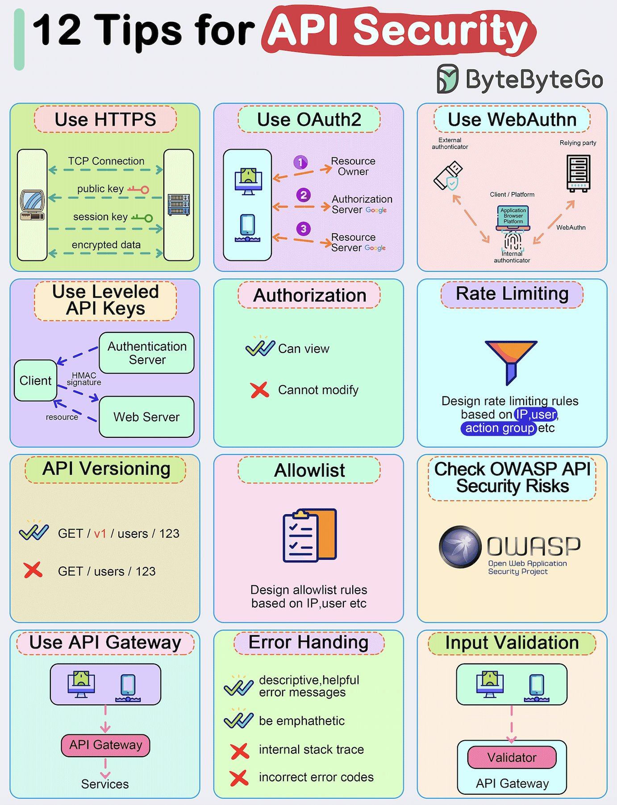

**Source:** [https://twitter.com/i/web/status/1884479345584136603](https://twitter.com/i/web/status/1884479345584136603)
**Original Post Date:** 2025-05-27 19:30:02

# API Security Best Practices: Comprehensive Guidelines for Secure API Design

## Introduction
Modern web applications rely heavily on secure APIs to facilitate communication between clients and servers. A single security vulnerability can compromise entire systems, making robust API protection critical. This comprehensive guide presents ByteByteGo's recommended strategies for securing APIs against common threats. By following these proven techniques, developers can significantly enhance their API security posture.

## Use HTTPS

HTTPS provides end-to-end encryption using TLS/SSL protocols to protect data confidentiality and integrity during transmission between clients and servers.

> **Note/Tip:** Always enforce HTTPS through secure certificates

> **Note/Tip:** Implement HSTS for additional security

## Use OAuth2

OAuth2 enables secure delegation of access rights through a token-based system without exposing user credentials.

1. User grants application permission
1. Authorization server issues access token
1. Resource server provides protected resources

> **Note/Tip:** Implement refresh tokens securely

> **Note/Tip:** Use appropriate OAuth2 flows based on client type

## WebAuthn Integration

WebAuthn eliminates password-based authentication by using public-key cryptography and hardware authenticators for secure user verification.

> **Note/Tip:** Support FIDO2 compliant authenticators

> **Note/Tip:** Implement proper challenge-response mechanisms

## Leveled API Keys

API keys with varying permission levels provide granular access control and reduce attack surfaces through HMAC request signing.

> **Note/Tip:** Rotate keys regularly

> **Note/Tip:** Use different key levels for various operations

## Key Takeaways

- HTTPS is fundamental for API security
- OAuth2 enables secure delegated authentication
- WebAuthn provides passwordless authentication
- Implement layered access controls with API keys

## Conclusion
Securing APIs requires a multi-layered approach combining encryption, proper authentication mechanisms, and strict authorization policies. By implementing these best practices, organizations can significantly reduce security risks while maintaining robust functionality.

## External References

- [OWASP Top 10 API Security Risks](https://owasp.org/www-project-top-ten-for-api-security)
- [WebAuthn Standard Specification](https://www.w3.org/TR/webauthn/)

## Media

**Image Description:** The image is an infographic titled **"12 Tips for API Security"**, presented by **ByteByteGo**. It provides a comprehensive overview of best practices for securing APIs, organized into 12 distinct sections, each with a brief explanation and visual aids. Below is a detailed breakdown of each section:

---

### **1. Use HTTPS**
- **Description**: This tip emphasizes the use of HTTPS (Hypertext Transfer Protocol Secure) for secure communication between clients and servers.
- **Visual**: 
  - A diagram shows a TCP connection between a client and a server.
  - The use of a public key and session key is highlighted, indicating the encryption process.
  - Encrypted data is shown being exchanged between the client and server.
- **Technical Details**: HTTPS ensures data confidentiality and integrity by encrypting data using TLS/SSL protocols.

---

### **2. Use OAuth2**
- **Description**: This tip recommends implementing OAuth2 for secure authentication and authorization.
- **Visual**:
  - A flowchart illustrates the OAuth2 process:
    1. The resource owner (e.g., a user) grants permission to an application.
    2. The authorization server issues an access token.
    3. The resource server (e.g., Google) provides access to the resource using the token.
  - Key components include the resource owner, authorization server, and resource server.
- **Technical Details**: OAuth2 is a widely adopted protocol for secure delegation of access to resources.

---

### **3. Use WebAuthn**
- **Description**: This tip suggests using WebAuthn for secure authentication.
- **Visual**:
  - A diagram shows the interaction between a client, a relying party (server), and an external authenticator.
  - The process involves the client initiating a request, the relying party verifying the user, and the external authenticator (e.g., a hardware key) providing authentication.
- **Technical Details**: WebAuthn enhances security by using public-key cryptography and eliminating the need for passwords.

---

### **4. Use Leveled API Keys**
- **Description**: This tip recommends using API keys with varying levels of access permissions.
- **Visual**:
  - A diagram shows the interaction between a client, an authentication server, and a web server.
  - HMAC (Hash-based Message Authentication Code) is used to sign requests, ensuring integrity and authenticity.
- **Technical Details**: Leveled API keys provide granular access control, reducing the risk of unauthorized access.

---

### **5. Authorization**
- **Description**: This tip focuses on implementing proper authorization mechanisms.
- **Visual**:
  - Icons indicate permissions:
    - A checkmark (✓) for "Can view."
    - A cross (✗) for "Cannot modify."
  - The emphasis is on controlling what authenticated users can do.
- **Technical Details**: Authorization ensures that authenticated users have only the permissions they need.

---

### **6. Rate Limiting**
- **Description**: This tip suggests implementing rate limiting to prevent abuse and denial-of-service attacks.
- **Visual**:
  - A funnel icon represents filtering requests.
  - Text explains designing rate limiting rules based on IP, user, action, and action group.
- **Technical Details**: Rate limiting restricts the number of requests a client can make within a given time frame.

---

### **7. API Versioning**
- **Description**: This tip recommends versioning APIs to manage changes and backward compatibility.
- **Visual**:
  - Examples of API endpoints are shown:
    - Correct: `GET /v1/users/123`
    - Incorrect: `GET /users/123` (without versioning).
  - Versioning helps in managing updates and deprecations.
- **Technical Details**: Versioning ensures that changes to the API do not break existing clients.

---

### **8. Allowlist**
- **Description**: This tip suggests using allowlists to restrict access to specific IP addresses or users.
- **Visual**:
  - A checklist icon represents the allowlist.
  - Text explains designing allowlist rules based on IP, user, etc.
- **Technical Details**: Allowlists provide a whitelist approach to access control, enhancing security.

---

### **9. Check OWASP API Security Risks**
- **Description**: This tip recommends reviewing the OWASP API Security Top 10 to identify and mitigate risks.
- **Visual**:
  - The OWASP logo is displayed.
  - Text emphasizes checking for common API security vulnerabilities.
- **Technical Details**: OWASP provides a comprehensive list of API security risks and mitigation strategies.

---

### **10. Use API Gateway**
- **Description**: This tip suggests using an API gateway to manage and secure API requests.
- **Visual**:
  - A diagram shows the flow of requests through an API gateway to backend services.
  - The API gateway acts as a central point for authentication, rate limiting, and other security measures.
- **Technical Details**: API gateways centralize security and management of APIs.

---

### **11. Error Handling**
- **Description**: This tip recommends implementing secure and descriptive error handling.
- **Visual**:
  - Checkmarks and crosses indicate best practices:
    - ✓ Descriptive and helpful error messages.
    - ✓ Be empathetic in error messages.
    - ✗ Avoid exposing internal stack traces.
    - ✗ Use incorrect error codes.
- **Technical Details**: Proper error handling prevents information leakage and improves user experience.

---

### **12. Input Validation**
- **Description**: This tip emphasizes the importance of validating input data to prevent attacks like injection.
- **Visual**:
  - A diagram shows a validator component in the API gateway.
  - Input validation ensures that only valid data is processed.
- **Technical Details**: Input validation prevents security vulnerabilities such as SQL injection and cross-site scripting (XSS).

---

### **Overall Layout and Design**
- The infographic is visually organized into a 4x3 grid, with each tip having a distinct color-coded box.
- Each section includes:
  - A title in a dashed orange box.
  - A brief explanation or visual representation.
  - Icons or diagrams to illustrate the concept.
- The title at the top is prominently displayed in bold black text with a red box around "API Security."
- The branding of **ByteByteGo** is visible in the top-right corner.

---

### **Key Takeaways**
The infographic provides a concise and visually appealing summary of essential API security practices, covering authentication, authorization, rate limiting, versioning, and more. It is a valuable resource for developers and security professionals looking to enhance the security of their APIs.
