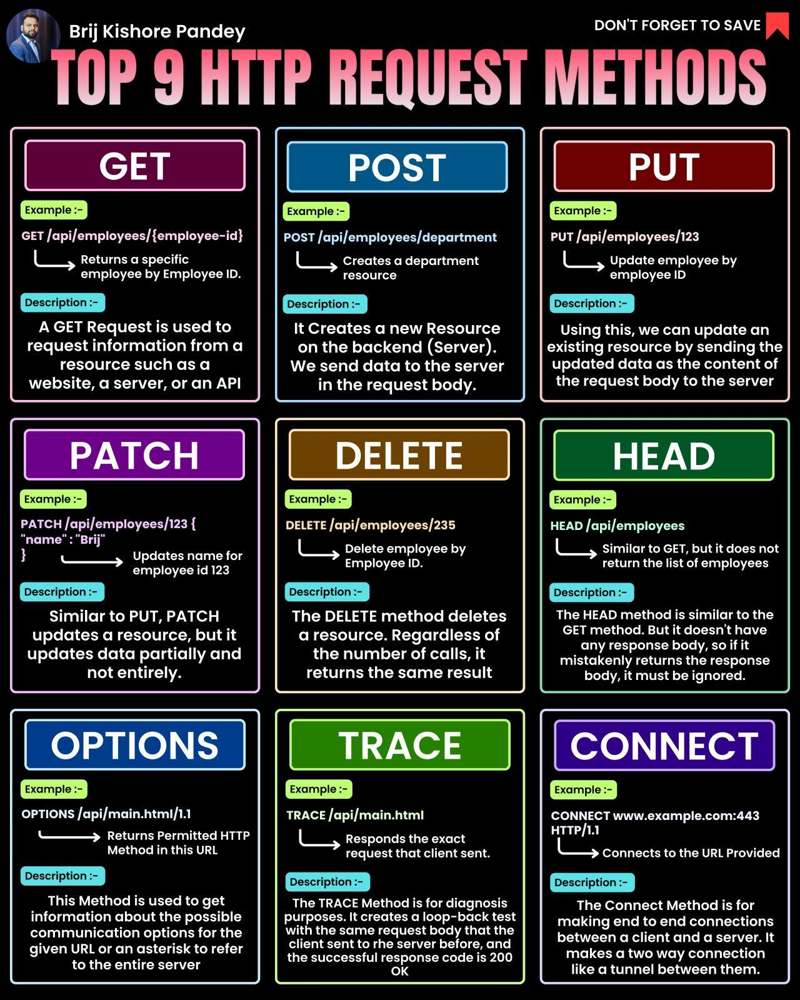

**Source:** [https://twitter.com/i/web/status/1876192002963829042](https://twitter.com/i/web/status/1876192002963829042)
**Original Post Date:** 2025-05-28 05:49:56

# HTTP Request Methods: A Comprehensive Guide for API Design and Web Development

## Introduction
HTTP request methods are fundamental building blocks of web APIs and client-server communication. Understanding their proper usage is crucial for designing robust, efficient, and secure APIs. This guide provides an in-depth analysis of the nine HTTP methods defined by the HTTP specification, covering their purposes, example usages, and best practices for implementation.

## GET Method

The GET method retrieves data from a specified resource. It should only retrieve data and not modify it on the server. Request parameters can be passed via URL query strings.

_Example of a GET request to fetch employee data by ID_

```http
GET /api/employees/{employee-id} HTTP/1.1
Host: example.com
```

- Idempotent operation (multiple identical requests have same effect)
- Should not be used for operations that change server state
- Can be cached and bookmarked safely

> **Note/Tip:** Limit query parameter length to avoid URL size limitations

> **Note/Tip:** Use GET with caution for sensitive data due to logging issues

## POST Method

The POST method is used to create a new resource on the server. It sends data in the request body and may return either the newly created resource or an identifier.

_Example of a POST request to create a new employee record_

```http
POST /api/employees HTTP/1.1
Host: example.com
Content-Type: application/json

{
  "name": "Brij",
  "department": "Engineering"
}
```

- Non-idempotent (multiple identical requests may create multiple resources)
- Used for data submission and form processing
- Commonly used with JSON or form-encoded data

> **Note/Tip:** Always return appropriate status codes (201 Created, 409 Conflict)

> **Note/Tip:** Consider using PUT instead when resource identity is known

## PUT Method

The PUT method replaces a complete resource with the request payload. It updates or creates a resource at a specific URI.

_Example of a PUT request to replace an existing employee record_

```http
PUT /api/employees/123 HTTP/1.1
Host: example.com
Content-Type: application/json

{
  "name": "Brij",
  "department": "Engineering"
}
```

- Idempotent operation (multiple identical requests have same effect)
- Updates entire resource representation
- Should not create new resources unless specified in API design

## PATCH Method

The PATCH method applies partial modifications to a resource. It's used when only specific fields need updating without sending the entire resource representation.

_Example of a PATCH request using JSON Patch format_

```http
PATCH /api/employees/123 HTTP/1.1
Host: example.com
Content-Type: application/json-patch+json

[
  { "op": "replace", "path": "/name", "value": "Updated Name" }
]
```

- Non-idempotent by default (multiple identical requests may have different effects)
- Supports partial updates without full resource knowledge
- Commonly used with formats like JSON Patch or Merge-Patch

> **Note/Tip:** Ensure server supports PATCH and understands the patch format used

> **Note/Tip:** Consider idempotency considerations when implementing PATCH endpoints

## DELETE Method

The DELETE method removes a resource from the server. It typically returns no content after successful deletion.

_Example of a DELETE request to remove an employee record_

```http
DELETE /api/employees/235 HTTP/1.1
Host: example.com
```

- Idempotent operation (multiple identical requests have same effect)
- Does not require request body
- Should return 204 No Content or 200 OK upon success

> **Note/Tip:** Consider implementing soft deletes for critical business data

> **Note/Tip:** Return appropriate error codes (404 Not Found, 403 Forbidden)

## HEAD Method

The HEAD method retrieves only the headers of a response without the body. It's useful for checking metadata or validating resource existence.

_Example of a HEAD request to check employee collection headers_

```http
HEAD /api/employees HTTP/1.1
Host: example.com
```

- Identical to GET but returns no body
- Useful for caching and conditional requests
- Returns all status codes that GET would return

## OPTIONS Method

The OPTIONS method describes the communication options available for a resource. It's commonly used in CORS preflight requests to determine allowed methods and headers.

_Example of an OPTIONS request to check resource capabilities_

```http
OPTIONS /api/main.html HTTP/1.1
Host: example.com
```

- Returns allowed HTTP methods via Allow header
- Key for CORS preflight requests
- Useful for API discovery and documentation

> **Note/Tip:** Consider implementing OPTIONS endpoints on important resources

> **Note/Tip:** Can be used to advertise custom capabilities via headers

## TRACE Method

The TRACE method echoes back the exact request sent by the client, including all headers and body. It's primarily a diagnostic tool.

_Example of a TRACE request for diagnostic purposes_

```http
TRACE /api/main.html HTTP/1.1
Host: example.com
```

- Echoes back the entire request exactly as received
- Useful for debugging routing and proxy configurations
- Should be disabled in production environments

> **Note/Tip:** Enable only during troubleshooting phases

> **Note/Tip:** Can expose sensitive information, use with caution

## CONNECT Method

The CONNECT method establishes a tunnel to the server identified by the target resource. It's primarily used for HTTP proxying and SSL/TLS negotiation.

_Example of a CONNECT request to establish a secure tunnel_

```http
CONNECT api.example.com:443 HTTP/1.1
Host: api.example.com
```

- Establishes bidirectional communication tunnel
- Commonly used with HTTPS through proxies
- Requires proper security considerations for production use

> **Note/Tip:** Enable only in proxy or gateway contexts

> **Note/Tip:** Implement appropriate access controls and SSL/TLS verification

## Best Practices and Considerations

When designing APIs, carefully consider the semantics of each HTTP method to ensure consistency with RESTful principles.

Use idempotent methods (GET, PUT, DELETE) for operations that can be safely retried without unexpected side effects.

- Follow proper status code conventions for each method
- Document any deviations from standard HTTP semantics
- Consider security implications of each method in your context

## Key Takeaways

- GET, PUT, DELETE are idempotent; POST and PATCH typically are not.
- Use appropriate methods based on operation intent (create=POST, update=PUT/PATCH).
- Consider security implications of each method in your API design.
- Return proper status codes to indicate success or failure.
- Document any custom behavior that differs from standard HTTP semantics.

## Conclusion
Understanding and properly implementing HTTP request methods is essential for creating well-designed, secure, and efficient APIs. By following RESTful principles and considering the specific characteristics of each method, developers can build robust web services that effectively communicate with clients.

## External References

- [https://tools.ietf.org/html/rfc7231](https://tools.ietf.org/html/rfc7231)
- [https://restfulapi.net/](https://restfulapi.net/)


## Media

**Image Description:** ### Description of the Image

The image is an infographic titled **"TOP 9 HTTP REQUEST METHODS"** by **Brij Kishore Pandey**. It provides a detailed overview of the nine most commonly used HTTP request methods, each explained with examples, descriptions, and their purposes. The background is black, and the text is presented in a visually organized grid format with distinct color-coded sections for each method. Here's a detailed breakdown:

---

### **Main Subject: HTTP Request Methods**
The infographic is centered around the nine HTTP request methods, which are fundamental to web development and API interactions. Each method is explained with:
1. **Method Name**
2. **Example**
3. **Description**

---

### **Layout and Structure**
The infographic is divided into a **3x3 grid**, with each cell dedicated to one HTTP method. The methods are listed in the following order (row-wise):
1. **GET**
2. **POST**
3. **PUT**
4. **PATCH**
5. **DELETE**
6. **HEAD**
7. **OPTIONS**
8. **TRACE**
9. **CONNECT**

Each cell contains:
- **Method Name**: Highlighted in bold, large text at the top.
- **Example**: A sample URL or request structure demonstrating how the method is used.
- **Description**: A brief explanation of the method's purpose and behavior.

---

### **Detailed Explanation of Each Method**

#### **1. GET**
- **Color**: Purple
- **Example**: `GET /api/employees/{employee-id}`
  - Explanation: Returns a specific employee by Employee ID.
- **Description**:
  - A GET request is used to retrieve information from a resource.
  - It is typically used for fetching data without modifying it.
  - The request parameters can be included in the URL query string.

#### **2. POST**
- **Color**: Blue
- **Example**: `POST /api/employees/department/department`
  - Explanation: Creates a department resource.
- **Description**:
  - A POST request is used to create a new resource on the server.
  - Data is sent in the request body, typically in JSON or form-encoded format.
  - It is commonly used for submitting forms or creating new records.

#### **3. PUT**
- **Color**: Red
- **Example**: `PUT /api/employees/123`
  - Explanation: Updates an employee by Employee ID.
- **Description**:
  - A PUT request is used to update a resource entirely.
  - The request body contains the complete updated representation of the resource.
  - It replaces the existing resource with the new data.

#### **4. PATCH**
- **Color**: Purple
- **Example**: `PATCH /api/employees/123 { "name": "Brij" }`
  - Explanation: Updates the name of employee ID 123.
- **Description**:
  - A PATCH request is used to update a resource partially.
  - Unlike PUT, it only sends the changes to the resource, not the entire resource.
  - It is useful for making incremental updates.

#### **5. DELETE**
- **Color**: Brown
- **Example**: `DELETE /api/employees/235`
  - Explanation: Deletes an employee by Employee ID.
- **Description**:
  - A DELETE request is used to remove a resource from the server.
  - It does not require a request body.
  - The server should confirm the deletion, typically with a `200 OK` or `204 No Content` response.

#### **6. HEAD**
- **Color**: Green
- **Example**: `HEAD /api/employees`
  - Explanation: Similar to GET but does not return the response body.
- **Description**:
  - A HEAD request is similar to GET but only retrieves the headers of the response.
  - It is useful for checking metadata without fetching the entire resource.

#### **7. OPTIONS**
- **Color**: Blue
- **Example**: `OPTIONS /api/main.html/1.1`
  - Explanation: Returns permitted HTTP methods for the given URL.
- **Description**:
  - An OPTIONS request is used to determine the communication options available for a resource.
  - It is often used for preflight requests in CORS (Cross-Origin Resource Sharing) scenarios.

#### **8. TRACE**
- **Color**: Green
- **Example**: `TRACE /api/main.html`
  - Explanation: Responds with the exact request sent by the client.
- **Description**:
  - A TRACE request is used for diagnostic purposes.
  - The server echoes back the exact request sent by the client, including headers and body.
  - It is rarely used in production environments.

#### **9. CONNECT**
- **Color**: Purple
- **Example**: `CONNECT www.example.com:443`
  - Explanation: Establishes a tunnel to the target server.
- **Description**:
  - A CONNECT request is used to establish a tunnel, typically for HTTPS connections.
  - It is often used by proxies to facilitate secure connections.

---

### **Additional Notes**
- **Visual Design**: The use of contrasting colors (purple, blue, red, green, etc.) helps differentiate the methods and makes the infographic visually appealing and easy to read.
- **Typography**: The text is clear and concise, with method names in bold and large font sizes for emphasis.
- **Call to Action**: At the top-right corner, there is a reminder: **"DON'T FORGET TO SAVE"**, encouraging viewers to save the infographic for future reference.

---

### **Purpose**
The infographic serves as an educational resource for developers, students, and anyone learning about HTTP request methods. It provides a quick reference guide with practical examples and descriptions, making it easy to understand the purpose and usage of each method.

---

This detailed breakdown covers the main subject and technical details of the image, highlighting its structure, content, and purpose.
