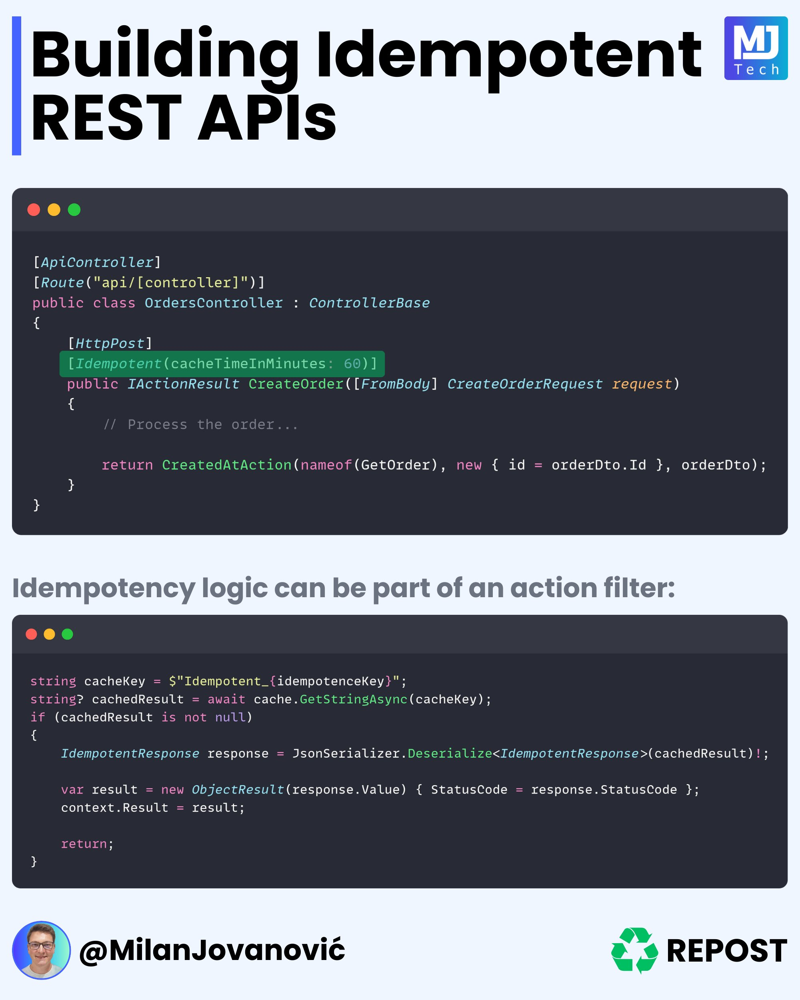

**Source:** [https://twitter.com/i/web/status/1867834552141422747](https://twitter.com/i/web/status/1867834552141422747)
**Original Post Date:** 2025-05-28 08:24:22

# Implementing Idempotent REST APIs with ASP.NET Core

## Introduction
Idempotency is a critical concept in RESTful API design that guarantees predictable responses regardless of request repetition. This guide demonstrates how to implement idempotent endpoints using ASP.NET Core's features, focusing on cache-based validation and action filter integration.

## Controller Implementation with Idempotency

The OrdersController implements idempotent behavior through a custom attribute and caching mechanism. This approach ensures that repeated requests with the same idempotence key produce consistent results without creating duplicate resources.

The controller inherits from ControllerBase and uses standard ASP.NET Core routing attributes to define its endpoint structure.

_This code defines an idempotent endpoint using a custom attribute and demonstrates proper HTTP response handling for created resources._

```csharp
[ApiController]
[Route("api/[controller]")]
public class OrdersController : ControllerBase
{
    [HttpPost]
    [Idempotent(cacheTimeInMinutes: 60)]
    public IActionResult CreateOrder(CreateOrderRequest request)
    {
        // Process the order...
        return CreatedAtAction(...);
    }
}
```

## Idempotency Logic Implementation

The core of idempotent behavior lies in the cache-based validation system. Each request is validated against existing cached responses using a unique key.

When implementing this pattern, consider caching strategy, key generation, and proper error handling to maintain data consistency.

_This code demonstrates the cache lookup and validation process, ensuring consistent responses for repeated requests._

```csharp
string cacheKey = $"Idempotent_{idempotenceKey}";
var cachedResult = await cache.GetStringAsync(cacheKey);

if (!string.IsNullOrEmpty(cachedResult))
{
    var response = JsonSerializer.Deserialize<IdempotentResponse>(cachedResult);
    return new ObjectResult(response.Data)
    {
        StatusCode = (int)response.StatusCode
    };
}
```

- Generate unique idempotency keys from client-side
- Implement cache key generation using a standardized format
- Handle cache expiration to prevent long-term storage of temporary data

## Key Takeaways

- Idempotency is essential for reliable API behavior in distributed systems.
- Cache-based validation provides an efficient mechanism for ensuring idempotent responses.
- Custom action filters encapsulate idempotency logic, promoting code reusability and maintainability.

## Conclusion
Implementing idempotent REST APIs requires careful consideration of caching strategies, key generation, and error handling. By following these patterns in ASP.NET Core, you can create reliable services that handle repeated requests predictably.

## External References

- [ASP.NET Core Caching Documentation](https://docs.microsoft.com/en-us/aspnet/core/performance/caching/memory)
- [REST API Design: From Concept to Code](https://www.oreilly.com/library/view/rest-api-design/9781492034567/)


## Media

**Image Description:** The image is a technical presentation slide focused on building **idempotent REST APIs**. The slide is well-structured, combining code snippets, explanations, and branding elements. Below is a detailed breakdown:

### **Header**
- **Title**: "Building Idempotent REST APIs"
  - The title is prominently displayed at the top in large, bold text.
  - The word "Idempotent" is repeated multiple times in the title, emphasizing its importance.
- **Branding**: 
  - On the top-right corner, there are two logos:
    1. **MJ Tech**: A purple and blue logo with the text "MJ Tech."
    2. **Repost**: A green recycling symbol with the text "REPOST" next to it.

### **Main Content**
The slide is divided into two main sections: a code snippet and an explanation of idempotency logic.

#### **1. Code Snippet: Controller Implementation**
- **Language**: The code is written in C# (likely ASP.NET Core).
- **Controller Class**:
  - The class is named `OrdersController` and inherits from `ControllerBase`.
  - It is decorated with the `[ApiController]` attribute, indicating it is an API controller.
  - The `[Route("api/[controller]")]` attribute specifies the base route for the controller.
- **Action Method**:
  - The method `CreateOrder` is decorated with `[HttpPost]`, indicating it handles HTTP POST requests.
  - The method is also decorated with `[Idempotent(cacheTimeInMinutes: 60)]`, which suggests a custom attribute for handling idempotency with a cache time of 60 minutes.
  - The method accepts a request body of type `CreateOrderRequest` and returns an `IActionResult`.
  - Inside the method:
    - The order is processed (indicated by a comment `// Process the order...`).
    - The method returns a `CreatedAtAction` result, which is a standard HTTP 201 Created response with a location header pointing to the newly created resource.

#### **2. Explanation of Idempotency Logic**
- **Text Explanation**:
  - The slide explains that idempotency logic can be implemented as part of an action filter.
  - The text reads: "Idempotency logic can be part of an action filter."
- **Code Snippet for Idempotency Logic**:
  - The code demonstrates how to implement idempotency using caching.
  - **Key Components**:
    1. **Cache Key Generation**:
       - A cache key is generated using the format: `"Idempotent_{idempotenceKey}"`.
    2. **Cache Retrieval**:
       - The code attempts to retrieve the result from the cache using `cache.GetStringAsync(cacheKey)`.
    3. **Cache Hit Logic**:
       - If the result is found in the cache, it is deserialized into an `IdempotentResponse` object.
       - The response is then returned as an `ObjectResult` with the appropriate status code.
    4. **Cache Miss Logic**:
       - If the result is not found in the cache, the method proceeds with the actual processing logic (not shown in this snippet).

### **Footer**
- **Author Information**:
  - The author is identified as **@MilanJovanovivović**.
  - There is a circular profile picture of a person with glasses.
- **Repost Branding**:
  - The "REPOST" logo with a recycling symbol is repeated at the bottom-right corner.

### **Design and Formatting**
- **Color Scheme**:
  - Dark background with light text for the code snippets, making the code highly readable.
  - Bright colors for the title and logos (e.g., purple, blue, green).
- **Code Formatting**:
  - The code is well-indented and formatted, following standard C# conventions.
  - Syntax highlighting is used to differentiate keywords, strings, and other elements.

### **Overall Purpose**
The slide aims to educate readers on how to implement idempotent REST APIs using ASP.NET Core. It provides a practical example of a controller method and explains how idempotency can be enforced using caching and action filters. The repetition of the word "Idempotent" in the title emphasizes the importance of this concept in API design. The inclusion of both code and explanatory text ensures that the content is both technical and accessible.
