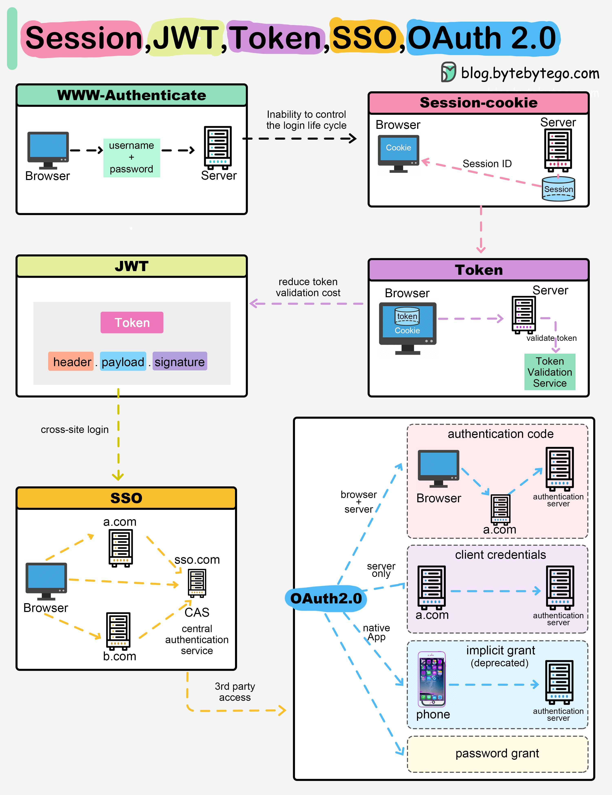

**Source:** [https://twitter.com/i/web/status/1925766400385097834](https://twitter.com/i/web/status/1925766400385097834)
**Original Post Date:** 2025-05-28 08:51:41

# JWT-Based SSO and OAuth 2.0 Flows: Technical Comparison

## Introduction
Modern web applications require robust authentication systems that balance security, scalability, and user experience. This article provides a deep dive into five essential authentication mechanisms: Session-based Authentication, JWT (JSON Web Tokens), Token-based Authentication, Single Sign-On (SSO), and OAuth 2.0. Each mechanism has distinct characteristics and use cases that make them suitable for different scenarios in distributed systems architecture.

## Session-Based Authentication Flow

Session-based authentication maintains user state on the server through session IDs stored in cookies. This approach requires maintaining server-side state but provides seamless user experience within a single application domain.

```javascript
app.post('/login', (req, res) => {
  const sessionId = generateSessionId();
  sessions[sessionId] = { userId: req.body.userId };
  res.cookie('session_id', sessionId);
});
```

- Server generates unique session ID upon authentication
- Session state maintained in server memory/database
- Client receives cookie containing session ID
- Subsequent requests include session ID for validation

> **Note/Tip:** Consider scaling implications when using in-memory sessions across multiple servers

## JWT Authentication Flow

JWT provides a stateless authentication mechanism where the token itself contains all necessary user information and claims. This enables scalable, distributed systems without session management overhead.

```javascript
const jwt = require('jsonwebtoken');

function generateToken(user) {
  return jwt.sign({ userId: user.id }, 'secret', { expiresIn: '1h' });
}
```

- JWT structure: header.payload.signature
- Self-contained token with claims and metadata
- Stateless validation on any server
- Ideal for microservices architecture

## Token-based Authentication

Generalized approach where tokens are validated by the authentication service, supporting both stateful and stateless implementations depending on token type.

- Supports various token types (JWT, OAuth 2.0)
- Centralized validation logic
- Flexible deployment options

## SSO Architecture

Single Sign-On enables users to authenticate once and access multiple services without re-authentication.

Common implementations include CAS (Central Authentication Service) for web applications.

- User authenticates with central SSO server
- Single token valid across all participating services
- Reduces user friction and security risks

## OAuth 2.0 Flow

OAuth 2.0 focuses on authorization delegation, enabling third-party applications to access resources without exposing user credentials.

```javascript
app.get('/auth/callback', (req, res) => {
  const authCode = req.query.code;
  // Exchange code for access token
});
```

1. Authorization Code Grant (primary flow)
1. Implicit Grant (deprecated for security reasons)
1. Client Credentials Flow (machine-to-machine)

## Key Takeaways

- Session-based authentication requires server state but provides seamless user experience within single domains
- JWT offers stateless validation and is ideal for distributed systems
- SSO reduces login complexity across multiple services
- OAuth 2.0 enables secure authorization delegation to third-party applications

## Conclusion
Each authentication mechanism serves specific use cases: session-based for traditional web apps, JWT for microservices, SSO for multi-service environments, and OAuth 2.0 for authorization delegation. Architectural decisions should consider factors such as scalability requirements, security needs, and user experience.

## External References

- [OAuth 2.0 Authorization Framework](https://tools.ietf.org/html/rfc6749)
- [JWT Specification](https://tools.ietf.org/html/rfc7519)


## Media

**Image Description:** This image is a detailed diagram that compares and contrasts several authentication and authorization mechanisms commonly used in web and application development. The main subjects covered are **Session-based authentication**, **JWT (JSON Web Token)**, **Token-based authentication**, **SSO (Single Sign-On)**, and **OAuth 2.0**. Each mechanism is explained with visual flowcharts and technical details. Below is a detailed breakdown of the image:

---

### **1. Session-based Authentication**
- **Title**: "Session"
- **Description**:
  - **Flow**:
    - The user sends their **username** and **password** from the **Browser** to the **Server**.
    - The **Server** validates the credentials and creates a **Session** on the server-side.
    - The **Server** sends a **Session ID** back to the **Browser**, which stores it in a **Cookie**.
    - Subsequent requests from the **Browser** include the **Session ID** in the **Cookie**, allowing the **Server** to identify the user.
  - **Key Points**:
    - The **Session** is stored on the server, and the **Session ID** is used to track the user's state.
    - The **Cookie** is used to persist the **Session ID** on the client-side.
    - **Inability to control the login lifecycle**: The diagram highlights that session-based authentication may lack fine-grained control over the login lifecycle.

---

### **2. JWT (JSON Web Token)**
- **Title**: "JWT"
- **Description**:
  - **Flow**:
    - The **Server** generates a **JWT Token** after validating the user's credentials.
    - The **JWT Token** is sent to the **Browser**, which stores it (often in a **Cookie** or local storage).
    - Subsequent requests from the **Browser** include the **JWT Token** in the request headers.
    - The **Server** validates the **JWT Token** (checking its signature, expiration, etc.) to authenticate the user.
  - **Key Points**:
    - **JWT Token Structure**: The token is divided into three parts:
      - **Header**: Contains metadata about the token, such as the signing algorithm.
      - **Payload**: Contains claims about the user (e.g., user ID, expiration time).
      - **Signature**: Ensures the integrity and authenticity of the token.
    - **Reduces Token Validation Cost**: Since the token is self-contained, the server does not need to maintain session state, reducing the load on the server.
    - **Cross-Site Login**: JWT is often used in scenarios where users need to log in across multiple sites or services.

---

### **3. Token-based Authentication**
- **Title**: "Token"
- **Description**:
  - **Flow**:
    - The **Browser** sends a **Token** (e.g., a JWT or OAuth token) in the request headers to the **Server**.
    - The **Server** validates the **Token** to authenticate the user.
    - The **Token** is stored in the **Browser** (e.g., in a **Cookie** or local storage).
  - **Key Points**:
    - The **Token** is validated by the **Server** to ensure its authenticity and validity.
    - The **Token** can be used for stateless authentication, meaning the server does not need to maintain session state.
    - The **Token Validation Service** is responsible for verifying the token's integrity and claims.

---

### **4. SSO (Single Sign-On)**
- **Title**: "SSO"
- **Description**:
  - **Flow**:
    - The user logs into a central **SSO Server** (e.g., `sso.com`).
    - After successful authentication, the **SSO Server** issues a **Token** or **Authentication Code**.
    - The user can then access multiple services (e.g., `a.com` and `b.com`) using the same **Token** or **Authentication Code**.
  - **Key Points**:
    - **Central Authentication**: Users authenticate once with the **SSO Server** and can access multiple services without re-authenticating.
    - **CAS (Central Authentication Service)**: A common implementation of SSO.
    - **3rd Party Access**: SSO is often used in scenarios where users need to access third-party services with a single login.

---

### **5. OAuth 2.0**
- **Title**: "OAuth 2.0"
- **Description**:
  - **Flow**:
    - The **Browser** or **App** requests access to a resource from the **Authorization Server** (e.g., `a.com`).
    - The **Authorization Server** redirects the user to the **Authentication Server** for authentication.
    - After successful authentication, the **Authentication Server** issues an **Authentication Code**.
    - The **Authorization Server** exchanges the **Authentication Code** for an **Access Token**.
    - The **Access Token** is used by the **Browser** or **App** to access the protected resources.
  - **Key Points**:
    - **Grant Types**:
      - **Implicit Grant**: Used for native apps (deprecated).
      - **Password Grant**: Used for trusted clients (e.g., mobile apps).
      - **Client Credentials**: Used for server-to-server communication.
    - **Authentication Code Flow**: A common OAuth 2.0 flow where the **Authentication Code** is exchanged for an **Access Token**.
    - **Server-Side and Client-Side Interaction**: OAuth 2.0 supports both server-side and client-side authentication flows.

---

### **Overall Structure of the Image**
- The image is divided into five main sections, each representing a different authentication mechanism.
- Each section includes:
  - A **title** in a colored box.
  - A **flowchart** illustrating the interaction between the **Browser**, **Server**, and other components.
  - **Key technical details** and **annotations** explaining the mechanism.
- The mechanisms are connected with arrows to show the flow of data and the progression from one mechanism to another.

---

### **Key Technical Details**
1. **Session-based Authentication**:
   - Server-side session management.
   - Cookie-based persistence of the Session ID.
2. **JWT**:
   - Self-contained token with Header, Payload, and Signature.
   - Stateless authentication.
3. **Token-based Authentication**:
   - Generalized token validation process.
   - Stateless and scalable.
4. **SSO**:
   - Centralized authentication server.
   - Cross-site login capability.
5. **OAuth 2.0**:
   - Authorization and authentication separation.
   - Multiple grant types for different use cases.

---

### **Conclusion**
The image provides a comprehensive comparison of different authentication and authorization mechanisms, highlighting their workflows, technical details, and use cases. It is particularly useful for developers and architects who need to understand the trade-offs and implementation details of these mechanisms.
