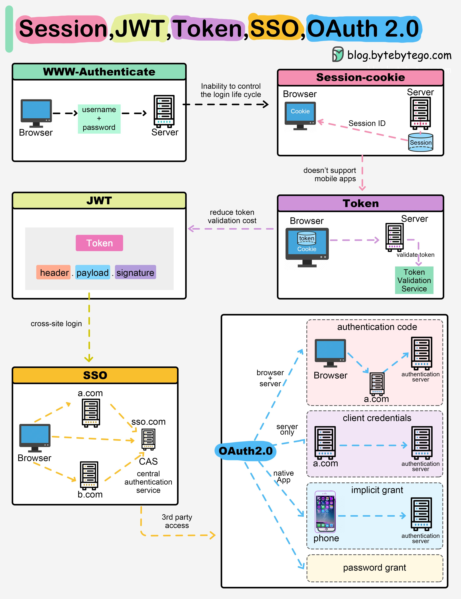

**Source:** [https://twitter.com/i/web/status/1882828220061692107](https://twitter.com/i/web/status/1882828220061692107)
**Original Post Date:** 2025-05-28 03:21:46

# JWT Token: Structure, Flow, and Comparison with Other Authentication Mechanisms

## Introduction
JSON Web Tokens (JWT) have become a cornerstone of modern API authentication due to their stateless nature and flexibility. This article examines JWT in detail, compares it with traditional session-based authentication, token-based systems, Single Sign-On (SSO), and OAuth 2.0, helping developers choose the right mechanism for their use case.

## JWT Structure and Flow

JWT consists of three distinct parts: header, payload, and signature, each base64Url encoded and joined with a dot (.) to form the complete token. The header specifies the signing algorithm used.

The authentication flow involves credential validation on the server side, JWT generation, client storage, and subsequent request inclusion. This stateless approach eliminates server-side session management overhead.

- Header: Defines token type and algorithm
- Payload: Contains user claims and metadata
- Signature: Ensures integrity and authenticity

## Comparison with Other Mechanisms

Session-based authentication requires server-side state management, while JWT operates in a stateless manner. Token-based systems provide broader flexibility but may not directly support mobile apps.

SSO centralizes user authentication across multiple services, whereas OAuth 2.0 focuses on authorization delegation without credential sharing.

1. Session-based: Server maintains state
1. JWT: Stateless token validation
1. Token-based: Broader scope but web-centric
1. SSO: Centralized authentication
1. OAuth 2.0: Authorization delegation

> **Note/Tip:** Choose JWT for scalable, distributed systems requiring minimal server state

> **Note/Tip:** Use SSO when multiple applications share a single user base

> **Note/Tip:** Consider OAuth 2.0 for third-party access scenarios

## Key Takeaways

- JWT offers stateless authentication with self-contained user information
- Each mechanism has distinct advantages: JWT for scalability, SSO for unified login, OAuth 2.0 for delegation
- Token validation costs are reduced in JWT due to decentralized verification

## Conclusion
Understanding the characteristics and trade-offs of different authentication mechanisms is crucial for making informed architectural decisions. JWT provides an excellent balance between security, scalability, and simplicity, particularly in stateless architectures.

## External References

- [JWT Specification](https://tools.ietf.org/html/rfc7519)
- [OAuth 2.0 Authorization Framework](https://tools.ietf.org/html/rfc6749)

## Media

**Image Description:** This image is a detailed diagram comparing and contrasting different authentication and authorization mechanisms commonly used in web and mobile applications. The main subjects include **Session-based authentication**, **JWT (JSON Web Token)**, **Token-based authentication**, **SSO (Single Sign-On)**, and **OAuth 2.0**. Each mechanism is explained with visual flowcharts and technical details. Below is a detailed breakdown:

---

### **1. Session-based Authentication**
- **Description**: 
  - Session-based authentication is a traditional method where the server maintains a session for the user.
- **Flow**:
  1. The user sends their **username** and **password** to the server.
  2. The server validates the credentials and creates a **session** on the server.
  3. The server sends a **session ID** (usually a cookie) to the client (browser).
  4. The client stores the session ID in a cookie and sends it with every subsequent request.
  5. The server uses the session ID to retrieve the session data and authenticate the user.
- **Key Points**:
  - The server manages the session state, which can lead to scalability issues.
  - Session IDs are typically stored in cookies.
  - The diagram highlights the **inability to control the login lifecycle** effectively.

---

### **2. JWT (JSON Web Token)**
- **Description**:
  - JWT is a self-contained, stateless token that contains user information and is signed or encrypted.
- **Structure**:
  - JWT is composed of three parts:
    1. **Header**: Contains metadata about the token, such as the signing algorithm (e.g., HMAC SHA256 or RSA).
    2. **Payload**: Contains claims about the user, such as user ID, expiration time, etc.
    3. **Signature**: Ensures the integrity and authenticity of the token.
- **Flow**:
  1. The user sends their credentials to the server.
  2. The server validates the credentials and generates a JWT.
  3. The JWT is sent back to the client, which stores it (e.g., in a cookie or local storage).
  4. The client sends the JWT with every request.
  5. The server validates the JWT (signature and payload) to authenticate the user.
- **Key Points**:
  - JWT is stateless, meaning the server does not need to maintain session data.
  - Reduces the validation cost since the token can be validated locally without querying a database.
  - The diagram highlights the **reduction in token validation cost**.

---

### **3. Token-based Authentication**
- **Description**:
  - Token-based authentication is a broader concept where the server issues a token to the client, which is used for authentication.
- **Flow**:
  1. The user sends their credentials to the server.
  2. The server validates the credentials and issues a token (e.g., JWT or OAuth token).
  3. The client stores the token (e.g., in a cookie or local storage).
  4. The client sends the token with every request.
  5. The server validates the token to authenticate the user.
- **Key Points**:
  - The diagram shows that token-based authentication **does not support mobile apps** directly, as it is often used in the context of web applications.
  - The token is validated by the server, ensuring the user's identity.

---

### **4. SSO (Single Sign-On)**
- **Description**:
  - SSO allows users to authenticate once and access multiple applications or services without re-authenticating.
- **Flow**:
  1. The user accesses a service (e.g., `a.com` or `b.com`).
  2. The service redirects the user to an **SSO server** (e.g., `sso.com`).
  3. The SSO server authenticates the user (e.g., using username and password).
  4. The SSO server issues a token or session to the user.
  5. The user is redirected back to the original service with the token or session.
  6. The service validates the token or session with the SSO server.
- **Key Points**:
  - The diagram shows multiple services (`a.com`, `b.com`) using a central SSO server (`sso.com`).
  - SSO reduces the need for users to manage multiple credentials.
  - The diagram highlights the use of **CAS (Central Authentication Service)** as an example of SSO.

---

### **5. OAuth 2.0**
- **Description**:
  - OAuth 2.0 is an open standard for authorization that allows users to grant third-party applications access to their resources without sharing their credentials.
- **Flow**:
  1. The user accesses a client application (e.g., a web app or mobile app).
  2. The client application redirects the user to an **authorization server**.
  3. The authorization server prompts the user to authenticate and authorize the client.
  4. The authorization server issues an **authentication code** or **access token**.
  5. The client uses the authentication code to obtain an access token from the authorization server.
  6. The client uses the access token to access protected resources on the resource server.
- **Key Points**:
  - The diagram shows different grant types:
    - **Implicit Grant**: Used for native apps (e.g., mobile apps) where the client directly receives an access token.
    - **Password Grant**: Used when the client has direct access to the user's credentials.
    - **Client Credentials**: Used when the client itself needs to access resources.
  - OAuth 2.0 is designed for third-party access and is widely used in scenarios where multiple applications need to interact securely.

---

### **Overall Structure of the Diagram**
- The diagram is organized into sections, each explaining a different authentication mechanism.
- Arrows and flowcharts illustrate the data flow between the client (browser or app), server, and authorization server.
- Key technical details are highlighted, such as the structure of JWT, the role of SSO, and the different grant types in OAuth 2.0.
- The diagram also points out limitations or considerations for each mechanism, such as the inability of session-based authentication to control the login lifecycle or the lack of mobile app support for token-based authentication.

---

### **Conclusion**
This image provides a comprehensive comparison of various authentication and authorization mechanisms, highlighting their strengths, weaknesses, and use cases. It is particularly useful for developers and architects who need to choose the right authentication strategy for their applications.
