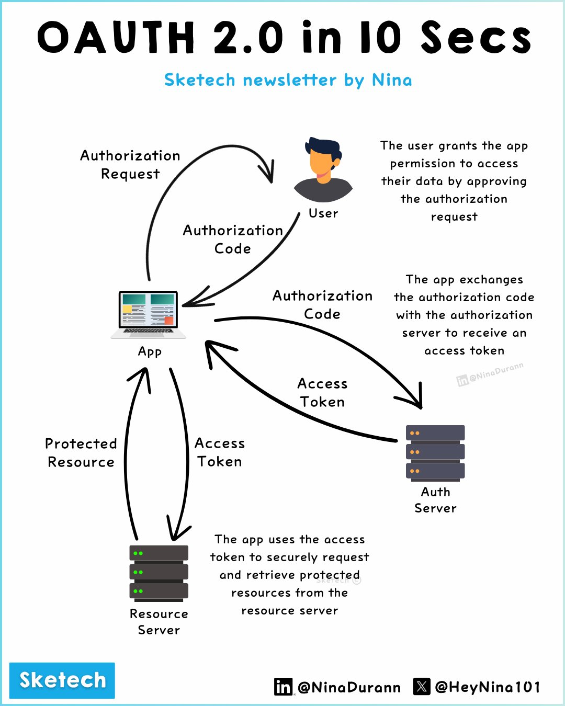

**Source:** [https://twitter.com/i/web/status/1870577916024868875](https://twitter.com/i/web/status/1870577916024868875)
**Original Post Date:** 2025-05-28 04:11:51

# OAuth 2.0 Authorization Code Flow: Technical Deep Dive

## Introduction
OAuth 2.0 represents the industry standard for delegating permissions in modern APIs while maintaining security. This knowledge base item examines the authorization code grant type—a widely adopted pattern where clients request user consent without directly accessing sensitive credentials. Understanding this flow is crucial for designing secure API architectures that protect both user data and system resources.

## Architectural Components

The OAuth 2.0 ecosystem consists of four primary actors working in concert:

- User: Initiates authentication and grants permissions

- Client Application: Requests access to protected resources on behalf of the user

- Authorization Server: Issues authorization codes and tokens, validating user consent

- Resource Server: Holds protected data that clients seek to access

- Each component plays a distinct security role in the overall flow
- Clear separation of concerns enables secure communication patterns
- Token-based authentication reduces reliance on shared secrets

## Step-by-Step Flow Analysis

The authorization code grant type follows a four-step process:

1. Authorization Request: Client redirects user to authorization server for consent

2. Authorization Code Issuance: Server generates a temporary code upon user approval

3. Token Exchange: Client exchanges code for access and refresh tokens

4. Resource Access: Client uses access token to request protected resources

```http
POST /oauth/token HTTP/1.1
Host: authorization-server.com
Content-Type: application/x-www-form-urlencoded

grant_type=authorization_code&
client_id=my_client&
code=AUTHORIZATION_CODE&
redirect_uri=http://myapp/callback
```

> **Note/Tip:** Always use HTTPS for all OAuth interactions

> **Note/Tip:** Validate redirect URIs to prevent token interception

> **Note/Tip:** Implement proper code rotation and short expiration times

## Security Considerations

Key security aspects include:

- Protection of authorization codes using secure transport

- Client authentication mechanisms (basic auth or client secret)

- Token validation on resource servers via introspection

1. Implement PKCE for public clients to prevent authorization code interception
1. Use refresh tokens with appropriate scopes and lifetimes
1. Monitor and log all OAuth interactions for security auditing

## Implementation Best Practices

Successful OAuth 2.0 implementation requires attention to:

- Secure storage of client credentials and tokens

- Proper error handling and user communication

- Regular security assessments and compliance checks

## Key Takeaways

- Authorization code flow is the recommended pattern for web applications due to its security benefits
- Proper implementation requires careful attention to token storage, validation, and rotation
- Security practices like PKCE and secure transport are essential for preventing common vulnerabilities

## Conclusion
Understanding OAuth 2.0's authorization code flow is fundamental for building secure API integrations. By following the outlined architectural components, security considerations, and implementation best practices, developers can create robust authentication systems that protect user data while maintaining usability.

## External References

- [OAuth 2.0 Authorization Framework](https://tools.ietf.org/html/rfc6749)
- [PKCE Specification](https://tools.ietf.org/html/rfc7636)


## Media

**Image Description:** The image is a visual representation of the OAuth 2.0 authorization flow, designed to explain the process in a simple and concise manner. The diagram is titled **"OAuth 2.0 in 10 Secs"** and is credited to **"Sketech newsletter by Nina"**. Below is a detailed breakdown of the image:

### **Main Components and Flow**
The OAuth 2.0 flow is depicted as a circular process involving four main entities:
1. **User**
2. **App (Client)**
3. **Auth Server**
4. **Resource Server**

### **Step-by-Step Breakdown**

#### **1. Authorization Request**
- **User**: The process begins with the **User** interacting with the **App**.
- **App**: The **App** sends an **Authorization Request** to the **User**.
- **User Action**: The **User** is prompted to grant permission to the **App** to access their data.

#### **2. Authorization Code**
- **User Approval**: After the **User** grants permission, the **Auth Server** issues an **Authorization Code**.
- **Flow**: The **Authorization Code** is sent back to the **App**.

#### **3. Token Exchange**
- **App Action**: The **App** uses the **Authorization Code** to request an **Access Token** from the **Auth Server**.
- **Auth Server**: The **Auth Server** validates the **Authorization Code** and issues an **Access Token** to the **App**.

#### **4. Accessing Protected Resources**
- **App Action**: The **App** uses the **Access Token** to request access to **Protected Resources** from the **Resource Server**.
- **Resource Server**: The **Resource Server** verifies the **Access Token** and grants access to the requested resources.

### **Visual Elements**
1. **User Icon**:
   - Represented as a simple human figure with dark hair and a gray silhouette.
   - The **User** is the starting point of the flow, granting permission to the **App**.

2. **App Icon**:
   - Represented as a laptop with a colorful screen, symbolizing the client application.
   - The **App** initiates the authorization request and uses the **Access Token** to access resources.

3. **Auth Server Icon**:
   - Represented as a stack of server-like blocks with orange dots, symbolizing the authorization server.
   - The **Auth Server** issues the **Authorization Code** and the **Access Token**.

4. **Resource Server Icon**:
   - Similar to the **Auth Server**, but with green dots, symbolizing the server hosting the protected resources.
   - The **Resource Server** provides access to the resources after verifying the **Access Token**.

### **Arrows and Flow**
- **Curved Arrows**: The flow is depicted using curved arrows that connect the entities, showing the sequence of interactions:
  1. From **App** to **User** (Authorization Request).
  2. From **User** to **Auth Server** (Authorization Code).
  3. From **App** to **Auth Server** (Token Exchange).
  4. From **App** to **Resource Server** (Accessing Resources).

### **Text Annotations**
- Each step is annotated with descriptive text to explain the process:
  - **Authorization Request**: The **App** requests permission from the **User**.
  - **Authorization Code**: The **Auth Server** issues a code after the **User** grants permission.
  - **Access Token**: The **App** exchanges the **Authorization Code** for an **Access Token**.
  - **Protected Resources**: The **App** uses the **Access Token** to access resources from the **Resource Server**.

### **Design and Styling**
- **Color Scheme**: The diagram uses a clean, minimalistic design with a white background and blue accents.
- **Icons**: Simple, cartoonish icons are used to represent the entities (User, App, Auth Server, Resource Server).
- **Typography**: The text is clear and concise, with key terms like "Authorization Code" and "Access Token" emphasized.

### **Footer and Attribution**
- The bottom left corner features the logo **"Sketech"** in blue.
- The bottom right corner includes social media handles:
  - **LinkedIn**: @NinaDurann
  - **X (Twitter)**: @HeyNina101

### **Overall Purpose**
The image serves as an educational tool to explain the OAuth 2.0 authorization flow in a visually engaging and easy-to-understand manner. It breaks down the complex process into a simple, step-by-step diagram, making it accessible for both technical and non-technical audiences.
