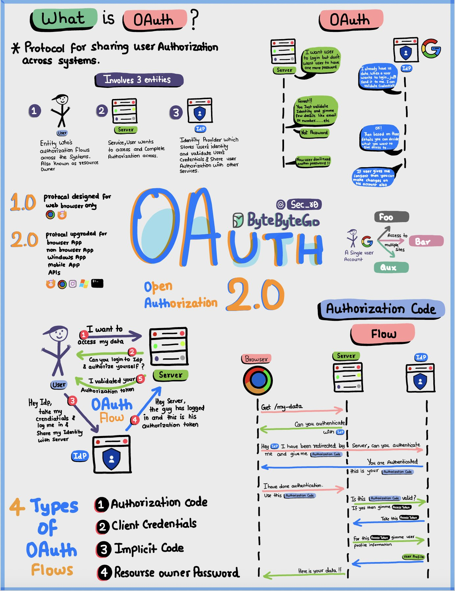

**Source:** [https://twitter.com/i/web/status/1882465831441035492](https://twitter.com/i/web/status/1882465831441035492)
**Original Post Date:** 2025-05-27 18:30:22

# OAuth 2.0: Understanding Authorization Protocol Mechanics

## Introduction
OAuth 2.0 represents a foundational protocol in modern web architecture, enabling secure delegated authorization between systems without exposing user credentials. This knowledge base explores the core mechanics, implementation patterns, and security implications of OAuth 2.0 through detailed examination of its entities, flow types, and practical applications.

## OAuth Fundamentals and Entities

OAuth 2.0 is an open standard protocol that enables third-party applications to access user resources without requiring direct credential sharing. The protocol operates through three primary entities: User, Resource Server (Server), and Authorization Server (Identity Provider). Each entity plays a distinct role in the authorization process.

The evolution from OAuth 1.0 to 2.0 marked significant improvements in security architecture and flexibility across different application types.

1. Users initiate resource access requests
1. Servers manage protected resources
1. Authorization Servers validate identities

## Standard OAuth 2.0 Flow Mechanics

The core authorization code flow follows a six-step process: User initiates access → Server redirects to IdP → User authenticates → IdP issues Authorization Code → Server exchanges for Access Token → Resource accessed.

This pattern ensures secure credential management while maintaining user control over resource access.

- Authorization Code Flow: Most secure, recommended for web apps
- Implicit Flow: For single-page applications with direct token return
- Client Credentials Flow: Application-to-application authorization
- Password Grant (deprecated): Direct credential exchange

> **Note/Tip:** Always prefer Authorization Code flow when possible

> **Note/Tip:** Never expose client secrets in browser-based flows

## Technical Implementation Considerations

Token security is paramount. Implement token expiration, secure storage practices, and proper error handling to maintain protocol integrity.

Refresh tokens should be stored securely and used only for silent access token renewal.

- Use HTTPS exclusively for all OAuth interactions
- Implement PKCE for public clients
- Validate token signatures using asymmetric cryptography

## Common Implementation Patterns

Real-world implementations often combine OAuth 2.0 with OpenID Connect (OIDC) to provide both authentication and authorization capabilities.

Consider implementing silent token renewal mechanisms for seamless user experience.

> **Note/Tip:** Cache tokens appropriately based on session requirements

> **Note/Tip:** Implement proper error handling for token expiration

## Key Takeaways

- OAuth 2.0 enables secure third-party access without credential sharing
- Authorization Code Flow is the most secure and widely adopted pattern
- Proper implementation requires careful attention to security best practices
- Token management and storage are critical for protocol integrity

## Conclusion
Understanding OAuth 2.0's mechanics is essential for building secure, scalable authentication systems. By following proper implementation patterns and adhering to security best practices, developers can effectively leverage this protocol to enable secure third-party access in modern applications.

## External References

- [OAuth 2.0 RFC](https://tools.ietf.org/html/rfc6749)
- [OAuth 2.0 Security Best Practices](https://oauth.net/security/)

## Media

**Image Description:** This image is a detailed and colorful sketchnote-style diagram explaining **OAuth 2.0**, a widely used protocol for authorization and authentication. The diagram is divided into several sections, each focusing on different aspects of OAuth 2.0, including its purpose, entities involved, flow, and types of OAuth flows. Below is a detailed breakdown:

---

### **Main Subject: OAuth 2.0**
The central theme of the image is **OAuth 2.0**, an open standard for authorization that allows users to grant third-party applications access to their resources (e.g., data) without sharing their credentials (username and password). The diagram explains the protocol's purpose, its entities, flow, and types of OAuth flows.

---

### **Key Sections of the Diagram**

#### **1. What is OAuth?**
- **Definition**: OAuth is a protocol designed for sharing user authorization across systems.
- **Purpose**: It allows users to grant access to their resources (e.g., data) to third-party applications without sharing their credentials.
- **Entities Involved**:
  - **User**: The entity who wants to authorize access to their resources.
  - **Server**: The service or application that the user wants to access.
  - **Identity Provider (IdP)**: The entity that stores and validates the user's identity (e.g., Google, Facebook).

#### **2. Evolution of OAuth**
- **OAuth 1.0**: Designed for web browsers only.
- **OAuth 2.0**: Upgraded version that supports web browsers, non-browser apps, mobile apps, and more. It is widely used today.

#### **3. Entities Involved in OAuth**
The diagram highlights three main entities:
1. **User**: The individual who owns the resources and wants to authorize access.
2. **Server**: The service or application that the user wants to access.
3. **Identity Provider (IdP)**: The entity responsible for authenticating the user and issuing tokens.

#### **4. OAuth Flow**
The diagram illustrates the flow of OAuth 2.0, showing the interactions between the User, Server, and Identity Provider:
1. **User Initiates Access**: The user wants to access a resource on the Server.
2. **Redirect to IdP**: The Server redirects the user to the IdP for authentication.
3. **User Authenticates**: The user logs in to the IdP using their credentials.
4. **IdP Issues Authorization Code**: After successful authentication, the IdP redirects the user back to the Server with an **Authorization Code**.
5. **Server Exchanges Code for Token**: The Server uses the Authorization Code to exchange it for an **Access Token** from the IdP.
6. **Access Granted**: The Server uses the Access Token to access the user's resources on their behalf.

#### **5. OAuth 2.0 Flow Diagram**
The flow is visually represented with arrows showing the sequence of interactions:
- **User → Server**: The user requests access to a resource.
- **Server → IdP**: The Server redirects the user to the IdP for authentication.
- **User → IdP**: The user logs in to the IdP.
- **IdP → Server**: The IdP redirects the user back to the Server with an Authorization Code.
- **Server → IdP**: The Server exchanges the Authorization Code for an Access Token.
- **Server → Resource**: The Server uses the Access Token to access the user's resources.

#### **6. Types of OAuth Flows**
The diagram lists the four main types of OAuth 2.0 flows:
1. **Authorization Code Flow**: The most secure flow, suitable for web applications.
2. **Implicit Flow**: Used for client-side applications (e.g., single-page apps) where the Access Token is returned directly to the client.
3. **Client Credentials Flow**: Used when the client application needs to access its own resources, not the user's resources.
4. **Resource Owner Password Credentials Flow**: Less secure, where the user directly provides their username and password to the client.

#### **7. Key Technical Details**
- **Authorization Code**: A temporary code issued by the IdP to the Server, which is then exchanged for an Access Token.
- **Access Token**: A token used by the Server to access the user's resources on their behalf.
- **Refresh Token**: (Not explicitly mentioned in this diagram but often used in OAuth 2.0) A token used to refresh the Access Token when it expires.

#### **8. Visual Elements**
- **Color Coding**: Different entities and steps are color-coded for clarity:
  - **Blue**: User
  - **Green**: Server
  - **Purple**: Identity Provider (IdP)
  - **Orange**: OAuth 2.0
- **Icons**: Simple icons represent the User, Server, and IdP.
- **Arrows**: Show the flow of interactions between entities.
- **Text Boxes**: Explain the actions taken by each entity at each step.

#### **9. Example Scenario**
The diagram includes a scenario where a user wants to log in to a service using their Google account:
- The user is redirected to Google for authentication.
- After logging in, Google redirects the user back to the service with an Authorization Code.
- The service then exchanges the Authorization Code for an Access Token to access the user's data.

---

### **Conclusion**
The image is a comprehensive and visually engaging explanation of OAuth 2.0, covering its purpose, entities, flow, and types of flows. It uses a sketchnote style with icons, arrows, and color coding to make the complex process of OAuth 2.0 easy to understand. The diagram is particularly useful for developers, security professionals, and anyone looking to understand how OAuth 2.0 works in practice.
