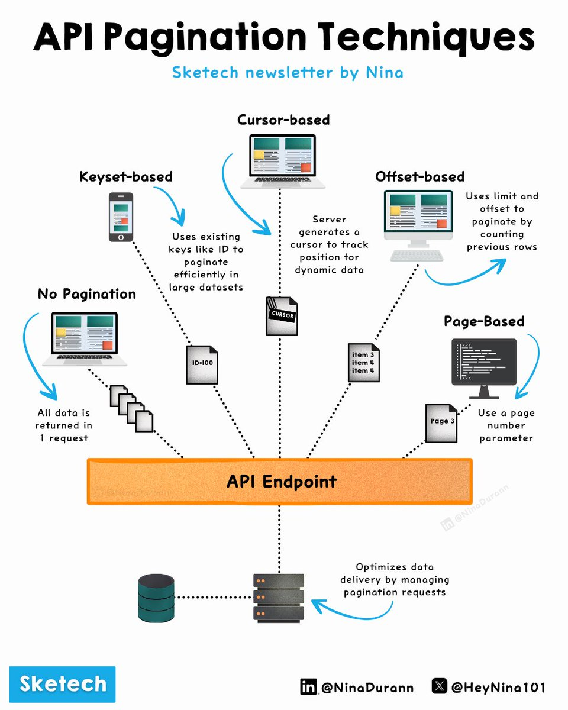

**Source:** [https://twitter.com/i/web/status/1880268843869958299](https://twitter.com/i/web/status/1880268843869958299)
**Original Post Date:** 2025-05-28 03:33:46

# Advanced API Pagination Techniques: Implementation Strategies & Best Practices

## Introduction
Pagination is crucial for managing large datasets in APIs efficiently. This article explores five distinct pagination techniques—No Pagination, Keyset-based, Cursor-based, Offset-based, and Page-based—detailing their implementations, advantages, and ideal use cases. Understanding these methods helps architects make informed decisions about data delivery strategies.

## No Pagination

This technique returns all data in a single request without any pagination.

While simple to implement, it's only suitable for small datasets due to potential performance issues.

- Simple implementation
- High memory usage for large datasets
- Limited scalability

> **Note/Tip:** Avoid using in production APIs with significant data volumes

## Keyset-based Pagination

Uses existing unique keys (IDs) to paginate through datasets.

Ideal for handling dynamic data as it maintains consistency even when records are added or removed.

```HTTP/REST
/api/resources?cursor=12345&direction=forward
```

> **Note/Tip:** Requires indexed columns for optimal performance

## Cursor-based Pagination

Server generates a cursor to track position in dynamic datasets.

Optimized for scenarios where data frequently changes.

```HTTP/REST
/api/resources?cursor=abc123
```

## Offset-based Pagination

Uses offset and limit parameters to paginate by counting previous rows.

Simple implementation but can become inefficient with large datasets.

```HTTP/REST
/api/resources?offset=10&limit=20
```

## Page-based Pagination

Divides dataset into pages and retrieves data based on page number.

Simple to implement but may face scalability issues with very large datasets.

```HTTP/REST
/api/resources?page=2&per_page=10
```

## Implementation Considerations

Select pagination method based on dataset size and data dynamics.

Consider factors like memory usage, response time, and scalability requirements.

- Use Keyset or Cursor-based for large dynamic datasets
- Offset-based suitable for smaller, static datasets
- Page-based good for user-facing APIs with simple pagination needs

## Key Takeaways

- No Pagination only viable for small datasets (<100 items)
- Keyset/Cursor-based optimal for large dynamic datasets
- Offset-based suitable for smaller, static datasets
- Page-based best for user-facing interfaces with simple pagination needs

## Conclusion
Choosing the right pagination technique is crucial for API performance and scalability. Consider your dataset size, data dynamics, and use case requirements when implementing pagination strategies.

## External References

- [GraphQL Cursor Connection Specification](https://relay.dev/graphql/connections.htm)
- [RESTful API Pagination Best Practices](https://developers.google.com/gdata/docs/directory)


## Media

**Image Description:** ### Description of the Image

The image is a detailed infographic titled **"API Pagination Techniques"** by Nina, as indicated by the text at the top and the author's social media handles at the bottom. The infographic visually explains different pagination techniques used in API design to manage large datasets efficiently. Below is a detailed breakdown of the image:

---

#### **Title and Header**
- The title is prominently displayed at the top: **"API Pagination Techniques"**.
- The subtitle mentions the source: **"Sketech newsletter by Nina"**.
- The author's social media handles are provided at the bottom:
  - LinkedIn: **@NinaDurann**
  - X (formerly Twitter): **@HeyNina101**

---

#### **Main Content: Pagination Techniques**
The infographic illustrates four primary pagination techniques, each explained with visual elements and brief descriptions. These techniques are:
1. **No Pagination**
2. **Keyset-based**
3. **Cursor-based**
4. **Offset-based**
5. **Page-based**

Each technique is represented with icons, arrows, and text annotations to explain how they work.

---

### **1. No Pagination**
- **Description**: This technique involves returning all data in a single request without any pagination.
- **Visual Representation**:
  - A laptop icon is shown with a large dataset represented as multiple files or documents.
  - The text explains: **"All data is returned in 1 request"**.
  - This method is suitable for small datasets but is inefficient for large datasets due to performance issues.

---

### **2. Keyset-based Pagination**
- **Description**: This technique uses unique keys (e.g., IDs) to paginate through the dataset. It is efficient for dynamic data.
- **Visual Representation**:
  - A smartphone icon is shown with a dataset represented as files.
  - The text explains: **"Uses existing keys like ID to paginate efficiently in large datasets"**.
  - This method is particularly useful for handling large datasets and dynamic data changes.

---

### **3. Cursor-based Pagination**
- **Description**: This technique uses a cursor to track the position in the dataset, allowing for efficient navigation.
- **Visual Representation**:
  - A laptop icon is shown with a dataset represented as files.
  - The text explains: **"Server generates a cursor to track position for dynamic data"**.
  - This method is ideal for handling dynamic datasets where data might change frequently.

---

### **4. Offset-based Pagination**
- **Description**: This technique uses an offset and limit to paginate through the dataset. It specifies the starting point and the number of items to retrieve.
- **Visual Representation**:
  - A desktop computer icon is shown with a dataset represented as files.
  - The text explains: **"Uses offset and limit to paginate by counting previous rows"**.
  - This method is straightforward but can become inefficient for large datasets or when data changes frequently.

---

### **5. Page-based Pagination**
- **Description**: This technique divides the dataset into pages and retrieves data based on the page number.
- **Visual Representation**:
  - A desktop computer icon is shown with a dataset represented as files.
  - The text explains: **"Uses a page number parameter"**.
  - This method is simple and commonly used but can become inefficient for very large datasets.

---

#### **Central API Endpoint**
- At the center of the infographic, there is a large orange box labeled **"API Endpoint"**. This represents the central point where all pagination techniques interact with the API.
- Arrows connect each pagination technique to the API endpoint, indicating that these techniques are implemented at the API level to manage data delivery.

---

#### **Database and Data Delivery**
- At the bottom of the infographic, there is a representation of a database (a cylinder icon) and multiple server icons.
- The text explains: **"Optimizes data delivery by managing pagination requests"**.
- This section highlights how the chosen pagination technique affects the interaction between the API, the database, and the server, emphasizing the importance of efficient data management.

---

### **Visual Elements**
- **Icons**: Laptop, smartphone, desktop computer, database, and server icons are used to represent different components.
- **Arrows**: Blue arrows indicate the flow of data and the relationship between the API endpoint and the pagination techniques.
- **Text Annotations**: Each technique is accompanied by a brief explanation of its functionality and use cases.
- **Color Coding**: The orange box for the API endpoint stands out, drawing attention to its central role.

---

### **Overall Theme**
The infographic effectively communicates the different pagination techniques available for API design, highlighting their strengths and use cases. It emphasizes the importance of choosing the right pagination method based on the dataset size, data dynamics, and performance requirements.

---

This detailed description should provide a comprehensive understanding of the image and its technical content.
