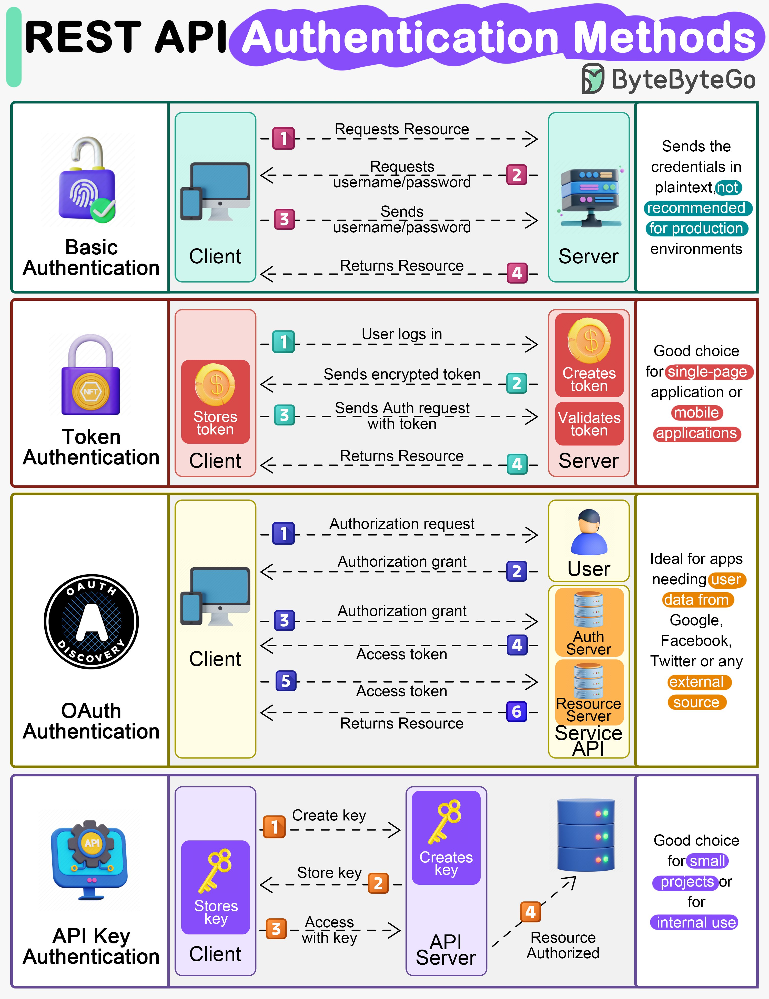

**Source:** [https://twitter.com/i/web/status/1867812745791647966](https://twitter.com/i/web/status/1867812745791647966)
**Original Post Date:** 2025-06-17 09:48:48

# REST API Authentication Methods: Comprehensive Guide

## Introduction
Authentication in REST APIs is a critical component that ensures secure access to resources. This guide explores four fundamental authentication methods used across different applications.

Understanding these methods helps developers choose the right approach based on their specific requirements, from simple internal systems to complex external integrations.

## Basic Authentication

Basic authentication involves sending plaintext credentials (username/password) with each request.

The server validates these credentials and grants access if they're valid.

- Client sends credentials in the Authorization header as 'Basic <base64(username:password)>'
- Server decodes and verifies credentials
- HTTP 401 Unauthorized if invalid

> **Note/Tip:** Never use Basic Auth without HTTPS

> **Note/Tip:** Not recommended for production environments

## Token Authentication

Uses encrypted tokens for authentication, typically implemented using JWT (JSON Web Tokens).

Tokens are generated upon successful login and validated in subsequent requests.

```javascript
const token = jwt.sign({ userId: user.id, exp: Math.floor(Date.now() / 1000) + (60 * 60) }, process.env.JWT_SECRET);
```

1. Server generates token with payload including user ID and expiration time
1. Client stores token securely (e.g., HTTPOnly cookie)
1. Token sent in Authorization header for each request

## OAuth Authentication

OAuth is a protocol that allows third-party applications to access user resources without sharing credentials.

Involves multiple parties: resource owner, client application, authorization server, and resource server.

- Uses scopes for granular permissions control
- Common in social media integrations (Google, Facebook)
- Supports different grant types (Authorization Code, Implicit)

## API Key Authentication

Simple method using unique identifiers to authenticate clients.

Ideal for internal APIs and small-scale applications requiring basic security.

1. Generate unique key per client
1. Send in 'X-API-Key' header
1. Validate on server-side

> **Note/Tip:** Rotate keys periodically

> **Note/Tip:** Use different environments for development and production

## Key Takeaways

- Choose authentication method based on use case: OAuth for third-party access, token-based for SPAs/mobile apps
- Always encrypt tokens and credentials in transit using HTTPS
- Implement proper key management and rotation practices

## Conclusion
Selecting the appropriate authentication method depends on your specific requirements. Basic Auth is suitable only with HTTPS, Token Authentication provides good security for modern applications, OAuth enables secure third-party access, while API Keys offer simplicity for internal use.

## External References

- [RFC 7617 - HTTP Authentication: Basic and Digest Access Authentication](https://tools.ietf.org/html/rfc7617)
- [OAuth 2.0 Authorization Framework](https://tools.ietf.org/html/rfc6749)


## Media

**Image Description:** ### Image Description: REST API Authentication Methods

The image is a detailed infographic that explains four common authentication methods used in REST API development. Each method is illustrated with a flowchart, icons, and descriptive text. The infographic is visually organized into four sections, each representing a different authentication method. Below is a detailed breakdown of each section:

---

### **1. Basic Authentication**
- **Icon**: A lock with a fingerprint and a green checkmark.
- **Description**:
  - **Client**: The client requests a resource from the server.
  - **Server**: The server responds by requesting credentials (username/password).
  - **Client**: The client sends the credentials in plaintext.
  - **Server**: The server validates the credentials and returns the requested resource.
- **Key Points**:
  - **Plaintext Credentials**: The username and password are sent in plaintext, which is not secure.
  - **Not Recommended for Production**: This method is insecure and should not be used in production environments.

---

### **2. Token Authentication**
- **Icon**: A lock with a dollar sign and a golden coin.
- **Description**:
  - **Client**: The user logs in.
  - **Server**: The server creates an encrypted token and sends it to the client.
  - **Client**: The client stores the token.
  - **Client**: The client sends the token in subsequent requests.
  - **Server**: The server validates the token and returns the requested resource.
- **Key Points**:
  - **Encrypted Token**: The token is encrypted for security.
  - **Good for Single-Page Applications (SPAs) or Mobile Apps**: Suitable for applications where secure authentication is needed without exposing credentials.

---

### **3. OAuth Authentication**
- **Icon**: A lock with the OAuth logo and a user profile icon.
- **Description**:
  - **Client**: The client requests authorization from the user.
  - **User**: The user grants authorization.
  - **Auth Server**: The authorization server issues an access token.
  - **Client**: The client uses the access token to request resources.
  - **Resource Server**: The resource server validates the token and returns the requested resource.
- **Key Points**:
  - **Multi-Step Process**: Involves user consent and an authorization server.
  - **Ideal for External Data Sources**: Commonly used for accessing data from external platforms like Google, Facebook, Twitter, etc.
  - **Secure and Flexible**: Allows users to grant access to specific resources without sharing credentials.

---

### **4. API Key Authentication**
- **Icon**: A lock with a key icon.
- **Description**:
  - **Client**: The client requests a key from the API server.
  - **API Server**: The server generates and sends a key to the client.
  - **Client**: The client stores the key.
  - **Client**: The client uses the key in subsequent requests.
  - **API Server**: The server validates the key and returns the requested resource.
- **Key Points**:
  - **Simple and Secure**: Uses a unique key for authentication.
  - **Good for Small Projects or Internal Use**: Suitable for internal APIs or small-scale applications where security is manageable.
  - **Access Control**: Provides fine-grained control over API access.

---

### **Overall Layout and Design**
- **Title**: The title at the top reads "REST API Authentication Methods" in bold, colorful text.
- **Sections**: Each authentication method is separated by a horizontal line, making it easy to distinguish between them.
- **Flowcharts**: Each method is illustrated with a flowchart showing the interaction between the client, server, and other components (e.g., user, authorization server).
- **Icons**: Each section uses relevant icons to represent the method (e.g., lock, key, user profile, dollar sign).
- **Color Coding**: Different colors are used for each method to enhance visual clarity:
  - Basic Authentication: Green and purple.
  - Token Authentication: Red and gold.
  - OAuth Authentication: Yellow and blue.
  - API Key Authentication: Purple and blue.
- **Annotations**: Each step in the flowchart is numbered and annotated with a brief description of the action.

---

### **Additional Notes**
- The infographic is visually appealing and educational, making it easy for developers to understand the differences between the authentication methods.
- The use of icons and flowcharts helps convey complex concepts in a simple and intuitive manner.
- The text annotations provide clear explanations of each step in the authentication process.

This infographic is a valuable resource for developers looking to choose the appropriate authentication method for their REST API projects.
