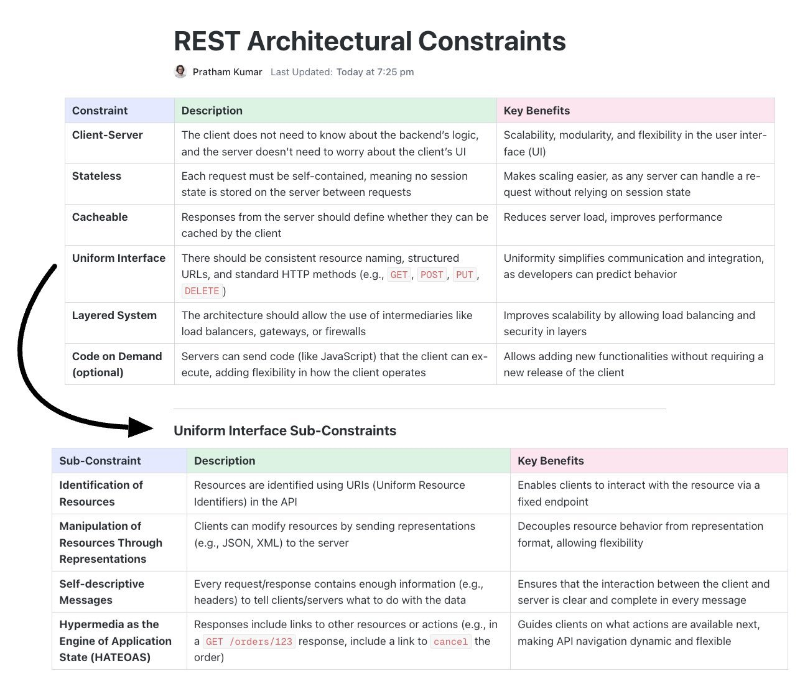

**Source:** [https://twitter.com/i/web/status/1869403892007710750](https://twitter.com/i/web/status/1869403892007710750)
**Original Post Date:** 2025-05-28 07:01:15

# REST Architectural Constraints: Core Principles for Building Scalable APIs

## Introduction
This article explores the fundamental architectural constraints of REST (Representational State Transfer), which define how scalable and interoperable networked applications should be designed. Understanding these principles is crucial for building robust APIs that can evolve over time while maintaining performance and reliability.

The REST architecture, originally proposed by Roy Fielding, provides a set of constraints that guide the design of modern web services. This article breaks down each constraint with practical explanations and benefits.

## Main REST Architectural Constraints

REST defines six primary architectural constraints that work together to ensure system scalability, performance, and flexibility:

The client-server separation principle ensures that clients can evolve independently from the server backend. This modularity allows for scalable deployments where different versions of APIs can coexist.

Statelessness is a core constraint requiring each request to contain all necessary information. No session state is maintained on the server between requests, which significantly simplifies horizontal scaling.

- Client-Server: Enables independent evolution of client and server components
- Stateless: Ensures scalability through self-contained requests
- Cacheable: Improves performance by reducing unnecessary server calls
- Uniform Interface: Provides consistency in resource interaction patterns
- Layered System: Supports security, load balancing, and intermediary services

> **Note/Tip:** Consider statelessness as a requirement for distributed systems where multiple servers handle requests.

## Uniform Interface Sub-Constraints

The Uniform Interface constraint breaks down into four sub-constraints that define how resources should be identified and manipulated:

Resource identification through URIs ensures consistent endpoints, while self-descriptive messages guarantee complete information exchange between client and server.

- Identification of Resources: Use meaningful URIs to represent resources
- Manipulation via Representations: Send standardized formats (JSON/XML) for data transfer
- Self-Descriptive Messages: Include all necessary metadata in requests and responses
- HATEOAS: Embed links to related resources for dynamic API navigation

> **Note/Tip:** Implement HATEOAS by including appropriate hypermedia controls in your API responses.

> **Note/Tip:** Use standard HTTP methods (GET, POST, PUT, DELETE) consistently across all endpoints.

## Key Takeaways

- REST architectural constraints are not optional guidelines but fundamental principles for building scalable web services
- Statelessness and caching are critical for handling high traffic loads in distributed systems
- The uniform interface provides a consistent pattern for resource interaction, reducing client complexity

## Conclusion
Understanding and properly implementing REST architectural constraints is essential for creating APIs that scale effectively. By following these principles, developers can build robust, maintainable services that evolve alongside their applications.

Each constraint serves a specific purpose in the overall architecture, from enabling scalability to improving performance through caching.

## External References

- [Fielding's Dissertation on REST](https://www.ics.uci.edu/~fielding/pubs/dissertation/rest_arch_style.htm)
- [REST API Design Rulebook](https://restfulapi.net/)

## Media

**Image Description:** The image is a detailed table summarizing the **REST Architectural Constraints** and their sub-constraints, along with descriptions and key benefits. REST (Representational State Transfer) is an architectural style for designing networked applications, particularly web services. The table is organized into two main sections: 

1. **Main REST Architectural Constraints**
2. **Uniform Interface Sub-Constraints**

### **Main REST Architectural Constraints**

The table lists six core constraints of REST, along with their descriptions and key benefits:

#### **1. Client-Server**
- **Description**: The client does not need to know about the backend's logic, and the server doesn't need to worry about the client's UI.
- **Key Benefits**: Scalability, modularity, and flexibility in the user interface (UI).

#### **2. Stateless**
- **Description**: Each request must be self-contained, meaning no session state is stored on the server between requests.
- **Key Benefits**: Makes scaling easier, as any server can handle a request without relying on session state.

#### **3. Cacheable**
- **Description**: Responses from the server should define whether they can be cached by the client.
- **Key Benefits**: Reduces server load, improves performance.

#### **4. Uniform Interface**
- **Description**: There should be consistent resource naming, structured URLs, and standard HTTP methods (e.g., `GET`, `POST`, `PUT`, `DELETE`).
- **Key Benefits**: Uniformity simplifies communication and integration, as developers can predict behavior.

#### **5. Layered System**
- **Description**: The architecture should allow the use of intermediaries like load balancers, gateways, or firewalls.
- **Key Benefits**: Improves scalability by allowing load balancing and security in layers.

#### **6. Code on Demand (Optional)**
- **Description**: Servers can send code (like JavaScript) that the client can execute, adding flexibility in how the client operates.
- **Key Benefits**: Allows adding new functionalities without requiring a new release of the client.

### **Uniform Interface Sub-Constraints**

The table further breaks down the **Uniform Interface** constraint into five sub-constraints, each with a description and key benefits:

#### **1. Identification of Resources**
- **Description**: Resources are identified using URIs (Uniform Resource Identifiers) in the API.
- **Key Benefits**: Enables clients to interact with the resource via a fixed endpoint.

#### **2. Manipulation of Resources Through Representations**
- **Description**: Clients can modify resources by sending representations (e.g., JSON, XML) to the server.
- **Key Benefits**: Decouples resource behavior from representation format, allowing flexibility.

#### **3. Self-Descriptive Messages**
- **Description**: Every request/response contains enough information (e.g., headers) to tell clients/servers what to do with the data.
- **Key Benefits**: Ensures that the interaction between the client and server is clear and complete in every message.

#### **4. Hypermedia as the Engine of Application State (HATEOAS)**
- **Description**: Responses include links to other resources or actions (e.g., in a `GET /orders/123` response, include a link to `cancel` the order).
- **Key Benefits**: Guides clients on what actions are available next, making API navigation dynamic and flexible.

### **Visual Layout and Formatting**
- The table is neatly organized into columns: **Constraint/Sub-Constraint**, **Description**, and **Key Benefits**.
- The **Main REST Architectural Constraints** and **Uniform Interface Sub-Constraints** are clearly separated.
- The **Uniform Interface Sub-Constraints** are highlighted with a black arrow pointing to them, emphasizing their importance.
- The table uses color coding for headers:
  - **Constraint/Sub-Constraint** column: Light blue.
  - **Description** column: Light green.
  - **Key Benefits** column: Light pink.
- The text is clear and concise, with technical terms like "HATEOAS" and HTTP methods (e.g., `GET`, `POST`, `PUT`, `DELETE`) highlighted in bold or color for emphasis.

### **Additional Notes**
- The document is attributed to **Pratham Kumar** and was last updated today at 7:25 pm.
- The **Code on Demand** constraint is marked as **(optional)**, indicating it is not a mandatory part of REST but can be used for added flexibility.

### **Summary**
The image provides a comprehensive overview of the REST architectural constraints, emphasizing the importance of the **Uniform Interface** and its sub-constraints. It highlights how these constraints contribute to scalability, modularity, performance, and flexibility in API design. The use of clear descriptions and key benefits makes it an excellent reference for understanding REST principles.
