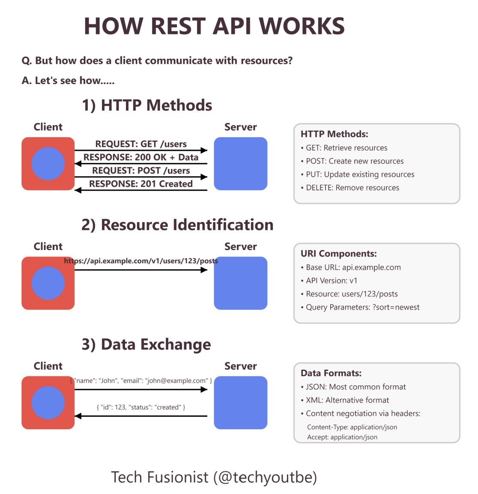

**Source:** [https://twitter.com/i/web/status/1913940027144376406](https://twitter.com/i/web/status/1913940027144376406)
**Original Post Date:** 2025-07-15 12:07:17

# Understanding REST API Fundamentals: HTTP Methods, Resource Identification, and Data Exchange

## Introduction
RESTful APIs are a cornerstone of modern web services, enabling seamless communication between clients and servers. This guide breaks down the fundamental aspects of how REST APIs operate, focusing on three key areas: HTTP methods for performing CRUD operations, resource identification through URIs, and data exchange mechanisms including formats like JSON and XML.

## HTTP Methods

REST APIs utilize standard HTTP methods to perform Create, Read, Update, and Delete (CRUD) operations on resources. These methods define the action to be performed on a resource.

The primary HTTP methods used in REST APIs include GET for retrieving resources, POST for creating new resources, PUT for updating existing resources, and DELETE for removing resources.

- GET: Retrieve resources from the server.
- POST: Create new resources on the server.
- PUT: Update existing resources on the server.
- DELETE: Remove resources from the server.

> **Note/Tip:** Ensure that your API endpoints correctly implement these HTTP methods to maintain consistency and predictability in client-server interactions.

## Resource Identification

Resources in a REST API are uniquely identified using URIs (Uniform Resource Identifiers). A well-structured URI helps clients understand the resource they are interacting with.

A typical URI consists of several components, including the base URL, API version, resource path, and optional query parameters for filtering or sorting.

- Base URL: The root address of your API (e.g., api.example.com).
- API Version: Specifies the version of the API being used (e.g., v1).
- Resource Path: Identifies the specific resource or collection of resources (e.g., users/123/posts).
- Query Parameters: Optional parameters for filtering, sorting, or modifying the response (e.g., ?sort=newest).

> **Note/Tip:** Design URIs to be intuitive and consistent. Avoid using verbs in resource paths; instead, use nouns that represent the resources.

## Data Exchange

Data exchange between clients and servers in REST APIs is typically done using structured data formats like JSON or XML.

Content negotiation allows clients to specify the format they prefer for receiving data, while the Content-Type header indicates the format of the sent data.

- JSON: A lightweight and widely used data interchange format.
- XML: An alternative format that is more verbose but supports complex structures.
- Content-Type Header: Specifies the media type of the resource (e.g., application/json).
- Accept Header: Indicates the preferred response format for the client (e.g., application/json).

> **Note/Tip:** Use JSON as your primary data format due to its simplicity and widespread adoption. Ensure that your API supports content negotiation to accommodate different client preferences.

## Key Takeaways

- Understand the role of HTTP methods in performing CRUD operations on resources.
- Design URIs that are intuitive, consistent, and resource-oriented.
- Utilize JSON for data exchange due to its simplicity and broad compatibility.
- Implement content negotiation to support various data formats and client preferences.

## Conclusion
By understanding these fundamental concepts—HTTP methods, resource identification, and data exchange—you can design and implement RESTful APIs that are efficient, scalable, and user-friendly. Always prioritize clarity and consistency in your API design to ensure a seamless experience for both developers and end-users.

## External References

- [MDN Web Docs on HTTP Methods](https://developer.mozilla.org/en-US/docs/Web/HTTP/Methods)
- [REST API Tutorial by IBM Cloud Education](https://cloud.ibm.com/docs/tutorials?topic=api-rest-apis)

## Media

**Image Description:** The image is a detailed infographic titled **"HOW REST API WORKS"**. It explains the fundamental concepts of how a REST API operates, focusing on three main aspects: **HTTP Methods**, **Resource Identification**, and **Data Exchange**. Below is a detailed breakdown of the image:

---

### **1. HTTP Methods**
- **Title**: "1) HTTP Methods"
- **Description**: This section explains how clients interact with servers using HTTP methods to perform CRUD (Create, Read, Update, Delete) operations on resources.
- **Diagram**:
  - **Client**: Represented by a red square with a blue circle inside.
  - **Server**: Represented by a blue square.
  - **Communication**:
    - **GET Request**: The client sends a `GET /users` request to retrieve user data. The server responds with a `200 OK` status code and the requested data.
    - **POST Request**: The client sends a `POST /users` request to create a new user. The server responds with a `201 Created` status code.
- **List of HTTP Methods**:
  - **GET**: Retrieve resources.
  - **POST**: Create new resources.
  - **PUT**: Update existing resources.
  - **DELETE**: Remove resources.

---

### **2. Resource Identification**
- **Title**: "2) Resource Identification"
- **Description**: This section explains how resources are uniquely identified using URIs (Uniform Resource Identifiers).
- **Diagram**:
  - **Client**: Same red square with a blue circle.
  - **Server**: Same blue square.
  - **URI Example**: The client sends a request to `[https://api.example.com/v1/users/123/posts`.](https://api.example.com/v1/users/123/posts`.)
- **URI Components**:
  - **Base URL**: `api.example.com`
  - **API Version**: `v1`
  - **Resource**: `users/123/posts`
  - **Query Parameters**: `?sort=newest` (optional, used to sort the posts by the newest ones).

---

### **3. Data Exchange**
- **Title**: "3) Data Exchange"
- **Description**: This section explains how data is exchanged between the client and server, focusing on data formats and content negotiation.
- **Diagram**:
  - **Client**: Same red square with a blue circle.
  - **Server**: Same blue square.
  - **Data Exchange**:
    - The client sends a JSON object: `{ "name": "John", "email": "john@example.com" }`.
    - The server responds with a JSON object: `{ "id": 123, "status": "created" }`.
- **Data Formats**:
  - **JSON**: The most common format for data exchange.
  - **XML**: An alternative format.
- **Content Negotiation**:
  - **Content-Type**: Specifies the format of the data being sent. For example, `application/json`.
  - **Accept**: Specifies the format the client expects to receive. For example, `application/json`.

---

### **Additional Notes**
- **Typography and Layout**:
  - The text is well-organized into sections with clear headings and bullet points.
  - The use of colors (red for the client and blue for the server) helps differentiate between the two entities.
  - The repetition of the title "HOW REST API API API WORKS WORKS" at the top is likely a typographical error.

- **Visual Elements**:
  - The use of arrows indicates the direction of communication between the client and server.
  - The inclusion of status codes (`200 OK`, `201 Created`) provides insight into the HTTP response structure.

- **Footer**:
  - The infographic is credited to **Tech Fusionist (@techyoututbe)**, though the handle appears to have a typo.

---

### **Summary**
The infographic effectively breaks down the core concepts of REST APIs into three main components:
1. **HTTP Methods**: How clients interact with servers using standard HTTP verbs.
2. **Resource Identification**: How resources are uniquely identified using URIs.
3. **Data Exchange**: How data is formatted and negotiated between the client and server.

This visual guide is educational and provides a clear, step-by-step explanation of REST API functionality.
