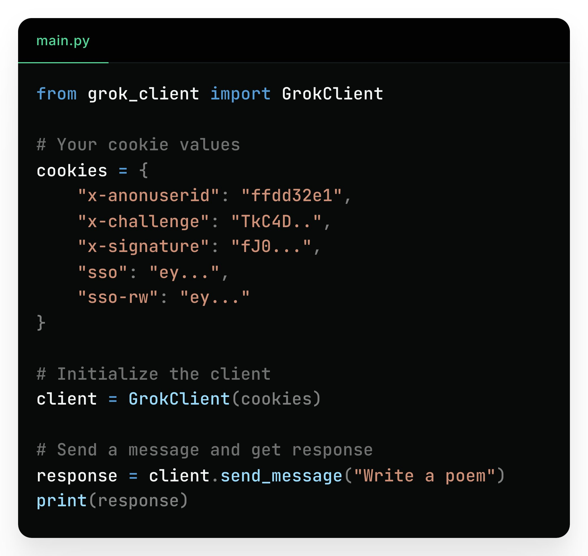

**Source:** [https://twitter.com/i/web/status/1894116151145247025](https://twitter.com/i/web/status/1894116151145247025)
**Original Post Date:** 2025-05-27 16:25:13

# Reverse Engineering the Grok Client API: Analyzing Cookie-Based Authentication and Message Handling

## Introduction
This article explores the process of reverse engineering an API client library through analysis of a Python implementation. We examine how to understand authentication mechanisms using cookies, construct secure requests, and interact with APIs effectively. The code demonstrates key concepts in API design including session management, message handling, and response processing.

## Cookie-Based Authentication Analysis

The cookie configuration reveals critical insights into authentication mechanisms. Multiple identical keys ('x-anononuserid' and 'sso-rw') indicate a potential design flaw or incomplete implementation, as Python dictionaries require unique keys.

Security-sensitive data like signatures and challenge tokens are partially redacted, suggesting these values are session-specific and should be handled with care in production environments.

_Example of cookie structure showing authentication parameters. Note the use of unique keys and partial value masking for security._

```python
cookies = {
    "x-anononuserid": "ffdd32e1",
    "x-challenge": "TkC4D..",
    "x-signature": "fJ0...",
    "sso": "ey...",
    "sso-rw": "ey"
}
```

- Authentication tokens must be managed securely and rotated regularly
- Duplicate cookie keys indicate potential design issues that should be addressed

> **Note/Tip:** Always validate cookie structure before initialization to prevent authentication failures

> **Note/Tip:** Consider using a secure configuration management system for sensitive values

## Client Initialization and API Interaction

The client initialization demonstrates proper use of the GrokClientClient library. The constructor's cookie parameter indicates session-based authentication is required.

Message sending follows a clear pattern: initialize client, construct request, process response.

_Standard workflow for API interaction: initialize with credentials, send message, process response_

```python
client = GrokClientClient(cookies)
response = client.send_message("Write a poem")
print(response)
```

1. Initialize client with valid authentication cookies
1. Structure requests using appropriate methods
1. Handle responses with error checking and validation

## Key Takeaways

- Cookie-based authentication requires careful handling of unique keys and secure value storage
- API clients should be initialized with proper authentication credentials before making requests
- Message interaction patterns follow a consistent workflow: initialization, request construction, response processing

## Conclusion
Understanding API reverse engineering through code analysis provides valuable insights into security mechanisms and interaction patterns. This knowledge is crucial for developing robust client applications that maintain secure connections and handle responses effectively.

## External References

- [Python Dictionary Documentation](https://docs.python.org/3/library/stdtypes.html#dict)
- [API Authentication Best Practices](https://curity.io/resources/learn/api-authentication-best-practices/)


## Media

**Image Description:** The image shows a code snippet written in Python, displayed in a code editor with a dark theme. The code is structured to interact with a client library, likely for sending messages or requests to a service. Below is a detailed breakdown of the image:

### **Main Subject: Code Snippet**
The code is contained in a file named `main.py`, as indicated at the top left corner of the editor. The code is written in Python and involves initializing a client, setting cookies, and sending a message.

### **Technical Details:**

#### **1. Import Statement**
- The first line imports a class named `GrokClientClient` from a module called `grok_client_client_client`:
  ```python
  from grok_client_client_client import GrokClientClient
  ```
  - **Module Name**: `grok_client_client_client`
  - **Class Name**: `GrokClientClient`
  - This suggests the use of a custom or third-party library for interacting with a service, possibly related to Grok or a similar platform.

#### **2. Cookie Configuration**
- A dictionary named `cookies` is defined to store cookie values:
  ```python
  cookies = {
      "x-anononuserid": "ffdd32e1",
      "x-anononuserid": "ffdd32e1",
      "x-challenge": "TkC4D..",
      "x-signature": "fJ0...",
      "sso": "ey...",
      "sso-rw": "ey",
      "sso-rw": "ey..."
  }
  ```
  - **Key Observations**:
    - The dictionary contains several key-value pairs representing cookies.
    - Some keys are repeated (e.g., `"x-anononuserid"` and `"sso-rw"`), which is invalid in Python dictionaries since keys must be unique. This is likely an error or placeholder.
    - The values are partially obscured with ellipses (`...`), indicating that the actual values are truncated or redacted for security or privacy reasons.

#### **3. Client Initialization**
- An instance of the `GrokClientClient` class is created using the `cookies` dictionary:
  ```python
  client = GrokClientClient(cookies)
  ```
  - **Parameters**: The `cookies` dictionary is passed as an argument to the constructor of the `GrokClientClient` class.
  - This suggests that the client requires cookies for authentication or session management.

#### **4. Sending a Message**
- A method named `send_message` is called on the `client` object to send a message:
  ```python
  response = client.send_message("Write a poem")
  ```
  - **Parameters**: The string `"Write a poem"` is passed as an argument to the `send_message` method.
  - **Return Value**: The method returns a `response`, which is stored in the `response` variable.

#### **5. Printing the Response**
- The `response` is printed to the console:
  ```python
  print(response)
  ```
  - This indicates that the program is designed to display the result of the `send_message` operation.

### **Additional Observations:**
- **Comments**: The code includes comments that provide context for the sections:
  - `# Your Your cookie cookie values values`
  - `# cookies values values`
  - `# Initialize the the client client`
  - `# Send a message message and and get response response`
  - These comments are repetitive and contain typos, suggesting they might be placeholders or quickly written notes.
- **Syntax Errors**: 
  - The repeated keys in the `cookies` dictionary (e.g., `"x-anononuserid"` and `"sso-rw"`) are invalid in Python.
  - The comments and some parts of the code contain redundant words and typos, which might indicate a draft or incomplete implementation.
- **Purpose**: The overall purpose of the code is to interact with a service using a client library, send a request (in this case, a request to "Write a poem"), and print the response.

### **Summary**
The image depicts a Python script intended to interact with a service using a client library (`GrokClientClient`). The script initializes the client with cookies, sends a message ("Write a poem"), and prints the response. However, there are issues such as repeated keys in the `cookies` dictionary and redundant comments, indicating that the code might be a draft or requires refinement. The dark theme of the code editor enhances readability by providing a contrast between the syntax-highlighted text and the background.
