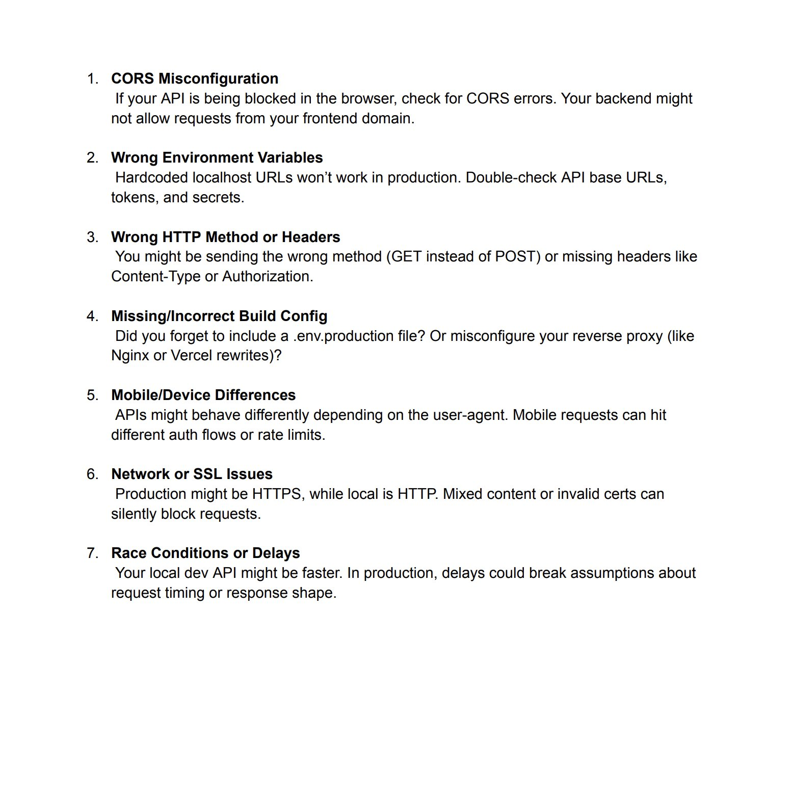

**Source:** [https://twitter.com/i/web/status/1946278660773748911](https://twitter.com/i/web/status/1946278660773748911)
**Original Post Date:** 2025-07-20 09:23:24

# API Error Handling Best Practices: Common Deployment and Testing Issues

## Introduction
When transitioning from development to production environments, APIs often encounter a variety of issues that can disrupt functionality. This guide outlines seven common challenges and provides actionable solutions to ensure smooth deployment and testing. By addressing these issues proactively, developers can minimize downtime and enhance the reliability of their APIs.

## 1. CORS Misconfiguration

Cross-Origin Resource Sharing (CORS) errors occur when the backend does not allow requests from the frontend domain, leading to blocked API calls in browsers.

- Check for CORS errors and ensure the backend is properly configured to allow requests from the frontend domain.
- Configure CORS headers on the server to specify allowed origins, methods, and headers.

> **Note/Tip:** Always test API endpoints with different domains to ensure CORS policies are correctly enforced.

## 2. Wrong Environment Variables

Hardcoded localhost URLs in the code will not work in production environments, leading to failed requests or incorrect behavior.

- Replace hardcoded localhost URLs with environment variables (e.g., `.env` files) to manage different configurations for development and production.
- Double-check API base URLs, tokens, and secrets in the environment variables to ensure they are correctly set for the production environment.

> **Note/Tip:** Use tools like `dotenv` or similar libraries to manage environment variables securely.

## 3. Wrong HTTP Method or Headers

Sending the wrong HTTP method (e.g., GET instead of POST) or missing required headers can cause API requests to fail or behave unexpectedly.

- Ensure the correct HTTP method is used for each endpoint.
- Include all required headers, such as `Content-Type` and `Authorization`.

> **Note/Tip:** Review API documentation to confirm the expected HTTP methods and headers for each endpoint.

## 4. Missing/Incorrect Build Config

Missing or misconfigured build configurations can lead to deployment issues, such as missing environment files or incorrect reverse proxy settings.

- Verify that all necessary build configuration files (e.g., `.env.production`) are included and correctly set up.
- Check reverse proxy configurations (e.g., Nginx or Vercel rewrites) to ensure they are properly routing requests.

> **Note/Tip:** Automate build configuration checks using CI/CD pipelines to catch issues early in the deployment process.

## 5. Mobile/Device Differences

APIs may behave differently based on the user-agent, especially in mobile environments, leading to inconsistent behavior or errors.

- Test APIs across different devices and user-agents to ensure consistent behavior.
- Implement device-specific logic if necessary (e.g., different authentication flows for mobile vs. desktop).

> **Note/Tip:** Use tools like BrowserStack or Sauce Labs to test API behavior across various devices and browsers.

## 6. Network or SSL Issues

Network or SSL (Secure Sockets Layer) problems can block requests, especially when transitioning from HTTP in development to HTTPS in production.

- Ensure SSL certificates are valid and up-to-date.
- Avoid mixed content issues by ensuring all resources are loaded over HTTPS in production environments.

> **Note/Tip:** Use tools like `openssl` or online SSL checkers to verify certificate validity and configuration.

## 7. Race Conditions or Delays

Delays in production can break assumptions about request timing or response shape, leading to race conditions or unexpected behavior.

- Test APIs in production-like environments to account for delays and ensure robustness.
- Implement retry logic and timeouts to handle transient failures gracefully.

> **Note/Tip:** Use tools like `Postman` or `Newman` to simulate production conditions during testing.

## Key Takeaways

- Always test APIs with different domains and user-agents to ensure CORS policies are correctly enforced.
- Replace hardcoded localhost URLs with environment variables to manage configurations for development and production.
- Ensure the correct HTTP method is used and that all required headers are included in API requests.
- Verify build configuration files and reverse proxy settings before deployment.
- Test APIs across different devices and user-agents to ensure consistent behavior.
- Ensure SSL certificates are valid and avoid mixed content issues in production environments.
- Test APIs in production-like environments to account for delays and implement retry logic for robustness.

## Conclusion
By addressing these common API deployment and testing issues proactively, developers can minimize downtime and enhance the reliability of their APIs. Regular testing across different environments and devices ensures consistent behavior and performance.

## External References

- [MDN Web Docs on CORS](https://developer.mozilla.org/en-US/docs/Web/HTTP/CORS)
- [Environment Variables in Node.js](https://nodejs.org/api/process.html#process_env)

## Media

**Image Description:** The image is a document containing a list of common issues that can arise when deploying or testing APIs, particularly when transitioning from development to production environments. The text is formatted in a numbered list, with each item describing a specific problem and providing guidance on how to address it. Below is a detailed breakdown of the content:

---

### **Main Subject**
The main subject of the image is a checklist of **common API deployment and testing issues**, along with explanations and troubleshooting tips. The list is organized into seven numbered points, each addressing a different technical challenge.

---

### **Technical Details and Content Breakdown**

#### **1. CORS Misconfiguration**
- **Description**: This issue occurs when the API is blocked in the browser due to Cross-Origin Resource Sharing (CORS) errors.
- **Details**: 
  - CORS errors happen when the backend does not allow requests from the frontend domain.
  - The backend might need to be configured to accept requests from specific origins.
- **Solution**: Check for CORS errors and ensure the backend is properly configured to allow requests from the frontend domain.

#### **2. Wrong Environment Variables**
- **Description**: Hardcoded localhost URLs in the code will not work in production environments.
- **Details**:
  - Localhost URLs (e.g., `[http://localhost:3000`)](http://localhost:3000`)) are typically used in development but must be replaced with production URLs.
  - Environment variables (e.g., `.env` files) should be used to manage different configurations for development and production.
- **Solution**: Double-check API base URLs, tokens, and secrets in the environment variables to ensure they are correctly set for the production environment.

#### **3. Wrong HTTP Method or Headers**
- **Description**: Sending the wrong HTTP method (e.g., `GET` instead of `POST`) or missing required headers can cause issues.
- **Details**:
  - Common headers include `Content-Type` and `Authorization`.
  - Using the wrong method or missing headers can lead to API requests failing.
- **Solution**: Ensure the correct HTTP method is used and that all required headers are included in the request.

#### **4. Missing/Incorrect Build Config**
- **Description**: Issues can arise from missing or misconfigured build configurations.
- **Details**:
  - A `.env.production` file might be required but forgotten.
  - Misconfiguring a reverse proxy (e.g., Nginx or Vercel rewrites) can also cause problems.
- **Solution**: Verify that all necessary build configuration files are included and correctly set up.

#### **5. Mobile/Device Differences**
- **Description**: APIs may behave differently based on the user-agent, especially in mobile environments.
- **Details**:
  - Mobile requests might trigger different authentication flows or rate limits.
  - User-agent-specific behaviors can lead to unexpected issues.
- **Solution**: Test APIs across different devices and user-agents to ensure consistent behavior.

#### **6. Network or SSL Issues**
- **Description**: Network or SSL (Secure Sockets Layer) problems can block requests.
- **Details**:
  - Production environments often use HTTPS, while local environments use HTTP.
  - Mixed content (e.g., loading HTTP resources on an HTTPS page) or invalid SSL certificates can silently block requests.
- **Solution**: Ensure SSL certificates are valid and that there is no mixed content in the production environment.

#### **7. Race Conditions or Delays**
- **Description**: Delays in production can break assumptions about request timing or response shape.
- **Details**:
  - Local development environments are often faster than production environments.
  - Delays in production can lead to race conditions or unexpected behavior.
- **Solution**: Test APIs in production-like environments to account for delays and ensure robustness.

---

### **Formatting and Structure**
- The document is structured as a numbered list, making it easy to follow.
- Each item includes a brief description of the issue and a more detailed explanation of the problem and solution.
- The text is clear and concise, aimed at developers or engineers working with APIs.

---

### **Visual Elements**
- The text is black on a white background, ensuring high readability.
- There are no images, charts, or additional visual elements; the focus is purely on the textual content.

---

### **Overall Purpose**
The document serves as a troubleshooting guide for developers encountering issues when deploying or testing APIs. It highlights common pitfalls and provides actionable steps to resolve them, making it a practical resource for anyone working with API development and deployment.
