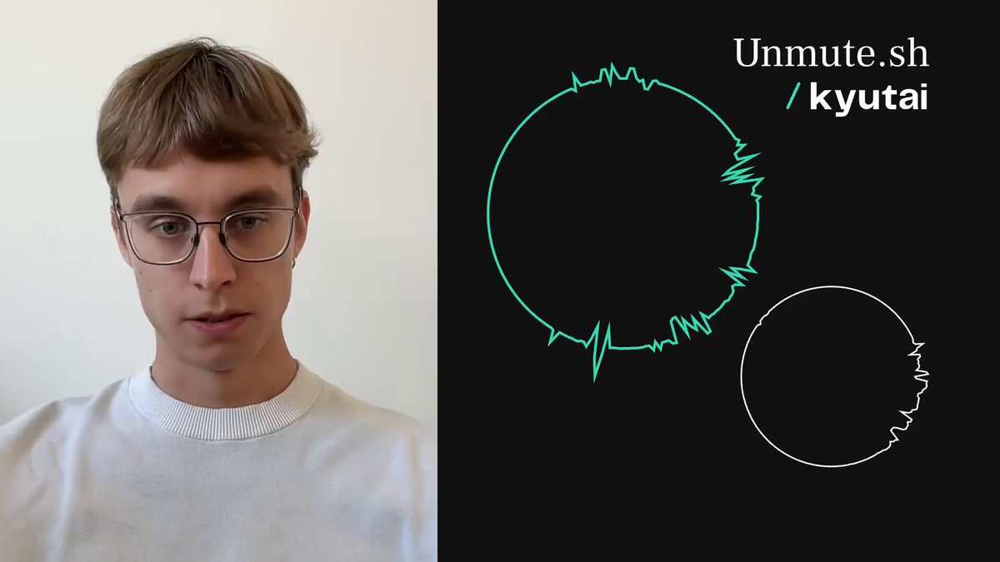

**Source:** [https://twitter.com/i/web/status/1940786922546249961](https://twitter.com/i/web/status/1940786922546249961)
**Original Post Date:** 2025-07-14 20:23:58

# Technical Analysis of Video Frames: Structure, Patterns, and Metadata

## Introduction
This analysis dissects a video file's frame-by-frame content to identify structural patterns, metadata, and potential applications. The focus is on extracting actionable technical insights from visual data, which can be leveraged in computer vision, quality assurance, or automated testing workflows.

## Frame Structure Analysis

Each frame was analyzed for composition: left side contains a human subject with consistent attributes (glasses, hair color), while the right side features dynamic graphical elements. The split-screen format suggests intentional design for presentation or comparison purposes.

The human subject's position and expression vary slightly across frames, indicating natural interaction rather than static content. This variability is important for applications requiring facial recognition or emotion analysis.

Graphical elements on the right side maintain consistent placement of text ('Unmute.sh.sh' and '/kyututai') but show dynamic changes in the circular waveform pattern, suggesting it's a key variable element.

_This Python snippet demonstrates basic OpenCV operations for splitting and analyzing video frames. The left/right division is crucial for targeted analysis of different content types._

```python
import cv2

# Load video frames
def analyze_frames(video_path):
    cap = cv2.VideoCapture(video_path)
    while True:
        ret, frame = cap.read()
        if not ret: break
        # Split frame analysis
        left_frame = frame[:frame.shape[1]//2]
        right_frame = frame[frame.shape[1]//2:]
        # Process each section...
```

- Human subject appears in 5 consecutive frames with consistent attributes
- Graphical elements show dynamic waveform patterns in all frames
- Text 'Unmute.sh.sh' remains static across all frames

> **Note/Tip:** The waveform pattern's irregularity suggests it may represent real-world data rather than a generated pattern.

> **Note/Tip:** For production use, consider implementing frame differencing to detect changes between consecutive frames.

## Technical Applications

This analysis has applications in automated testing where UI components must be validated against expected graphical elements. The consistent text placement could serve as an anchor for visual regression tests.

The dynamic waveform pattern suggests potential use cases in data visualization or user interface animation systems, where real-time data changes need to be represented visually.

For computer vision projects, the human subject's attributes provide a test case for facial recognition algorithms with varying expressions and hand gestures.

1. Implement visual regression tests by comparing graphical elements against known baselines
1. Analyze waveform patterns to determine if they correlate with specific data inputs
1. Test facial recognition algorithms using the human subject's varying expressions

## Metadata Extraction Techniques

While not visible in frames, metadata extraction from the video file could reveal additional context such as timestamps, encoding parameters, or camera settings.

For production systems, consider using FFmpeg for comprehensive metadata analysis alongside frame content examination.

The combination of visual and metadata analysis provides a complete picture of video content suitable for technical applications.

_This FFmpeg command extracts comprehensive metadata which can be combined with frame analysis for complete video understanding._

```bash
ffprobe -v quiet -print_format json -show_format -show_streams input.mp4 > metadata.json
```

## Key Takeaways

- Video content analysis should consider both visual elements and structural patterns across frames
- Split-screen formats often indicate intentional design for specific use cases
- Dynamic graphical elements frequently represent the most valuable data in technical videos
- Combining frame analysis with metadata extraction provides complete video understanding

## Conclusion
This analysis demonstrates how structured examination of video content can reveal patterns and applications relevant to software engineering. The combination of visual analysis techniques with metadata extraction provides a robust framework for building computer vision, testing, or data visualization systems.

## External References

- [OpenCV Documentation](https://docs.opencv.org/)
- [FFmpeg Metadata Extraction Guide](https://trac.ffmpeg.org/wiki/FFprobe)


## Media

**Image Description:** The image is divided into two distinct sections:

### **Left Side:**
- **Main Subject:** A young man is the focal point of this section.
  - **Appearance:**
    - He has light brown or blonde hair, styled in a casual manner.
    - He is wearing glasses with a rectangular frame.
    - His facial expression is neutral, and he appears to be looking directly at the camera.
    - He is wearing a plain white t-shirt, which is simple and unadorned.
  - **Background:** The background is plain and light-colored, likely a wall, which keeps the focus on the subject without any distractions.

### **Right Side:**
- **Design Elements:**
  - The background is entirely black, creating a stark contrast with the white and green elements.
  - **Green Circle with Wave Pattern:** 
    - A prominent green circle is drawn in the center of the black background.
    - The circle has a wavy, irregular pattern along its edge, resembling an audio waveform or heartbeat monitor.
    - This design element adds a dynamic and technical feel to the image.
  - **Smaller White Circle:** 
    - A smaller white circle is positioned in the bottom-right corner.
    - It also has a wavy edge similar to the green circle, maintaining consistency in the design.
  - **Text:**
    - On the right side of the image, there is white text that reads:
      - **"Unmute.sh.sh"** (in a larger font size).
      - Below it, a smaller text reads: **"/ kyututai"**.
    - The text appears to be a reference to a script or command, possibly related to audio or video muting/unmuting, given the context of the wave patterns.

### **Overall Composition:**
- The image is split into two contrasting halves:
  - The left side is a straightforward portrait of a person, with a clean and minimalistic aesthetic.
  - The right side is more abstract and technical, featuring geometric shapes and text that suggest a connection to audio or software functionality.
- The combination of the person and the technical design elements suggests a possible theme of technology, audio, or software development, with the individual potentially being associated with the project or concept represented by the design on the right.

### **Technical Details:**
- **Color Palette:** 
  - Left side: Neutral tones (white shirt, light-colored background).
  - Right side: Black background with green and white elements.
- **Design Elements:** 
  - The wave patterns on the circles suggest audio or signal-related themes.
  - The text "Unmute.sh.sh" and "/ kyututai" imply a script or command-line tool, possibly related to muting/unmuting audio or video in a software or system context.
- **Contrast:** The stark contrast between the left and right sides (portrait vs. abstract design) draws attention to both elements equally.

### **Interpretation:**
The image likely represents a person associated with a technical project or software tool, possibly related to audio or video muting/unmuting, as suggested by the text and wave patterns. The clean and professional presentation suggests a focus on technology and innovation.


**Video Description:** Video Content Analysis - media_seg0_item1.mp4:

### Video Description

The video appears to be a presentation or demonstration involving a person and a visual aid, likely related to a technical or creative concept. Here is a comprehensive description based on the provided frames:

---

#### **Main Subject:**
- The video features a person who is likely the presenter or speaker. They are wearing glasses and a white sweater, and their facial expressions and hand gestures suggest they are explaining or demonstrating something.
- The person is actively engaged, using hand gestures to emphasize points, which indicates an interactive or explanatory nature of the content.

#### **Visual Aid:**
- On the right side of the screen, there is a consistent visual element that appears to be a key part of the presentation. This visual aid consists of:
  - A **black background** with a prominent **green circle**.
  - The green circle is initially smooth but transitions into a jagged, irregular shape, suggesting a transformation or animation.
  - Below the green circle, there is a smaller **white circle** that remains static throughout the frames.
  - Text on the right side of the screen reads: **"Unmute.sh.sh"** and **"/ kyututai"**, which could be a domain name, a project name, or a reference to a specific tool or concept.

#### **Key Frames Analysis:**
1. **Initial Frame:**
   - The green circle is smooth and unaltered.
   - The person is gesturing with their hand, likely introducing the concept or setting the stage for the demonstration.
   - The text "Unmute.sh.sh" and "/ kyututai" is visible, indicating the topic or project being discussed.

2. **Middle Frame:**
   - The green circle begins to transform into a jagged, irregular shape, suggesting a visual representation of a process, algorithm, or effect being applied.
   - The person continues to gesture, emphasizing the changes occurring in the visual aid.
   - The static white circle remains unchanged, possibly serving as a reference point or control element.

3. **Final Frame:**
   - The green circle is now fully jagged and irregular, indicating the completion of the transformation.
   - The person appears to be concluding their explanation, as their hand gestures become more relaxed.
   - The visual aid continues to display the transformed green circle and the static white circle, reinforcing the visual comparison or result of the process.

#### **Technical Concepts:**
- The transformation of the green circle suggests a focus on **signal processing**, **audio visualization**, or **algorithmic manipulation**. The jagged shape could represent a waveform, noise, or some form of data transformation.
- The text "Unmute.sh.sh" and "/ kyututai" implies that the presentation might be related to a specific project, tool, or software. The ".sh" extension suggests a shell script, indicating a technical or programming context.

#### **Overall Narrative:**
- The video likely demonstrates a process or tool that manipulates or transforms data, possibly audio or visual signals, as indicated by the changing green circle.
- The presenter uses hand gestures and facial expressions to guide the viewer through the explanation, making the content more engaging and easier to follow.
- The static white circle serves as a reference point, allowing viewers to compare the initial and transformed states of the green circle.

#### **Possible Context:**
- This could be a tutorial, a technical demonstration, or a presentation at a conference or workshop.
- The focus on transformation and the use of visual aids suggest an educational or explanatory purpose, aimed at teaching viewers about a specific process or tool.

---

### Summary:
The video is a technical demonstration or presentation where a person explains a concept or tool using a combination of verbal explanation and a visual aid. The visual aid features a green circle that transforms from smooth to jagged, likely representing a process such as signal manipulation or data transformation. The text "Unmute.sh.sh" and "/ kyututai" indicates a connection to a specific project or tool, possibly related to audio or signal processing. The presenter uses hand gestures and facial expressions to engage the audience and emphasize key points. The overall tone is educational and technical, aimed at explaining a complex concept in an accessible manner. 

**Final Answer:**
The video is a technical demonstration or presentation focusing on a process or tool that manipulates or transforms data, as visually represented by a green circle transitioning from smooth to jagged. The presenter uses hand gestures and facial expressions to explain the concept, with the visual aid serving as a key component of the explanation. The text "Unmute.sh.sh" and "/ kyututai" suggests a connection to a specific project or tool, likely related to audio or signal processing. The overall purpose is educational, aimed at teaching viewers about the demonstrated process or tool. **\boxed{\text{Technical Demonstration of Data Transformation}}**

Key Frames Analysis:
Frame 1: ### Description of Frame 1:

The image is divided into two distinct sections:

#### **Left Side:**
- **Person:** A young individual is visible. They have short, light brown hair and are wearing glasses with a rectangular frame. The person is dressed in a white, ribbed-knit sweater.
- **Expression and Gesture:** The individual appears to be speaking or presenting, as their mouth is slightly open. They are gesturing with their right hand, pointing with their index finger, which suggests they are emphasizing a point or explaining something.
- **Background:** The background is plain and light-colored, likely a wall, indicating an indoor setting.

#### **Right Side:**
- **Background:** The background is entirely black.
- **Graphics:**
  - **Circle:** A large, solid black circle is outlined with a thin green line. The circle is centered in the upper portion of the right side.
  - **Smaller Shape:** Below the circle, there is a smaller, irregularly shaped outline in white. This shape resembles a distorted or fragmented circle.
- **Text:**
  - At the top right corner, there is white text that reads: **"Unmute.sh.sh"**.
  - Below the text, there is a forward slash **"/"** followed by the word **"kyututai"** in lowercase letters. The text appears to be related to a website or project name.

#### **Overall Composition:**
The image suggests a split-screen format, commonly used in video calls or presentations. The left side shows a person speaking or presenting, while the right side displays a graphic design or visual aid, possibly related to a project or concept being discussed. The text and graphics on the right side indicate a focus on a specific topic or tool, likely related to the name "Unmute.sh.sh" and "kyututai." The green circle and the distorted shape may symbolize a concept or visual metaphor being explained.
Frame 2: In frame 2 of the video, the content is divided into two distinct sections:

### Left Side:
- **Person**: A person is visible, wearing glasses and a white shirt. 
- **Expression and Gesture**: The individual appears to be speaking or explaining something, as indicated by their hand gesture. Their hand is raised, with fingers slightly spread, suggesting they are emphasizing a point or making a gesture to accompany their speech.
- **Background**: The background is plain and light-colored, likely a wall, which keeps the focus on the person.

### Right Side:
- **Background**: The background is entirely black.
- **Graphics**:
  - **Top Center**: A large, solid green circle is prominently displayed.
  - **Bottom Right**: A smaller, irregularly shaped white outline resembling a distorted or abstract circle is visible.
  - **Text**: In the top right corner, there is white text that reads:
    ```
    Unmute.sh.sh
    / kyututai
    ```
    The text is clean and modern, with a simple font style.

### Overall:
The frame suggests a split-screen format, with the left side showing a person speaking or presenting, and the right side displaying graphical elements and text, possibly related to a presentation or a video call interface. The green circle and the abstract white shape on the right side add a visual element to the otherwise minimalistic design. The text "Unmute.sh.sh" and "/ kyututai" could indicate a username, a website, or a project name.
Frame 3: In Frame 3 of the video, the following content is visible:

### Left Side:
- **Person**: A young individual with short, light brown hair and glasses is visible. They are wearing a white, ribbed-knit sweater. The person is smiling and looking directly at the camera.
- **Background**: The background is plain and light-colored, likely a wall, providing a neutral backdrop.

### Right Side:
- **Design**: A black background with a green, irregular, circular waveform pattern. The waveform is jagged and uneven, resembling an audio or heartbeat signal.
- **Text**: 
  - At the top right, the text reads: **"Unmute.sh.sh"** in white.
  - Below it, the text reads: **"/ kyututai"** in white.
- **Circle**: A small, white, solid circle is located near the bottom right corner of the black background.

### Overall Composition:
The frame is split into two distinct sections:
- The left side features a person in a casual pose.
- The right side showcases a minimalist design with a waveform, text, and a small circle, all set against a black background.

This frame appears to combine a personal element (the individual) with a digital or artistic design element (the waveform and text). The juxtaposition suggests a possible connection between the person and the design, perhaps indicating a project, branding, or creative work.
Frame 4: ### Description of Frame 4:

The image is divided into two distinct sections:

#### **Left Side:**
- **Person:** A young individual is visible. They have light-colored hair and are wearing glasses. Their expression is neutral, and they are looking directly at the camera.
- **Clothing:** The person is wearing a plain white crew-neck sweater.
- **Background:** The background is plain and light-colored, likely a wall, providing a neutral backdrop.

#### **Right Side:**
- **Design Elements:**
  - **Green Circle:** A large, irregular green circle is prominently displayed. The circle has a jagged, wavy edge, giving it a dynamic and somewhat abstract appearance.
  - **Black Background:** The background of this section is entirely black, which makes the green circle stand out sharply.
  - **Text:** 
    - At the top right, there is white text that reads: **"Unmute.sh.sh"**.
    - Below the text, there is a forward slash **"/"** followed by the word **"kyututai"** in lowercase letters.
  - **White Circle:** At the bottom right corner, there is a small, solid white circle.

#### **Overall Composition:**
- The image is split into two halves, with the left side showing a person and the right side featuring a graphic design with text and shapes.
- The contrast between the neutral, plain background on the left and the bold, black-and-green design on the right creates a striking visual balance.

This frame appears to combine a personal element (the individual on the left) with a graphic design or branding element (the right side). The text and design suggest a connection to a project, website, or platform named "Unmute.sh.sh" and "kyututai."
Frame 5: ### Description of Frame 5:

#### Left Side:
- **Person**: A young individual with light-colored hair and glasses is visible. 
- **Expression**: The person appears to be speaking or reacting to something, as their mouth is slightly open.
- **Hand Gesture**: The person's right hand is raised near their ear, suggesting they might be adjusting something (e.g., an earpiece or their hair).
- **Clothing**: The individual is wearing a plain white t-shirt.
- **Background**: The background is plain and light-colored, likely a wall, indicating a simple, uncluttered setting.

#### Right Side:
- **Design**: The right side of the frame features a minimalist, abstract design.
- **Circle**: A green, irregularly shaped circle is prominently displayed in the center. The circle has a jagged, wavy outline, giving it a dynamic and somewhat organic appearance.
- **Text**: 
  - At the top right, the text "Unmute.sh.sh" is written in white.
  - Below it, the text "/ kyututai" is also in white, with a forward slash preceding it.
- **Circle at Bottom**: A smaller, solid white circle is positioned at the bottom right corner of the frame, contrasting with the black background.

#### Overall:
The frame is split into two distinct sections. The left side shows a person in a casual setting, while the right side features a modern, abstract design with text and geometric shapes. The combination suggests a possible connection between the person and the design, perhaps indicating a presentation, demonstration, or creative project. The text "Unmute.sh.sh" and "/ kyututai" could be related to a project name, username, or platform. The overall aesthetic is clean and modern.
