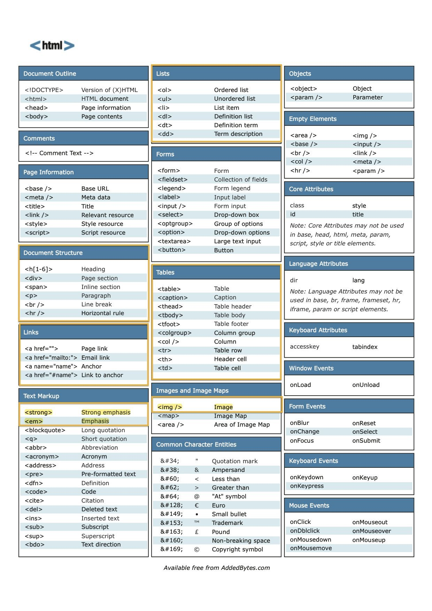
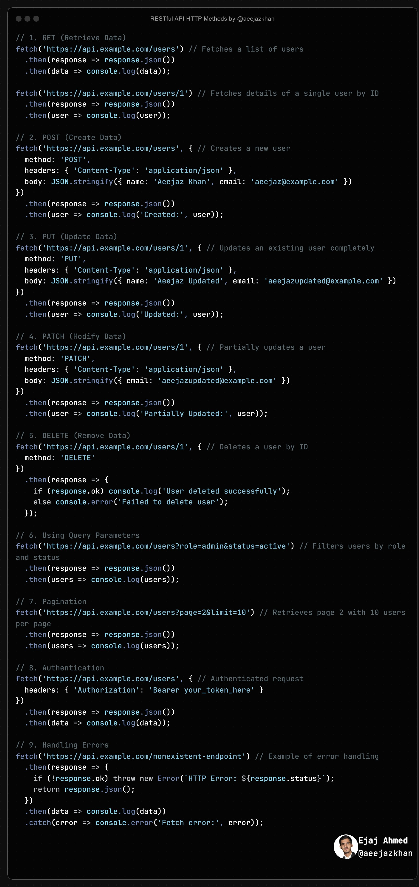

**Source:** [https://twitter.com/i/web/status/1869733233279279427](https://twitter.com/i/web/status/1869733233279279427)
**Original Post Date:** 2025-07-23 06:23:32

# Advanced PostgreSQL: Optimizing Write Performance with Connection Pooling

## Introduction
PostgreSQL is a powerful relational database that powers many mission-critical applications. However, as data volumes grow, write performance becomes increasingly important. This guide explores advanced techniques for optimizing PostgreSQL write operations, focusing on connection pooling strategies, efficient indexing approaches, and transaction management best practices. We'll cover practical implementations with code examples to help you achieve optimal performance in high-throughput environments.

## Understanding Write Performance Bottlenecks

Write performance in PostgreSQL can be bottlenecked by several factors including I/O contention, lock contention, and inefficient transaction handling. The most common bottleneck is disk I/O, especially when dealing with large write volumes.

Another significant factor is connection overhead. Each database connection requires memory allocation and network resources, which becomes problematic at scale.

- Disk I/O saturation from synchronous writes
- Lock contention in high-concurrency scenarios
- Inefficient transaction batching strategies

## Connection Pooling Strategies

Connection pooling is essential for optimizing write performance by reusing established database connections. This reduces the overhead of connection establishment and teardown during high write volumes.

_This Python example demonstrates creating a connection pool with PgBouncer and executing write operations. The pool maintains connections between requests._

```python
from psycopg2 import pool

# Create a connection pool
connection_pool = pool.ThreadedConnectionPool(
    minconn=5,
    maxconn=20,
    host='localhost',
    database='mydb'
)

# Get a connection from the pool
conn = connection_pool.getconn()
try:
    with conn.cursor() as cur:
        # Execute write operations
        cur.execute("""
            INSERT INTO users (name, email) VALUES (%s, %s)
        """, ('John Doe', 'john@example.com'))
finally:
    connection_pool.putconn(conn)
```

> **Note/Tip:** Always return connections to the pool after use

> **Note/Tip:** Monitor connection pool metrics for optimal sizing

> **Note/Tip:** Consider using PgBouncer for external connection pooling

## Efficient Indexing for Write Operations

While indexes are crucial for read performance, they can impact write operations. Each index requires additional I/O during insert/update operations.

The key is to balance between having enough indexes for query performance and not over-indexing which would degrade write performance.

1. Identify the most frequently queried columns
1. Create composite indexes instead of multiple single-column indexes where possible
1. Consider partial indexes for large tables

## Transaction Management Best Practices

Proper transaction management is critical for both performance and data integrity. Large transactions can lock resources for extended periods, causing contention.

_This SQL example shows how to batch inserts in smaller transactions. The optimal batch size depends on your specific workload and hardware._

```sql
-- Batch inserts in smaller transactions
BEGIN;
INSERT INTO users (name, email) VALUES ('User 1', 'user1@example.com');
INSERT INTO users (name, email) VALUES ('User 2', 'user2@example.com');
-- Commit after reasonable batch size
COMMIT;
```

## Conclusion
Optimizing PostgreSQL write performance requires a multi-faceted approach combining connection pooling, efficient indexing strategies, and proper transaction management. By implementing these techniques, you can significantly reduce I/O contention and improve overall system responsiveness.

## External References

- [PostgreSQL Official Documentation on Write Performance](https://www.postgresql.org/docs/current/performance-tips.html)
- [PgBouncer Connection Pooling Guide](https://pgbouncer.github.io/)


## Media

**Image Description:** This image is a comprehensive HTML reference sheet, designed to serve as a quick guide for developers and web designers working with HTML. The sheet is organized into multiple sections, each highlighting different aspects of HTML elements, attributes, and entities. Below is a detailed breakdown of the image:

### **Main Structure**
The reference sheet is divided into several columns and sections, each focusing on a specific category of HTML elements or attributes. The layout is clean and structured, making it easy to navigate.

### **Sections and Content**
1. **Document Outline**
   - **<!DOCTYPE>**: Defines the version of HTML or XHTML.
   - **<html>**: The root element of an HTML page.
   - **<head>**: Contains meta-information about the document.
   - **<body>**: Contains the content of the HTML document.

2. **Comments**
   - **<!-- Comment Text -->**: Used to insert comments in the HTML code.

3. **Page Information**
   - **<base>**: Sets the base URL for all relative URLs in a document.
   - **<meta>**: Defines metadata about an HTML document.
   - **<title>**: Defines the title of the document.
   - **<link>**: Defines the relationship between a document and an external resource (e.g., stylesheets).
   - **<style>**: Defines style information for a document.
   - **<script>**: Defines a client-side script.

4. **Document Structure**
   - **<h1> to <h6>**: Defines headings of different levels.
   - **<div>**: Defines a section in a document.
   - **<span>**: Defines a section in a document.
   - **<p>**: Defines a paragraph.
   - **<br />**: Inserts a line break.
   - **<hr />**: Defines a horizontal rule.

5. **Links**
   - **<a href="">**: Creates a hyperlink to another page.
   - **<a href="mailto:">**: Creates a hyperlink to send an email.
   - **<a name="">**: Defines an anchor point in a document.
   - **<a href="#name">**: Links to an anchor within the same page.

6. **Text Markup**
   - **<strong>**: Defines strong importance for its content.
   - **<em>**: Defines emphasized content.
   - **<blockquote>**: Defines a long quotation.
   - **<q>**: Defines a short quotation.
   - **<abbr>**: Defines an abbreviation or acronym.
   - **<address>**: Defines contact information for the author/owner of a document.
   - **<pre>**: Defines preformatted text.
   - **<dfn>**: Defines a term.
   - **<code>**: Defines a piece of computer code.
   - **<cite>**: Defines the title of a work.
   - **<del>**: Defines deleted text.
   - **<ins>**: Defines inserted text.
   - **<sub>**: Defines subscripted text.
   - **<sup>**: Defines superscripted text.
   - **<bdo>**: Defines the direction of text display.

7. **Lists**
   - **<ol>**: Defines an ordered list.
   - **<ul>**: Defines an unordered list.
   - **<li>**: Defines a list item.
   - **<dl>**: Defines a description list.
   - **<dt>**: Defines a term in a description list.
   - **<dd>**: Defines a description of a term in a description list.

8. **Objects**
   - **<object>**: Defines an embedded object.
   - **<param>**: Defines a parameter for an embedded object.

9. **Empty Elements**
   - ****: Defines an image.
   - **<base />**: Defines the base URL for all relative URLs in a document.
   - **<input />**: Defines an input field.
   - **<br />**: Inserts a line break.
   - **<link />**: Defines the relationship between a document and an external resource.
   - **<col />**: Defines column properties for columns within a <colgroup> element.
   - **<hr />**: Defines a horizontal rule.

10. **Forms**
    - **<form>**: Defines an HTML form for user input.
    - **<fieldset>**: Groups related elements in a form.
    - **<legend>**: Defines a caption for a <fieldset> element.
    - **<label>**: Defines a label for an <input> element.
    - **<input>**: Defines an input field.
    - **<select>**: Defines a drop-down list.
    - **<optgroup>**: Defines a group of related options in a drop-down list.
    - **<option>**: Defines an option in a drop-down list.
    - **<textarea>**: Defines a multi-line input field.
    - **<button>**: Defines a clickable button.

11. **Tables**
    - **<table>**: Defines a table.
    - **<caption>**: Defines a table caption.
    - **<thead>**: Groups the header content in a table.
    - **<tbody>**: Groups the body content in a table.
    - **<tfoot>**: Groups the footer content in a table.
    - **<colgroup>**: Specifies a group of one or more columns in a table.
    - **<col>**: Specifies column properties for columns within a <colgroup> element.
    - **<tr>**: Defines a row in a table.
    - **<th>**: Defines a header cell in a table.
    - **<td>**: Defines a cell in a table.

12. **Images and Image Maps**
    - ****: Defines an image.
    - **<map>**: Defines an image map.
    - **<area />**: Defines an area inside an image map.

13. **Common Character Entities**
    - A list of HTML character entities, such as:
      - `&amp;` for `&`
      - `&lt;` for `<`
      - `&gt;` for `>`
      - `&quot;` for `"`
      - `&copy;` for ©
      - `&reg;` for ®
      - `&trade;` for ™
      - `&euro;` for €
      - `&pound;` for £

14. **Core Attributes**
    - **class**: Specifies a style for an element.
    - **style**: Specifies an inline style for an element.
    - **id**: Specifies a unique id for an element.
    - **title**: Specifies extra information about an element.

15. **Language Attributes**
    - **lang**: Specifies the language of the element's content.
    - **dir**: Specifies the text direction for the content of an element.

16. **Keyboard Attributes**
    - **accesskey**: Specifies a shortcut key to activate/focus an element.
    - **tabindex**: Specifies the tab order of an element.

17. **Window Events**
    - **onLoad**: Triggered when the page has finished loading.
    - **onUnload**: Triggered when the page is being unloaded.

18. **Form Events**
    - **onBlur**: Triggered when an element loses focus.
    - **onReset**: Triggered when a form is reset.
    - **onChange**: Triggered when the value of an element is changed.
    - **onSelect**: Triggered when an element is selected.
    - **onFocus**: Triggered when an element gets focus.
    - **onSubmit**: Triggered when a form is submitted.

19. **Keyboard Events**
    - **onKeyDown**: Triggered when a key is pressed down.
    - **onKeyUp**: Triggered when a key is released.
    - **onKeyPress**: Triggered when a key is pressed and released.

20. **Mouse Events**
    - **onClick**: Triggered when an element is clicked.
    - **onMouseOut**: Triggered when the mouse pointer moves out of an element.
    - **onDblClick**: Triggered when an element is double-clicked.
    - **onMouseOver**: Triggered when the mouse pointer moves over an element.
    - **onMouseDown**: Triggered when the mouse button is pressed down over an element.
    - **onMouseUp**: Triggered when the mouse button is released over an element.
    - **onMouseMove**: Triggered when the mouse pointer is moved within an element.

### **Design and Layout**
- The sheet uses a grid layout with multiple columns to organize the information.
- Each section is color-coded and labeled for easy identification.
- The background is white, and the text is black, ensuring high readability.
- The HTML elements and attributes are clearly defined with their purposes.

### **Additional Notes**
- The sheet is titled with an HTML icon (`<html>`) at the top left corner.
- At the bottom, there is a note indicating that the sheet is available for free from **AddedBytes.com**.

### **Purpose**
This reference sheet is a valuable tool for developers and designers who need a quick reference to HTML elements, attributes, and events. It provides a concise summary of the most commonly used HTML components, making it an essential resource for both beginners and experienced professionals. 

### **Overall Impression**
The image is well-organized, visually appealing, and highly functional, serving as an efficient reference guide for HTML development.


**Image Description:** The image is a screenshot of a code snippet written in JavaScript, demonstrating the use of the Fetch API to interact with a RESTful API. The code is structured to illustrate various HTTP methods (GET, POST, PUT, PATCH, DELETE) and other common API interactions such as query parameters, pagination, authentication, and error handling. Below is a detailed breakdown:

---

### **Main Subject**
The main subject of the image is a JavaScript code snippet that demonstrates how to perform CRUD (Create, Read, Update, Delete) operations and other API interactions using the Fetch API. The code is well-commented and organized into sections, each corresponding to a specific API operation.

---

### **Technical Details**

#### **1. GET (Retrieve Data)**
- **Purpose**: Fetches a list of users or details of a single user.
- **Code**:
  ```javascript
  fetch('[https://api.example.com/users')](https://api.example.com/users'))
    .then(response => response.json())
    .then(data => console.log(data));
  ```
  - Retrieves all users from the API endpoint `/users`.
  - Converts the response to JSON and logs the data to the console.

  ```javascript
  fetch('[https://api.example.com/users/1')](https://api.example.com/users/1'))
    .then(response => response.json())
    .then(user => console.log(user));
  ```
  - Retrieves details of a single user with ID `1`.

#### **2. POST (Create Data)**
- **Purpose**: Creates a new user.
- **Code**:
  ```javascript
  fetch('[https://api.example.com/users',](https://api.example.com/users',) {
    method: 'POST',
    headers: { 'Content-Type': 'application/json' },
    body: JSON.stringify({ name: 'Aeejaz Khan', email: 'aeejaz@example.com' })
  })
  .then(response => response.json())
  .then(user => console.log('Created:', user));
  ```
  - Sends a POST request to create a new user with the provided `name` and `email`.
  - The request body is JSON-formatted.
  - Logs the created user to the console.

#### **3. PUT (Update Data)**
- **Purpose**: Updates an existing user completely.
- **Code**:
  ```javascript
  fetch('[https://api.example.com/users/1',](https://api.example.com/users/1',) {
    method: 'PUT',
    headers: { 'Content-Type': 'application/json' },
    body: JSON.stringify({ name: 'Aeejaz Updated', email: 'aeejazupdated@example.com' })
  })
  .then(response => response.json())
  .then(user => console.log('Updated:', user));
  ```
  - Sends a PUT request to update the user with ID `1` with new `name` and `email`.
  - Logs the updated user to the console.

#### **4. PATCH (Modify Data)**
- **Purpose**: Partially updates a user.
- **Code**:
  ```javascript
  fetch('[https://api.example.com/users/1',](https://api.example.com/users/1',) {
    method: 'PATCH',
    headers: { 'Content-Type': 'application/json' },
    body: JSON.stringify({ email: 'aeejazupdated@example.com' })
  })
  .then(response => response.json())
  .then(user => console.log('Partially Updated:', user));
  ```
  - Sends a PATCH request to update only the `email` of the user with ID `1`.
  - Logs the partially updated user to the console.

#### **5. DELETE (Remove Data)**
- **Purpose**: Deletes a user by ID.
- **Code**:
  ```javascript
  fetch('[https://api.example.com/users/1',](https://api.example.com/users/1',) {
    method: 'DELETE'
  })
  .then(response => {
    if (response.ok) console.log('User deleted successfully');
    else console.error('Failed to delete user');
  });
  ```
  - Sends a DELETE request to remove the user with ID `1`.
  - Checks the response status and logs success or failure accordingly.

#### **6. Using Query Parameters**
- **Purpose**: Filters users by role and status.
- **Code**:
  ```javascript
  fetch('[https://api.example.com/users?role=admin&status=active')](https://api.example.com/users?role=admin&status=active'))
    .then(response => response.json())
    .then(users => console.log(users));
  ```
  - Sends a GET request with query parameters to filter users by `role=admin` and `status=active`.
  - Logs the filtered users to the console.

#### **7. Pagination**
- **Purpose**: Retrieves a paginated list of users.
- **Code**:
  ```javascript
  fetch('[https://api.example.com/users?page=2&limit=10')](https://api.example.com/users?page=2&limit=10'))
    .then(response => response.json())
    .then(users => console.log(users));
  ```
  - Sends a GET request with pagination parameters to retrieve the second page with 10 users per page.
  - Logs the paginated users to the console.

#### **8. Authentication**
- **Purpose**: Sends an authenticated request.
- **Code**:
  ```javascript
  fetch('[https://api.example.com/users',](https://api.example.com/users',) {
    headers: { 'Authorization': 'Bearer your_token_here' }
  })
  .then(response => response.json())
  .then(data => console.log(data));
  ```
  - Sends a GET request with an `Authorization` header containing a Bearer token for authentication.
  - Logs the authenticated response data to the console.

#### **9. Handling Errors**
- **Purpose**: Demonstrates error handling for API requests.
- **Code**:
  ```javascript
  fetch('[https://api.example.com/nonexistent-endpoint')](https://api.example.com/nonexistent-endpoint'))
    .then(response => {
      if (!response.ok) throw new Error(`HTTP Error: ${response.status}`);
      return response.json();
    })
    .then(data => console.log(data))
    .catch(error => console.error('Fetch error:', error));
  ```
  - Sends a GET request to a non-existent endpoint.
  - Checks the response status and throws an error if the response is not OK.
  - Handles errors using a `.catch` block.

---

### **Additional Observations**
1. **Commenting**: The code is well-commented, explaining the purpose of each section.
2. **Structure**: The code is organized into numbered sections, making it easy to follow.
3. **Error Handling**: The error handling section demonstrates best practices for managing API errors.
4. **Authentication**: The use of Bearer tokens shows how authentication can be implemented in API requests.
5. **Pagination and Query Parameters**: These features are demonstrated to show how to handle complex API interactions.

---

### **Footer**
The bottom of the image includes a watermark with the name "Ejaj Ahmed" and the handle "@aeejazkhan," indicating the author or creator of the code snippet.

---

This code snippet serves as an educational example for developers learning how to interact with RESTful APIs using JavaScript and the Fetch API. It covers a wide range of common API operations and best practices.
