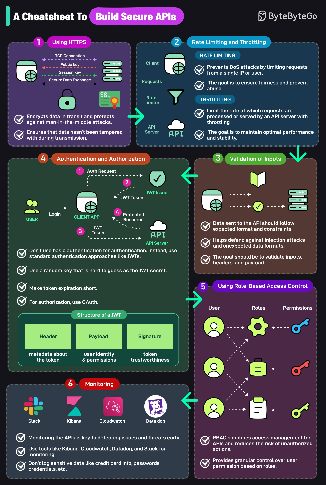

**Source:** [https://twitter.com/i/web/status/1873959778680267143](https://twitter.com/i/web/status/1873959778680267143)
**Original Post Date:** 2025-05-28 02:31:00

# Building Secure APIs: A Comprehensive Security Guide

## Introduction
In today's interconnected systems, securing APIs is paramount to protecting data and maintaining system integrity. This guide presents six critical areas of API security that developers and architects must implement to build robust, secure services. From encryption in transit to granular access control, each component addresses specific attack vectors while ensuring optimal performance.

## HTTPS Implementation

HTTPS provides end-to-end encryption for data transmission between clients and servers. It establishes a secure connection using SSL/TLS protocols, protecting against man-in-the-middle attacks.

The implementation involves configuring public key certificates, session keys, and managing SSL termination points in your infrastructure.

- Require HTTPS for all API endpoints
- Use strong cipher suites (TLS 1.2+)
- Implement HSTS headers

## Rate Limiting and Throttling

Rate limiting prevents denial-of-service attacks by restricting request volumes from clients, while throttling maintains system stability during peak loads.

Implementation should consider both IP-based and authenticated user quotas.

1. Configure request limits per minute/hour/day
1. Implement sliding window algorithms for accuracy
1. Set up failover mechanisms

## Input Validation

All incoming data must be validated to prevent injection attacks and ensure proper formatting. This includes headers, query parameters, and request bodies.

Validation should occur at both client and server sides.

- Use schema validation for JSON/XML payloads
- Implement parameter sanitization
- Validate content types and encodings

## Authentication and Authorization

JWT provides stateless authentication with compact, secure tokens. Implementation requires careful management of secrets and short-lived tokens.

OAuth 2.0 authorization enables delegated access control while maintaining security.

```javascript
const jwt = require('jsonwebtoken');
const token = jwt.sign({ userId: '123' }, process.env.JWT_SECRET, { expiresIn: '1h' });
```

## Role-Based Access Control (RBAC)

RBAC simplifies permission management by organizing users into roles with specific privileges. This approach reduces complexity and minimizes misconfiguration risks.

Implement role hierarchies based on business requirements.

1. Define clear user roles (admin, editor, viewer)
1. Assign permissions to roles, not users directly
1. Regularly audit role assignments

## Monitoring and Logging

Real-time monitoring detects security issues early. Implementation requires integration with logging systems and alerting mechanisms.

Configure alerts for suspicious activities while avoiding sensitive data exposure.

- Set up centralized logging with tools like Kibana or CloudWatch
- Monitor authentication failures and rate limit triggers
- Create incident response workflows

## Key Takeaways

- HTTPS encryption is foundational for secure data transmission
- Implement layered security: rate limiting, input validation, and RBAC work together
- JWT-based authentication requires careful secret management
- Monitoring is essential for proactive security

## Conclusion
Building secure APIs requires a comprehensive approach combining technical controls with operational practices. By implementing these best practices, organizations can significantly reduce their API attack surface while maintaining system performance and reliability.


## Media

**Image Description:** This image is a comprehensive cheatsheet titled **"A Cheatsheet To Build Secure APIs"** by **ByteByteGo**. It provides a structured guide on securing APIs by breaking down the process into six key steps, each with detailed explanations, diagrams, and best practices. Below is a detailed description of the image, focusing on the main subjects and technical details:

---

### **1. Using HTTPS**
- **Objective**: Secure data in transit.
- **Technical Details**:
  - **TCP Connection**: Establishes a secure connection using HTTPS.
  - **Public Key**: Used for encryption and decryption.
  - **Session Key**: Ensures secure data exchange between the client and server.
  - **SSL Certificate**: Verifies the identity of the server and ensures data integrity.
  - **Benefits**:
    - Prevents man-in-the-middle attacks.
    - Ensures data hasn't been tampered with during transmission.
    - Encrypts data in transit.

---

### **2. Rate Limiting and Throttling**
- **Objective**: Control the number of requests to prevent abuse and maintain performance.
- **Subsections**:
  - **Rate Limiting**:
    - **Purpose**: Prevents DoS attacks by limiting requests from a single IP or user.
    - **Mechanism**: Imposes a cap on the number of requests a client can make within a specific time frame.
    - **Benefits**: Ensures fairness and prevents abuse.
  - **Throttling**:
    - **Purpose**: Controls the rate at which requests are processed or served.
    - **Mechanism**: Slows down requests to maintain optimal performance and stability.
    - **Benefits**: Maintains system stability and prevents overload.

---

### **3. Validation of Inputs**
- **Objective**: Ensure data sent to the API is in the expected format and constraints.
- **Technical Details**:
  - Validates data sent to the API, including:
    - **Headers**
    - **Payload**
    - **Parameters**
  - **Benefits**:
    - Helps defend against injection attacks (e.g., SQL injection, XSS).
    - Ensures data integrity and expected format.
    - Reduces the risk of unexpected data formats.

---

### **4. Authentication and Authorization**
- **Objective**: Securely authenticate users and authorize access to resources.
- **Subsections**:
  - **Authentication**:
    - **JWT (JSON Web Token)**:
      - **Structure**:
        - **Header**: Metadata about the token (e.g., algorithm, type).
        - **Payload**: User identity and permissions.
        - **Signature**: Ensures token integrity and authenticity.
      - **Process**:
        1. User sends an authentication request.
        2. JWT issuer generates a token.
        3. Token is sent back to the client.
        4. Client uses the token to access protected resources.
    - **Best Practices**:
      - Use JWTs instead of basic authentication.
      - Use a random, hard-to-guess key as the JWT secret.
      - Make token expiration short.
  - **Authorization**:
    - Use OAuth for authorization.
    - Ensure that only authorized users can access specific resources.

---

### **5. Using Role-Based Access Control (RBAC)**
- **Objective**: Simplify access management by defining roles and permissions.
- **Technical Details**:
  - **RBAC Model**:
    - **Users**: Assigned to roles.
    - **Roles**: Associated with permissions.
    - **Permissions**: Define actions users can perform.
  - **Benefits**:
    - Provides granular control over user permissions based on roles.
    - Reduces the risk of unauthorized actions.
    - Simplifies access management.

---

### **6. Monitoring**
- **Objective**: Detect issues and threats early.
- **Technical Details**:
  - **Tools**:
    - **Kibana**: Visualizes logs and metrics.
    - **CloudWatch**: Monitors AWS services.
    - **Datadog**: Provides real-time monitoring.
    - **Slack**: Alerts for critical issues.
  - **Best Practices**:
    - Monitor APIs to detect issues early.
    - Use tools like Kibana, CloudWatch, Datadog, and Slack for monitoring.
    - Don't log sensitive data (e.g., credit card info, passwords).

---

### **Overall Layout and Design**
- The image is divided into six sections, each with a distinct color-coded background for easy navigation.
- Each section includes:
  - A title in a colored box.
  - A diagram or flowchart to illustrate the concept.
  - A list of best practices or key points.
  - Visual icons to represent technical components (e.g., users, servers, tokens).
- The flow of information is logical, starting from securing data in transit (HTTPS) to monitoring and alerting.

---

### **Key Takeaways**
- The cheatsheet emphasizes a holistic approach to API security, covering encryption, rate limiting, input validation, authentication, authorization, and monitoring.
- It provides practical advice and tools for each step, making it a useful reference for developers and security professionals.

This cheatsheet is a valuable resource for anyone looking to build secure and robust APIs.
