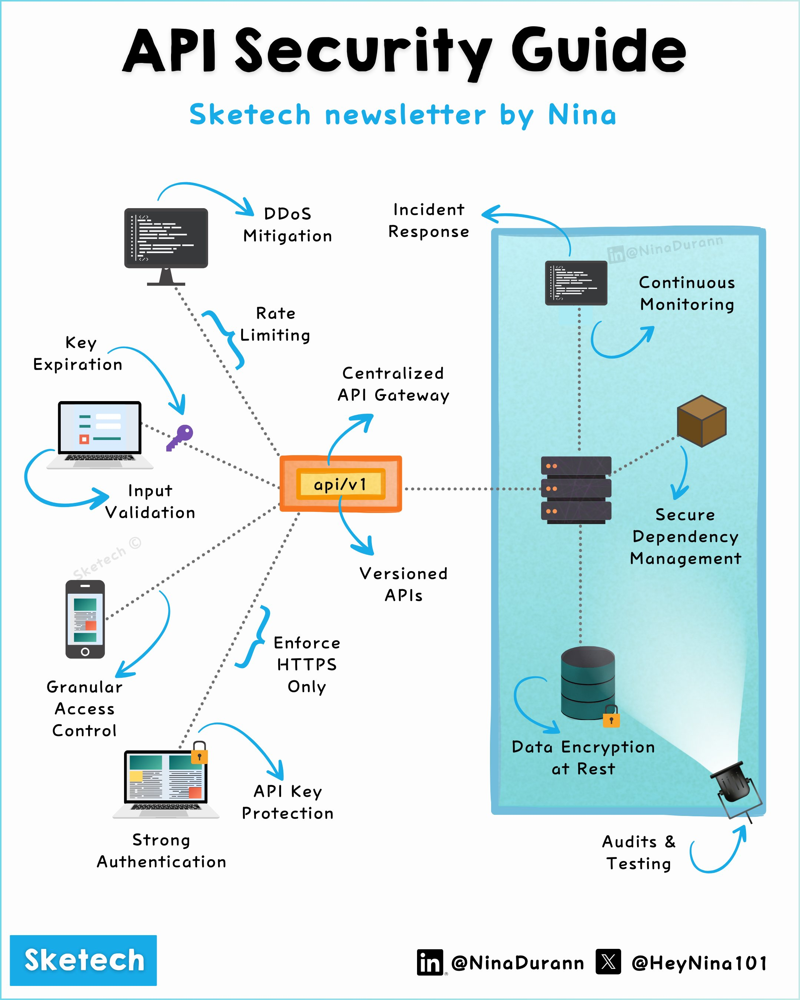

**Source:** [https://twitter.com/i/web/status/1872396449209553107](https://twitter.com/i/web/status/1872396449209553107)
**Original Post Date:** 2025-05-27 22:15:21

# Comprehensive Guide to Securing APIs: Best Practices & Implementation

## Introduction
API security is a critical aspect of modern distributed systems, protecting valuable data and ensuring system integrity. This comprehensive guide outlines proven best practices for securing APIs, from implementing robust authentication mechanisms to establishing effective monitoring systems. We'll explore the essential components that form a secure API infrastructure, including gateway implementation, encryption protocols, and incident response strategies.

## Centralized API Gateway Implementation

The API gateway serves as the central point of control for all API traffic. It acts as a reverse proxy, managing authentication, rate limiting, and monitoring. All external requests must pass through this gateway before reaching your backend services.

Implementing a robust gateway ensures consistent security policies across multiple APIs and provides centralized logging and analytics.

> **Note/Tip:** Use mature API management platforms like Kong or Apigee for production environments

> **Note/Tip:** Ensure the gateway implements WAF (Web Application Firewall) capabilities

## Essential Security Measures Around APIs

Implementing multiple layers of security around your API endpoint is crucial. These include rate limiting to prevent abuse, key expiration for temporary access, and input validation to sanitize data.

Strong authentication mechanisms such as OAuth 2.0 or JWT (JSON Web Tokens) ensure only authorized clients can access your APIs.

- Enforce HTTPS for all API communication
- Implement granular access control based on role-based permissions
- Use versioned endpoints to manage backward compatibility

## Incident Response and Mitigation Strategies

Preparing for security incidents is as important as preventing them. Implement DDoS protection mechanisms and establish clear incident response protocols.

Regular penetration testing and vulnerability assessments help identify potential security gaps before they're exploited.

## Key Takeaways

- Implement a centralized API gateway with comprehensive monitoring capabilities
- Layer multiple security measures including rate limiting, input validation, and strong authentication
- Establish clear incident response protocols and regularly test your security infrastructure

## Conclusion
Securing APIs requires a holistic approach that combines technical safeguards with operational best practices. By implementing the strategies outlined in this guide - from robust gateway implementation to comprehensive monitoring - you can significantly enhance your API's security posture.

## External References

- [OWASP API Security Project](https://owasp.org/www-project-api-security/)
- [NIST Cybersecurity Framework](https://www.nist.gov/cyberframework)

## Media

**Image Description:** The image is a detailed infographic titled **"API Security Guide"**, created by **Nina Durann** (as indicated by the text and social media handles). The infographic provides a comprehensive overview of the key components and best practices for securing APIs. Below is a detailed breakdown of the image:

### **Main Title and Theme**
- The title, **"API Security Guide"**, is prominently displayed at the top in bold black text.
- The subtitle, **"Sketech newsletter by Nina"**, is written in blue, indicating the source of the content.

### **Central Focus: API Gateway**
- At the center of the infographic is a **red-orange box labeled "api/v1"**, representing the API endpoint or version.
- This central box is the focal point, with multiple arrows pointing to it from various security components, illustrating how these elements interact with and protect the API.

### **Key Security Components**
The infographic is divided into several sections, each highlighting a critical aspect of API security. Below are the main components:

#### **1. API Gateway**
- **Centralized API Gateway**: This is depicted as a blue rectangular box surrounding the API endpoint. It acts as a central point for managing and securing API traffic.
- **Continuous Monitoring**: Arrows point to this section, indicating the need for real-time monitoring of API activity to detect and respond to anomalies.

#### **2. Security Measures Around the API**
- **Rate Limiting**: A dashed arrow points to this component, emphasizing the importance of controlling the number of requests to prevent abuse or overload.
- **Key Expiration**: This ensures that API keys have a defined lifespan, reducing the risk of long-term exposure.
- **Input Validation**: Ensures that all incoming data is checked for correctness and security before processing.
- **Granular Access Control**: Provides fine-grained control over who can access specific API endpoints and resources.
- **HTTPS Enforcement**: Ensures all communication with the API is encrypted, protecting data in transit.
- **Versioned APIs**: Maintaining different versions of the API helps in managing backward compatibility and security updates.
- **API Key Protection**: Ensures that API keys are securely managed and not exposed.
- **Strong Authentication**: Implements robust authentication mechanisms to verify the identity of API users.

#### **3. Incident Response and Mitigation**
- **DDoS Mitigation**: Protects the API from distributed denial-of-service attacks by implementing measures to handle excessive traffic.
- **Incident Response**: Establishes protocols for responding to security incidents or breaches.

#### **4. Data Security**
- **Data Encryption at Rest**: Ensures that data stored in databases or other storage systems is encrypted to protect it from unauthorized access.
- **Secure Dependency Management**: Manages external dependencies to ensure they are secure and up-to-date, reducing vulnerabilities.

#### **5. Audits and Testing**
- **Audits & Testing**: Regular audits and testing are crucial for identifying and addressing security vulnerabilities in the API.

### **Visual Elements**
- **Icons and Symbols**:
  - A **computer monitor** represents DDoS mitigation.
  - A **laptop** with a key symbolizes key expiration and input validation.
  - A **smartphone** indicates granular access control.
  - A **server stack** represents versioned APIs and secure dependency management.
  - A **database icon** with a lock symbolizes data encryption at rest.
  - A **lock** emphasizes API key protection and strong authentication.
- **Arrows and Lines**:
  - Blue arrows indicate the flow of security measures and their connection to the API endpoint.
  - Dashed lines highlight optional or secondary security measures.

### **Social Media Handles**
- The infographic includes social media handles for the creator:
  - **LinkedIn**: @NinaDurann
  - **X (Twitter)**: @HeyNina101

### **Overall Layout**
- The infographic is visually organized, with the API endpoint at the center and security components radiating outward. This layout effectively illustrates how various security measures work together to protect the API.

### **Purpose**
The infographic serves as a concise and informative guide for developers and security professionals, highlighting the essential practices for securing APIs in a modern, distributed environment. It emphasizes the importance of a holistic approach to API security, covering everything from input validation to continuous monitoring and encryption. 

This visual representation is both educational and practical, making it a valuable resource for anyone working with APIs.
