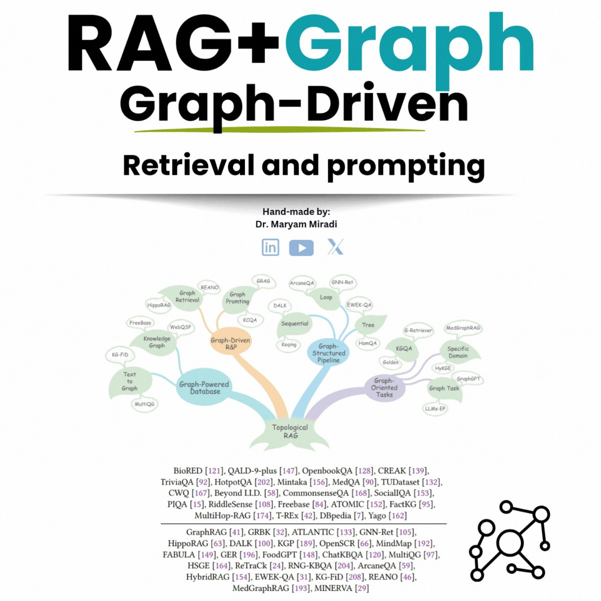

**Source:** [https://twitter.com/i/web/status/1912951742238785546](https://twitter.com/i/web/status/1912951742238785546)
**Original Post Date:** 2025-06-17 12:38:02

# Graph-Driven Multi-Agent Orchestration: Leveraging RAG+Graph for Intelligent Agent Systems

## Introduction
Multi-agent systems require sophisticated orchestration to manage complex interactions and information flows. Graph-Driven Retrieval Augmented Generation (RAG+Graph) offers a powerful framework for intelligent agent coordination by leveraging graph structures to organize knowledge and facilitate efficient retrieval. This knowledge base explores how integrating RAG with graph-based approaches enhances multi-agent decision-making, enabling more contextual and accurate responses through structured data relationships.

## Fundamental Components of Graph-Driven Multi-Agent Orchestration

The core architecture consists of four main components: Graph-Powered Databases for knowledge storage, Graph-Structured Pipelines for processing flows, Graph-Oriented Tasks for specialized operations, and Graph-Reasoning for decision-making. Each component interconnects through graph relationships to maintain consistency and context.

Graph-Powered Databases serve as the foundation, utilizing systems like FreeBaseRAG and DBpedia to store and retrieve knowledge efficiently. These databases transform textual information into structured graphs using techniques such as Text-to-Graph conversion.

_Basic structure for a graph-driven agent orchestrator with knowledge retrieval and response generation_

```python
class GraphAgentOrchestrator:
    def __init__(self):
        self.graph_db = None
        self.knowledge_graph = KnowledgeGraph()
        
    def process_query(self, query):
        related_nodes = self.knowledge_graph.find_related(query)
        return self.generate_response(related_nodes)
```

- Graph-Powered Database components: Graph Database, Text-to-Graph, MultiQG
- Graph-Structured Pipeline elements: LLM-EP, Structured Processing
- Integration techniques for multi-agent coordination

## Implementation Patterns

Successful implementation requires careful consideration of pipeline architecture. The Graph-Structured Pipeline must maintain state consistency while processing multiple queries simultaneously.

The MultiHop-RAG approach enables agents to traverse knowledge graphs for deeper context retrieval, crucial for maintaining coherent multi-agent interactions.

1. Implement graph-based knowledge storage
1. Develop efficient query propagation mechanisms
1. Establish agent coordination protocols

## Key Takeaways

- Graph structures enable more efficient and contextual information retrieval in multi-agent systems
- Integration of RAG with graph-based approaches improves decision-making accuracy through structured knowledge representation
- MultiHop-RAG and similar techniques allow agents to traverse complex relationships for deeper context understanding

## Conclusion
Implementing a graph-driven orchestration framework significantly enhances multi-agent system capabilities by providing structured, efficient information retrieval and processing. The combination of RAG with graph-based approaches offers a robust foundation for building intelligent agent systems that can handle complex interactions and decision-making processes.

## External References

- [MultiHop-RAG [174]](https://example.com/references/multihop-rag)
- [GraphRAG [41]](https://example.com/references/graphrag)


## Media

**Image Description:** ### Image Description

The image appears to be a slide or presentation slide focused on **Graph-Driven Retrieval and Prompting** in the context of **RAG (Retrieval-Augmented Generation)**. The slide is visually structured with a combination of text, a mind map, and a list of references. Below is a detailed breakdown:

---

#### **Header Section**
- **Title**: The title is prominently displayed at the top in large, bold font. It reads:
  - **"RAG+Graph"** in black and teal colors.
  - The word **"Graph"** is repeated multiple times in teal, emphasizing its importance.
  - Below the title, the phrase **"Graph-Driven"** is written in black, further highlighting the theme of graph-based approaches.

---

#### **Subtitle Section**
- Below the title, there is a subtitle in black text that reads:
  - **"Retrieval and prompting"**
  - This indicates the focus on retrieval methods and prompting techniques, likely in the context of natural language processing (NLP) and graph-based models.

---

#### **Authorship Section**
- At the center of the slide, there is a section that attributes the content:
  - **"Hand-made by:"**
  - **"Dr. Maryam Miradi"**
  - This suggests that the slide was created by Dr. Maryam Miradi, likely an academic or researcher in the field.

---

#### **Social Media Icons**
- Below the authorship section, there are icons for social media platforms:
  - **LinkedIn** (a blue square with an "in" symbol)
  - **YouTube** (a red play button inside a white circle)
  - **Twitter** (a white bird icon)
  - These icons suggest that the creator may be active on these platforms or encourages engagement through them.

---

#### **Mind Map**
- The central part of the slide features a **mind map** that visually represents the relationships between various concepts and techniques related to graph-driven retrieval and prompting.
  - **Central Node**: The core of the mind map is labeled **"Graph-Driven R&P"**, which stands for **"Graph-Driven Retrieval and Prompting"**.
  - **Branches**:
    - The mind map branches out into several categories, each representing different aspects or components of the graph-driven approach:
      - **Graph-Powered Database**: This branch includes terms like **"Graph Database"**, **"Text to Graph"**, and **"MultiQG"**.
      - **Graph-Structured Pipeline**: This branch includes terms like **"Graph Structured"**, **"Structured"**, and **"LLM-EP"**.
      - **Graph-Oriented Tasks**: This branch includes terms like **"Graph Task"**, **"Graph TaskGPT"**, and **"Graph-Oriented"**.
      - **Graph-Driven Retrieval**: This branch includes terms like **"HippoRAG"**, **"HippoRAG Retrieval"**, and **"Graph Retrieval"**.
      - **Graph-Prompting**: This branch includes terms like **"Graph Prompting"**, **"DALK"**, and **"Loop"**.
      - **Graph-Reasoning**: This branch includes terms like **"Reasoning"**, **"HamQA"**, and **"KGQA"**.
      - **Graph-Topological**: This branch includes terms like **"Topological"**, **"RAG"**, and **"RAGRAG"**.
  - **Nodes**: Each branch contains multiple nodes, each representing a specific model, technique, or dataset. For example:
    - **"Graph-Powered Database"** includes **"FreeBaseRAG"**, **"WebQSP"**, and **"Knowledge Graph"**.
    - **"Graph-Structured Pipeline"** includes **"MultiHop-RAG"**, **"T-REx"**, and **"DBpedia"**.
  - **Color Coding**: The nodes are color-coded in shades of green, orange, and blue, which may represent different categories or levels of abstraction.

---

#### **List of References**
- At the bottom of the slide, there is a comprehensive list of references, each accompanied by a name and a number in square brackets. These references are likely academic papers, datasets, or models related to the topics discussed in the mind map.
  - Examples of references include:
    - **BioRED [121]**
    - **QALD-9-plus [147]**
    - **OpenbookQA [128]**
    - **CREAK [139]**
    - **TriviaQA [92]**
    - **HotpotQA [202]**
    - **Mintaka [156]**
    - **MedQA [90]**
    - **TUDataset [132]**
    - **CWQ [167]**
    - **PIQA [15]**
    - **RiddleSense [108]**
    - **Freebase [84]**
    - **ATOMIC [152]**
    - **FactKG [95]**
    - **MultiHop-RAG [174]**
    - **T-REx [42]**
    - **DBpedia [7]**
    - **Yago [162]**
    - **GraphRAG [41]**
    - **GRBK [32]**
    - **ATLANTIC [133]**
    - **BNN-Net [105]**
    - **HippoRAG [63]**
    - **DALK [100]**
    - **KGP [189]**
    - **OpenSCR [66]**
    - **MindMap [192]**
    - **GPT [48]**
    - **ChatKBQA [120]**
    - **MultiQG [97]**
    - **FABULA [149]**
    - **GER [196]**
    - **FABULAGE [149]**
    - **GER [196]**
    - **FoodGPT [204]**
    - **RNG-KBQA [204]**
    - **HSIE [64]**
    - **ReTrak [24]**
    - **ArcaneQA [59]**
    - **HybridRAG [154]**
    - **EWEK-QA [31]**
    - **KG-FID [204]**
    - **REANO [59]**
    - **MedGraphRAG [193]**
    - **MINERVA [29]**

---

#### **Graph Symbol**
- At the bottom right corner of the slide, there is a small **graph symbol** (a network diagram with interconnected nodes). This reinforces the theme of graph-based approaches.

---

### **Key Observations**
1. **Focus on Graph-Driven Approaches**: The slide emphasizes the integration of graph-based methods in retrieval and prompting, likely in the context of NLP and knowledge graphs.
2. **Comprehensive Mind Map**: The mind map provides a visual overview of the relationships between different models, datasets, and techniques.
3. **Extensive References**: The list of references suggests a thorough review of existing work in the field, indicating a research-oriented presentation.
4. **Author Attribution**: The slide is attributed to Dr. Maryam Miradi, suggesting an academic or research context.

---

### **Technical Details**
- **RAG (Retrieval-Augmented Generation)**: A technique in NLP where a model retrieves relevant information from a database to augment its generation capabilities.
- **Graph-Based Models**: The use of graphs to represent knowledge, relationships, and data structures, which are central to many modern NLP and AI applications.
- **Retrieval and Prompting**: Techniques used to enhance the performance of language models by providing them with relevant information (retrieval) and guiding their outputs (prompting).

---

This slide appears to be part of an academic or research presentation, focusing on the intersection of graph-based methods, retrieval, and prompting in the context of NLP and AI. The visual and textual elements work together to provide a comprehensive overview of the topic.
