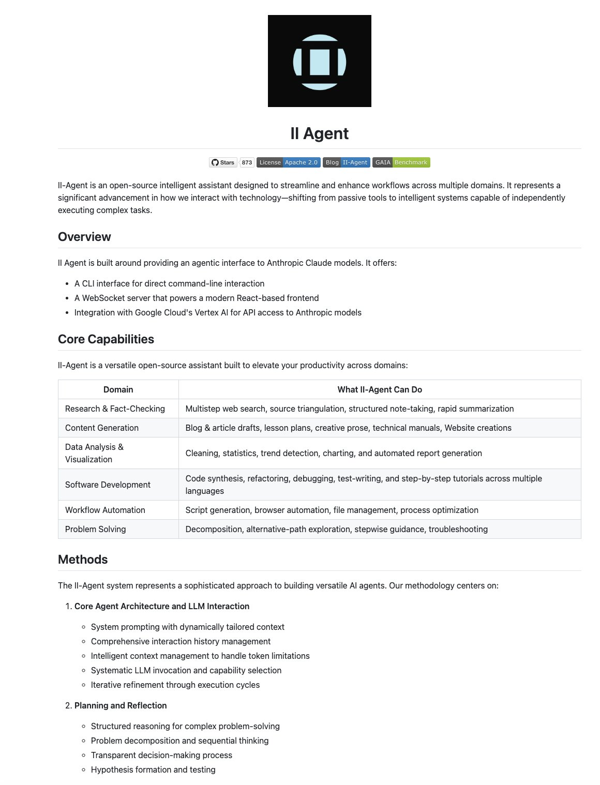

**Source:** [https://twitter.com/i/web/status/1925940635393044847](https://twitter.com/i/web/status/1925940635393044847)
**Original Post Date:** 2025-05-28 08:58:13

# II Agent Framework: Architecture & Methodology for Multi-Domain AI Workflows

## Introduction
The II Agent represents a paradigm shift in intelligent assistant technology, evolving from passive tools to autonomous systems. This framework leverages modern AI capabilities through direct integration with Anthropic Claude models via Google Cloud Vertex AI, providing a robust platform for automated task execution across diverse workflows.

## Framework Overview

II Agent is built on a modular architecture featuring a CLI interface and modern React-based frontend powered by WebSocket communication. This structure enables seamless interaction with advanced AI capabilities while maintaining flexibility for domain-specific applications.

- CLI Interface for direct command-line operations
- React-based frontend with WebSocket integration
- Anthropic Claude model agentic interface
- Google Cloud Vertex AI API access

## Core Domain Capabilities

The II Agent framework excels across six primary domains, each equipped with specialized capabilities for automation and intelligence enhancement.

1. Research & Fact-Checking: Multistep web searches, source triangulation, structured notes, rapid summarization
1. Content Generation: Blog articles, lesson plans, creative prose, technical manuals, website creation
1. Data Analysis & Visualization: Data cleaning, statistical analysis, trend detection, automated reporting
1. Software Development: Code synthesis, refactoring, debugging, test-writing, tutorial generation
1. Workflow Automation: Script generation, browser automation, file management, process optimization
1. Problem Solving: Decomposition strategies, alternative-path exploration, stepwise guidance

## Agent Architecture & LLM Interaction

The core architecture employs sophisticated system prompting and intelligent context management to overcome token limitations while maintaining efficient LLM interactions.

Dynamic capability selection ensures optimal resource utilization across tasks, supporting both single-step and complex multi-stage operations.

> **Note/Tip:** Context management is critical for maintaining task coherence in long-running workflows

> **Note/Tip:** Token optimization strategies are essential for cost-effective operation

## Key Takeaways

- II Agent bridges the gap between LLM capabilities and practical domain applications through structured architecture
- The framework's modular design enables seamless integration with existing systems via CLI and WebSocket interfaces
- Core methodology emphasizes iterative refinement, transparent decision-making, and systematic capability selection

## Conclusion
II Agent exemplifies modern AI assistant development by combining advanced LLM capabilities with practical workflow automation. Its open-source nature (Apache 2.0 licensed) and proven track record (873 stars on GitHub) make it a valuable resource for developers seeking to integrate intelligent assistants into their systems.

## External References

- [II Agent Project Repository](#)
- [Technical Documentation](#)

## Media

**Image Description:** The image is a screenshot of a document or webpage detailing the **II Agent**, an open-source intelligent assistant designed to streamline and enhance workflows across multiple domains. Below is a detailed breakdown of the content:

### **Header and Logo**
- At the top center of the image, there is a black square logo with a light blue abstract design. The logo appears to represent the branding for the II Agent project.
- Below the logo, the title **"II Agent"** is prominently displayed in bold, centered text.

### **Overview Section**
- **Introduction**: The document begins with an overview of the II Agent, describing it as an open-source intelligent assistant designed to enhance workflows across multiple domains. It emphasizes the shift from passive tools to intelligent systems capable of independently executing complex tasks.
- **Key Features**: The section highlights the following:
  - **CLI Interface**: For direct command-line interaction.
  - **Modern React-based Frontend**: Powered by a WebSocket server.
  - **Integration with Anthropic Claude Models**: Provides an agentic interface to these models.
  - **Google Cloud Vertex AI Integration**: Enables API access to Anthropic models.

### **Core Capabilities**
- This section outlines the domains where the II Agent can be applied and its capabilities within each domain:
  - **Research & Fact-Checking**: Multistep web searches, source triangulation, structured note-taking, and rapid summarization.
  - **Content Generation**: Drafting blog articles, lesson plans, creative prose, technical manuals, and website creations.
  - **Data Analysis & Visualization**: Cleaning, statistics, trend detection, charting, and automated report generation.
  - **Software Development**: Code synthesis, refactoring, debugging, test-writing, and tutorials.
  - **Workflow Automation**: Script generation, browser automation, file management, and process optimization.
  - **Problem Solving**: Decomposition, alternative-path exploration, stepwise guidance, and troubleshooting.

### **Methods Section**
- This section delves into the methodology behind the II Agent system, emphasizing a sophisticated approach to building versatile AI agents. The methodology is centered around two key areas:
  1. **Core Agent Architecture and LLM Interaction**:
     - **System Prompting**: Dynamically tailored context for LLMs.
     - **Comprehensive Interaction**: Intelligent context management and iterative refinement of LLM interactions.
     - **Token Limitations**: Management of token constraints in LLMs.
     - **Capability Selection**: Systematic invocation and selection of capabilities.
  2. **Planning and Reflection**:
     - **Structured Reasoning**: For complex problem-solving, including decomposition and sequential thinking.
     - **Problem Decomposition**: Breaking down problems into manageable steps.
     - **Transparent Decision-Making**: Hypothesis formation and testing.

### **Additional Details**
- **License**: The document mentions that the project is licensed under the **Apache 2.0** license.
- **Stars**: The project has **873 stars**, indicating its popularity or engagement on a platform like GitHub.
- **Blog and Benchmark**: Links to a blog and benchmark are provided, suggesting additional resources for users.

### **Design and Layout**
- The document is structured with clear headings and subheadings, making it easy to navigate.
- Bullet points and tables are used effectively to organize information, particularly in the **Core Capabilities** section.
- The overall tone is technical and informative, aimed at developers, researchers, or users interested in AI and automation tools.

### **Conclusion**
The II Agent is presented as a versatile, open-source tool designed to enhance productivity across various domains by leveraging advanced AI capabilities, particularly through interactions with LLMs like Anthropic Claude models. The document provides a comprehensive overview of its features, capabilities, and the underlying methodology, making it a valuable resource for potential users or developers interested in integrating intelligent assistants into their workflows.
