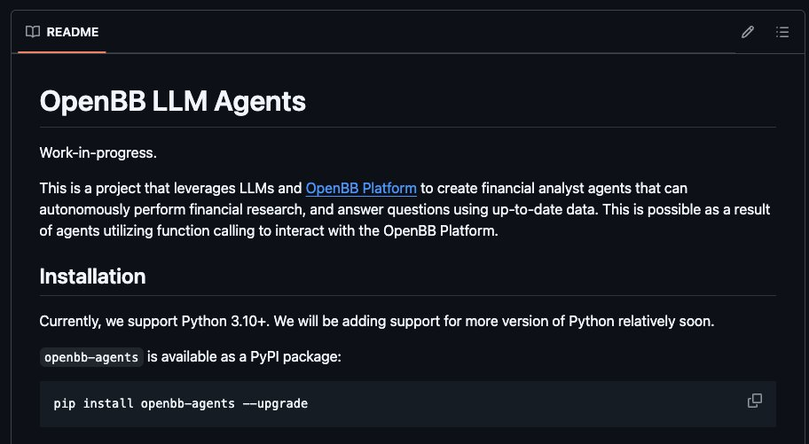

**Source:** [https://twitter.com/i/web/status/1871200888418640307](https://twitter.com/i/web/status/1871200888418640307)
**Original Post Date:** 2025-07-12 21:58:14

# OpenBB LLM Agents: Leveraging LLMs for Financial Analysis with Python

## Introduction
The OpenBB LLM Agents project is an innovative initiative that leverages Large Language Models (LLMs) and the OpenBB Platform to create financial analyst agents. These agents are designed to autonomously perform financial research, answer questions, and interact with up-to-date data using function calling capabilities. This project is currently in a work-in-progress state but shows significant promise for developers and researchers interested in financial analysis tasks.

## Project Overview

The OpenBB LLM Agents project focuses on creating autonomous financial analyst agents by leveraging LLMs and the OpenBB Platform. These agents are designed to perform financial research, answer questions, and interact with up-to-date data using function calling capabilities.

This project is currently a work in progress, indicating that it is still under active development and may not yet be fully stable or feature-complete.

> **Note/Tip:** The project leverages advanced integration capabilities through function calling to interact with the OpenBB Platform.

## Installation Instructions

The project currently supports Python 3.10 and above, with plans to add support for additional Python versions in the future.

The package, named `openbb-agents`, is available on PyPI (Python Package Index) and can be installed using the following command:

_This command installs or upgrades the `openbb-agents` package from PyPI._

```bash
pip install openbb-agents --upgrade
```

## Technical Details

The project is written in Python and leverages LLMs for financial analysis tasks.

It integrates with the OpenBB Platform to provide up-to-date data and advanced functionality through function calling.

- Language: Python (version 3.10+ supported)
- Package Name: `openbb-agents`
- Package Source: PyPI (Python Package Index)
- Installation Tool: `pip`

> **Note/Tip:** The README is concise and provides essential information for users interested in installing and using the project.

> **Note/Tip:** The project appears to be in an early stage of development, as indicated by the 'Work-in-progress' label.

## Visual Layout

The README is formatted with a dark background theme for readability, using white and light-colored text.

The text is organized into sections with clear headings and subheadings to ensure easy navigation and understanding.

## Key Takeaways

- The OpenBB LLM Agents project combines LLMs and the OpenBB Platform to create autonomous financial analyst agents.
- It supports Python 3.10+ and is available on PyPI for easy installation.
- The project is in an early stage of development, with plans to add support for additional Python versions soon.

## Conclusion
In conclusion, the OpenBB LLM Agents project represents a promising initiative for developers and researchers interested in leveraging LLMs for financial analysis tasks. Its integration with the OpenBB Platform and advanced function calling capabilities make it a valuable tool for autonomous financial research and data interaction.

## External References

- [OpenBB Platform](https://openbb.co)


## Media

**Image Description:** The image shows a screenshot of a **README file** for a project titled **"OpenBB LLM Agents"**. The README is written in Markdown format and provides an overview of the project, its purpose, and installation instructions. Below is a detailed description of the content and technical details:

### **Main Subject: OpenBB LLM Agents**
The main subject of the image is the **OpenBB LLM Agents** project. This project is described as a work in progress and focuses on leveraging **Large Language Models (LLMs)** and the **OpenBB Platform** to create financial analyst agents. These agents are designed to autonomously perform financial research, answer questions, and interact with up-to-date data using function calling capabilities.

### **Key Sections and Content:**

1. **Title:**
   - The title, **"OpenBB LLM Agents"**, is prominently displayed at the top in bold, large text.

2. **Project Overview:**
   - The project is described as a work in progress.
   - It leverages **LLMs** and the **OpenBB Platform** to create financial analyst agents.
   - These agents are capable of autonomously performing financial research, answering questions, and interacting with the OpenBB Platform using function calling.

3. **Installation Instructions:**
   - The installation section specifies that the project currently supports **Python 3.10+**.
   - Support for additional Python versions is planned to be added soon.
   - The package, **`openbb-agents`**, is available on **PyPI** (Python Package Index).
   - The installation command is provided:
     ```
     pip install openbb-agents --upgrade
     ```

4. **Markdown Formatting:**
   - The text is formatted using Markdown syntax, with headings, bullet points, and links.
   - Links are included for terms like **"OpenBB Platform"**, which are likely hyperlinks to additional resources or documentation.

5. **Visual Layout:**
   - The background is dark, likely a dark mode theme, with white and light-colored text for readability.
   - The text is organized into sections with clear headings and subheadings.
   - The installation command is highlighted in a code block for emphasis.

6. **Additional Notes:**
   - The project is described as leveraging function calling to interact with the OpenBB Platform, indicating advanced integration capabilities.
   - The README is concise and provides essential information for users interested in installing and using the project.

### **Technical Details:**
- **Language:** Python (version 3.10+ supported).
- **Package Name:** `openbb-agents`.
- **Package Source:** PyPI (Python Package Index).
- **Installation Tool:** `pip`.
- **Functionality:** Financial research, question answering, and interaction with the OpenBB Platform using LLMs and function calling.

### **Overall Impression:**
The README is well-structured and provides clear, concise information about the project's purpose, installation process, and technical requirements. It is designed to be user-friendly for developers and researchers interested in leveraging LLMs for financial analysis tasks. The inclusion of a code block for the installation command ensures ease of use for potential users. The project appears to be in an early stage of development, as indicated by the "Work-in-progress" label.
