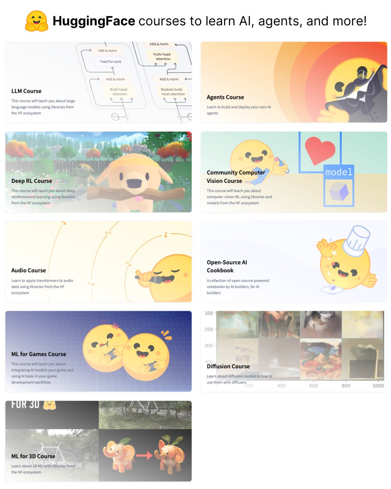

**Source:** [https://twitter.com/i/web/status/1918638533277065420](https://twitter.com/i/web/status/1918638533277065420)
**Original Post Date:** 2025-07-12 21:38:39

# HuggingFace AI Courses: Comprehensive Overview of Machine Learning and AI Education

## Introduction
HuggingFace offers a series of courses designed to educate users on various aspects of artificial intelligence (AI) and machine learning (ML). These courses leverage the HuggingFace ecosystem, providing hands-on experience with cutting-edge tools and libraries. The courses cover a wide range of topics, from large language models (LLMs) to deep reinforcement learning (RL), computer vision, audio processing, game development, diffusion models, and 3D ML. Each course is visually represented in a grid layout, making it easy for learners to navigate and choose the most relevant content.

## Course Overview

HuggingFace's AI courses are organized into distinct sections, each focusing on a specific area of AI and ML. The courses are presented in a grid layout, with each course having its own section that includes a title, description, and illustrative image.

The main subject of the promotional graphic is HuggingFace's courses designed to teach various aspects of AI, machine learning, and related technologies. The courses are visually represented in a grid format, with each course having its own section that includes a title, a brief description, and an illustrative image.

- LLM Course: Focuses on large language models using HuggingFace libraries.
- Agents Course: Teaches building and deploying AI agents.
- Deep RL Course: Covers deep reinforcement learning with HuggingFace tools.
- Vision Course: Explores computer vision ML using HuggingFace libraries.
- Audio Course: Applies transformers to audio data using HuggingFace libraries.
- Open-Source AI Cookbook: A collection of notebooks by builders for AI builders.
- ML for Games Course: Integrates AI tools in game development workflows.
- Diffusion Course: Teaches diffusion models and their applications with diffusers.
- ML for 3D Course: Focuses on 3D ML using HuggingFace libraries.

> **Note/Tip:** The courses emphasize practical application and hands-on learning using real-world tools and libraries from the HuggingFace ecosystem.

> **Note/Tip:** Each course is accompanied by a cartoon-style illustration that helps convey the course's theme in a fun and engaging way.

## Course Details

The courses are presented in a grid layout with each section including a title, description, and illustrative image. The layout is divided into two columns, with the first column containing three courses and the second column containing four courses.

Each course section includes a title, a brief overview of what the course covers, and an illustrative image that visually represents the course topic.

- LLM Course: Teaches about large language models using HuggingFace libraries.
- Agents Course: Focuses on building and deploying AI agents.
- Deep RL Course: Covers deep reinforcement learning with HuggingFace tools.
- Vision Course: Explores computer vision ML using HuggingFace libraries.
- Audio Course: Applies transformers to audio data using HuggingFace libraries.
- Open-Source AI Cookbook: A collection of notebooks by builders for AI builders.
- ML for Games Course: Integrates AI tools in game development workflows.
- Diffusion Course: Teaches diffusion models and their applications with diffusers.
- ML for 3D Course: Focuses on 3D ML using HuggingFace libraries.

> **Note/Tip:** The courses cover a wide range of AI-related topics, including large language models, reinforcement learning, computer vision, audio processing, game development, diffusion models, and 3D modeling.

> **Note/Tip:** Each course is designed to be educational, with a focus on practical application and hands-on learning using real-world tools and libraries.

## Design Elements

The image uses a bright and cheerful color palette, with yellow being a dominant color in the cartoon-style illustrations. This creates a friendly and approachable tone.

Each course is accompanied by a cute, cartoon-style illustration that helps convey the course's theme in a fun and engaging way.

- Color Scheme: Bright and cheerful color palette with yellow as the dominant color.
- Cartoon Illustrations: Each course is accompanied by a cute, cartoon-style illustration that helps convey the course's theme in a fun and engaging way.

> **Note/Tip:** The visual appeal and organization make it easy to understand the scope and focus of each course.

> **Note/Tip:** The courses are designed to be accessible and appealing, even to those who might be new to AI and machine learning.

## Technical Details

All courses emphasize the use of libraries and tools from the HuggingFace ecosystem, highlighting the platform's role in providing resources for AI and machine learning.

The courses cover a wide range of AI-related topics, including large language models, reinforcement learning, computer vision, audio processing, game development, diffusion models, and 3D modeling.

- Focus on HuggingFace Ecosystem: All courses emphasize the use of libraries and tools from the HuggingFace ecosystem.
- Diverse Topics: The courses cover a wide range of AI-related topics, including large language models, reinforcement learning, computer vision, audio processing, game development, diffusion models, and 3D modeling.

> **Note/Tip:** The courses are designed to be educational, with a focus on practical application and hands-on learning using real-world tools and libraries.

> **Note/Tip:** Each course is accompanied by a cartoon-style illustration that helps convey the course's theme in a fun and engaging way.

## Key Takeaways

- HuggingFace offers a comprehensive series of AI courses covering various aspects of machine learning and artificial intelligence.
- The courses are visually represented in a grid layout, with each section including a title, description, and illustrative image.
- Each course emphasizes practical application and hands-on learning using tools and libraries from the HuggingFace ecosystem.
- The courses cover a wide range of topics, including large language models, reinforcement learning, computer vision, audio processing, game development, diffusion models, and 3D ML.

## Conclusion
HuggingFace's AI courses provide a valuable resource for anyone looking to expand their knowledge in the fields of machine learning and artificial intelligence. The courses are well-organized, visually appealing, and focus on practical applications using the HuggingFace ecosystem.

## External References

- [HuggingFace Official Website](https://huggingface.co/)
- [HuggingFace Courses Page](https://huggingface.co/courses)

## Media

**Image Description:** The image is a promotional graphic for a series of courses offered by **HuggingFace**, a popular platform for machine learning and artificial intelligence resources. The graphic is vibrant, colorful, and organized into a grid layout, with each course represented by a distinct section. Below is a detailed description of the image:

### **Main Subject**
The main subject of the image is the **HuggingFace courses** designed to teach various aspects of AI, machine learning, and related technologies. The courses are visually represented in a grid format, with each course having its own section that includes a title, a brief description, and an illustrative image.

### **Layout and Structure**
The image is divided into a grid of **seven courses**, each occupying its own rectangular section. The sections are arranged in two columns, with the first column containing three courses and the second column containing four courses. Each section includes:
1. **Title**: The name of the course.
2. **Description**: A brief overview of what the course covers.
3. **Illustration**: A colorful, cartoon-style image that visually represents the course topic.

### **Courses and Details**
#### **1. LLM Course**
- **Title**: LLM Course
- **Description**: "This course will teach you about large language models using libraries from the HF ecosystem."
- **Illustration**: A diagram illustrating the architecture of a transformer model, including components like "Add & norm," "Multi-head attention," and "Feed forward." This is a technical representation of the inner workings of large language models (LLMs).

#### **2. Agents Course**
- **Title**: Agents Course
- **Description**: "Learn to build and deploy your own AI agents."
- **Illustration**: A cartoon-style image of two people sitting on a rock, looking at a sunset. The scene suggests collaboration or teamwork, symbolizing the development and deployment of AI agents.

#### **3. Deep RL Course**
- **Title**: Deep RL Course
- **Description**: "This course will teach you about deep reinforcement learning using libraries from the HF ecosystem."
- **Illustration**: A cute, cartoon-style dog holding a stick, set against a scenic background with trees and a clear sky. The dog represents the "agent" in reinforcement learning, learning through interactions with the environment.

#### **4. Vision Course**
- **Title**: Vision Course
- **Description**: "This course will teach you about computer vision ML using libraries and models from the HF ecosystem."
- **Illustration**: A cartoon-style yellow face with a heart symbol and a computer screen in the background. The heart symbolizes the "vision" aspect, while the computer screen represents the technical focus on computer vision.

#### **5. Audio Course**
- **Title**: Audio Course
- **Description**: "Learn to apply transformers to audio data using libraries from the HF ecosystem."
- **Illustration**: A cartoon-style yellow face singing into a microphone, with sound waves emanating from the microphone. This visually represents the application of transformers to audio data.

#### **6. Open-Source AI Cookbook**
- **Title**: Open-Source AI Cookbook
- **Description**: "A collection of notebooks by builders, for AI builders."
- **Illustration**: A cartoon-style yellow face wearing a chef's hat and holding a spoon, symbolizing the "cookbook" aspect of sharing recipes or tutorials for building AI models.

#### **7. ML for Games Course**
- **Title**: ML for Games Course
- **Description**: "This course will teach you about integrating AI tools in your game and using AI models in your game development workflow."
- **Illustration**: Two cartoon-style yellow faces playing a video game, with one face appearing to be in control and the other reacting. This represents the integration of AI in game development.

#### **8. Diffusion Course**
- **Title**: Diffusion Course
- **Description**: "Learn about diffusion models & how to use them with diffusers."
- **Illustration**: A collage of images showing various stages of image generation or transformation, representing the concept of diffusion models in AI.

#### **9. ML for 3D Course**
- **Title**: ML for 3D Course
- **Description**: "Learn about 3D ML with libraries from the HF ecosystem."
- **Illustration**: A cartoon-style orange elephant with a 3D model of an elephant next to it, connected by an arrow. This visually represents the application of machine learning to 3D modeling and data.

### **Design Elements**
- **Color Scheme**: The image uses a bright and cheerful color palette, with yellow being a dominant color in the cartoon-style illustrations. This creates a friendly and approachable tone.
- **Cartoon Illustrations**: Each course is accompanied by a cute, cartoon-style illustration that helps convey the course's theme in a fun and engaging way.
- **Text**: The text is clear and concise, providing a brief overview of each course. The titles are bold and easy to read, while the descriptions are informative but not overly technical.

### **Overall Theme**
The image effectively combines technical content with a playful and inviting design. The use of cartoon illustrations and bright colors makes the courses appear accessible and appealing, even to those who might be new to AI and machine learning. The grid layout ensures that each course is clearly separated and easy to navigate.

### **Technical Details**
- **Focus on HuggingFace Ecosystem**: All courses emphasize the use of libraries and tools from the HuggingFace ecosystem, highlighting the platform's role in providing resources for AI and machine learning.
- **Diverse Topics**: The courses cover a wide range of AI-related topics, including large language models, reinforcement learning, computer vision, audio processing, game development, diffusion models, and 3D modeling.
- **Educational Approach**: The courses are designed to be educational, with a focus on practical application and hands-on learning using real-world tools and libraries.

### **Conclusion**
The image is a well-designed promotional graphic that effectively communicates the offerings of HuggingFace's course series. It uses a combination of technical diagrams, playful illustrations, and clear text to engage potential learners and provide a comprehensive overview of the courses available. The visual appeal and organization make it easy to understand the scope and focus of each course.
