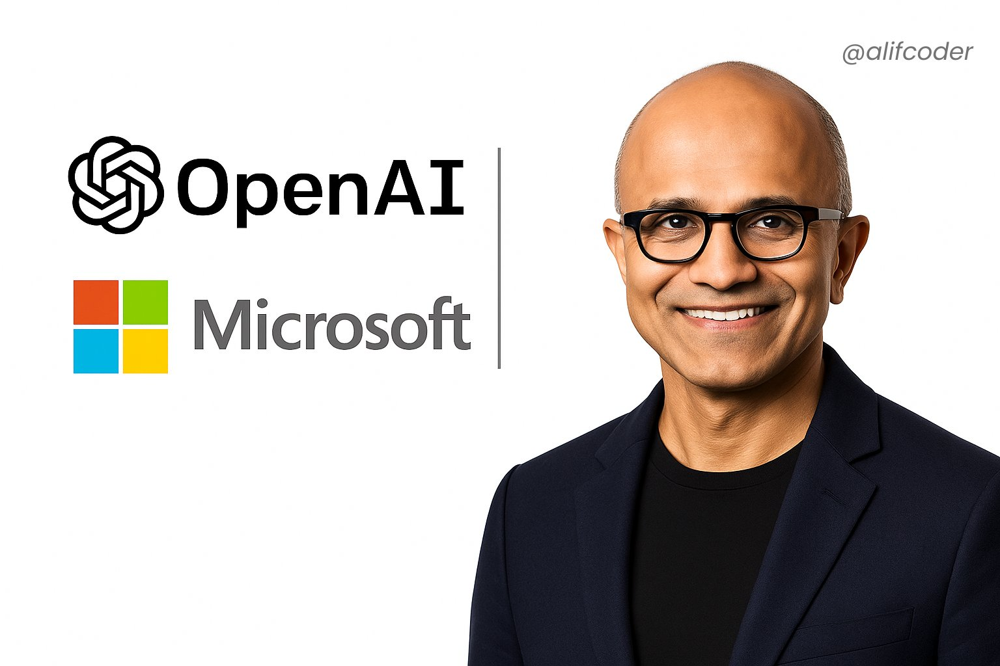

**Source:** [https://twitter.com/i/web/status/1918917910573322656](https://twitter.com/i/web/status/1918917910573322656)
**Original Post Date:** 2025-05-27 21:52:33

# Generative AI Fundamentals: From Basics to Practical Applications

## Introduction
Generative artificial intelligence represents a revolutionary approach to machine learning where models can create new content based on learned patterns. This tutorial demystifies the fundamentals of generative AI systems by exploring key concepts including large language models, diffusion models, transformers, and token-based architectures. We'll examine how OpenAI's innovations have shaped this field and demonstrate practical implementations using Azure OpenAI Service.

## Understanding Generative AI Fundamentals

Generative AI systems create new data instances with characteristics similar to the training dataset. These models learn underlying patterns in existing content (text, images, audio) and can generate novel outputs that maintain these statistical properties.

Key types of generative AI include language models (GPT series), image generators (DALL-E 3), code generation tools (Copilot), and multimodal systems that combine different data types.

_Basic example showing how to initialize and use a GPT-2 language model for text generation using Hugging Face's transformers library._

```python
from transformers import pipeline

generator = pipeline('text-generation', model='gpt2')
result = generator("The future of AI will", max_length=50)
print(result[0]['generated_text'])
```

- Generative AI can produce human-like content across multiple modalities (text, images, code)
- Models learn patterns from vast datasets rather than being explicitly programmed for specific outputs
- Transformers architecture enables understanding of contextual relationships in data

> **Note/Tip:** Beginner users should start with smaller models before scaling to more complex ones like GPT-4 due to computational requirements.

## Implementing Generative AI with Azure OpenAI Service

Microsoft's partnership with OpenAI has enabled enterprise-grade access to powerful generative models through the Azure OpenAI Service. This section demonstrates practical implementation strategies.

The service provides managed endpoints for accessing GPT-4, text-davinci-003, and other advanced language models while offering scalable resources and security features.

_Python code demonstrating how to authenticate and interact with Azure OpenAI Service, including environment variable handling for security._

```python
# Azure OpenAI Service implementation
import openai

openai.api_type = "azure"
openai.api_base = os.getenv("AZURE_OPENAI_ENDPOINT")
openai.api_version = "2023-05-15"
openai.api_key = os.getenv("AZURE_OPENAI_KEY")

response = openai.ChatCompletion.create(
  engine="gpt-4",
  messages=[{"role": "user", "content": "Explain generative AI in simple terms"}]
)
```

1. Set up an Azure account and enable the OpenAI service
1. Configure resource groups and API keys for secure access
1. Implement rate limiting to optimize costs and performance

> **Note/Tip:** Always use environment variables or key vaults rather than hardcoding credentials in your application.

## Ethical Considerations and Responsible AI Development

Generative AI systems raise important ethical questions regarding content authenticity, bias mitigation, and potential misuse. This section outlines best practices for responsible implementation.

Key areas of focus include prompt engineering to reduce hallucinations, implementing content filters, and transparent documentation about model capabilities and limitations.

- Implement robust validation layers between user inputs and the generative AI system
- Document all use cases and clearly communicate model limitations to end users
- Regularly audit outputs for bias or harmful content patterns

> **Note/Tip:** Consider implementing a feedback loop where users can report problematic outputs for model refinement.

## Key Takeaways

- Generative AI leverages transformer architectures to create context-aware content across multiple modalities
- Azure OpenAI Service provides enterprise-grade access to advanced models with managed infrastructure and security features
- Responsible implementation requires careful consideration of ethical implications, bias mitigation, and transparent documentation

## Conclusion
This tutorial has provided a comprehensive introduction to generative AI fundamentals, practical implementation strategies using Azure OpenAI Service, and considerations for responsible deployment. As you continue your journey in this field, focus on understanding model limitations while exploring the vast potential of these technologies.

## External References

- [Azure OpenAI Service Documentation](https://learn.microsoft.com/en-us/azure/cognitive-services/openai/)
- [OpenAI API Reference](https://platform.openai.com/docs/api-reference)
- [Transformers Library on GitHub](https://github.com/huggingface/transformers)


## Media

**Image Description:** The image is a professional and clean composition that prominently features a man in the foreground and logos of two major technology companies in the background. Here is a detailed description:

### **Main Subject:**
1. **Person:**
   - The individual in the image is a bald man with a warm, friendly smile. He appears to be middle-aged.
   - He is wearing black-framed glasses and a dark suit jacket over a black shirt, giving him a formal and professional appearance.
   - His expression is confident and approachable, suggesting he is a public figure or leader in a professional context.

### **Background:**
1. **Logos:**
   - The background features two prominent logos:
     - **OpenAI Logo:** 
       - Positioned on the left side of the image.
       - The logo consists of a stylized, interconnected knot-like design in black, accompanied by the text "OpenAI" in a clean, modern font.
     - **Microsoft Logo:**
       - Positioned below the OpenAI logo.
       - The classic Microsoft logo is displayed, featuring four colored squares (red, green, blue, and yellow) arranged in a 2x2 grid.
       - The text "Microsoft" is written in a clean, sans-serif font below the logo.

2. **Text:**
   - To the top right of the image, there is a social media handle: `@alifcoder`.
   - This suggests the image may be associated with a professional or promotional context, possibly related to technology or AI.

### **Technical Details:**
1. **Composition:**
   - The image is well-balanced, with the person centered on the right side and the logos aligned on the left.
   - The use of a clean white background ensures that the focus remains on the subject and the logos.
   - The vertical alignment of the logos and text creates a structured and professional look.

2. **Lighting:**
   - The lighting is even and soft, highlighting the subject's face without harsh shadows. This is typical of professional headshots or promotional images.

3. **Color Palette:**
   - The image uses a minimalistic color scheme dominated by white, black, and the colors of the Microsoft logo (red, green, blue, yellow).
   - The contrast between the dark suit and the white background makes the subject stand out prominently.

4. **Typography:**
   - The fonts used for the logos and text are modern and professional, aligning with the branding of both OpenAI and Microsoft.
   - The text is clear and legible, ensuring that the logos and the social media handle are easily recognizable.

### **Overall Impression:**
The image conveys a professional and tech-oriented theme, likely related to a collaboration or partnership between OpenAI and Microsoft. The subject appears to be a key figure in this context, possibly a leader or spokesperson. The clean and polished design suggests that this image is intended for use in professional or promotional materials.
