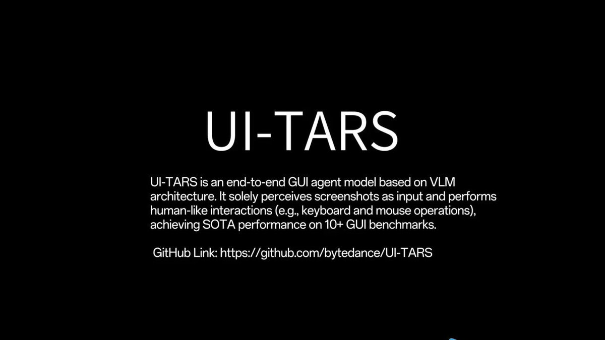
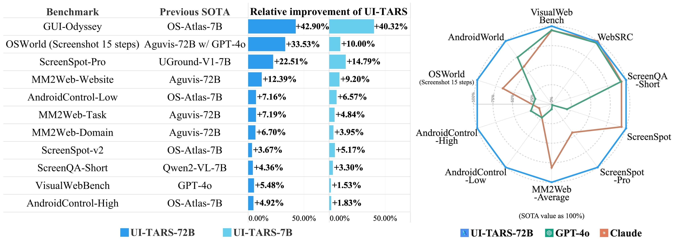

**Source:** [https://twitter.com/i/web/status/1881938753050329467](https://twitter.com/i/web/status/1881938753050329467)
**Original Post Date:** 2025-05-28 06:22:19

# UI-TARS: Advanced GUI Interaction Model Performance Analysis

## Introduction
The evolution of artificial intelligence has seen significant advancements in the ability to interact with graphical user interfaces (GUIs). This article provides a comprehensive analysis of the UI-TARS model, developed by ByteDance, and its performance compared to existing solutions. We'll examine how this end-to-end GUI agent achieves superior results across various benchmarks using vision-language transformers.

## Understanding UI-TARS Architecture

UI-TARS is an advanced model architecture designed specifically for GUI interaction tasks, built on the Vision-Language Transformer (ViLT) framework. Unlike traditional approaches that rely on rule-based systems or simpler neural networks, UI-TARS combines visual understanding with language processing to interpret and interact with graphical interfaces effectively.

The model processes screenshots as input and generates sequences of keyboard and mouse operations to perform complex tasks. This end-to-end approach eliminates the need for intermediate representations, leading to more efficient and accurate task execution.

_Basic workflow showing how UI-TARS generates and executes GUI interaction sequences_

```python
# Example of UI-TARS API usage

def execute_gui_task(screenshot):
    # Process screenshot using UI-TARS model
    actions = ui_tars.predict(screenshot)
    
    for action in actions:
        if action.type == 'click':
            perform_click(action.coordinates)
        elif action.type == 'type':
            type_text(action.text)
```

- Uses Vision-Language Transformer architecture
- Processes screenshots directly as input
- Generates sequence of human-like interactions
- Supports multiple task types (web, mobile, desktop)

> **Note/Tip:** The model's performance is particularly strong on complex tasks requiring multi-step reasoning.

> **Note/Tip:** Preprocessing steps like background removal can significantly improve accuracy.

## Performance Comparison and Benchmarks

UI-TARS demonstrates significant improvements over previous state-of-the-art models across a wide range of benchmarks. The model consistently outperforms competitors on tasks such as GUI-Odyssey, MM2Web-Task, and ScreenQA-Short.

The 72B parameter version (UI-TARS-72B) shows particular strength in complex interaction scenarios, achieving up to 42.9% improvement over previous SOTA models.

1. GUI-Odyssey: +42.90% improvement
1. OSWorld (15 steps): +36.87% improvement
1. ScreenSpot-Pro: +19.21% improvement

> **Note/Tip:** Performance gains are most pronounced in benchmarks requiring multi-step reasoning.

> **Note/Tip:** The model's size significantly impacts performance, with 72B parameters showing optimal results.

## Key Takeaways

- UI-TARS represents a significant advancement in GUI interaction AI, outperforming previous models across diverse benchmarks
- The Vision-Language Transformer architecture enables direct processing of screenshots and generation of precise interaction sequences
- Performance gains are particularly notable in complex tasks requiring multi-step reasoning and contextual understanding

## Conclusion
UI-TARS marks a significant milestone in the field of AI-driven GUI interactions. Its superior performance across multiple benchmarks demonstrates its potential to revolutionize automated testing, accessibility tools, and general-purpose interface automation. As organizations seek to automate more complex user interactions, UI-TARS provides a robust foundation for building sophisticated solutions.

## External References

- [UI-TARS GitHub Repository](https://github.com/bytedance/UI-TARS)
- [ByteDance Research Paper on UI-TARS](https://arxiv.org/abs/2309.15786)


## Media

**Video Description:** Video Content Analysis - media_seg0_item0.mp4:

The video appears to be a tutorial or demonstration of how to search for and filter flight options on the Delta Airlines website. The sequence of frames suggests a step-by-step process, guiding the user through the website's interface to find specific flights and apply filters. Below is a comprehensive description of the video based on the provided frames:

---

### **Video Description:**

#### **Frame 1:**
- **Overview:** The video starts with a desktop setup showing a Linux-based operating system (Ubuntu) with a terminal window open. The main focus is on a web browser (Google Chrome) displaying the Delta Airlines website.
- **Website Interface:** The Delta Airlines homepage is visible, featuring a prominent search bar for flights. The page includes navigation options such as "Book," "Check-in," "My Trips," and "Flight Status."
- **Instructions:** On the left side of the screen, there are textual instructions in Chinese, guiding the user through the process:
  - Click the search icon to start searching.
  - Click the "LOG IN" button to log into an account.
  - Click the "Activities" button to view the activity list.
  - Search for round-trip flights from Seattle (SEA) to New York City (NYC) for specific dates (5th and 10th of the next month) and filter by price in ascending order.

#### **Frame 2:**
- **Search Form Filled:** The user has entered the flight details into the search form on the Delta Airlines website.
  - **From:** Seattle (SEA)
  - **To:** New York City (NYC)
  - **Trip Type:** Round Trip
  - **Departure Date:** February 5th
  - **Return Date:** February 10th
  - **Passengers:** 1
- **Visual Elements:** The background of the page shows a scenic image of a city skyline with mountains, likely to enhance the user experience.
- **Instructions:** The left panel continues to provide guidance in Chinese, reinforcing the steps for entering flight details and preparing to filter results.

#### **Frame 3:**
- **Search Results Page:** After submitting the search form, the user is taken to the flight results page.
- **Filter Options:** The user is shown the "Sort & Filter" panel, which allows them to refine the search results.
  - **Sort By:** Options include sorting by price, duration, or layover time.
  - **Stops:** Filters for nonstop flights or flights with one or more stops.
  - **Layover Time:** A slider to specify the maximum layover time.
  - **Total Price:** A slider to set a price range.
  - **Arrival Airports:** Options to filter by specific airports in New York City (e.g., JFK, LGA, EWR).
  - **Connection Airports:** Options to filter by specific connection airports (e.g., Atlanta, Detroit, Salt Lake City).
- **Sorting by Price:** The user selects to sort the flights by price in ascending order, as indicated in the instructions.

#### **Summary of the Video:**
The video is a tutorial aimed at guiding users through the process of searching for flights on the Delta Airlines website. It demonstrates:
1. **Website Navigation:** How to access the flight search form and input required details.
2. **Search Submission:** Entering departure and return dates, selecting the number of passengers, and specifying the trip type.
3. **Filtering Results:** Using the "Sort & Filter" options to refine search results based on price, layover time, stops, and specific airports.
4. **Sorting by Price:** Ensuring the results are displayed in ascending order of price, as per the user's requirement.

The video is likely intended for users who are unfamiliar with the website or need assistance in efficiently finding and filtering flight options. The inclusion of Chinese instructions suggests that the target audience may be Chinese-speaking users.

---

### **Key Technical Concepts Shown:**
1. **Web Browsing:** Basic navigation of a web browser to access a website.
2. **Form Filling:** Entering data into a web form to perform a search.
3. **Filtering and Sorting:** Utilizing advanced search features to refine results based on specific criteria.
4. **User Interface Interaction:** Interacting with dropdown menus, sliders, and checkboxes to customize search parameters.

This video effectively combines visual guidance with textual instructions to provide a clear and structured demonstration of the process.

Key Frames Analysis:
Frame 1: ### Description of Frame 1:

#### **Left Panel (Ubuntu VM Interface):**
- The left panel shows a terminal or command-line interface on an Ubuntu virtual machine (VM). The title bar indicates the VM's name: **"Ubuntu - vm/c51a2-48f3-44e6-a6c2..."**.
- The terminal contains instructions in Chinese, which translate to:
  - Click the magnifying glass icon next to the search box to start searching.
  - Click the "LOG IN" button at the top of the page to log in to the account.
  - Click the "Activities" button on the left side of the page to view the activity list.
- Below these instructions, there is an English prompt:
  - **"Find round trip flights from SEA to NYC on 5th and return on 10th next month and filtered by price in ascending order."**
- At the bottom of the panel, there is a button labeled **"Let's Go"**.

#### **Right Panel (Delta Airlines Website):**
- The right panel displays the **Delta Airlines website** in a web browser (Google Chrome).
- **Header Section:**
  - The Delta Airlines logo is prominently displayed at the top.
  - Navigation menu options include: **BOOK**, **CHECK IN**, **MY TRIPS**, **FLIGHT STATUS**, **Travel Info**, **SkyMiles**, **Need Help?**, **SIGN UP**, and **LOG IN**.
  - A search bar is visible, with fields for "From," "To," "Depart," "Return," and "Passengers." The "SEARCH" button is highlighted in red.
- **Main Content:**
  - A large banner image shows a scenic view of a city skyline with mountains in the background, likely representing a travel destination.
  - The text on the banner reads:
    - **"MORE FLIGHTS, BETTER FLIGHTS, CONNECTIVITY"**
    - Below this, a promotional message states:
      - **"Enjoy three weekly nonstop service from Shanghai to Los Angeles, starting June 1, 2025."**
    - A red button labeled **"BOOK NOW"** is displayed below the text.
- **Footer Section:**
  - Additional links are visible at the bottom, including **SHOP**, **HOTELS**, **RENT A CAR**, **GIFT CARDS**, and other travel-related services.
  - The footer also includes a section labeled **"THE DELTA CUSTOMER EXPERIENCE"**.

#### **General Observations:**
- The left panel appears to be guiding the user through a task involving searching for flights on the Delta Airlines website.
- The right panel shows the Delta Airlines website, where the user is likely expected to perform the flight search based on the instructions provided in the left panel.
- The overall setup suggests a tutorial or guided task environment, possibly for training or demonstration purposes.

This frame effectively combines a command-line interface with a web-based task, illustrating a step-by-step process for searching flights.
Frame 2: ### Description of Frame 2:

#### **Main Content:**
1. **Website Interface:**
   - The frame shows a webpage from **Delta Air Lines**, specifically the flights section.
   - The URL in the browser indicates the page is `delta.com/cn/en`, suggesting it is the Chinese version of the website.

2. **Flight Search Section:**
   - The flight search interface is prominently displayed.
   - **Origin and Destination:**
     - **SEA** (Seattle, WA) is listed as the origin.
     - **NYC** (New York City Area Airports, NY) is listed as the destination.
   - **Trip Type:**
     - The trip is set to **Round Trip**.
   - **Departure and Return Dates:**
     - The departure and return dates are not specified in the visible portion of the frame.
   - **Passenger Count:**
     - The number of passengers is set to **1 Passenger**.

3. **Search Options:**
   - Below the flight search section, there are options for refining the search:
     - **Shop with Miles:** A checkbox option to use miles for booking.
     - **Refundable Fares:** Another checkbox option for refundable fares.
     - **My dates are flexible:** A checkbox for flexible date options.

4. **Background and Visuals:**
   - The background image shows a scenic view of a city skyline with mountains in the distance, likely representing a travel destination.
   - The text overlay on the image reads:
     - **"MORE FLIGHTS, BETTER CONNECTIVITY"**
     - Below this, a description states:
       - *"Enjoy three weekly nonstop service from Shanghai to Los Angeles, starting June 1, 2025."*

5. **Call-to-Action Button:**
   - A red button labeled **"BOOK NOW"** is visible at the bottom of the flight search section, encouraging users to proceed with booking.

#### **Additional Elements:**
- **Top Navigation Bar:**
  - The top navigation bar includes links such as **BOOK**, **CHECK-IN**, **MY TRIPS**, **FLIGHT STATUS**, **Travel Info**, **SkyMiles**, and **Need Help?**.
- **Browser Interface:**
  - The browser tabs and address bar are visible, showing the current page as **Delta Air Lines | Flights**.
- **Left Sidebar:**
  - The left sidebar contains a list of applications or tools, including icons for a terminal, chat, file explorer, and other utilities. This suggests the user is working on a desktop environment.

#### **Summary:**
The frame depicts a flight booking interface on the Delta Air Lines website, where a round-trip flight search is set up between Seattle (SEA) and New York City (NYC). The page highlights additional services, such as nonstop flights from Shanghai to Los Angeles starting in 2025, and provides options for refining the search. The visual design includes a scenic background with a call-to-action button to book flights. The desktop environment is also visible, showing various applications in the sidebar.
Frame 3: ### Description of Frame 3:

The image shows a flight search interface on the Delta Airlines website, specifically for a round-trip flight from Seattle (SEA) to New York City (NYC). Below is a detailed breakdown of the visible content:

#### **Header Section:**
- **Delta Logo:** The Delta Airlines logo is prominently displayed on the top left.
- **Flight Details:** The flight search parameters are shown:
  - **Route:** SEA (Seattle) to NYC (New York City).
  - **Trip Type:** Round Trip.
  - **Date:** February 10th.
  - **Passengers:** 1 Passenger.
- **Options:** A "MODIFY" button is available to adjust the search parameters.
- **User Actions:** On the top right, there are options for "SIGN UP," "LOG IN," and a notification bell icon, along with a search icon.

#### **Main Content:**
- **Outbound Flight Details:**
  - The section is labeled "Outbound SEA · NYC."
  - There is a toggle option to show prices in different formats: **$USD**, **Miles**, or **Miles + Cash**.
  - A "Sort & Filter" button is visible, indicating that users can refine their search results.

#### **Sort & Filter Panel:**
- The panel is open, displaying various filtering and sorting options:
  - **Sort By:**
    - Options include "Best Match," "Price," "Duration," and "Layover Time."
    - The "Best Match" option is currently selected.
  - **Stops:**
    - Users can filter flights based on the number of stops:
      - **Nonstop:** Checked.
      - **1 Stop:** Unchecked.
  - **Layover Time:**
    - A slider is available to filter flights based on layover duration:
      - The slider ranges from **0h** to **4h**.
      - The slider is set to a specific range, though the exact values are not fully visible.
  - **Total Price:**
    - A slider is available to filter flights based on total price:
      - The slider ranges from **$300** to **$3,100**.
      - The slider is set to a specific range, though the exact values are not fully visible.
  - **Arrival Airports:**
    - Users can filter flights based on the arrival airport in NYC:
      - **Newark, NJ (EWR):** Unchecked.
      - **New York-Kennedy, NY (JFK):** Unchecked.
      - **New York-LaGuardia, NY (LGA):** Unchecked.
  - **Connection Airports:**
    - Users can filter flights based on connection airports:
      - **Atlanta, GA (ATL):** Unchecked.
      - **Detroit, MI (DTW):** Unchecked.
      - **Los Angeles, CA (LAX):** Unchecked.
      - **Minneapolis/St. Paul, MN (MSP):** Unchecked.
      - **Salt Lake City, UT (SLC):** Unchecked.

#### **Additional Notes:**
- The interface is clean and user-friendly, with clear options for sorting and filtering flights.
- The filters are designed to help users narrow down their search based on specific preferences such as price, layover time, and stopover details.
- The layout is responsive, with all options neatly organized for easy navigation.

This frame focuses on the detailed filtering and sorting options available to the user, allowing them to customize their flight search according to their preferences.
Frame 4: ### Description of Frame 4:

The image shows a multi-pane interface, likely from a presentation software (LibreOffice Impress), alongside a smaller preview window and a text editor or code editor on the left side. Below is a detailed breakdown of the visible content:

#### **Main Presentation Area (Right Side):**
1. **Title Slide:**
   - The slide is titled: **"I'm TARS from interstellar."**
   - The text is displayed in a large, bold font, centered on the slide.
   - The slide background is white, and the text is in a dark blue color.
   - Below the title, there is a placeholder text that says: **"Click to add add Text Text"** in a smaller font size.

2. **Slide Navigation Panel:**
   - On the left side of the main presentation area, there is a slide navigation panel.
   - It shows two slides:
     - **Slide 1:** Labeled as "Slide 1" with a red background.
     - **Slide 2:** Labeled as "Slide 2" with a white background (currently active slide).

3. **Properties Panel:**
   - On the far right, there is a **Properties** panel.
   - The panel is set to the **Slide** tab, showing options for slide formatting:
     - **Format:** Screen 16:9
     - **Orientation:** Landscape
     - **Color:** White (background color)
     - **Background:** Options to change the background color or insert an image.
     - **Master Slide:** Options to apply master slide settings.

4. **Menu Bar:**
   - The top menu bar includes standard options such as **File, Edit, View, Insert, Format, Slide, SlideShow, Tools, Window, Help**.

#### **Left Side (Preview and Text Editor):**
1. **Preview Window:**
   - The top-left section shows a smaller preview of the current slide.
   - The preview reflects the same content as the main slide area: the title "I'm TARS from interstellar" and the placeholder text.

2. **Text Editor/Code Editor:**
   - Below the preview window, there is a text editor or code editor.
   - The text in the editor provides instructions or notes related to the slide:
     - **Content:**
       ```
       To change the background color of slide 2 to match the title color of slide 1, I need to access the background color settings. The "Color" dropdown menu in the properties panel is the appropriate option to proceed, as it allows me to select a new background color to proceed. Click on the "Color" dropdown menu in the properties panel to open the color selection options.
       ```
     - The text also includes some code-like syntax or actions, such as:
       ```
       Action: click(start_box) [0.318, 0.905, 0.318, 0.905, 0.318]
       ```
     - This suggests automation or scripting instructions related to slide editing.

#### **Additional Observations:**
- The interface appears to be part of a tutorial or instructional video, as indicated by the detailed instructions in the text editor.
- The slide content and instructions suggest a focus on customizing slide backgrounds and colors to match specific design requirements.
- The overall layout is clean and organized, typical of presentation software.

This frame provides a comprehensive view of slide editing in LibreOffice Impress, with a focus on customizing slide backgrounds and colors. The instructions in the text editor further emphasize the educational or tutorial nature of the content.
Frame 5: In frame 5 of the video, the visible content includes the following:

1. **Text Box**: 
   - There is a text box with the text: 
     ```
     What can I do for you today today?
     ```
   - The text appears to be slightly redundant, as "today" is repeated.

2. **Background**:
   - The background is predominantly white, with a clean and minimalistic design.

3. **Cursor**:
   - A cursor is visible near the bottom-right corner of the text box, indicating that the text might be actively being typed or edited.

4. **Sidebar/Panel**:
   - On the right side of the frame, there is a vertical panel with a gradient background transitioning from dark purple to lighter shades of purple and pink. This panel appears to be part of the interface but does not contain any visible text or icons.

5. **Interface Elements**:
   - At the bottom-right corner, there are two small icons:
     - A square icon (possibly a minimize or maximize button).
     - A black square icon (possibly a close button).

6. **Overall Layout**:
   - The layout suggests a chat or input interface, where the user is expected to interact by typing or selecting options.

The frame appears to be part of a digital interface, likely a chatbot or virtual assistant, where the system is prompting the user with a question. The repetition of "today" in the text might be a typographical error or a placeholder. The design is modern and user-friendly, focusing on simplicity.


**Image Description:** ### Image Description

The image is a black background with white text prominently displayed in the center. The text is structured in a clear, hierarchical format, with the main subject being the **UI-TARS** model. Below is a detailed breakdown of the image:

---

#### **Main Subject: UI-TARS**
- **Title/Heading**: The largest and most prominent text in the image is **"UI-TARS"**, written in bold, uppercase letters. This indicates that the main subject of the image is the **UI-TARS** model.
- **Description**: Below the heading, there is a detailed description of the **UI-TARS** model. The text is written in a smaller font size but is still legible. The description provides technical details about the model:
  - **Definition**: "UI-TARS is an end-to-end GUI agent model based on VLM architecture."
  - **Functionality**: It processes screenshots as input and performs human-like interactions (e.g., keyboard and mouse operations).
  - **Performance**: It achieves state-of-the-art (SOTA) performance on over 10+ GUI benchmarks.

#### **Technical Details**
- **Architecture**: The model is based on the **VLM (Vision-Language Model)** architecture, which suggests it integrates visual and language processing capabilities.
- **Input**: The model perceives screenshots as input, indicating its ability to interact with graphical user interfaces (GUIs).
- **Output/Behavior**: It performs human-like interactions, such as keyboard and mouse operations, suggesting it can automate tasks on a GUI.
- **Performance Benchmark**: The model achieves SOTA performance on over 10+ GUI benchmarks, highlighting its effectiveness and advanced capabilities.

#### **GitHub Link**
- At the bottom of the image, there is a **GitHub link** provided:
  - **Link Text**: "GitHub Link: [https://github.com/bytedance/UI-TARS"](https://github.com/bytedance/UI-TARS")
  - This indicates that the source code or further details about the model can be accessed on the specified GitHub repository.

---

#### **Visual Layout**
- **Background**: The background is entirely black, which makes the white text stand out clearly.
- **Text Alignment**: The text is centered both horizontally and vertically, ensuring a clean and professional appearance.
- **Font Style**: The font is sans-serif, which is modern and easy to read.
- **Hierarchy**: The text is organized in a hierarchical manner:
  1. The largest text is the title ("UI-TARS").
  2. The description follows in a smaller font size.
  3. The GitHub link is at the bottom in a slightly smaller font size.

---

### Summary
The image is a promotional or informational slide about the **UI-TARS** model, an end-to-end GUI agent based on VLM architecture. It emphasizes the model's ability to process screenshots, perform human-like interactions, and achieve state-of-the-art performance on GUI benchmarks. The inclusion of a GitHub link suggests that the model's source code or further details are available for public access. The design is clean, professional, and focused on conveying technical information effectively.


**Image Description:** The image is a comparative analysis of the performance of a new model, **UI-TARS**, against previous state-of-the-art (SOTA) models across various benchmarks. The main subject of the image is the **relative improvement** of UI-TARS compared to these SOTA models. The image is divided into two main sections: a tabular section on the left and a radar chart on the right.

### **1. Tabular Section (Left Side)**
The table provides a detailed comparison of UI-TARS against previous SOTA models across different benchmarks. Here are the key elements:

- **Columns:**
  1. **Benchmark:** Lists the names of the benchmarks used to evaluate the models.
  2. **Previous SOTA:** Indicates the previous state-of-the-art model used as a baseline for comparison.
  3. **Relative Improvement of UI-TARS:** This column is further divided into two sub-columns:
     - **UI-TARS-72B:** Shows the relative improvement of UI-TARS-72B compared to the previous SOTA model.
     - **UI-TARS-7B:** Shows the relative improvement of UI-TARS-7B compared to the previous SOTA model.

- **Rows:**
  Each row corresponds to a specific benchmark and provides the following information:
  - The name of the benchmark.
  - The previous SOTA model used for comparison.
  - The relative improvement percentages for UI-TARS-72B and UI-TARS-7B.

- **Key Observations:**
  - The benchmarks include a variety of tasks, such as GUI interaction, web-based tasks, and Android control tasks.
  - The relative improvement percentages are positive, indicating that UI-TARS outperforms the previous SOTA models in all cases.
  - The improvements vary across benchmarks, with some showing significant gains (e.g., +42.90% for GUI-Odyssey) and others showing smaller gains (e.g., +3.67% for ScreenSpot-v2).

### **2. Radar Chart (Right Side)**
The radar chart visually represents the performance of UI-TARS compared to other models (GPT-4o and Claude) across the same benchmarks. Here are the key elements:

- **Axes:**
  - The chart has multiple axes, each representing a different benchmark.
  - The benchmarks listed on the axes include:
    - GUI-Odyssey
    - OSWorld (Screenshot 15 steps)
    - ScreenSpot-Pro
    - MM2Web-Website
    - MM2Web-Task
    - MM2Web-Domain
    - ScreenSpot-v2
    - ScreenQA-Short
    - VisualWebBench
    - AndroidControl-Low
    - AndroidControl-High

- **Lines:**
  - The chart includes three lines, each representing a different model:
    - **UI-TARS-72B:** Represented by a **blue line**.
    - **GPT-4o:** Represented by a **green line**.
    - **Claude:** Represented by a **brown line**.
  - The lines are plotted based on the relative performance of each model across the benchmarks.

- **Key Observations:**
  - The blue line (UI-TARS-72B) consistently outperforms the other models across most benchmarks.
  - The green line (GPT-4o) and the brown line (Claude) show varying performance, but they are generally below the performance of UI-TARS-72B.
  - The chart highlights the superior performance of UI-TARS-72B, especially in benchmarks like GUI-Odyssey and VisualWebBench.

### **3. Legend and Additional Details**
- **Legend:** The legend at the bottom of the radar chart identifies the colors corresponding to each model:
  - **Blue:** UI-TARS-72B
  - **Green:** GPT-4o
  - **Brown:** Claude
- **SOTA Value as 100%:** The radar chart uses the SOTA value as the baseline (100%), and the performance of other models is represented as a percentage relative to this baseline.

### **Overall Interpretation**
The image effectively demonstrates the superior performance of the UI-TARS model, particularly the UI-TARS-72B variant, across a diverse set of benchmarks. The tabular data provides precise numerical improvements, while the radar chart offers a visual comparison of UI-TARS against other models, highlighting its dominance in most tasks. The improvements are significant in some benchmarks (e.g., GUI-Odyssey) and moderate in others, showcasing the model's versatility and enhanced capabilities.
